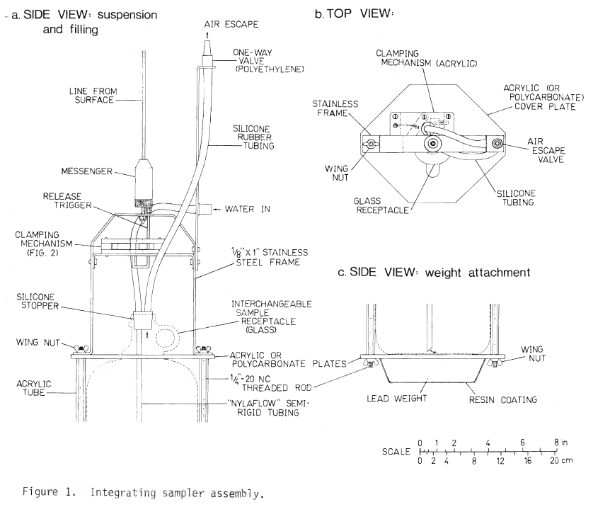

# IISD-ELA Chemistry Info Sheet

**Authors:** IISD Experimental Lakes Area, Sonya Havens, Chris Hay, Ken Sandilands, Paul Fafard, Idil Yaktubay  
**Last Updated:** 2025-05-30  
**Last Updated by**: Chris Hay  

## Contents
<!-- TOC -->
- [General Information ](#general-information)
- [Methods ](#methods)
  - [Sampling](#sampling)
    - [Integrated Water Sampling](#integrated-water-sampling)
    - [Profile Sampling ](#profile-sampling)
  - [Analysis ](#analysis)
  - [Processing ](#processing)
- [Instrumentation ](#instrumentation)
- [Data Dictionary ](#data-dictionary)
  - [List of columns by table ](#list-of-columns-by-table)
  - [Column Definitions](#column-definitions)
- [References](#references)
- [Appendices](#appendices)
  - [Result Detection Limits](#result-detection-limits)
  - [Quality Control Levels](#quality-control-levels)
  - [Chemical Parameter Names on EDI and DataStream](#chemical-parameter-names-on-edi-and-datastream)
<!-- /TOC -->

# General Information 

Chemistry data from the Experimental Lakes Area (ELA) has been collected across ELA lakes since May 1968. Water samples are collected and analyzed for a variety of parameters, for both specific research projects and long-term ecological research (LTER), and across manipulated lakes or enclosures and reference lakes.    
   
The management of the chemistry dataset has periodically changed since its inception, as would be expected with technological advances over the years. Currently, all chemistry data undergo ETL (extract, transform, load) from source databases into a PostgreSQL master database. This represents a merging of older chemistry data 1968 through 2016 that were compiled into a Microsoft Access database and newer data 2017 to present which are managed in Sample Master (a Laboratory Information Management System). 

The way fields are named and formatted, as well as the naming of chemical parameters, is largely based on the DataStream Open Data Schema for Water Quality Data, which is itself based on the United States Environmental Protection Agency’s “Water Quality eXchange” (WQX) (DataStream 2022; United States Environmental Protection Agency 2022). However, the names of a few chemical parameters in the internal IISD-ELA Master Database and the Chemistry of LTER Lakes data package on the Environmental Data Initiative (EDI) repository differ from those used in the parallel data package on the DataStream repository. For further details on these differences, refer to the Appendices section.

# Methods 

## Sampling

### Integrated Water Sampling

Integrated water samples were collected from the epilimnion and metalimnion (when present) of LTER lakes approximately biweekly during the open water season (c. May through October). See the “Instrumentation” section for a diagram of the integrated sampler used.

Integrated epilimnion samples (**EPI**) are collected starting from the lake surface to 0.5 m above the bottom of the thermal epilimnion, or to the depth of 1% of surface PAR when the thermal epilimnion extends beyond this depth by at least 0.5 m. The thermal epilimnion has stable temperature throughout, with changes in temperature of less than 1 °C / 1 m increase in depth. The bottom of the thermal epilimnion is defined as the shallowest depth with a stable temperature, after which a temperature change of ≥ 0.25 °C occurs within a 0.25 m increase in depth.  

Integrated metalimnion samples (**META**) are collected between the bottom of the thermal epilimnion and the depth at which 1% of surface PAR occurs. When the thermal epilimnion extends beyond the depth of 1% of surface PAR, no integrated metalimnion sample is collected. When taking a META sample, the inlet tube is closed off using the clamping mechanism before entering the water and later opened via a messenger weight when at the proper depth. In this way, epilimnetic water is not inadvertently sampled as the sampler descends to the proper sampling depth of the metalimnion. 

### Profile Sampling 

Water chemistry profile sampling involves taking samples of the water column at pre-determined depths (e.g. Lake 239 depths are 1, 5, 10, 15, 20, 25, 30 m). Note that if an integrated epilimnion sample was collected at the same time as the profile samples (and usually this is the case, for IISD-ELA data), additional profile samples within the epilimnion are not collected as well. Profile samples within the epilimnion range would be essentially a repeat sample of the same water as the integrated epilimnion sample, since the epilimnion is well mixed and homogeneous, at least in terms of chemistry. This was tested historically and generally holds true, except on very calm (non-windy) days. It saves a lot on chemistry costs and effort for IISD-ELA.

So for example, if you are looking to use profile data from 239 and see the depths only begin at 5 m (missing a 1 m sample), it means you will need to also use the integrated epilimnion data to represent the first layer within the profile data.

Water is pumped from depth using a marked sampling line (Kuri Tec KLEARON food grade PVC tubing: 1/4'” inner diameter, 3/8” outer diameter for the marked line and 3/16” inner diameter, 5/16” outer diameter to connect the line to the pump), and a 24v Greylor gear pump (part number: 001-240103 - 24V, HDPE Gears, Heat Sink w/No Holes, Viton Seal). The pump must not be run dry- the gears will melt and cause the pump to stop working properly.  

While sampling with the pump, care is taken to ensure that the pump does not introduce air (bubbles) to the sample. The connection between the pump hose and the sampling line is inspected to ensure air is not being introduced, and the out-line of the pump is also inspected for bubbles. If bubbles are present in the out-line but not the in-line, this indicates that the seals on the pump need to be replaced.  

Bottles are rinsed twice with water from the target depth before filling, and when filling a bottle for analysis that is sensitive to air being introduced (e.g. an oxygen bottle) the hose from the pump is inserted to the bottom of the bottle during filling, to reduce air being mixed into the sample. 

## Analysis 

Sample bottles are brought to the IISD-ELA chemistry lab on site, and subsampled for lab analyses for a wide variety of parameters. Sometimes samples have been shipped to other labs for certain analyses, but increasingly analysis is done at the IISD-ELA chemistry lab. The lab that performed analysis on a sample is indicated in the lab name column for each record in the data. 

Methods and instrumentation used to analyze samples have changed over the decades of data in the IISD-ELA chemistry dataset. This is indicated in the data via method name and instrument columns. Details of laboratory procedures for each parameter are described in published standard operating procedures—editions of The Chemical Analysis of Fresh Water (Havens et al. 2024; Stainton et al. 1977). The year and edition are indicated in the analytical reference column for each record in the data. Early data have unknown processing methods. 

## Processing 

Benchtop quality control practices are carried out as described in the standard operating procedures. Data are entered into Sample Master (the chemistry lab LIMS) and undergo some additional quality control checks and corrections when traveling through the pipeline loading the data into the IISD-ELA master database. These are checks that values are within expected ranges, and that metadata-related columns are populated or conform to expected values. The data are otherwise relatively “raw” and unprocessed.

# Instrumentation 

This is the original Integrated Sampler design (Shearer 1978), used for integrated water samples. The overall design has remained largely unchanged since its inception. The sample bottle is now a ~2 L Nalgene bottle encased and insulated within a large PVC shell, and the weight/bottle holder is constructed of a single piece of a solid stainless steel. The frame with the clamping mechanism clips into the weight/bottle holder with small metal clips, rather than wing-nuts. 

# Data Dictionary 

## List of columns by table 

Tabular Data – Chemistry of LTER Lakes 
- dataset_name 
- monitoring_location_id 
- monitoring_location_name 
- activity_media_name 
- activity_start_date 
- activity_start_time 
- activity_end_date 
- activity_end_time 
- activity_depth_height_measure 
- activity_depth_height_unit 
- layer_collection_end_depth 
- layer_collection_start_depth 
- characteristic_name 
- characteristic_name_long 
- method_speciation 
- result_sample_fraction 
- result_value 
- result_unit 
- result_detection_quantitation_limit_measure 
- result_detection_quantitation_limit_unit 
- result_detection_quantitation_limit_type 
- result_status_id 
- analysis_start_date 
- result_analytical_method_name 
- result_analytical_method_instrument 
- result_analytical_reference_method 
- laboratory_name 
- laboratory_sample_id 
- field_comment 
- analysis_comment 
- result_comment 

## Column Definitions

   
| **Column name (alphabetical)** | **data type** | **unit** | **definition** |
| --- | --- | --- | --- |
| activity\_depth\_height\_measure | numeric | See "activity\_depth\_ height\_unit" | The depth the sample was collected, measured down from the surface of the lake. For the associated unit, see "activity\_depth\_height\_unit". Sometimes samples are collected at discrete profile depths, in which case the specific numeric level is indicated here. If an integrated sample was collected, this field is left as null, the layer name is indicated in another column ("activity\_depth\_height\_unit", e.g. "epi"), and the start and end depth are indicated (when available) elsewhere in other columns ("layer\_collection\_start/end\_depth"). |
| activity\_depth\_height\_unit | character varying | N/A | The unit associated with the depth value (“activity\_depth\_height\_measure”), e.g., “m” for metres, if the depth value was a specific numeric level. If the sample is not from a numeric depth but an integrated sample from a layer of the lake, this field will note the stratification layer (epilimnion, metalimnion, hypolimnion), or a “surface grab” if the sample was collected from reaching an arm into the surface of the water, or “eup” for the euphotic zone (referring to the top part of the lakes that has sufficient light for algal growth, usually anything greater than 1% surface light). |
| activity\_end\_date | date | N/A | Date field sampling or surveying activity ended (YYYY-MM-DD). Null or blank values may indicate the end date was the same day, or in rare cases that the end date is unknown. See the associated info sheet for more information on sampling protocols. |
| activity\_end\_time | time without time zone | N/A | Time field sampling or surveying activity ended. |
| activity\_media\_name | character varying | N/A | Describes what type of material was sampled. |
| activity\_start\_date | date | N/A | Date field sampling or surveying activity began (YYYY-MM-DD). |
| activity\_start\_time | time without time zone | N/A | Time field sampling or surveying activity began. |
| analysis\_comment | character varying | N/A | A comment about the analysis of the sample (lab work). If the comment starts with "Sample note: ", the value is a historical comment (pre-2017) related to the entire sample, rather than to the characteristic specified by the row. Therefore, the entry may only pertain to certain parameters measured on that sample, and may or may not be related to that particular row. |
| analysis\_start\_date | date | N/A | The date on which sample analysis started (YYYY-MM-DD). |
| characteristic\_name | character varying | N/A | The parameter being measured (abbreviated version). For chemistry, usually the element in question (e.g., "Fe"). |
| characteristic\_name\_long | character varying | N/A | The full, non-abbreviated version of the parameter being measured. For example, for chemistry, usually the full name of the element in question (e.g., Iron, rather than Fe). |
| dataset\_name | character varying | N/A | Name of the dataset. A dataset is a collection of data to which several individual data records (rows) belong. Dataset names are useful to distinguish groups of data across different research fields and provide some descriptive context. |
| field\_comment | character varying | N/A | Any kind of comment from when in the field, related to acquiring the sample (vs. result\_comment, which is noted at a later stage). May be an important caveat to analysis of the data (e.g., notes about the rain gauge overflowing, which affects accuracy of precip\_rain\_gauge\_mm value). |
| laboratory\_name | character varying | N/A | Theoretically this column is defined as the name of the laboratory that conducted the analysis on the sample in question, but in actuality this column does not always fit such a clean-cut definition. Historically the use of this field has not been standardized, so values may be a name of an individual, institution, or location. In recent years, the column value is usually "bcooney", referring to an IISD-ELA staff working at the IISD-ELA chemistry lab. Note that although many samples are analyzed by IISD-ELA, some samples are shipped to external labs for certain analyses (e.g., The University of Alberta Biogeochemical Analytical Service Laboratory). There are future plans to improve the data quality of the values in this column. |
| laboratory\_sample\_id | character varying | N/A | A unique code for each sample, at least for 2017 to present data obtained from the LIMS. Note that each sample is typically analyzed for multiple parameters. The ID usually begins with the date the sample was logged in at the lab (e.g., 2022051101-01 for May 11th, 2022). |
| layer\_collection\_end\_depth | numeric | metres | Along with “layer\_collection\_start\_depth”, this field is mostly used for 2017 to present year data when an integrated sample was collected, to specify the range of the layer that the sample was collected within. For example, a record with layer\_collection\_start\_depth = 0.00, layer\_collection\_end\_depth = 5.50, and activity\_depth\_height\_unit = epi, indicates an integrated sample from an epilimnion layer defined as 0m to 5.5m depth from the surface of the lake. |
| layer\_collection\_start\_depth | numeric | metres | Along with “layer\_collection\_end\_depth”, this field is mostly used for 2017 to present year data when an integrated sample was collected, to specify the range of the layer that the sample was collected within. For example, a record with layer\_collection\_start\_depth = 0.00, layer\_collection\_end\_depth = 5.50, and activity\_depth\_height\_unit = epi, indicates an integrated sample from an epilimnion layer defined as 0m to 5.5m depth from the surface of the lake. |
| method\_speciation | character varying | N/A | How the parameter specified by the characteristic name in the associated row is described in method. |
| monitoring\_location\_id | uuid | N/A | A uuid for each monitoring\_location\_name, used for internal database table joining purposes. |
| monitoring\_location\_name | character varying | N/A | Name of sampled or surveyed geographic location at the IISD Experimental Lakes Area field site. The name consists of: <location sublocation station>. Location is typically the lake number (each lake is named with a number, representing the lake's geographical watershed), sublocation which typically specifies LA for "lake" (or a basin, e.g. NB - north basin, or other), and station which is usually CB ("centre buoy" - at about the deepest point of the lake). |
| result\_detection\_quantitation\_ limit\_measure | numeric | See "result\_detection\_ quantitation\_limit\_unit" | The result detection limit value. The associated unit is in the field "result\_detection\_quantitation\_limit\_unit". In the chemistry dataset, detection limits vary for a number of reasons including the changes in instrumentation over the years and a shift since the use of the Sample Master LIMS in 2017 to assessing them each sample run. As the user of our data, there are a number of potential approaches you may want to use to present the detection limits (e.g. half the limit, normal distribution of the detection limit), but what we provide is the Method Detection Level (i.e., "Limit of Detection). See the definition for the column "result\_detection\_quantitation\_ limit\_type" for more information, as well as the chem info sheet appendices. For earlier years of data (1968 into 2017) although we have detection limit values, we are lacking documentation on how detection limits were calculated. The ELA and FWI labs that conducted the analyses did not have a way to record the detection limits, but somehow the numbers were still included in ELA's archive master database, and that is where these numbers originate from. So there is some uncertainty as to the validity of those detection limits for older records, and they should be used with caution if at all.  |
| result\_detection\_quantitation\_ limit\_unit | character varying | N/A | A field for the unit associated with "result\_detection\_quantitation\_limit\_measure". Always identical to the result\_unit value (at least for the chemistry dataset 2017 to Present). |
| result\_detection\_quantitation\_ limit\_type | character varying | N/A | For all IISD-ELA Chemistry data since the use of the Sample Master LIMS database in 2017, it is always “Method Detection Level” (i.e., “Limit of Detection”). That is, not the “Limit of Quantitation” which is 3.3 times the “Limit of Detection”. Specifically, the ELA analytical service laboratory uses the ISO method. The ISO method sums the residuals of the instrument response from the calibration curve and calculates what this would be in terms of a concentration. This method provides a Limit Of Detection (LOD) for every analytical run, which provides a more accurate portrayal of the method (and analyst) performance for every run. For all IISD-ELA Chemistry data prior to the use of Sample Master in 2017, it is likely still "Method Detection Level", though not likely per run, and since we are unsure of how they were calculated and at what frequency, those records have been designated as “Unknown”.  |
| result\_analytical\_method\_name | character varying | N/A | The short name for the analytical method used (e.g., ELA-PartP, UA-ClSO4, etc.). The prefix is the specific institution associated with the method (e.g., ELA = Experimental Lakes Area, UA = University of Alberta).For pre-2017 data, this value may not be available. In this case, ‘N/A’ (not available) was entered. |
| result\_analytical\_method\_ instrument | character varying | N/A | The instrument (tool) used to analyze the sample (e.g., Dionex DX-600 Ion Chromatography, Fisher Scientific Accumet pH meter, Cole-Parmer 2100 Spectrophotometer, etc.). Instrumentation cannot be assumed to be the same within certain time periods or characteristic\_name values. For example, it is possible that two different instruments may be used in a given year, if one breaks down and an alternate is needed. For 2017 to present data, the instrument used is recorded for every sample or test, so be aware that it may change from record to record. For pre-2017 data, this value may not be available. In this case, ‘N/A’ (not available) was entered. |
| result\_analytical\_reference\_ method | character varying | N/A | The standard operating procedure reference for details on analytical methods. This is useful for finding additional information for better understanding results, and as a reference when publishing research using the data. Typically this is a specific edition of "The Chemical Analysis of Fresh Water". The intention is that this will be updated and published on a more frequent basis than in the past, to reflect changing instruments and methods. |
| result\_comment | character varying | N/A | Notes about the result. This field is rarely used. Comments were seemingly noted at later analysis or quality control stages (vs. field\_comment, which was collected while in the field). E.g., “Trend analysis shows the result to be an outlier and possibly erroneous.” Or “This value is the average of two instrument duplicate measurements which were not within 5% (281 vs 265 ug/L). The logic is that assuming one of these is the true value, the average value will be within 3% of it.” |
| result\_sample\_fraction | character varying | N/A | Describes the portion of the characteristic being analyzed. |
| result\_status\_id | character varying | N/A | Provides a level of quality control that the record has undergone (thus, “trust” in the data). Note that this only applies for data 2017 to Present. There are three levels. See descriptions for each of these levels in the appendices of the chem info sheet. Note that IISD-ELA’s quality control management extends beyond the factors considered for this field. For example, IISD-ELA carries out benchtop quality control practices, which are stipulated in each test’s standard operating procedure. |
| result\_unit | character varying | N/A | Units of measure for the result value, associated with the characteristic name parameter. |
| result\_value | numeric | See "result\_unit" | The actual measured number for the parameter: the result. Basically, this is the meaningful number measured or determined for the parameter in question. For the associated unit, see "result\_unit". For more information, read the definition for the "result\_detection\_quantitation\_limit\_measure" column and read in the chem info sheet appendices an important bolded note about below detection scenarios. |

# References

DataStream. 2022. DataStream Open Data Schema for Water Quality Data – JSON Schema. <https://github.com/datastreamapp/schema>

DataStream. 2025. Welcome to DataStream’s learning centre! <https://datastream.org/en-ca/documentation>

Havens, S.M., M.P. Stainton, and B.C. Cooney. 2024. The Chemical Analysis of Fresh Water – Third Edition. International Institute for Sustainable Development. <https://www.iisd.org/publications/guide/chemical-analysis-fresh-water-third-edition> DOI: <https://dx.doi.org/10.13140/RG.2.2.32178.82889>

Shearer, J.A. 1978. Two devices for obtaining water samples integrated over depth. Can. Fish. Mar. Serv. Tech. Rep. 772: iv+9p.

Stainton, M.P., M.J. Capel, and F.A.J. Armstrong. 1977. The Chemical Analysis of Fresh Water, 2nd ed. Fish. Mar. Serv. Misc. Spec. Publ. 25:116 p. <https://waves-vagues.dfo-mpo.gc.ca/Library/110147.pdf>

United States Environmental Protection Agency. 2017. WQXWeb Template Dictionary v3.xls (Sheet: WQX Web Allowable Values) from wqxweb3_physical_chemical_package_0.zip on page Water Quality Exchange Web Template Files. Last saved 2017-07-06. <https://www.epa.gov/waterdata/water-quality-exchange-web-template-files>

United States Environmental Protection Agency. 2022. Characteristic.csv. from WQX Domain Value Services and Downloads. Last modified 2022-05-31. <https://www.epa.gov/waterdata/storage-and-retrieval-and-water-quality-exchange-domain-services-and-downloads>

# Appendices

## Result Detection Limits

The result detection limit values (result_detection_quantitation_limit_measure) from 2017 to present were calculated as follows:

- Initially average detection limits were calculated and applied as annual averages per parameter (characteristic_name), but these were all changed-over to be detection limits per run, by the end of 2024. Given the finer scale of analytical run detection limits, the data user can average per year or summarize whichever way they deem fit.

- Whether a result value is above or below detection is determined at the time of data entry. If the result is below detection, typically the result_value is entered as 0, but sometimes the actual (below detection) value is noted instead. **It is up to the data user to examine the result_value vs. detection limit and decide how they will handle below detection records.**

- A description of how the detection limit is calculated is described in the third edition of The Chemical Analysis of Freshwater (Havens et al. 2024). It is calculated for each run by using equations 1 through 3:

> Equation 1.          $`C_{dl} = \ \frac{y_{d} - b}{m}`$
>
> where *b* is the y-intercept, *m* is the slope, and *yd* is the signal detection limit, which is calculated using equation 2:
>
> Equation. 2.         $`y_{d} = 3s_{y} + b`$
>
> where *sy* is the residuals between the measured signal for each standard concentration and the calibration curve predicted response for each standard concentration and is calculated using equation 3:
>
> Equation 3.          $`s_{y} = \ \sqrt{\frac{?_{}^{}{di}^{2}}{n - 2}}`$
>
> where *n* is the number of standards in the calibration curve, and *di* is the difference between the measured signal for each standard concentration and the calibration curve predicted response for each standard concentration.

## Quality Control Levels

- Preliminary: Samples that have passed the analytical quality control parameters (samples that failed are not entered into the database). Quality control parameters for each analysis are available in the third edition of The Chemical Analysis of Fresh Water (Havens et al. 2024). This step is benchmark quality control (e.g., blanks, duplicates, etc.). Internally this corresponds with level result_status_id 1 in Sample Master and “Entered”.

- Accepted: Samples that have undergone a second level of quality control. That is, records that have passed trend analysis. Trend analysis is conducted for each parameter at each site to look for outliers and then investigate the outliers. This step is done internally using an R script for efficiency. For more information, see the third edition of The Chemical Analysis of Fresh Water (Havens et al. 2024). Internally this corresponds with level result_status_id 2 in Sample Master and “Validated”.

- Final: Samples that have undergone external peer-review. Currently IISD-ELA has not yet defined a process to evaluate whether a record has been peer-reviewed, but there are plans to do this and use this designation in the future. Internally this corresponds with level result_status_id 3 in Sample Master and “Approved”.

- Not noted or null: Quality control level is not noted for all pre-2017 records. For 2017 to present, records with result_status_id 0 or null are not written to the database, as the result value has not been entered yet (though other parameters for a record may be filled out ahead of time in Sample Master).

## Chemical Parameter Names on EDI and DataStream

Following a discussion in early 2025 between DataStream staff and IISD-ELA’s data team and research chemist, the names of chemical parameters in both the IISD-ELA master database and the Chemistry of LTER Lakes data package on EDI were revised to better align with those used in the parallel DataStream data package (see table below). However, we decided to keep some differences.

The result sample fractions for “PARTC” and “PARTFE” were labeled as “Suspended” across EDI, the IISD-ELA master database, and DataStream, following DataStream’s guidance for non-nutrient parameters. However, we thought the “Suspended” label may cause confusion since these measurements actually refer to particles retained on a filter. To address this, the parameter names on EDI and in the IISD-ELA master database are “particulate,” but it is “suspended” on DataStream (their standards must be followed for the data upload to be accepted for their repository). A similar clarification was made for “PARTN” and “PARTP”, although their result sample fraction labels already make this clear.

In the EDI data package and the IISD-ELA master database, each chemical parameter has a unique name in the characteristic columns. In contrast, on DataStream, parameters are distinguished by unique combinations of CharacteristicName, MethodSpeciation, and ResultSampleFraction. For example, our “Nitrogen, particulate” and “Total dissolved nitrogen” are both labeled as “Total Nitrogen, mixed forms” on DataStream, but are differentiated by their ResultSampleFraction values: “Non-Filterable (Particle)” and “Filtered,” respectively. Therefore, it is important to consider all three columns when interpreting the DataStream data package.

For more information, please refer to DataStream’s learning centre website (DataStream 2025) and to *The Chemical Analysis of Fresh Water* (Havens et al. 2024).

       
| **IISD-ELA Database and EDI Repository** |     |     |     | **DataStream Repository** |     |     |
| --- | --- | --- | --- | --- | --- | --- |
| **characteristic\_name** | **characteristic\_name\_long** | **method\_speciation** | **result\_sample\_fraction** | **CharacteristicName** | **MethodSpeciation** | **ResultSampleFraction** |
| A254 | Specific UV Absorbance at 254 nm |     | Filtered, lab | Specific UV Absorbance at 254 nm |     | Filtered, lab |
| ALK | Alkalinity, total |     |     | Alkalinity, total |     |     |
| CA  | Calcium |     | Dissolved | Calcium |     | Dissolved |
| CHLA | Chlorophyll a, uncorrected for pheophytin |     |     | Chlorophyll a, uncorrected for pheophytin |     |     |
| CL  | Chloride |     | Dissolved | Chloride |     | Dissolved |
| COLOUR | Colour |     |     | Color |     |     |
| COND | Conductivity |     |     | Conductivity |     |     |
| DIC | Inorganic carbon |     | Dissolved | Inorganic carbon |     | Dissolved |
| DOC | Organic carbon |     | Dissolved | Organic carbon |     | Dissolved |
| FE  | Iron |     | Dissolved | Iron |     | Dissolved || K   | Potassium |     |     | Potassium |     |     |
| MG  | Magnesium |     | Dissolved | Magnesium |     | Dissolved |
| MN  | Manganese |     | Dissolved | Manganese |     | Dissolved |
| NA  | Sodium |     | Dissolved | Sodium |     | Dissolved |
| NH3 | Ammonia | as N | Filtered, lab | Ammonia | as N | Filtered, lab |
| NO2 | Nitrite | as N | Filtered, lab | Nitrite | as N | Filtered, lab |
| NO3 | Nitrate | as N | Filtered, lab | Nitrate | as N | Filtered, lab |
| O2  | Dissolved oxygen (DO) |     |     | Dissolved oxygen (DO) |     |     |
| PARTC | Carbon, particulate |     | Suspended | Organic carbon |     | Suspended |
| PARTFE | Iron, particulate |     | Suspended | Iron |     | Suspended |
| PARTN | Nitrogen, particulate | as N | Non-Filterable (Particle) | Total Nitrogen, mixed forms | as N | Non-Filterable (Particle) |
| PARTP | Phosphorus, particulate | as P | Non-Filterable (Particle) | Total Phosphorus, mixed forms | as P | Non-Filterable (Particle) |
| PH  | pH, lab |     |     | pH, lab |     |     |
| SO4 | Sulfate | as SO4 | Dissolved | Sulfate | as SO4 | Dissolved |
| SR  | Spectral ratio |     |     | Spectral slope ratio |     |     |
| SRSI | Silica, reactive | as Si |     | Silica, reactive | as Si |     |
| TDN | Total dissolved nitrogen | as N | Filtered | Total Nitrogen, mixed forms | as N | Filtered |
| TDP | Total dissolved phosphorus | as P | Filtered | Total Phosphorus, mixed forms | as P | Filtered |
