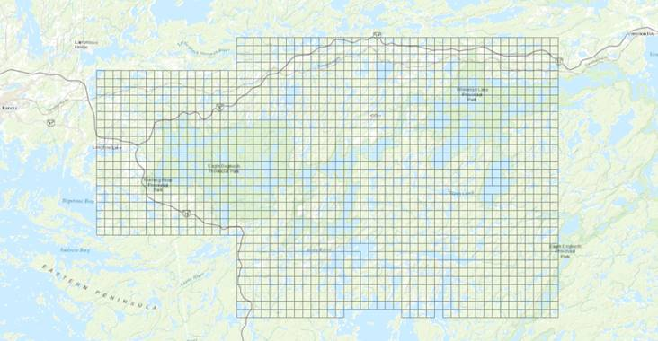

**General Hydrometric Station Information Sheet**

Author: Ken Beaty, Paul Fafard (updated March 21, 2019)

Last Update: 3 April 2025 (LNT)

**<u>General</u>**

Since 1968, there have been several changes in agency structure while the function for key working groups involved have remained the same. For simplicity throughout this discussion, the following acronyms have been used with no attempt to define the chronology of the name changes that occurred to agencies, affiliates or working groups.

> IISD-ELA: International Institute for Sustainable Development - ELA
>
> ELA: Experimental Lakes Area
>
> ELA-Hyd: Experimental Lakes Area Hydrology Program or Personnel
>
> DFO: Department of Fisheries and Oceans, Freshwater Institute, Winnipeg
>
> ESD: DFO, Science, Environmental Science Division, FWI, Winnipeg
>
> FRB: Fisheries Research Board
>
> FWI: Freshwater Institute, Winnipeg
>
> EC: Environment Canada
>
> MSC: Environment Canada, Meteorological Service of Canada
>
> WSC: Environment Canada, Atmospheric Monitoring and Water Survey Directorate, Water Survey Monitoring and Operations Branch
>
> U of M: University of Manitoba, Department of Civil Engineering and Department of Geology and Earth Sciences

**<u>The Hydrometric Program</u>**

This discussion is intended to support hydrometric record found in the ELA database. Three previously published data reports provide similar information current to the end of 1987. Users of these data sets are encouraged to read this information sheet in order to gain the proper perspective for the hydrology of the ELA and the specifics of using the data.

Hydrological work began at ELA in the winter of 1968/69 with the planning of the first monitoring stations. It is important to note that at that time, ELA and DFO did not have “in-house” expertise in hydrology. To fill that gap, WSC and the U of M were invited to advise and participate in the ELA program. Early hydrological investigations were carried out jointly through an arrangement with the U of M and WSC. In 1975, DFO created positions for a Research Scientist and Hydrometeorological Technologist thereby moving the U of M contribution “in-house”. WSC involvement continued, in all years, until March 31, 1985 with the exception of 1974. The WSC contribution included construction services, technical support, instrumentation and determination of mean daily discharge and mean daily lake level record as well as some financial support. The WSC continued to provide the loan of 22 water level recorders after 1985 which have since been decommissioned as obsolete.

From 1969 to end of 2018, 1,010 station years of hydrometric record have been collected from 48 hydrometric stations that have been operated in 28 different lake watersheds. A summary of stations and years of record during the 1969 to 2018 period is provided in this document.

<u>Cross reference with Water Survey of Canada station numbers:</u>

Hydrometric stations that are included in the Water Survey of Canada data base are identified in the following table. Data for these stations ceased to be included in the WSC database a few years after the withdrawal of their services in 1985.
    
| ELA  Location | ELA  Sub-location | ELA  Station | WSC Name | WSC # |
| --- | --- | --- | --- | --- |
| 114 | WW  | HQ114 | Lake 114 Outlet Near Kenora | 05PD014 |
| 114 | LA  | HW114 | Lake 114 Near Kenora | 05PD027 |
| 120 | WW  | HQ120 | Lake 120 Near Kenora | 05PD016 |
| 223 | WW  | HQ223 | Lake 223 Near Kenora | 05QD017 |
| 223 | LA  | HW223 | Lake 223 Near Kenora | 05QD021 |
| 224 | WW  | HQ224 | Lake 224 Outlet Near Kenora | 05QD018 |
| 225 | WW  | HQ225 | Lake 225 Outlet Near Kenora | 05QD019 |
| 226 | WW  | HQ226 | Lake 226 Outlet Near Kenora | 05QD015 |
| 227 | WW  | HQ227 | Lake 227 Outlet Near Kenora | 05QD008 |
| 227 | LA  | HW227 | Lake 227 Near Kenora | 05QD009 |
| 230 | WW  | HQ230 | Lake 230 Outlet Near Kenora | 05QD011 |
| 239 | WW  | HQ239 | Lake 239 Outlet Near Kenora | 05PD023 |
| 239 | LA  | HW239 | Lake 239 Near Kenora | 05PD021 |
| 239 | NWT | HQNW | Northwest Tributary to Lake 239 Near Kenora | 05PD022 |
| 239 | UET | HQUET | Lake 239, Upper East Inlet, Near Kenora | 05PD025 |
| 239 | ET  | HQE | Lake 239, Lower East Inlet, Near Kenora | 05PD024 |
| 239 | NET | HQNE | Lake 239, Northeast Inlet, Near Kenora | 05PD031 |
| 240 | WW  | HQ240 | Lake 240 Outlet Near Kenora | 05PD015 |
| 261 | WW  | HQ261 | Lake 261 Outlet Near Kenora | 05QD012 |
| 265 | WW  | HQ265 | Lake 265 Outlet Near Kenora | 05QD013 |
| 302 | WW  | HQ302 | Lake 302 Outlet Near Kenora | 05QD023 |
| 302 | LA  | HW302 | Lake 302 Near Kenora | 05QD022 |
| 303 | WW  | HQ303 | Lake 303 Outlet Near Kenora | 05PD019 |
| 303 | LA  | HW303 | Lake 303 Near Kenora | 05PD020 |
| 304 | LA  | HW304 | Lake 304 Near Kenora | 05PD018 |
| 305 | LA  | HW305 | Lake 305 Near Kenora | 05QD007 |
| 470 | WW  | HQ470 | Lake 470 Outlet Near Kenora | 05PD017 |
| 661 | WW  | HQ661 | Lake 661 Outlet Near Kenora | 05PD028 |

**<u>Hydrometric data</u>**

<u>Surface water data:</u> The lake level and discharge data in this report are surface water data. It is important to understand the difference between outflow and surface water data when working with streamflow records, particularly lake outflow data. The true or total outflow from a lake or flow between two lakes may include a groundwater seepage (subsurface flow) component that is not easily detectable in addition to that which is visible on the surface as open channel flow.

<u>Subsurface flow:</u> To date, only surface water data have been included in the ELA database. Subsurface flow or groundwater seepage may not exist for most ELA study lakes and is likely insignificant in others. Smooth continuous bedrock control at lake outlets is usually the case. However, the assumption that no groundwater flow exists should not be made without examination of the site and hydrometric record if available. For example, examination of Lake 224 surface water flow data raised suspicion of a groundwater seepage loss from the lake that was later confirmed by data from a previous experiment involving a whole lake spike addition of tritium. It was estimated that approximately 12,000 m3 per year was lost by seepage from lake 224 to adjacent Lake 222. This contribution was approximately 2% of the volume of Lake 222 per year or about 15% of the average reported Lake 224 surface outflow (Beaty 1984). As a second example, a small seepage inflow has also been located on the east beach of Lake 240 (see discussion for Lake 240). Where possible, a general assessment of each station with respect to the potential or presence of groundwater seepage has been included in the station discussions that follow where relevant.

The Lake 239 watershed is the only ELA basin where detailed groundwater investigations have been carried out. These investigations were mainly carried out during the early years (1969 to 1974). Methods, drill logs and groundwater wells and piezometer locations have been previously reported (Beaty 1981, Part III). Methods and results for hydraulic conductivity and groundwater flow estimates in the Rawson Lake Watershed have also been previously summarized in an unpublished report (Newbury and Cherry, April 1971). From these early investigations it was concluded that “it is apparent that the seepage inflows and outflows of Rawson Lake will not significantly alter the lake water budget quantities”.

In the years that followed, other studies that included groundwater investigations have been carried out by various external researchers at lakes 979, 632, 115 and 658. These works are not within the scope of this document. Some findings have been published but the data has not been incorporated in the ELA database.

<u>Period of record:</u> Most of the ELA hydrometric stations (discharge and lake level) are operated as “seasonal” stations that are operated generally from April 1 to October 31 each year. The only stations that have been heated for winter operation to provide 12-month record were Lake 239 Outflow, Lake 239 Lake Level, Lake 470 Outflow (until 2012), and Lake 240 Outflow (until 1988).

<u>Winter flow:</u> In the early years of the project, winter flow was somewhat neglected as a major component of the annual water budget. Initially, it was assumed that winter flow from small ELA headwater lakes would be relatively minor with almost all flow occurring during the April to October period. Also, in the early years of the project, equipment such as reliable snowmobiles, all-terrain vehicles and 4-wheel drive trucks were not available as in present day. Winter excursions were much more difficult to carry out.

In winter, all ELA lakes freeze over and accumulate a snow pack on the ice surface. As winter progresses, inflow from the terrestrial area surrounding the lake diminish to zero or near zero due to freezing temperatures and an accumulating snow cover that does not melt until April. ELA does not experience mid-winter melt-runoff events. Because small hydrometric stations are difficult to service and impractical to operate in winter, most of the stations were operated from late March to early November for complete April to October (seven months) record. However, it became apparent that, in some cases, it was possible for winter flow to be a substantial portion of the annual flow. Analysis of the first 18 years of Lake 239 record showed that 19% of the total annual flow occurred in the November to March five-month winter period. Whole lake water budgets calculated for Lake 226 for the years 1973 to 1980 suggested the same average winter flow rate as for Lake 239 for the same period. Observations indicate that small winter flows often exist from ELA lakes. This flow is caused and sustained in a couple of ways. First, if a lake level is controlled by a beaver dam located at its outlet, flow will likely occur as seepage through or under the dam even in winter as has been the case in many years on lakes 223, 224, 226, 227, 302, 303, 373, 470 and 661. And secondly, as winter progresses, a winter snow pack accumulates on the ice surface that exerts downward pressure that causes the displacement of lake water from beneath the ice sheet that is forced out of the outflow. The stream channel, once iced over, often develops a deep insulating snow cover which allows flow to occur beneath even at air temperatures below -30 oC.

Since 1980, efforts have been made to obtain monthly manual measurements of flow during the winter. These winter values are included in the database with a qualifier code to indicate a manual observation. These observations, along with data recorded at heated all-season stations and climate record, provide the basis for winter flow estimates that appear in the ELA database. Similarly, winter estimates have been flagged with a qualifier code to differentiate them from monitored record (see “Qualifier codes”).

<u>Units of measure and accuracy:</u> In Canada, metrification occurred in 1978. Prior to 1979, the unit of measure for discharge was cubic feet per second (f3s-1) reported to two decimal places. Flow volumes were reported in acre-feet reported to one decimal place. The unit of measure for lake level was feet reported to two decimal places. All data collected and previously reported in English units have been converted for the ELA database for consistency. Hydrological units are as follows:

- Discharge = cubic metres per second (m3s-1) reported to 4 decimal places

- Flow volume = cubic metres (m3) reported to the nearest whole cubic metre

- Lake level (stage) = metres (m) reported to 3 decimal places (1 mm precision).

> <u>Qualifier codes:</u> Letter codes were used to qualify discharge and water level data where necessary. These codes are defined as follows.
>
> A – manual observation: Mean daily flow or water level were coded “A” to indicate that the value was an estimate based on one or more manual gauge readings or in combination with partial recorded record for that day,
>
> B - ice conditions: The presence of ice in the channel or structure affected, or may have affected, the stage-discharge relationship. The value reported is a “best estimate” due to the presence of ice,
>
> C – capacity exceeded: A major or unusual runoff event occurred resulting in flow that exceeded the station capacity for all or part of the day reported. This code indicates that flow for the reported value was in the overflow range of the gauging structure or outside of the range of calibration and should be regarded as a “best estimate”,
>
> D - beaver activity: Mean daily discharge values were coded “D” when beaver have placed debris or constructed a dam directly in the gauging structure resulting in false recorded stage data. Estimates were made for missing or suspicious data during the period of beaver influence. If estimates were not possible, the entry in the ELA Data Base will be “null”. In either case the entry was coded “D”,
>
> D1 – beaver activity: Beaver have constructed a dam above or below the gauging structure that may have influenced the “best estimate” reported value,
>
> D2 – beaver activity: A beaver dam located above the gauging station was opened resulting in an increase in flow not associated with a normal precipitation event but indicated a valid flow value,
>
> E - estimated value: This indicates a value that was determined by some indirect method such as interpolation, graph of observed readings, discharge measurement, comparison with other stations or by considering meteorological data,
>
> F- frozen conditions: The hydrometric gauging station was frozen resulting in missing record. Estimates were made when possible.
>
> H- FLUDEX effect: This code applies to the Lake 239 NW Inflow station only. From 1999 to 2003 inclusive, The Upland Flooding Experiment (FLUDEX) operated a reservoir (Site 2) at the top end of the Northwest Sub-basin of the Lake 239 Watershed. While the reservoir discharged to Roddy Lake, seepage and end-of-season draining resulted in additional water, originating from Roddy Lake, to the NW Sub-basin. This additional water is included in the reported values for those station years of record.
>
> I – linear interpolation: This indicates a value that was estimated by linear interpolation between two manual observations. In most cases, estimates by interpolation were made to complete data sets during stable low flow periods (i.e. winter) that were not influenced by precipitation events or other hydrologic events in order to provide complete data sets for analyses such as chemical mass balances. Mean daily values that could not be estimated by interpolation resulted in “null” values in the data base that were coded “M”.
>
> L – leakage: This indicates that leakage or seepage under or around a weir or flume was present and that an adjustment was made to the reported value.
>
> M - missing record: Mean daily values that could not be reliably estimated were considered “missing record” resulting in a “null” entry in the data base,
>
> R – regulated flow or water level: This indicates that the reported discharge or water level value was influenced by human regulation for experimental or other purposes. This code is intended for “natural” systems that are not normally regulated and is reserved for situations that last only days or weeks in duration. Stations that were regulated for longer periods (one or more seasons) are noted in station discussions.
>
> S – unnatural flow or water level: This code indicates a mean daily value that was influenced by unnatural causes resulting water being removed or foreign water being added to the system. Examples have included pumped water for irrigation (NE Sub-basin), pumped water to fill FLUDEX reservoirs (NW Sub-basin), and the siphoning of water from Lake 226.
>
> U – controlled flow release: This code indicates a value that was influenced by a manual flow release of water such as spilling water impounded by a dam.

<u>  
Survey Benchmarks</u>:

Where long-term or continuous water level records are to be collected, it is necessary to establish and frequently refer to local survey benchmarks. Since there are no survey benchmarks with an established elevation above mean sea level (MSL) in the ELA area, survey benchmarks at ELA have been assigned arbitrary elevations that are not relative to MSL. Approximate MSL elevations are shown on 1:50,000 scale National Topographic Survey Maps for some lakes and is the reference datum for the land contours provided on those maps. Local survey benchmarks have been established in most ELA watersheds and have been assigned elevations relative to an arbitrary datum that are specific, in most cases, only to that particular watershed. The exception is for benchmarks 1 to 24a, 45 and 46 which are all relative to BM \#1 which was established by WSC on February 25, 1969 with an assigned elevation of 30.480 m (100.00 ft.). BM \#1 is approximately 391 m above MSL.

The following benchmarks were destroyed by forest fires in 1974 and 1980: 2, 3, 4, 6, 7, 9, 11, 12, 13, 13a, 14, 15, 16, 17, 18, 21, and 22. BM \#’s 27 and 28 at 114 Outflow were destroyed during weir re-construction in 2000. The following table summarizes survey benchmark information according to each lake basin.

Notes:

1.  The orientation convention used for all stream surveys and notes is that the right bank or side is on the right while looking downstream.

2.  BR means bedrock.

3.  BC means a brass cap benchmark.

4.  AB means an anchor bolt or lag bolt benchmark.

5.  CR means chipped ring in bedrock as a benchmark.

6.  The specified elevation is the highest point on the BC, AC or inside the CR.

7.  Survey accuracy is generally to 1 mm.

    
| Lake | Station | BM# | Elevation (m) | Description  (BR – bedrock) |
| --- | --- | --- | --- | --- |
| 114 | Lake level | 25  | 27.712 | Head of AB horizontal in BR 0.6 m west of S end of catwalk |
| 114 | Lake level | 26  | 29.018 | BC in BR, 4 m SW of S end of catwalk |
| 223 | Lake level | 29  | 30.644 | BC in BR 8 m NW of instrument shelter marked with iron rod |
| 223 | Outflow weir | 30  | 30.480 | BC on weir wall |
| 223 | Outflow weir | 31  | 30.203 | BC in rock 3 m N of weir |
| 224 | Lake level | 50  | 10.000 | AB on BR rock face, S shore between L.225 stream and BM58 |
| 224 | Lake level | 59  | 8.505 | AB in BR face beside new (2002) WL well and approx. 0.5 m above water level at SW end of lake (ref. survey notebook A25 p.38) |
| 225 | Outflow weir | 33  | 30.480 | BC 1.5 m W of left weir wall in BR |
| 225 | Outflow weir | 34  | 30.721 | BC on right weir wall |
| 226 | Lake level | 51  | 10.000 | AB in BR 1 m from waters edge on sloping rock 20 m N of outlet and 20 m S of dock |
| 226 | Outflow weir | 35  | 30.480 | AB in 25 cm diameter tree 4 m N of stilling well |
| 226 | Outflow weir | 36  | 30.834 | CR in BR rock face 1 m SW of end of walkway |
| 227 | Lake level | 37  | 32.129 | BC 3 m W of catwalk |
| 227 | Outflow weir | 38  | 29.050 | BC in rock outcrop 0.9 m NE of weir |
| 239 | Lake level | 7a  | 31.260 | BC in BR 23 m N of pump house |
| 239 | Outflow | 11b | 31.583 | BC in rock outcrop 122 m SE of flume |
| 239 | Northwest Sub-basin weir | 10  | 31.059 | BC in rock outcrop 61 m S of stream mouth at NW corner of lake and 3 m from waters edge |
| 239 | East Sub-basin, lower weir | 14c | 31.964 | AB set in vertical rock face 30 m N of weir |
| 239 | East Sub-basin, upper weir | 24a | 45.854 | CR in rock outcrop, right side of weir |
| 239 | Northeast Sub-basin weir | 13c | 45.763 | BC on BR, left bank, 1 m from end of wall |
| 240 | Outflow weir | 1   | 30.480 | BC in BR, right side, 8 m downstream of weir, 6 m W of stream. This is the master BM for 239 and 240 watersheds. |
| 240 | Outflow weir | 1a  | 30.328 | BC on right abutment of weir |
| 240 | Outflow weir | 1b  | 30.389 | BC on wall of concrete well, downstream side. |
| 302 | Lake level | 39  | 30.279 | BC in BR, 6 – 7 m ESE of stilling well |
| 302 | Outflow weir | 40  | 30.000 | BC in BR 1 m upstream of weir, on left side of stilling well |
| 302 | Upland weir | 42  | 10.000 | AB on weir wall |
| 303 | Lake level | 19  | 57.927 | BC in BR 15 m S of stilling well location |
| 303 | Outflow weir | 20a | 54.678 | BC on wall of weir, right side |
| 304 | Lake level | 23  | 55.726 | BC in BR 3 m S of stilling well |
| 304 | Lake level | 24  | 54.843 | Head of iron flag anchor for catwalk |
| 305 | Lake level | 48  | 10.000 | AB in BR at start of portage trail to L.227 |
| 373 | Lake level | 49  | 10.000 | AB in vertical rock face about 7 m S of first staff gauge (discontinued in 2000) |
| 373 | Lake level | 49b | 10.000 | AB in vertical rock face 1 m SW of stilling well (established 2000). Reference survey book A25 p.31 and A27 p.17 for datum correction between two benchmarks. |
| 375 | Lake level | 56  | 10.000 | AB in BR 4 m from stilling well |
| 382 | Outflow weir | 43  | 10.000 | No description |
| 442 | Lake level | 58  | 10.000 | Temporary BM established by GKM. Bottom tip of downward facing red painted arrow on cliff on S shore right of outflow stream. |
| 442 | Lake level | 58b | 9.323 | AB in BR 1.2 m from stilling well (established 2002). |
| 470 | Outflow flume | 5   | 35.659 | BC in Br, 6 m downstream, 2 m left of stream |
| 470 | Outflow flume | 5a  | 36.152 | BC on right abutment of concrete wall |
| 470 | Outflow flume | 5b  | 36.158 | BC on left abutment of concrete wall |
| 626 | Lake level | 60  | 10.000 | Bolt in BR on trail to lake gauge |
| 626 | Wetland @ RG | 61  | 12.068 | Bolt in BR near road and RG24 |
| 627 | Div. Channel | 62  | 10.044 | Bolt in BR south side lower end in clearing |
| 627 | Lake level | 63  | 10.419 | Bolt in BR, north side, upper channel, near lake gauge |
| 627 | Lake level | 64  | 9.882 | Top edge of metal gauge board bracket against boulder |
| 632 | Lake level | 52  | 10.000 | AB on vertical rock face at end of catwalk |
| 658 | Outflow | 55a | 10.000 | Large spike in 15 cm diameter Jack Pine, right side, 6 m below monitoring structure |
| 658 | Outflow | 55b | 10.218 | AB in BR face 5 m below structure, right side |
| 658 | Lake level | 55c | 9.401 | AB on angle support of staff gauge (survey book ref. A26 p.24) |
| 658 | Wetland | 55d | 10.522 | AB in large rock on main trail near entrance to wetland, opposite USGS boardwalk 1 (survey book ref. A25 p.8) |
| 658 | Wetland | 55e | 10.219 | AB in BR on main trail, opposite flume and USGS boardwalk 2. |
| 658 | Wetland | 55f | 11.773 | AB in BR on main trail, at narrows, opposite USGS boardwalk 3 (ref. M. Tate, USGS) |
| 658 | Wetland | 55g | 11.307 | AB in BR on main trail, opposite USGS boardwalk 4 (ref. M. Tate, USGS) |
| 661 | Outflow weir | 44  | 30.000 | BC in BR 9.7 m SSW of stilling well |
| 979 | Inflow from L.240 | 45  | 26.821 | Paint mark on top of large boulder, right bank of L.240 stream, near edge of wetland. |
| 979 | Outflow | 46  | 26.852 | CR with orange paint on BR at 979 outflow, 1 m from dam wall and 4 m from stream |

<u>Station UTM Coordinates:</u>

This section is under development. Contact the author directly for information on this topic.

Note: UTM coordinates are for Zone 15 U.

| Lake | Station                 | Easting | Northing | Datum |
|:-----|:------------------------|:--------|:---------|:------|
| 114  | Outflow Weir            | 444917  | 5502165  | NAD83 |
| 114  | Lake Level              | 445257  | 5502248  | NAD83 |
| 114  | Terrestrial Inflow      |         |          |       |
| 120  | Outflow Weir            |         |          |       |
| 223  | Outflow Weir            |         |          |       |
| 223  | Lake Level              |         |          |       |
| 224  | Outflow Weir            |         |          |       |
| 224  | Lake Level              | 447881  | 5504278  | NAD83 |
| 225  | Outflow Weir            |         |          |       |
| 226  | Outflow Weir            | 446834  | 5504496  | NAD83 |
| 226  | Lake Level              | 446824  | 5504507  | NAD83 |
| 227  | Outflow Weir            |         |          |       |
| 227  | Lake Level              |         |          |       |
| 230  | Outflow Weir            |         |          |       |
| 239  | Lake Level              | 447540  | 5501165  | NAD83 |
| 239  | Outflow Flume           | 447564  | 5500960  | NAD83 |
| 239  | Northeast Inflow        | 448245  | 5501810  | NAD83 |
| 239  | Northwest Inflow        | 447503  | 5501785  | NAD83 |
| 239  | East Inflow, lower weir | 448535  | 5501200  | NAD83 |
| 239  | East Upper Weir         |         |          |       |
| 240  | Outflow Weir            | 447603  | 5499862  | NAD83 |
| 261  | Outflow Weir            |         |          |       |
| 265  | Outflow Weir            |         |          |       |
| 302  | Outflow Weir            | 445353  | 5503349  | NAD83 |
| 302  | Lake Level              | 444924  | 5502396  | NAD83 |
| 302  | Upland Weir             | 444660  | 5502628  | NAD83 |
| 303  | Outflow Weir            |         |          |       |
| 303  | Lake Level              | 446367  | 5501246  | NAD83 |
| 304  | Lake Level              | 445977  | 5500930  | NAD83 |
| 373  | Outflow Weir            | 442939  | 5510663  | NAD83 |
| 373  | Lake Level              | 442520  | 5510841  | NAD83 |
| 375  | Lake Level              | 443365  | 5510654  | NAD83 |
| 382  | Outflow Weir            |         |          |       |
| 442  | Lake Level              | 441244  | 5513815  | NAD83 |
| 470  | Outflow Flume           | 447134  | 5500838  | NAD83 |
| 626  | Outflow Weir            | 442376  | 5511643  | NAD83 |
| 626  | Lake Level              | 442931  | 5511730  | NAD83 |
| 627  | Lake Level              | 442873  | 5512135  | NAD83 |
| 632  | Outflow Weir            |         |          |       |
| 632  | Lake Level              |         |          |       |
| 658  | Outflow                 | 447307  | 5509500  | NAD83 |
| 658  | Lake Level              |         |          |       |
| 661  | Outflow Weir            |         |          |       |
| 661  | Outflow Weir            |         |          |       |
| 979  | Outflow Weir            | 447481  | 5499262  | NAD83 |
| 979  | Lake Level              | 447482  | 5499271  | NAD83 |

<u>Rating Curve Equations</u>:

This section is under development. Contact the author directly for information on this topic.

Typically, the measurement of hydrometric interest is rate of flow or discharge from a terrestrial stream or lake outflow. Discharge values may be expressed as an instantaneous value for a specific point in time or as a mean value for a specified time period. Prior to metrification in Canada (August 1978), the standard units were feet (ft.) for hydraulic head and cubic feet per second (f3s-1) for discharge. After metrification, the standard units became metres (m) for hydraulic head and cubic metres per second (m3s-1) for discharge. The convenience is that multiplying the mean discharge for a period by the number of seconds in the period yields the flow volume for that period.

With the exception of Lake 658 outflow, all discharge monitoring stations are either a v-notch sharp crested weir (of varying degrees) or a flume (of varying shapes and sizes). The geometry at the outlet of Lake 658 required a different approach. At that site a crib structure was constructed to house long submerged flow pipe fitted with a flow sensor and data logger. Discharges are calculated simply by multiplying the average flow velocities by the cross-sectional area of the pipe. Flow velocities are routinely verified with field measurements. Refer to the information sheets for hydrometric stations of interest for details on structures and methods.

In the case of weirs and flumes, typically theoretical calibration equations are adopted until enough field measurements can be accumulated through the full range of stage to generate a “computed equation” for a station. This can take several years to accomplish. The following table summarizes rating curve or calibration equations for various stations at ELA.

\*Note: The following codes identify the source of the calibration equation.

1 – theoretical, hydraulics textbook

2E – theoretical table, English units, provided by WSC

2 – theoretical, provided by WSC

3 – computed by ELA-HYD from field discharge measurements

Units: where Q is discharge in m3/s and H is head in metres.

     
| #   | Station | Rating Formula | Version, dd/mm/yyyy | Code | Type of Control |
| --- | --- | --- | --- | --- | --- |
| 1   | 114 Outflow | Q = 0.8438H 2.137 | 4, 03/04/1983 | 2   | 2” H-flume, abbreviated, to 1994 |
|     | 114 Outflow | Q = 2.344 H 2.5 | 1, 2001 | 1   | 120o v-weir from 2000 |
| 2   | 114 Inflow | Q = 1.3425H 2.47 |     | 2   | 90o v-weir to 1979-83 |
|     | 114 Inflow | Q = 2.0444H 2.445 | Adopted 303 | 2   | 120o v-weir from 1983-87 |
|     | 114 Inflow | Q = 1.3425H 2.47 | 2, 06/1987 | 2   | 90o v-weir from 1987 |
| 3   | 120 Outflow | Table, WSC, English units | 1, 30/04/1970 | 2E  | 60o v-weir from 1972-74 |
| 4   | 223 Outflow | Q = 1.3425H 2.47 | 3, 01/04/1983 | 2   | 90o v-weir from 1975-98 |
| 5   | 224 Outflow | Q = 1.046H 2.366 | 1, 15/12/1987 | 3   | 90o v-weir |
|     | 224 Outflow | Q = 1.3425H 2.47 |     | 2   | 90o v-weir from 1975-86 |
|     | 224 Outflow | Q = 1.4197H 2.47 | 3, 08/02/1989 | 3   | 90o v-weir from 1986-99 |
| 7   | 225 Outflow | Q = 0.8212H 2.51 | 2, 30/04/1971 | 2   | 60o v-weir from 1975-92 |
| 8   | 226 Outflow | Q = 1.3425H 2.47 | 1, 30/04/1971 | 2   | 90o v-weir from 1971-88 |
|     | 226 Outflow | Q = 2.3278 H 2.642 | 2, 30/01/1989 | 3   | 90o v-weir from 1989-98 |
| 9   | 227 Outflow | Q = 1.3425H 2.47 | 1, 30/04/1971 | 2   | 90o v-weir from 1969-98 |
| 10  | 230 Outflow | Q = 0.8212H 2.51 | 2, 30/04/1971 | 2   | 60o v-weir from 1971-80 |
| 11  | 239 Outflow | Q = 1.624 H 1.876 | 7, 14/02/1989 | 3   | 12” trapezoidal flume |
| 12  | 239 NEIF | Q = 4.1306 H 2.602 | 18, 22/09/1989 | 3   | 120o v-weir from 1985-2020 |
|     | 239 NEIF | Q = 1.3425 H 2.47 | 19, 31/08/2020 | 2   | 90o v-weir from 2020 |
| 13  | 239 NWIF | Q = 2.9802 H 2.5511 | 8, 12/11/1991 | 3   | 120o v-weir, 1986 rebuild |
| 14  | 239 EIF | Q = 13.1892 H 2.407 | 8, 01/06/2004 | 3   | Shallow v in steel box flume |
| 15  | 239 EUW |     |     |     | 90o v-weir from 1973-74 |
|     | 239 EUW | Q = 2.3506 H 2.48 | 4, 01/04/1983 | 2   | 120o v-weir from 1974-84 |
| 16  | 240 Outflow | a) Q = 2.4052 H 2.3853 for H ≤ 0.3 m  b) Q = 7.5587 H 3.0436 for H > 0.3 m | 6, 22/09/1989 | 3   | Combination weir, 120o v-notch to H = 0.305 m, concrete broad-crested overflow above that. |
| 17  | 261 Outflow | Q = 1.47 H 2.51 | 1, 30/04/1971 | 2E  | 60o v-weir from 1971-80 |
| 18  | 265 Outflow | Table, WSC, English units | 3, 16/08/1973 | 2E  | 2” H-flume, abbreviated, 1971-80 |
| 19  | 302 Outflow | Q = 0.8213 H 2.51 | 2, 01/04/1983 | 2   | 60o v-weir |
| 20  | 302 Upland | Q = 1.4135 H 2.4752 | 5, 01/10/1996 | 3   | 90o v-weir |
| 21  | 303 Outflow |     |     |     |     |
| 22  | 373 Outflow | Q = 2.344 H 2.5 | 1, 21/01/1991 | 1   | 120o v-weir |
| 23  | 382 Outflow |     |     |     |     |
| 24  | 470 Outflow | Q = 2.024 H 2.155 | 5, 02/02/1989 | 3   | 6” trapezoidal flume, abbreviated |
| 25  | 626 Outflow | Q = 7.0839 H 2.6835 | 1, 17/12/2010 | 3   | 150o v-weir |
| 26  | 627 Div. Channel |     |     |     |     |
| 27  | 632 Outflow |     |     |     |     |
| 28  | 658 Outflow | Q = A \* V | n/a | 1   | Recorded V in a 20 cm diameter pipe |
| 29  | 661 Outflow |     |     |     |     |
| 30  | 979 Outflow | Q = 6.3674 H 2.5588 | 4, 01/06/2005 | 3   | 150o v-weir |

<u>Raw Data Files</u>

Beginning in 1969 and through the 1980’s all original record was on analog charts. From 1969 to April 30, 1985 (except 1974), data was analyzed by WSC, initially by hand-scaling and later by computer digitizer. Record was made available to ELA users and published in EC-WSC data publications in the form of mean daily discharges (initially f3s-1 then m3s-1 after 1982) water levels (initially in ft. then m after 1982). On April 1, 1985, WSC withdrew support and ELA assumed full responsibility for all hydrometric monitoring activities. Software was developed and hardware acquired to digitize water level charts and process data to a standard comparable with the methods and formats used by WSC. By the late 1990’s, data loggers that provided direct digital data were being phased in to replace chart recorders. By 2002, all hydrometric stations at ELA were equipped with data loggers.

The only hydrometric data that have been archived in the ELA database for general use are mean daily discharges and water levels. Raw data files from digitized record or data loggers exist outside of the ELA database. While these files provide the capability to examine flow and level to a greater resolution (i.e. storm hydrograph analysis), this capability has not been fully developed yet.

**<u>Station Record</u>**

The following table summarizes the station-years of record that are available. To the end of 2024, **1,119** station-years of records have been collected. Some records of low priority may not yet be processed or loaded into the ELA database.

**Discharge Stations**: 747 station-years collected to end of 2024.

\*\*Some station-years of record remain unprocessed due to low priority or “unfunded” status.\*\*

| \# | Station Name | Period of record | Record (stn years) | Status |
|:--:|:---|:--:|:---|:---|
| 1 | L 114 Outflow | 1971 to 1994; 2001 to present | 47 | active |
| 2 | L 114 Inflow | 1984 to 2000 | 17 | discontinued |
| 3 | L 120 Outflow | 1973, 1974 | 2 | discontinued |
| 4 | L 223 Outflow | 1975 to 1998 | 24 | discontinued |
| 5 | L 224 Outflow | 1975 to 1999 | 25 | discontinued |
| 6 | L 225 Outflow | 1975 to 1992 | 18 | discontinued |
| 7 | L 226 Outflow | 1972 to 1994; 1998 | 24 | discontinued |
| 8 | L 227 Outflow | 1970 to 1998 | 29 | discontinued |
| 9 | L 230 Outflow | 1971 to 1980 | 10 | discontinued |
| 10 | L 239 Outflow | 1970 to present | 55 | active |
| 11 | L 239 East Inflow | 1971 to present | 54 | active |
| 12 | L239 East Upper Weir | 1973 to 1984 | 12 | discontinued |
| 13 | L 239 Northwest Inflow | 1970 to present | 55 | active |
| 14 | L 239 Northeast Inflow | 1971 to present | 54 | active |
| 15 | L 240 Outflow | 1969 to present | 56 | active |
| 16 | L 261 Outflow | 1971 to 1978 | 8 | discontinued |
| 17 | L 265 Outflow | 1971 to 1980 | 10 | discontinued |
| 18 | L 302 Outflow | 1981 to 2008 | 28 | discontinued |
| 19 | L 302 Upland Weir | 1986 to 2009 | 24 | discontinued |
| 20 | L 303 Outflow | 1970 to 1997 | 28 | discontinued |
| 21 | L 373 Outflow | 1990 to present | 35 | active |
| 22 | L 382 Outflow | 1986 to 1997 | 12 | discontinued |
| 23 | L 470 Outflow | 1969 to 2013; 2014 to present | 54 | active |
| 24 | L 626 Outflow | 2009 to present | 16 | active |
| 25 | L 632 Outflow | 1991 to 1997 | 7 | discontinued |
| 26 | L 658 Outflow | 2000 to 2008 | 9 | discontinued |
| 27 | L 661 Outflow | 1983 to 1997 | 15 | discontinued |
| 28 | L 979 Outflow | 1991 to 2009 | 19 | discontinued |

**Lake Level Stations:** 372 station-years collected to end of 2024

| \# | Lake Level Station | Period of record | Record (stn years) | Status |
|:--:|:--:|:---|:---|:---|
| 1 | L 112 | 2018 to present | 7 | active |
| 2 | L 114 | 1981 to 1990; 2001 to present | 33 | active |
| 3 | L 223 | 1981 to 1998 | 18 | discontinued |
| 4 | L 224 | 2002 to present | 23 | active |
| 5 | L 226 | 1995 to 1998 | 4 | discontinued |
| 6 | L 227 | 1969, 1970; 1977 to 1998 | 24 | discontinued |
| 7 | L 239 | 1969 to present | 56 | active |
| 8 | L 260 | 2017 to present | 8 | active |
| 9 | L 302 | 1981 to 2008 | 28 | discontinued |
| 10 | L 303 | 1969 to 1990; 2024 to present | 22 | active |
| 11 | L 304 | 1969 to 1990; 2024 to present | 22 | active |
| 12 | L 373 | 2003 to present | 22 | active |
| 13 | L 375 | 2002 to 2012; 2021 to present | 14 | active |
| 14 | L378 | 2020 to present | 5 | active |
| 15 | L 442 | 2002 to present | 23 | active |
| 16 | L 626 | 2008 to present | 17 | active |
| 17 | L 632 | 1991 to 1993 | 3 | discontinued |
| 18 | L 658 | 2000 to 2011 | 12 | discontinued |
| 19 | L 660 | 2000 to 2011 | 12 | discontinued |
| 20 | L 979 | 1991 to 2009 | 19 | discontinued |

**<u>Human and Natural Disruptions</u>**

<u>Logging</u>: This section is under development. Contact the author directly for information on this topic.

Lake 114: Portions of the watershed were previously logged and scarified in the 1970’s. By 1977, approximately 60% of the terrestrial basin had been logged. The cutting took place in two stages, with the south and southeast portions being cut in the winter of 1973/74 and the east and northeast portions being cut in 1976. In July, 1979, the area that was cut in 1976 was scarified to encourage forest regeneration (Beaty, 1981, 1984).

<u>Storms:</u> This section is under development. Contact the author directly for information on this topic.

July 7, 1973: severe windstorm, with winds up to 150 kph, struck the ELA. The entire Lake 230 watershed and parts of the Lake 239 watershed were severely affected by blowdown.

June 8-10, 2002: extreme storm blew out beaver dam on Lake 442 causing lake level to fluctuate.

July 9-10, 2019: major rain event (~146 mm) resulted in the flooding of ELA’s streams, particularly Lake 470 Outflow, which experienced flooding, water flowing overland on either side of weir, and missing data.

<u>Forest fires:</u> This section is under development. Contact the author directly for information on this topic.

From 1968 to 2006, ELA designated watersheds with or without hydrometric installations affected by forest fire were as follows:

> 1\. 1974 - Lakes 239, 240, and 230
>
> 2\. 1978 - Lake 382
>
> 3\. 1979 - Lakes 226, 260, 221, 222
>
> 4\. 1980 - Lakes 240, 239, 470, 661, 303, and 304
>
> 5\. 1983 – Lakes 658, 659, and Winnange
>
> 6\. 1988 – Lake 302
>
> 7\. 2006 – Lakes 383, 265, Winnange, Teggau

**<u>Surveys, Mapping and Aerial Photography</u>**

<u>Mapping:</u>

This section is under development. Contact the author directly for information on this topic.

Accurate catchment and lake surface area data is fundamental to understanding hydrologic behaviour in watersheds and carrying out hydrometric computations. These areas are usually derived from topographic and bathymetric maps and aerial photographs.

The accuracy of area measurements is based on a number of factors including the quality and scale of the mapping, the scale of the photography, the experience of the individual and whether or not ground truthing or ground measurements were incorporated in the analysis.

<u>Aerial Photography:</u>

There are multiple years of aerial photographs available for the Experimental Lakes Area region. These photographs were captured over multiple contracts, by multiple companies, at various scales and altitudes. The ELA Air Photo Catalogue contains a list of all the available photographs, as well as how to use them and an image sign-out. In general, there are physical photographs for parts of the ELA from 1965, 1968, 1969, 1970, 1976, 1982, 1988, 1991, 1992, 1993, and 1995. Some of these photographs are accompanied by flight line maps. In the near future, we hope to digitize all of these photographs. There are also high-resolution digital images for the region, captured in 2017.

Digital elevation maps are being created using ArcGIS software, based on digital aerial photography carried out as part of the North West Ontario Orthophotos Project (NWOOP). The images were received from the Ontario Ministry of Natural Resources. Photo acquisition was contracted out to Fugro Geospatial. An ADS100 Leica digital camera system was used to capture the imagery which covers approximately 22,700 kilometres square in northwest Ontario and was taken during leaf off conditions between May 7th and May 19th, 2017. The 4 band Red Green Blue Near infrared (RGBNir) imagery has a pixel resolution of 20 cm and is available in 1 km tiles.

Flights over ELA took place between May 7 and May 9, 2017, at approximately 2,437 m above mean terrain. The grid patterned area in the image below indicates where aerial photos were captured.

Photographed region surrounding ELA captured during in the NWOOP flights in 2017.

These georeferenced images are available in Universal Transverse Mercator (UTM) coordinates; horizontal datum is North American Datum (NAD) 83. Data are stored as 1km x 1km jpg2 tiles.

These data are provided for personal use for academic, research, and/or teaching purposes. The Ontario Ministry of Natural Resources must be acknowledged on any derivative product, whether printed or electronic, including for example, a printed map, a raster or vector graphic, a web-based application, etc. Patrons are advised to fully respect the provisions of Canada's Copyright Act as well as terms and conditions imposed by the data provider.

Discuss UTM, WGS84 NAD83 NAD27.

<u>History of mapping at ELA</u>

This section is under development. Contact the author directly for information on this topic.

<u>Survey datum:</u> Where long term or continuous lake level records are to be collected, it is necessary to refer local survey benchmarks to a selected reference datum. Since there was no geodetic survey benchmark close to ELA to relate local elevations to mean sea level (MSL), the lake levels in the following data tables have been referenced to an arbitrary assumed datum. In most cases, individual lakes were not related to the same datum. The exception was for the Lake 240 drainage basin (includes 239, 470, 661, 303 and 304) in which all surveys were referenced to a master assumed benchmark at the Lake 240 outflow weir.

<u>Lake ordering:</u> Lake order is a number that we use to describe a watershed in terms of how many lakes are contained within the entire drainage basin. The order number is simply the number of lakes above the outflow including its own lake. For example, Lake 223 is an order 3 system meaning that it has 3 lakes above its outflow while Lake 239 is an order 1 or headwater lake.

**<u>Other considerations</u>**

<u>Construction methods and materials:</u> It is possible that factors such as disturbance due to construction, weir relocation, or choice of building materials may be thought responsible for local changes in chemistry or biology. With this in mind, the station discussions that follow provide information including dates of construction or major modification and also the type of materials used i.e.: concrete (sealed or unsealed), lumber containing preservatives, etc. Whether construction was conducted by Water Survey of Canada (WSC) or ELA hydrologic studies personnel has also been indicated. All construction, repairs or changes after October 1984 were carried out by ELA staff due to the withdrawal of WSC support.

<u>Station relocations:</u>

In some instances, hydrometric stations have been relocated for various reasons. It is therefore important to read the information sheets for the stations to a data analysis. A good example is in the case of Lake 373 Outflow Weir. The first weir was located above the road, some distance below the natural lake outlet. Due to serious ice conditions in most winter and spring periods, the weir was relocated to a better site downstream of the road. This resulted in an increase in the catchment area. This is discussed in full in the information sheet for Lake 373.

**<u>Hydrometric References</u>**

The following reports or papers are referenced in some of the hydrometric station information sheets that follow and are available in the ELA electronic data base.

1.  Assessment and Remediation of 25 Hydrometric Stations in Northwestern Ontario, Kenora/Thunder bay Areas. Project Summary Report. March 30, 2002. Dillon Consulting (for PWGSC and EC-Water Survey of Canada).

2.  BEATY, K.G. 1981. Hydrometeorological data for the Experimental Lakes Area, northwestern Ontario, 1969 through 1978 (in three parts). Can. Data Rep. Fish. Aquat. Sci. 285: 1-367.

3.  BEATY, K.G. 1984. Hydrometeorological data for the Experimental Lakes Area, northwestern Ontario, 1979 through 1981. Can. Data Rep. Fish. Aquat. Sci. 480: 146 p.

4.  BEATY, K.G., AND M.E. LYNG. 1989. Hydrometeorological data for the Experimental Lakes Area, northwestern Ontario, 1982 through 1987. Can. Data Rep. Fish. Aquat. Sci. 759: 280 p.

5.  LONG, J. A., P. Eng. 1972. A preliminary assessment of the weirs and flumes operating in the Kenora Experimental Lakes Area. Water Survey of Canada, Inland Waters Branch, Department of the Environment, Winnipeg, Manitoba, May, 1972. 58 p.

6.  CANADA. DEPARTMENT OF THE ENVIRONMENT. WATER SURVEY OF CANADA (WSC). 1969-1987. Surface water data: Ontario.

7.  ENVIRONMENT CANADA. INLAND WATERS DIRECTORATE. WATER RESOURCES BRANCH. OTTAWA, CANADA, 1984. Methods for the Estimation of Hydrometric Data. 23 p.

8.  HESSLEIN, R. 1980. Whole-lake radiocarbon experiment in an oligotrophic lake at the Experimental Lakes Area, northwestern Ontario. Canadian Journal of Fisheries and Aquatic Sciences. Vol. 37, 3 pages: 454-463.

9.  NEWBURY R.W. and J.A. CHERRY. April 1971. Geohydrology of the Kenora Research Watershed FRB Experimental Lakes Area, northwestern Ontario. (unpublished) Report no. 2. Departments of Civil Engineering and Earth Sciences, University of Manitoba.

**<u>Station Information Sheets:</u>**

Lake 112 Hydrometric Information Sheet

Lake 114 Hydrometric Information Sheet

Lake 120 Hydrometric Information Sheet

Lake 223 Hydrometric Information Sheet

Lake 224 Hydrometric Information Sheet

Lake 225 Hydrometric Information Sheet

Lake 226 Hydrometric Information Sheet

Lake 227 Hydrometric Information Sheet

Lake 230 Hydrometric Information Sheet

Lake 239 Hydrometric Information Sheet

Lake 239 East Sub-basin Hydrometric Information Sheet

Lake 239 East Upper Weir Hydrometric Information Sheet

Lake 239 Northwest Sub-basin Hydrometric Information Sheet

Lake 239 Northeast Sub-basin Hydrometric Information Sheet

Lake 240 Hydrometric Information Sheet

Lake 261 Hydrometric Information Sheet

Lake 265 Hydrometric Information Sheet

Lake 302 Hydrometric Information Sheet

Lake 303 Hydrometric Information Sheet

Lake 304 Hydrometric Information Sheet

Lake 373 Hydrometric Information Sheet

Lake 375 Hydrometric Information Sheet

Lake 382 Hydrometric Information Sheet

Lake 442 Hydrometric Information Sheet

Lake 470 Hydrometric Information Sheet

Lake 626 Hydrometric Information Sheet

Lake 627 Hydrometric Information Sheet

Lake 632 Hydrometric Information Sheet

Lake 658 Hydrometric Information Sheet

Lake 660 Hydrometric Information Sheet

Lake 661 Hydrometric Information Sheet

Lake 979 Hydrometric Information Sheet
