# Hydrology – Flows and Levels - Information Sheet
**Authors:** Ken Beaty, Paul Fafard  
**Last Updated:**  2026-08-13 Idil Yaktubay

## Contents
- [General information](#general-information)
  * [Background](#background)
  * [The Hydrometric Program](#the-hydrometric-program)
    * [Water Survey of Canada station numbers](#water-survey-of-canada-station-numbers)
  * [Hydrometric data](#hydrometric-data)
- [Station-Specific Information](#station-specific-information)
    

    
Click to expand stations

    - [Lake 112](#lake-112)
    - [Lake 114](#lake-114)
    - [Lake 120](#lake-120)
    - [Lake 223](#lake-223)
    - [Lake 224](#lake-224)
    - [Lake 225](#lake-225)
    - [Lake 226](#lake-226)
    - [Lake 227](#lake-227)
    - [Lake 230](#lake-230)
    - [Lake 239](#lake-239)
    - [Lake 239 - East Upper Weir](#lake-239---east-upper-weir)
    - [Lake 239 - East Inflow](#lake-239---east-inflow)
    - [Lake 239 - Northeast Inflow](#lake-239---northeast-inflow)
    - [Lake 239 - Northwest Inflow](#lake-239---northwest-inflow)
    - [Lake 240](#lake-240)
    - [Lake 260](#lake-260)
    - [Lake 261](#lake-261)
    - [Lake 265](#lake-265)
    - [Lake 302](#lake-302)
    - [Lake 303](#lake-303)
    - [Lake 304](#lake-304)
    - [Lake 373](#lake-373)
    - [Lake 375](#lake-375)
    - [Lake 378](#lake-378)
    - [Lake 382](#lake-382)
    - [Lake 442](#lake-442)
    - [Lake 470](#lake-470)
    - [Lake 626](#lake-626)
    - [Lake 627](#lake-627)
    - [Lake 632](#lake-632)
    - [Lake 658](#lake-658)
    - [Lake 660](#lake-660)
    - [Lake 661](#lake-661)
    - [LaKe 979](#lake-979)

    

- [Data Usage Considerations](#data-usage-considerations)
  * [Survey Benchmarks](#survey-benchmarks)
  * [Station UTM Coordinates](#station-utm-coordinates)
  * [Rating Curve Equations](#rating-curve-equations)
  * [Raw Data Files](#raw-data-files)
  * [Station Record](#station-record)
  * [Human and Natural Disruptions](#human-and-natural-disruptions)
  * [Surveys, Mapping and Aerial Photography](#surveys-mapping-and-aerial-photography)
  * [Other Considerations](#other-considerations)
- [Data Dictionary](#data-dictionary)
  * [List of columns](#list-of-columns)
  * [Data dictionary](#data-dictionary)
  * [Units of measure and accuracy](#units-of-measure-and-accuracy)
- [References](#references)

## General Information

### Background
Since 1968, there have been several changes in agency structure while the function for key working groups involved have remained the same. For simplicity throughout this discussion, the following acronyms have been used with no attempt to define the chronology of the name changes that occurred to agencies, affiliates or working groups.

> IISD-ELA: International Institute for Sustainable Development - ELA
>
> ELA: Experimental Lakes Area
>
> ELA-Hyd: Experimental Lakes Area Hydrology Program or Personnel
>
> DFO: Department of Fisheries and Oceans, Freshwater Institute, Winnipeg
>
> ESD: DFO, Science, Environmental Science Division, FWI, Winnipeg
>
> FRB: Fisheries Research Board
>
> FWI: Freshwater Institute, Winnipeg
>
> EC: Environment Canada
>
> MSC: Environment Canada, Meteorological Service of Canada
>
> WSC: Environment Canada, Atmospheric Monitoring and Water Survey Directorate, Water Survey Monitoring and Operations Branch
>
> U of M: University of Manitoba, Department of Civil Engineering and Department of Geology and Earth Sciences

### The Hydrometric Program

This discussion is intended to support hydrometric record found in the ELA database. Three previously published data reports provide similar information current to the end of 1987. Users of these datasets are encouraged to read this information sheet in order to gain the proper perspective for the hydrology of the ELA and the specifics of using the data.

Hydrological work began at ELA in the winter of 1968/69 with the planning of the first monitoring stations. It is important to note that at that time, ELA and DFO did not have “in-house” expertise in hydrology. To fill that gap, WSC and the U of M were invited to advise and participate in the ELA program. Early hydrological investigations were carried out jointly through an arrangement with the U of M and WSC. In 1975, DFO created positions for a Research Scientist and Hydrometeorological Technologist thereby moving the U of M contribution “in-house”. WSC involvement continued, in all years, until March 31, 1985 with the exception of 1974. The WSC contribution included construction services, technical support, instrumentation and determination of mean daily discharge and mean daily lake level record as well as some financial support. The WSC continued to provide the loan of 22 water level recorders after 1985 which have since been decommissioned as obsolete.

From 1969 to end of 2018, 1,010 station years of hydrometric record have been collected from 48 hydrometric stations that have been operated in 28 different lake watersheds. A summary of stations and years of record during the 1969 to 2018 period is provided in this document.

#### Water Survey of Canada station numbers

Hydrometric stations that are included in the Water Survey of Canada database are identified in the following table. Data for these stations ceased to be included in the WSC database a few years after the withdrawal of their services in 1985.
    
| **IISD-ELA Current** | **IISD-ELA Legacy** | **WSC Name**                                | **WSC #** |
|:----------------------|:---------------------|:---------------------------------------------|:-----------|
| 114 OF               | 114 WW HQ114        | Lake 114 Outlet Near Kenora                 | 05PD014   |
| 114 LA WL            | 114 LA HW114        | Lake 114 Near Kenora                        | 05PD027   |
| 120 OF               | 120 WW HQ120        | Lake 120 Near Kenora                        | 05PD016   |
| 223 OF               | 223 WW HQ223        | Lake 223 Near Kenora                        | 05QD017   |
| 223 LA WL            | 223 LA HW223        | Lake 223 Near Kenora                        | 05QD021   |
| 224 OF               | 224 WW HQ224        | Lake 224 Outlet Near Kenora                 | 05QD018   |
| 225 OF               | 225 WW HQ225        | Lake 225 Outlet Near Kenora                 | 05QD019   |
| 226 OF               | 226 WW HQ226        | Lake 226 Outlet Near Kenora                 | 05QD015   |
| 227 OF               | 227 WW HQ227        | Lake 227 Outlet Near Kenora                 | 05QD008   |
| 227 LA WL            | 227 LA HW227        | Lake 227 Near Kenora                        | 05QD009   |
| 230 OF               | 230 WW HQ230        | Lake 230 Outlet Near Kenora                 | 05QD011   |
| 239 OF               | 239 WW HQ239        | Lake 239 Outlet Near Kenora                 | 05PD023   |
| 239 LA WL            | 239 LA HW239        | Lake 239 Near Kenora                        | 05PD021   |
| 239 NWIF             | 239 NWT HQNW        | Northwest Tributary to Lake 239 Near Kenora | 05PD022   |
| 239 UEIF             | 239 UET HQUET       | Lake 239, Upper East Inlet, Near Kenora     | 05PD025   |
| 239 EIF              | 239 ET HQE          | Lake 239, Lower East Inlet, Near Kenora     | 05PD024   |
| 239 NEIF             | 239 NET HQNE        | Lake 239, Northeast Inlet, Near Kenora      | 05PD031   |
| 240 OF               | 240 WW HQ240        | Lake 240 Outlet Near Kenora                 | 05PD015   |
| 261 OF               | 261 WW HQ261        | Lake 261 Outlet Near Kenora                 | 05QD012   |
| 265 OF               | 265 WW HQ265        | Lake 265 Outlet Near Kenora                 | 05QD013   |
| 302 OF               | 302 WW HQ302        | Lake 302 Outlet Near Kenora                 | 05QD023   |
| 302 LA WL            | 302 LA HW302        | Lake 302 Near Kenora                        | 05QD022   |
| 303 OF               | 303 WW HQ303        | Lake 303 Outlet Near Kenora                 | 05PD019   |
| 303 LA WL            | 303 LA HW303        | Lake 303 Near Kenora                        | 05PD020   |
| 304 LA WL            | 304 LA HW304        | Lake 304 Near Kenora                        | 05PD018   |
| (DNE in Master DB)   | 305 LA HW305        | Lake 305 Near Kenora                        | 05QD007   |
| 470 OF               | 470 WW HQ470        | Lake 470 Outlet Near Kenora                 | 05PD017   |
| 661 OF               | 661 WW HQ661        | Lake 661 Outlet Near Kenora                 | 05PD028   |

Note that the IISD-ELA Master Database has hydrology data records for several locations not listed above, including: 112 LA WL, 114 IF, 223 IF, 224 LA WL, 226 LA WL, 260 LA WL, 302 UIF, 304 OF, 373 LA WL, 373 OF, 375 LA WL, 378 LA WL, 382 OF, 442 LA WL, 442 OF, 626 LA WL, 626 OF, 627 LA WL, 632 LA WL, 632 OF, 658 LA WL, 658 OF, 660 LA WL, 979 LA WL, and 979 OF.

### Hydrometric data

<u>Surface water data:</u> The lake level and discharge data in this report are surface water data. It is important to understand the difference between outflow and surface water data when working with streamflow records, particularly lake outflow data. The true or total outflow from a lake or flow between two lakes may include a groundwater seepage (subsurface flow) component that is not easily detectable in addition to that which is visible on the surface as open channel flow.

<u>Subsurface flow:</u> To date, only surface water data have been included in the ELA database. Subsurface flow or groundwater seepage may not exist for most ELA study lakes and is likely insignificant in others. Smooth continuous bedrock control at lake outlets is usually the case. However, the assumption that no groundwater flow exists should not be made without examination of the site and hydrometric record if available. For example, examination of Lake 224 surface water flow data raised suspicion of a groundwater seepage loss from the lake that was later confirmed by data from a previous experiment involving a whole lake spike addition of tritium. It was estimated that approximately 12,000 m3 per year was lost by seepage from lake 224 to adjacent Lake 222. This contribution was approximately 2% of the volume of Lake 222 per year or about 15% of the average reported Lake 224 surface outflow (Beaty 1984). As a second example, a small seepage inflow has also been located on the east beach of Lake 240 (see discussion for Lake 240). Where possible, a general assessment of each station with respect to the potential or presence of groundwater seepage has been included in the station discussions that follow where relevant.

The Lake 239 watershed is the only ELA basin where detailed groundwater investigations have been carried out. These investigations were mainly carried out during the early years (1969 to 1974). Methods, drill logs and groundwater wells and piezometer locations have been previously reported (Beaty 1981, Part III). Methods and results for hydraulic conductivity and groundwater flow estimates in the Rawson Lake Watershed have also been previously summarized in an unpublished report (Newbury and Cherry, April 1971). From these early investigations it was concluded that “it is apparent that the seepage inflows and outflows of Rawson Lake will not significantly alter the lake water budget quantities”.

In the years that followed, other studies that included groundwater investigations have been carried out by various external researchers at lakes 979, 632, 115 and 658. These works are not within the scope of this document. Some findings have been published but the data has not been incorporated in the ELA database.

<u>Period of record:</u> Most of the ELA hydrometric stations (discharge and lake level) are operated as “seasonal” stations that are operated generally from April 1 to October 31 each year. The only stations that have been heated for winter operation to provide 12-month record were Lake 239 Outflow, Lake 239 Lake Level, Lake 470 Outflow (until 2012), and Lake 240 Outflow (until 1988).

<u>Winter flow:</u> In the early years of the project, winter flow was somewhat neglected as a major component of the annual water budget. Initially, it was assumed that winter flow from small ELA headwater lakes would be relatively minor with almost all flow occurring during the April to October period. Also, in the early years of the project, equipment such as reliable snowmobiles, all-terrain vehicles and 4-wheel drive trucks were not available as in present day. Winter excursions were much more difficult to carry out.

In winter, all ELA lakes freeze over and accumulate a snow pack on the ice surface. As winter progresses, inflow from the terrestrial area surrounding the lake diminish to zero or near zero due to freezing temperatures and an accumulating snow cover that does not melt until April. ELA does not experience mid-winter melt-runoff events. Because small hydrometric stations are difficult to service and impractical to operate in winter, most of the stations were operated from late March to early November for complete April to October (seven months) record. However, it became apparent that, in some cases, it was possible for winter flow to be a substantial portion of the annual flow. Analysis of the first 18 years of Lake 239 record showed that 19% of the total annual flow occurred in the November to March five-month winter period. Whole lake water budgets calculated for Lake 226 for the years 1973 to 1980 suggested the same average winter flow rate as for Lake 239 for the same period. Observations indicate that small winter flows often exist from ELA lakes. This flow is caused and sustained in a couple of ways. First, if a lake level is controlled by a beaver dam located at its outlet, flow will likely occur as seepage through or under the dam even in winter as has been the case in many years on lakes 223, 224, 226, 227, 302, 303, 373, 470 and 661. And secondly, as winter progresses, a winter snow pack accumulates on the ice surface that exerts downward pressure that causes the displacement of lake water from beneath the ice sheet that is forced out of the outflow. The stream channel, once iced over, often develops a deep insulating snow cover which allows flow to occur beneath even at air temperatures below -30 oC.

Since 1980, efforts have been made to obtain monthly manual measurements of flow during the winter. These winter values are included in the database with a qualifier to indicate a manual observation. These observations, along with data recorded at heated all-season stations and climate record, provide the basis for winter flow estimates that appear in the ELA database. Similarly, winter estimates have been flagged with a qualifier to differentiate them from monitored record (see “Qualifiers”).

## Station-Specific Information

### Lake 112

 Click to show information on the Lake 112 hydrometric station.

Coordinates of water level gauge (UTM, WGS 84): 15U 445360E, 5505104N

Watershed area (ha): 57.71 ha based on 1972 mapping

XX.X ha based on 2017 DEM\*

54.8 ha based on OFAT\*\*

\*The watershed area of Lake 112 determined from the 2017 DEM has yet to be ground-truthed.

\*\*Ontario Flow Assessment Tool (<https://www.ontario.ca/page/watershed-flow-assessment-tool#section-1>)

<u>The Watershed</u>

Lake 112 is a headwater lake with an approximate surface area of 8.6 ha and a total watershed area of about 54.8 ha. It is not a designated experimental lake, though is an important upstream lake for L260, a designated experimental lake. As with L260, the watershed of L112 consists mainly of large boulders, which makes measuring the hydrology of the lake very challenging. As there is seepage through the ground and the cracks and spaces between underground boulders, accurate physical measurement of outflow discharge to downstream L260 is all but impossible. The lake is contained by an ancient beaver dam which it apparently very rarely flows over or around. L112 is about 6.8 hectares in size, with a watershed area of approximately 58 hectares (according to ela watersheds revised 2003 document). New data from 2017 aerial photos or even earlier aerial photos may offer better estimate. Lake 112 has a maximum depth of 2.1 m. L112 is a 1st order lake with a ~ 550 m downstream channel which flows into L260.

<u>Hydrometric Stations</u>

1.  Lake 112 Lake Level.

In 2018, L112 was equipped with a Sutron SDR-0001-1 and stilling well with accompanying staff gauge. This station was installed to monitor lake level in order to estimate outflow discharge. The staff gauge was installed on a very large boulder on the west side of the lake, south of the outflow. The water level appeared to be at a mid-range when the staff gauge was installed, based on high-water marks. During the summer of 2018, the lake level dropped to at least 10 cm below the bottom of the staff gauge. There is no apparent or easily accessible location to install a deeper staff gauge or stilling well. As the level is used to estimate when water might flow through the outflow area, low-water readings are far less important than mid or high-water level data and so relocating the gauging station is not essential. During the summer of 2019, the lake level climbed to approximately 15 cm above the top of the staff gauge. A square was placed on top of the staff gauge to get accurate readings, and the SDR station is high enough to capture the water level change without impediment from float or counterweight. The high-water level from 2019 appears to be a new record based on previous water marks. Water was flowing over the beaver dam at the lake outlet, suggesting even higher water levels are unlikely. Flow over the beaver dam was determined to stop when the lake level was at or below 0.960 m on the gauge board.

The first manual reading from the L112 lake level occurred on May 31, 2018. The station was surveyed to a benchmark of arbitrary value of 10.000. The direct water level was 9.415 m when initially surveyed, with a gauge board reading of 0.509 m. The SDR will be deployed in spring and pulled for winter each year that L260 has active research on it. The data is continuous 10-minute data.

<u>Groundwater Seepage</u>

The presence of subsurface flow or groundwater seepage from ELA lakes has generally been assumed to not exist or, at least, be insignificant to the annual water budget. This is certainly not the case of L112 or downstream L260. The terrain in the watersheds of these lakes consists partly of large subterranean boulders and rocks, leading to leaky lake bottoms and outflows. As such, it is nearly impossible to get an accurate physical measurement of discharge, leading to a modeling approach being taken. The L112 water level data will be used in a model to estimate total contribution to L260. Further investigation and ground-truthing is required to determine the lake level at which flow to L260 stops altogether.

Seepage through or under the beaver dam was estimated in August 2019 once flow over the dam ceased. Average seepage rate was determined to be 0.703 L/s (0.0007 m3/s) using the bag method. This should be the maximum seepage at any water level, as the lake was at maximum capacity when the estimate was carried out. Data can be found in the HydroLim 112 hydrometric information sheet folder, in the file ‘L112SeepageQuantification_2019.xlsx’.

### Lake 114

 Click to show information on the Lake 114 hydrometric station.

Coordinates of control structure (UTM, WGS 84): 15U 0444917E 5502165N

Coordinates of water level gauge (UTM, WGS 84): 15U 0445257E 5502248N

Watershed area (ha): 57.71 ha based on 1972 mapping

XX.XX ha based on 2017 DEM\*

\* The watershed area of 114Q determined from the 2017 DEM has yet to be ground-truthed.

<u>The Watershed</u>

Lake 114 is located along to the Pine Road approximately 2.5 km from the ELA field station. The lake is a headwater lake with a surface area of 12.1 ha and total watershed area of 57.7 hectares above the hydrometric monitoring station. The lake outlet is located some 200 m upstream of this gauging site. Water leaves the lake through a small wetland area by a poorly defined stream segment that flows to a small pond locally referred to as the “Moose Pond”. This pond drains through a culvert under the road. Drainage areas are based on the topographical map produced by Lockwood Surveys (1972) at a scale of 1:7920 from aerial photos taken in 1969-70. Portions of the watershed were previously logged and scarified in the 1970’s. By 1977, approximately 60% of the terrestrial basin had been logged by the Minnesota and Ontario Pulp and paper Company (Kenora). The cutting took place in two stages, with the south and southeast portions being cut in the winter of 1973/74 and the east and northeast portions being cut in 1976. In July, 1979, the area that was cut in 1976 was scarified to encourage forest regeneration (Beaty, 1981, 1984).

The L114 inflow watershed area was mapped by Airquest Resource Surveys in 1987.

<u>Hydrometric Stations</u>

1.  Lake 114 Outflow.

A hydrometric control was in place between 1971 and 1994, and from 2001 to present, but this does not necessarily mean data was recorded or is available for that time period. The weir may have been unused, used intermittently, discontinued without removal, or operated for another data program, such as WSC. Sometimes other datasets like stream chemistry have even been collected before a weir was installed, or after a weir was removed, leading to stream data date ranges longer than years of weir presence. Data ranges are best determined by working directly with the data, and contacting us with any questions.

In late 1970, a hydrometric control was established on the outflow stream by Water Survey of Canada (WSC). The structure was a steel H-flume set in concrete with a 2-foot (0.6 m) deep design, 2-inch (5 cm) outlet, equipped with a Leupold and Stevens A-35 analog chart and float water level recorder and staff gauge. The flume was located on the downstream side of the road about 3 m below the culvert. The concrete was never sealed with foundation tar or other chemical sealers. Occasional concrete repairs were made over the years. The outflow area is not bedrock controlled. The flume rests on boulder gravel till with the upstream road serving as a cut-off dike. This station was operated from early to mid-April to the end of October each year (seven-month record) from 1971 to 1994 when it was discontinued for a six-year period. In September 2000, the original steel flume was removed and replaced with a new 120o sharp crested v-notch weir with a notch and dike capacity of 0.330 m and 0.340 m respectively. Record resumed November 1, 2000. An OTT Thalimedes float actuated data logger was used from mid-April to the end of October each year. In June 2016, this weir was removed and replaced new with the same design and dimensions as the previous weir. In winter, monthly visits were made in each year of operation to obtain manual flow measurements (see “winter flow”). In some years, beaver activity has affected flow through the road culvert. As of 26 April 2018, this station is equipped with a Sutron SDR-0001-1 shaft-encoder type water level logger. The use of an OTT Thalimedes logger was discontinued on 21 October 2020. A Solinst Levelogger 5 (model 3001) was deployed on 12 April 2023 and usually remains from April-October each year. The Solinst Levelogger (pressure sensor) collects early spring data, acts as a backup logger to the Sutron SDR, and records water temperature.

2.  Lake 114 Lake Level.

In 1978, a staff gauge was installed on Lake 114 and 33 manual gauge readings were taken from May through October. In October 1980, a stilling well and Leupold Stevens A-35 float and chart recorder were installed by WSC to obtain continuous record during the open water season with record beginning in 1981. At the end of the 1990 season, this station was discontinued due to a lack of resources and a shift to other priorities. Occasional manual gauge readings were obtained in 1991, 1992, 1993 and 2000. In July 2001, this station was re-activated in support of the Long Term Ecological Research (LTER) project. Repairs were made to the existing (1980) stilling well and staff gauge installation and an OTT Thalimedes data logger was used to collect continuous record. This station was rebuilt in 2011, and continues to be operated each open-water season. As of, 21 April 2023, this station is equipped with a Sutron SDR-0001 shaft-encoder type water level logger. The OTT Thalimedes logger was removed and use discontinued on 21 October 2020.

3.  Lake 114 Terrestrial Inflow

Similar to outflow, a weir was in place between 1979 until 2000, but this does not necessarily mean data was recorded or is available for that time period. The weir may have been unused, used intermittently, discontinued without removal, or operated for another data program, such as WSC. 

In July, 1979, a weir was installed on a small intermittent stream entering the northeast corner of the lake 143 m upstream from the lake. The structure was a 90o sharp crested v-notch weir that was intended as a temporary station. The weir plate was plywood fitted with a steel edge and the wing walls were made of earth and rock. The stilling pond and dike were lined with plastic which was then covered with local soil. This weir was instrumented with a Leupold and Stevens type F float recorder with a weekly chart. This was considered a low priority station and only partial records were obtained during the 1979 to 1983 period. With the exception of the very small “mini-catchments” that were later developed in the Lake 302 Upland, this was the smallest terrestrial catchment monitored at ELA. The drainage area was estimated to be 3.64 ha and was totally within the portion of the watershed that was logged in 1976 and later scarified in the early summer of 1979. In September of 1983, a new 120o concrete sharp crested v-notch weir was constructed by ELA staff approximately 10 m downstream of the first temporary weir (133 m upstream of the lake). The weir was built on bedrock and incorporated a long, low concrete wall to capture and direct storm runoff toward the stilling pond. The concrete was never treated with tar or chemical based sealers however, in August 1988, the concrete was coated with a two-part epoxy paint manufactured by Pratt & Lambert. This weir was instrumented with a Leupold and Stevens A-71 float and chart recorder. On June 30, 1987, the notch was changed to a 90o V to improve sensitivity at low flow. This weir was operated from early April until the end of October (approximately seven-month record) each year from 1984 until it was discontinued at the end of the 2000 season. In winter, occasional visits were made to obtain measurements. Winter flow was usually zero. The location of this new weir resulted in a slightly larger drainage area of 5.73 ha. In 1987, new contour mapping was produced by AirQuest Resource Surveys at a scale of 1:1000 with 1 m contours based on existing 1982 aerial photography. At the end of the 2000 season, this station was discontinued. The weir has not been removed or properly decommissioned.

<u>  
Photographs</u>

<figure>
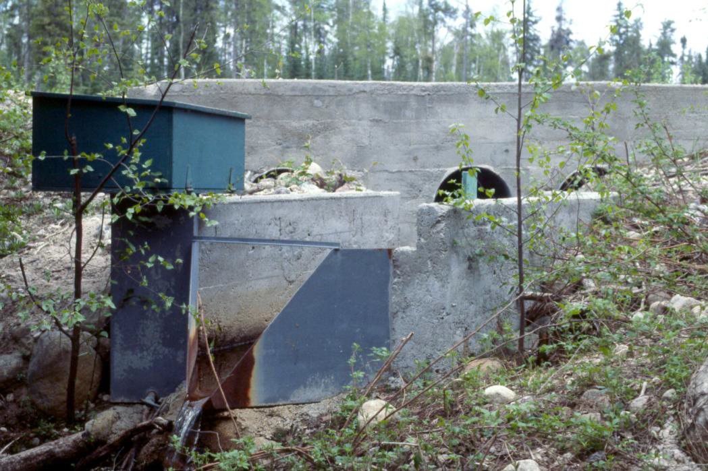
<figcaption>
Figure 1. H-Flume installed at Lake 114 Outflow in 1970 by Water Survey of Canada.
</figcaption>
</figure>

<figure>
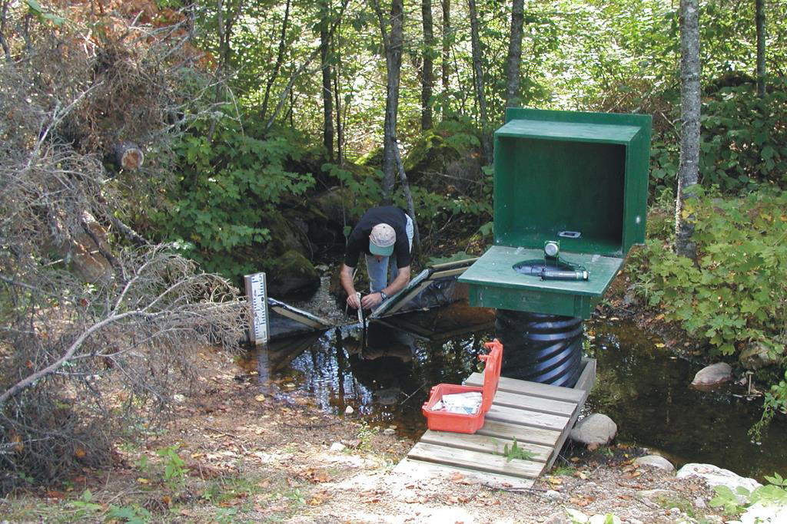
<figcaption>
Figure 2. Lake 114 Outflow weir constructed in October 2000 by ELA Staff.
</figcaption>
</figure>

<figure>
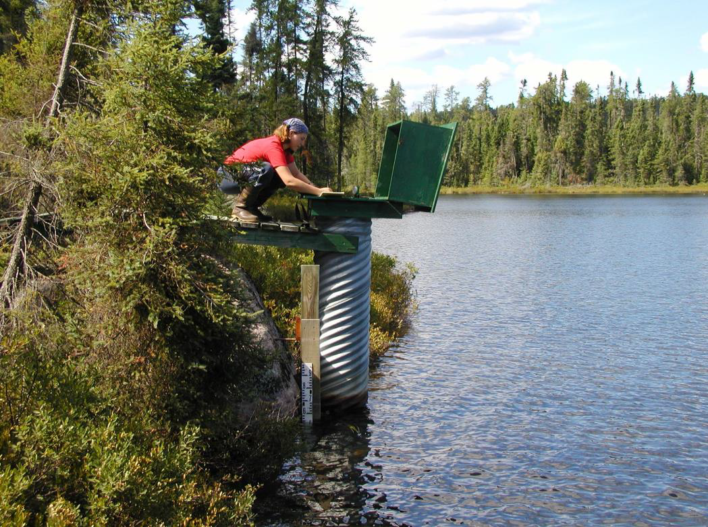
<figcaption>
Figure 3. Lake 114 lake level station installed October 1980 by Water Survey of Canada.
</figcaption>
</figure>

<figure>
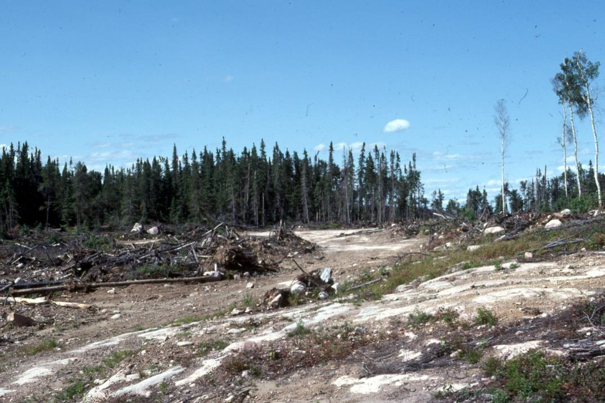
<figcaption>
Figure 4. Upper area of Lake 114 Inflow terrestrial sub-catchment after scarification in 1979.
</figcaption>
</figure>

<figure>
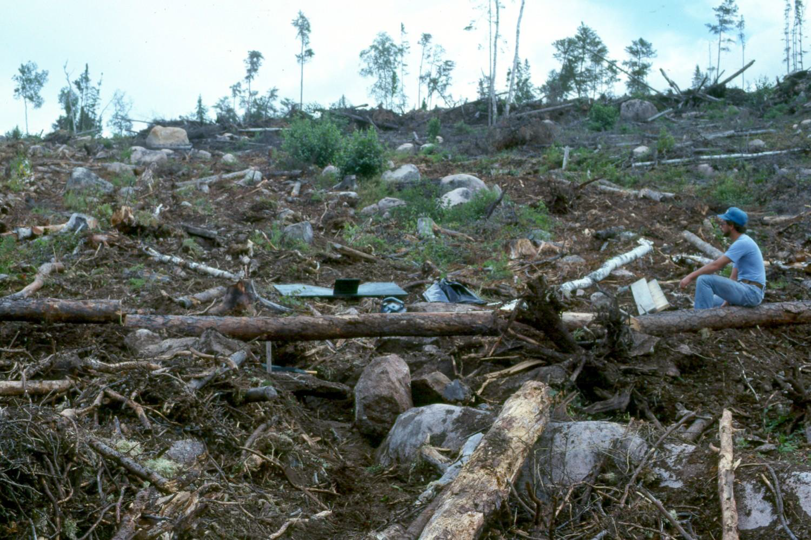
<figcaption>
Figure 5. Lower portion of Lake 114 Inflow terrestrial sub-catchment and weir site after scarification in August 1979.
</figcaption>
</figure>

<figure>
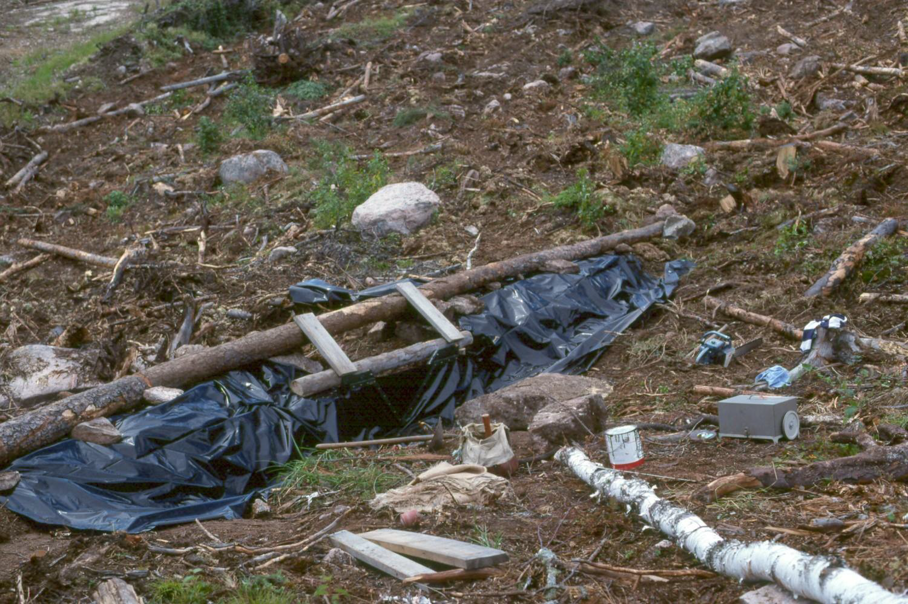
<figcaption>
Figure 6. First weir under construction at lake 114 Inflow in August 1979.
</figcaption>
</figure>

<figure>
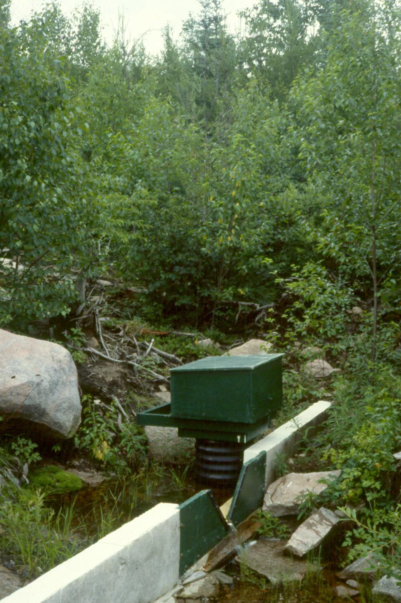
<figcaption>
Figure 7. Second weir at Lake 114 Inflow constructed in 1983 by ELA Staff.
</figcaption>
</figure>

<figure>
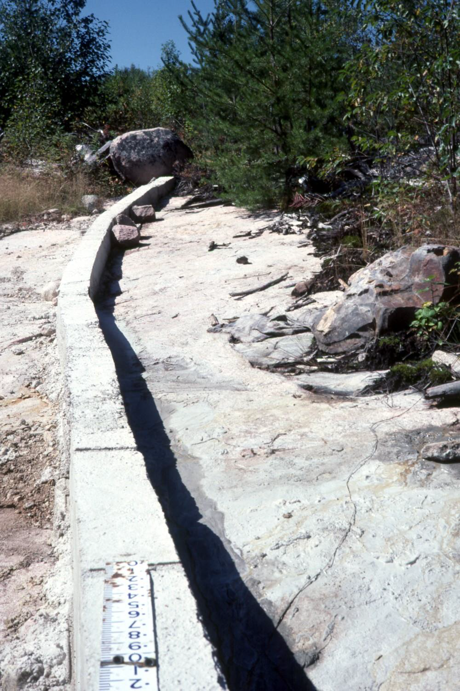
<figcaption>
Figure 8. Concrete wing walls to divert storm runoff to weir (1983).
</figcaption>
</figure>

### Lake 120

 Click to show information on the Lake 120 hydrometric station.

Watershed area (ha): 69.7 ha based on 1972 mapping

XX.XX ha based on 2017 DEM\*

\* The watershed area of Lake 120 determined from the 2017 DEM has yet to be ground-truthed.

<u>The Watershed</u>

Lake 120 is located 8 kilometres (5 miles) west of the ELA field station and inside the old north and south loops logging road. It is approximately a 1.5 km overland hike northwest from the south loop portion of the logging road and therefore access is poor and relatively difficult. This lake was never part of the ELA-Ontario agreement.

Lake 120 is a headwater lake with a surface area of 9.31 hectares and total watershed area of 69.7 ha above the hydrometric monitoring station. During the period of record, a beaver dam existed at the lake outlet but above the weir. The watershed area is based on the Lockwood Survey contour maps (1972) at a scale of 1:7920 from aerial photos taken in 1969-70 which is still the best scale available for this part of the ELA.

This lake is meromictic and was the focus of a Masters thesis by P. Campbell (1976). Hydrological work on Lake 120 has consisted of estimates of annual flow for the years 1970, 1971 and 1972 by Campbell, and monitored flows for 1973 and 1974 by Water Survey of Canada (WSC) and ELA staff.

<u>Hydrometric Stations</u>

1.  Lake 120 Outflow.

A weir was in place between 1972 and 1974, but this does not necessarily mean data was recorded or is available for that time period. The weir may have been unused, used intermittently, discontinued without removal, or operated for another data program, such as WSC. Sometimes other datasets like stream chemistry have even been collected before a weir was installed, or after a weir was removed, leading to stream data date ranges longer than years of weir presence. Data ranges are best determined by working directly with the data, and contacting us with any questions.

The estimates for annual outflow by Campbell were calculated by subtracting surface evaporation from the total input. Values of precipitation, runoff and evaporation from the Rawson (239) watershed were used, and storage was assumed to be zero. The estimates were as follows:

1970. 223,500 m3

1971. 233,600

1972. 147,500

The operation of a 60o sharp crested v-notch weir and water level recorder was commenced by WSC on April 4, 1972. This weir was a “temporary” structure made of a steel notch, plywood and earthen lined walls with plastic sheeting and was operated from mid-April to the end of October in 1972, 1973 by WSC and 1974 by ELA. The record for 1972 was insufficient for work-up and required the above estimate to be made. In the early years of the ELA project, winter flows were assumed to be insignificant and therefore no winter visits were made to this difficult site. Service of the station and calculation of the flows were carried out by WSC staff in 1972 and 1973 and by ELA staff in 1974. All original water level recorder charts are on file with WSC. The operation of this station was discontinued following the 1974 field season. The weir remained idle until August 2015 when the station was fully removed, and the site restored according to the DFO and IISD-ELA transfer agreement.

### Lake 223

 Click to show information on the Lake 223 hydrometric station.

Watershed area (ha): 259.96 ha based on 1972 mapping

XX.XX ha based on 2017 DEM\*

\* The watershed area of 223Q determined from the 2017 DEM has yet to be ground-truthed.

<u>The Watershed</u>

Lake 223 is located approximately 5 km north of the ELA field station. Lake 223 has a surface area of 27.3 ha and a total watershed area of 259.9 ha including the upstream Lake 224 and Lake 225 tributary watershed. L223 is a 3rd order lake. Drainage areas are based on the topographical map produced by Lockwood Surveys (1972) at a scale of 1:7920 from aerial photos taken in 1969. Hydrological instrumentation to the end of 1987 consisted of an outflow weir, a lake stage level recorder and inflow weir. The old beaver dam at the lake outflow was opened in 1986 to allow the lake levels to fluctuate naturally over a narrow range.

<u>Hydrometric Stations</u>

1.  Lake 223 Outflow

A weir was in place between 1975 and 1998, but this does not necessarily mean data was recorded or is available for that time period. The weir may have been unused, used intermittently, discontinued without removal, or operated for another data program, such as WSC. Sometimes other datasets like stream chemistry have even been collected before a weir was installed, or after a weir was removed, leading to stream data date ranges longer than years of weir presence. Data ranges are best determined by working directly with the data, and contacting us with any questions.

In August 1975, a 90˚ V-notch sharp crested concrete weir was constructed by the Water Survey of Canada (WSC). The weir was located on bedrock about 50m downstream of the lake outlet and beaver dam. A Leupold and Stevens A-35 float water level recorder, which were housed in a California-type shelter, provided continuous record from early April to the beginning of November each year (seven-month record). The natural outlet of Lake 223 is beaver dam controlled and therefore flow often occurs as seepage through or under the dam allowing flow to happen in winter. Because the weir is located downstream of the outlet and beaver dam, the recorded flow was unaffected. In winter, monthly observations were taken since 1982. The concrete was not sealed at the time of construction. However, in 1987, sections of the concrete wall around the notch were repaired and this concrete was sealed with a tar foundation coat.

The outflow weir was located on bedrock and assume subsurface seepage outflow to be unlikely. Users of this data should realize that groundwater seepage out of upstream Lake 224 into adjacent Lake 222 was detected by tritium analysis (Beaty, 1984). This leakage therefore reduces the surface water outflow yield to values lower than would be expected.

This station was discontinued at the end of October 1998. The weir was removed during the 2015 field season as part of the major site decommissioning and cleanup that was a requirement of the transfer of ELA from DFO to IISD-ELA.

2.  Lake 223 Lake Level

In October 1980, a staff gauge, stilling well and Leupold and Stevens A-35 float water level recorder were installed on the lake by WSC. Continuous records were obtained from the end of March to the beginning of November each year since 1981(seven month record). This station was discontinued at the end of October 1998. The lake gauge was removed during the 2015 field season as part of the major site decommissioning and cleanup that was a requirement of the transfer of ELA from DFO to IISD-ELA.

<u>Photographs</u>

Figure 1. Rain gauge and stream segment between beaver dam at lake outlet above and weir downstream.

Figure 2. Lake 223 90o v-notch weir.

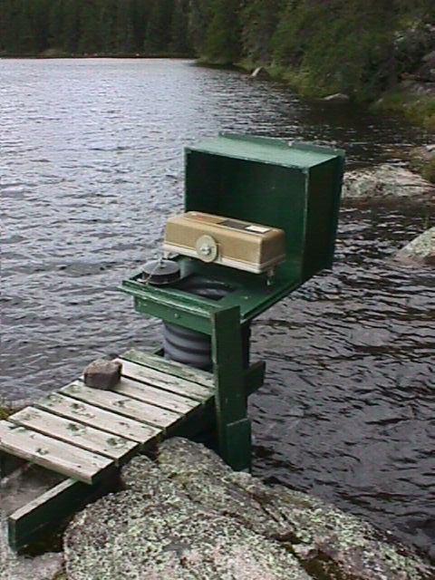

Figure 3. Lake 223 lake stage recorder and stilling well.

### Lake 224

 Click to show information on the Lake 224 hydrometric station.

Coordinates of water level gauge (UTM, WGS 84): 15U 0447881E 5504278N

Watershed area (ha): 97.48 ha based on 1972 mapping

XX.X ha based on 2017 DEM\*

\* The watershed area of Lake 224 determined from the 2017 DEM has yet to be ground-truthed.

<u>The Watershed</u>

Lake 224 is a second order lake that is located 3.0 km north of the ELA field station. It has a surface area of 25.9 ha and a total watershed area of 97.5 ha including the upstream Lake 225 tributary watershed (26.48 ha). L224 is a 2nd order lake. Drainage areas are based on the topographical map produced by Lockwood Surveys (1972) at a scale of 1:7920 from aerial photos taken in 1969-70. Lake 224 flows north into Lake 223. A groundwater seepage problem within the watershed was identified in 1982 and is explained below.

<u>Hydrometric Stations</u>

1.  Lake 224 Outflow

A weir was in place between 1975 and 1999, but this does not necessarily mean data was recorded or is available for that time period. The weir may have been unused, used intermittently, discontinued without removal, or operated for another data program, such as WSC. Sometimes other datasets like stream chemistry have even been collected before a weir was installed, or after a weir was removed, leading to stream data date ranges longer than years of weir presence. Data ranges are best determined by working directly with the data, and contacting us with any questions.

Hydrological work on the lake began in August 1975 when a hydrometric control was established on the outflow stream by Water Survey of Canada (WSC). The structure was a temporary plywood 90o sharp crested v-notch weir equipped with a Leupold and Stevens A-35 analog chart and float actuated water level recorder and staff gauge. This weir was located approximately 75% of the distance downstream from the outlet. The outflow stream and valley bottom are not bedrock controlled and are underlain by undetermined material and boulders. On June 18, 1986, this weir was replaced with a new concrete 90o sharp crested v-notch weir at a new location 50 m upstream of the old weir. A Leupold and Stevens A-35 float actuated chart recorder provided record from early to mid-April to the end of October each year (seven-month record) from 1975 to 1999. In winter, monthly visits were made to obtain manual flow measurements (see “winter flow”). In some years, beaver activity on the lake and in the stream above the weir affected flow.

This station was discontinued October 27, 1999. The weir was removed during the 2015 field season as part of the major site decommissioning and cleanup that was a requirement of the transfer of ELA from DFO to IISD-ELA.

2.  Lake 224 Lake Level

In 1978, a staff gauge was installed on Lake 224 and 24 manual gauge readings were taken from May through October. These readings were recorded in the first data report series of hydrometeorological data (Beaty, 1981) but are not relative to the datum used for data in the years to follow. Occasional manual gauge readings were also obtained in 1989 through 1998. The original station was a metric gauge plate fastened to a board bolted to the bedrock. It was located on a rock face on the south shore of the lake a little west of inflow the inflow stream from Lake 225. Level records were not collected for the years 1999 to 2001. In May 2002, this station was re-activated and upgraded in support of the Long-Term Ecological Research (LTER) project as a reference lake. A new benchmark, staff gauge, stilling well and OTT Thalimedes data logger were installed in July 2002 to obtain continuous record during the open water season. An elevation for the new benchmark was determined relative to the former datum by surveyed water level transfer. This improved station was located in the southwest corner of the lake on the closest bedrock point east of the trailhead from Roddy Lake and boat landing. As of, 12 September 2019, this station is equipped with a Sutron SDR-0001-1 shaft-encoder type water level logger. The OTT Thalimedes logger was removed and use discontinued on 12 September 2019.

<u>Groundwater Seepage</u>

The presence of subsurface flow or groundwater seepage from ELA lakes has generally been assumed to not exist or, at least, be insignificant to the annual water budget. Examination of monitored lake outflow records suggested that this was not the case for Lakes 224 and 225. Records indicated that annual runoff values were well below that of other lakes in the area. A visible seepage stream entering the southwest corner of an adjacent lake (Lake 222) was previously thought to originate from an elevated bog in that basin. The source of the stream was found to be Lake 224 or a combination of the bog and Lake 224.

In 1976, Lake 224 had been injected with tritiated water as a tracer for vertical diffusion experiments (Hesslein et al. 1980). In 1982, Tritium levels were still easily detectable therefore offering a unique groundwater tracing method. In the summer of 1982, samples were taken from the epilimnions of lakes 222 and 224 as well as the seepage inflow into Lake 222. Values were compared to background samples taken from the epilimnions of four other nearby lakes. The samples were analysed by Andy Herczeg from the Lamont-Doherty Geological Observatory of Columbia University. The results are summarized in the following table.

| Sample        | DPM/L         | T.U.             |
|---------------|---------------|------------------|
| Location      |               |                  |
| L. 222        | 1187 +/- 38   | 164.8 +/- 5.2    |
| L. 222 inflow | 6111 +/- 244  | 848.7 +/- 33.9   |
| L. 224        | 22859 +/- 822 | 3174.8 +/- 114.2 |
|               |               |                  |
| Background    |               |                  |
| Location      |               |                  |
| L. 383        | 425 +/- 25    | 59.1 +/- 3.5     |
| Teggau Lake   | 901 +/- 46    | 125.1 +/- 6.3    |
| L. 259        | 633 +/- 28    | 88.1 +/- 3.9     |
| Roddy Lake    | 774 +/- 22    | 107.5 +/- 3.1    |

Where:

- T.U. are Tritium units corresponding to the number of Tritium atoms per 1018 Hydrogen atoms.

- DPM/L refer to decays per minute per litre.

Herczeg offered the following interpretation of the results. “It is clear that Lake 222 is contaminated with water from Lake 224. A lake the size of Lake 222 should have only about 80 T.U. if its only source was bomb Tritium. The seepage water is clearly over one order of magnitude higher than expected. A rough calculation of water budget indicates that the contribution of this inflow is about 2 percent per year of the total volume of Lake 222.”

Furthermore, a mass curve analysis of the outflow data for lakes 223, 224, 226, 227, 303, and 239 for the period 1976 to 1983 demonstrates that the average yield of lakes 224 and 225 is approximately 50% lower than the average of lakes 226, 227, 239 and 303. This provides a strong indication of a seepage problem, not only from Lake 224 but also Lake 225.

While most ELA watersheds appear to be bounded by sound bedrock control, the assumption that groundwater flow or seepage does not exist should not be made without careful examination of the lake basin and hydrometric record where it exists.

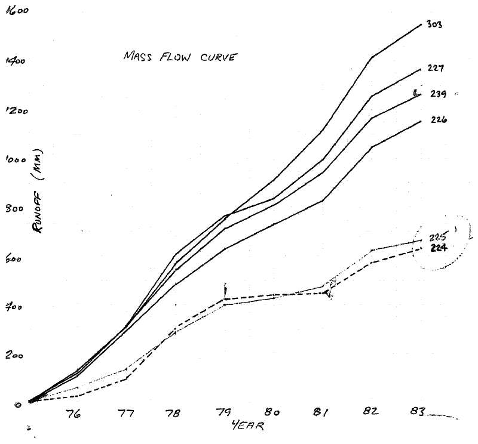

<u>Photographs</u>

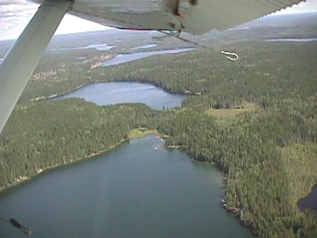

Figure 1. Lake 224 in foreground looking toward the outlet area with Lake 223 downstream. The outflow of Lake 225 is barely visible in the lower right corner of the photograph.

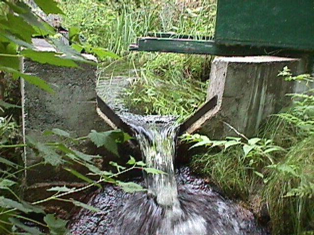

Figure 2. Lake 224 Outflow weir which was discontinued in 1999.

Figure 3. Lake 224 lake level station installed in 2002.

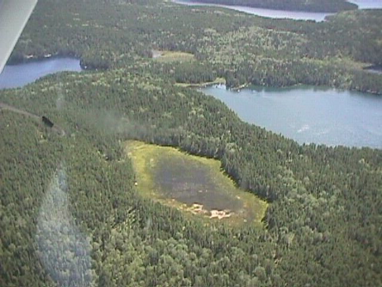

Figure 4. Aerial photo of the groundwater seepage location from Lake 224 (upper left) to Lake 222 (upper right). Samples containing tritium from Lake 224 were taken in the bay of Lake 222 were the portage trail ends.

### Lake 225

 Click to show information on the Lake 225 hydrometric station.

Watershed area (ha): 30.5 ha based on 1972 mapping

XX.X ha based on 2017 DEM\*

\* The watershed area of Lake 225 determined from the 2017 DEM has yet to be ground-truthed.

<u>The Watershed</u>

Lake 225 is located approximately 3 km north of the ELA field station. The lake is a headwater lake with a surface area of 3.99 ha and total watershed area of 30.5 ha above the hydrometric monitoring station. L225 is a 1st order lake. These areas are based on the topographical map produced by Lockwood Surveys (1972) at a scale of 1:7920 from aerial photos taken in 1969-70. The outflow stream flows a short distance over bedrock to downstream Lake 224.

<u>Hydrometric Stations</u>

1.  Lake 225 Outflow.

A weir was in place between 1975 and 2015, but this does not necessarily mean data was recorded or is available for that time period. The weir may have been unused, used intermittently, discontinued without removal, or operated for another data program, such as WSC. Sometimes other datasets like stream chemistry have even been collected before a weir was installed, or after a weir was removed, leading to stream data date ranges longer than years of weir presence. Data ranges are best determined by working directly with the data, and contacting us with any questions.

Hydrometric work on Lake 225 began in August 1975 when Water Survey of Canada (WSC) constructed a 60o sharp crested v-notch concrete weir on the outflow stream. It was instrumented with a Leupold and Stevens A-35 analog float actuated chart water level recorder and staff gauge. The weir was built on bedrock and the presence of seepage or bedrock fractures was not evident. This station was operated from early to mid-April to the end of October each year as a seasonal station (seven-month record) from August 1971 to the end of 1992. From 1982, monthly visits in winter were made to obtain manual flow measurements (see “winter flow”). This weir was treated with a tar foundation sealer at the time of construction.

This station was inactive since it was discontinued (1992). The weir was removed during the 2015 field season as part of the major site decommissioning and cleanup that was a requirement of the transfer of ELA from DFO to IISD-ELA.

<u>Groundwater Seepage</u>

Please refer to the discussion on seepage in the information sheet for Lake 224. A mass flow curve analysis strongly suggests that the same situation may exist for Lake 225 as Lake 224.

<u>  
Photographs</u>

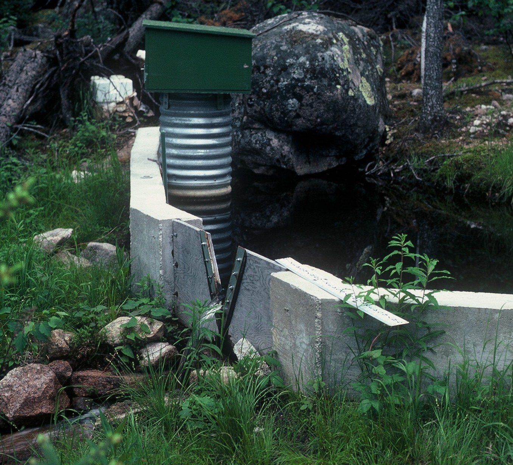

Photographs 1 and 2: Lake 225 outflow weir.

### Lake 226

 Click to show information on the Lake 226 hydrometric station.

Watershed area (ha): 97.17 ha based on 1972 mapping

XX.X ha based on 2017 DEM\*

\* The watershed area of Lake 226 determined from the 2017 DEM has yet to be ground-truthed.

<u>The Watershed</u>

Lake 226 is located approximately 3 km north of the ELA field station. The lake is a headwater lake with a surface area of 16.1 ha and total watershed area of 97.2 ha above the hydrometric outflow monitoring station. L226 is a 1st order lake. These areas were based on the topographical map produced by Lockwood Surveys (1972) at a scale of 1:7920 with 10 foot contours determined from aerial photographs taken in 1969-70. Hydrological instrumentation within the watershed has consisted of a weir at the outflow, and a staff gauge and lake level recorder or data logger in some years. The watershed has experienced disruption from wild fire and the lake from a water level manipulation study. In 1979, an OMNR (Ontario Ministry of Natural Resources) controlled fire burn north of Roddy Lake went out of control and spread to the Lake 226 watershed. This resulted in a forest fire which burned 28.1 ha of the northern terrestrial portion of the basin. Between 1994 and 1997 the lake was lowered in three consecutive winters by controlled drawdown using a stop-log control and siphons to examine divergent impacts of experimental lake-level drawdown on planktonic and benthic plant communities and spawning white fish egg survival. A summary report of this study was prepared by Wolfgang Jansen (March 11, 2000).

Hydrological speaking, the watershed is believed to be “tight”. The basin is bedrock controlled and the long reach of stream channel from the outflow to downstream Roddy Lake has revealed no obvious sign of seepage during times of no flow. This was further supported by the analysis of Tritium additions to Lake 226 between August 2, 1989 and May 10, 1994. The results for outflow from the lake by Tritium analysis checked to within 2% of reported monitored outflow from the weir. (personal communication with Glenn Bird, research scientist, Atomic Energy of Canada, Pinawa, Manitoba, February 12, 1997).

<u>Water Level and Bathymetry</u>

Since work began on Lake 226 in the early 1970’s, water level on the lake has often been affected by the presence of nuisance beaver activity which were very difficult to control.

Fluctuating water levels can be a problem when relating depth at sample sites to bathymetry or when accurate lake volume is required. For this reason, it is very important to know the date, conditions and water level reference at the time of bathymetric field surveys. Because of beavers, this lake has often reached elevation 9.5 m above datum, which is a full 1 m above the natural outflow sill elevation of 8.45 m. The field survey for the current lake bathymetry map was carried out by I. Davies and B. Ayles in February 1975. Unfortunately, the map that resulted was not referenced with respect to the survey date or water level at the time of the survey. It was several years later, about 1994, that the water level reference for that map was determined to be very close to the natural sill elevation (8.45 m) by G. McCullough. This elevation was determined by examination of vertical and oblique aerial photographs, field survey and ground truthing. It was from this analysis 20 years later that we learned that the map currently in use for Lake 226 represents a low water level situation not influenced by beaver. The highest water level observed on the lake was 10.015 m on August 7, 2015, a full 1.56 m above the original natural outflow sill elevation.

Between December 14, 1994 and January 29, 1996, drawdown was carried out during the winter months (December to March): 1994/95, 2.1 m, 1995/96, 3.1 m and 1996/97, 3.1 m below the historic average water level. Because of beaver activity, the lake remained high from the end of that study until the middle of August 2015 when the lake was lowered and the control structure removed in September 2015. At that time, the lake was restored close to the original sill (zero flow) elevation to a new elevation of 8.496 m with a water level of 8.507 m (survey Sept. 23, 2015; Survey book A-36, p34).

<u>Hydrometric Stations</u>

1.  Lake 226 Outflow

A weir was in place between 1971 and 2015, but this does not necessarily mean data was recorded or is available for that time period. The weir may have been unused, used intermittently, discontinued without removal, or operated for another data program, such as WSC. Sometimes other datasets like stream chemistry have even been collected before a weir was installed, or after a weir was removed, leading to stream data date ranges longer than years of weir presence. Data ranges are best determined by working directly with the data, and contacting us with any questions.

Hydrological monitoring began in 1971 when a 90˚ V-notch sharp crested weir was constructed about 20m below the beaver dam and lake outlet by WSC. The weir consisted of a plywood and steel notch section with earth fill dikes and plastic lining. The weir was relined with plastic in 1982 and completely rebuilt in 1985 with similar materials. A Leupold and Stevens A-35 float water level recorder provided continuous record from late March to early November each year since 1972 (seven-month record). The weir was discontinued January 25, 1995 for the three-year period of the lake draw down study that followed. The weir was completely rebuilt at the same location and reactivated October 22, 1997. It was operated until the end of the 1998 season. From 1999 and onward this station was declared “unfunded”. Regardless, attempts to continue record were made but were largely unsuccessful due to time constraints, recorder issues and the continuing battle with beaver. Some record does exist for the years 1999 to 2003 but it has not been processed. In May 2001, the chart recorder was replaced with an OTT Thalimedes data logger. In winter, monthly streamflow observations were made since 1982. From 2005, the weir remained completely buried in beaver debris until its removal in September 2015. In spring and early winter, Roddy Lake becomes a hazardous barrier for travel due to unsafe ice conditions during these shoulder seasons making site visits to collect record at this site difficult or impossible. There has been no evidence of groundwater flow from this lake.

2.  Lake 226 Lake Level

A benchmark was established at Lake 226 between the boat landing and the outlet stream and was assigned an arbitrary elevation of 10.000 m. All lake level data were referenced to this datum. Level record on Lake 226 consisted of periodic direct water level measurements or staff gauge readings in several years beginning in 1977. In June 1995, a stilling well and Leupold & Stevens AF water level recorder were installed and operated until October 1998. In several of the years between 1999 and 2015, occasional measurements of water level have been made. Except for the three draw down years, this lake has experienced a very high range of fluctuation from the natural sill elevation at the outlet of 8.45 m to maximum observed level of 10.015 m in August 2015.

3.  Lake Level Control Structure

A timber, stop-log control structure was constructed at the lake outlet for the water level draw down study. Four self-priming siphon tubes were imbedded in the floor of the structure (see photographs that follow). At the end of the study, stop-logs were set to allow the lake return to the pre-study water level target of elevation 9.2 m. The structure remained in place following the study until it was removed during the site restoration in September 2015.

<u>Site Decommissioning and Clean-up</u>

As part of the site decommissioning agreement between DFO and IISD-ELA, the outflow weir, water level control structure, lake level stilling well and staff gauge were removed in September 2015. The survey benchmark was left as a reference for future work. The outflow sill elevation was set at elevation 8.496 m.

<u>References</u>

1.  Wolfgang Jansen, Ph.D. March 11, 2000. Experimental drawdown of Lake 226 in the Experimental lakes Area, Ontario: Implications for fish habitat management in lakes and reservoirs with fluctuating water levels. Unpublished report to the Department of Fisheries and Oceans, Central and Arctic Region.

<u>Photographs</u>

Lake 226 outflow weir constructed in October 1997, removed in September 2015 (by DFO).

Lake 226 staff gauge (removed in 2015 by DFO)

Lake 226 recording water level station removed September 2015 by DFO.

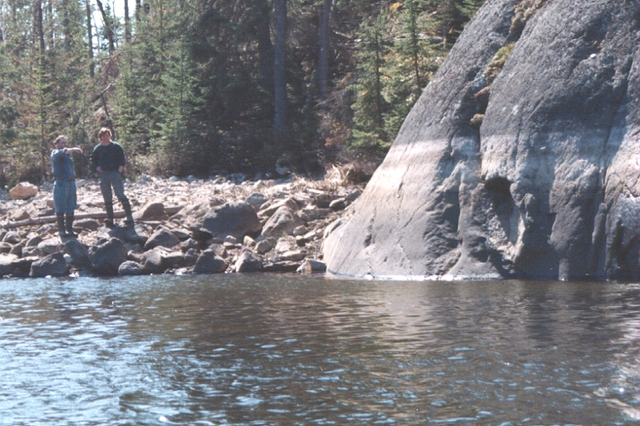

Lake 226 during Water Level Drawdown Study 1994 to 1997.

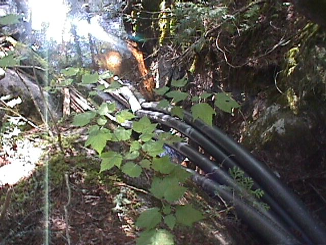

Four 6-inch diameter siphons used to draw down Lake 226.

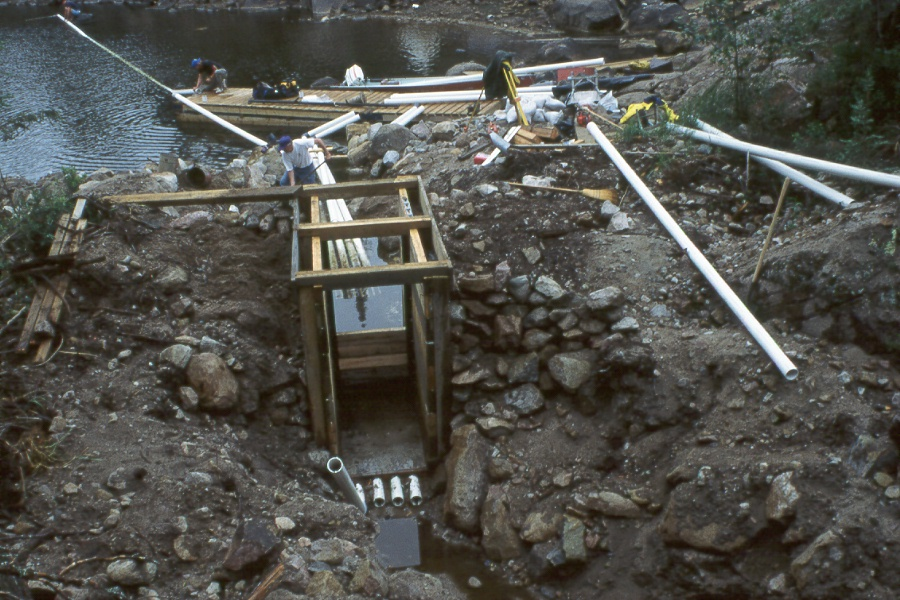

Stop-log control structure and siphons under construction at Lake 226 outlet in 1994.

Beaver debris in Lake 226 Outlet control structure.

Beaver debris in Lake 226 Outflow Weir.

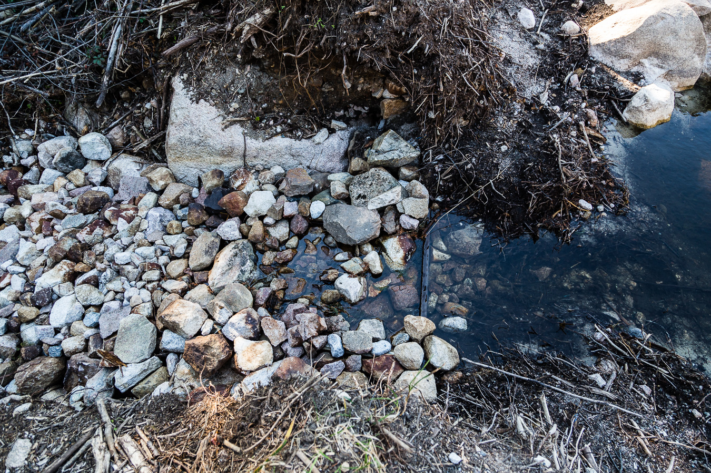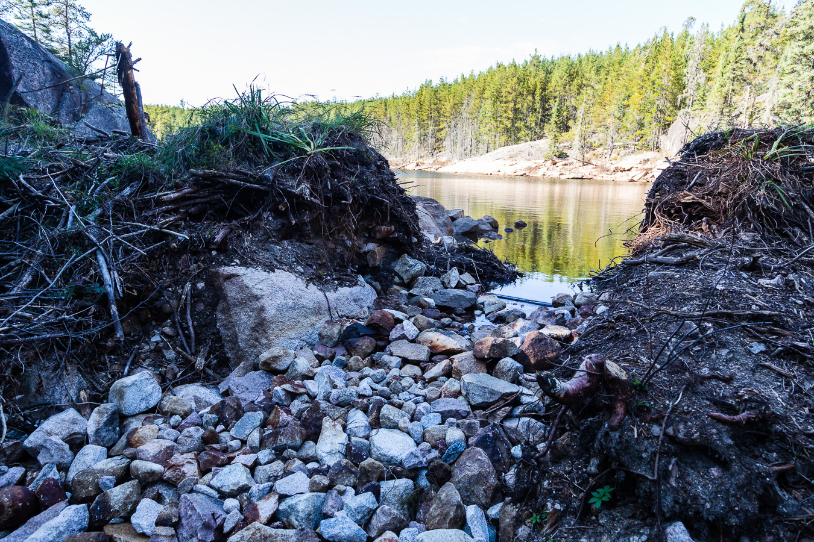

Lake 226 outlet after drawdown structure removal and lake restored to historic sill elevation (September 2015).

### Lake 227

Click to show information on the Lake 227 hydrometric station.

Watershed area (ha): 34.4 ha based on 1972 mapping

XX.X ha based on 2017 DEM\*

\* The watershed area of Lake 227 determined from the 2017 DEM has yet to be ground-truthed.

<u>The Watershed</u>

Lake 227 is located 4 kilometres northeast of the ELA field station. It is a small headwater lake (5.0 ha) that flows into Lake 305. The watershed is 34.4 ha including the lake surface. The best basin contour mapping available is that done by Lockwood Survey (1972) at a scale of 1:7920. A digital elevation map (DEM) was created from aerial imagery flown in 2017 as part of NWOOP.

Hydrological work consisted of monitoring lake level and lake outflow most years between 1969 and 1998 to obtain seven-month record between April and October. During the November to March winter period, record does not normally exist, but flows were usually zero or very low. Beaver activity in the later years was often a problem. Service of the two hydrometric stations, and computation of flows, was by WSC from 1969 to 1984 with the exception of 1974. In 1974 and all years after 1984, service, records and computations were carried out by ELA staff.

<u>Hydrometric Stations</u>

1.  Lake 227 Lake Level

Hydrological work began May 17, 1969 when Water Survey of Canada (WSC) installed a survey benchmark, stilling well and Stevens A-35 float water level recorder on the lake. The lake level gauge was operated in 1969, 1970, and 1977 to 1998. The record was discontinued at the end of the 1998 season.

2.  Lake 227 Outflow

A weir was in place between 1970 and 1998, but this does not necessarily mean data was recorded or is available for that time period. The weir may have been unused, used intermittently, discontinued without removal, or operated for another data program, such as WSC. Sometimes other datasets like stream chemistry have even been collected before a weir was installed, or after a weir was removed, leading to stream data date ranges longer than years of weir presence. Data ranges are best determined by working directly with the data, and contacting us with any questions.

October 27, 1970, a 90o v-notch sharp crested weir was constructed on the outflow stream by WSC. Data prior to this construction date was based on open channel measurements related to lake level. This first weir was a temporary plywood and plastic lined structure with stilling well and a Leupold and Stevens A-35 float water level recorder. The original weir was replaced in 1985 with a new 90o v-notch sharp crested concrete weir at the same location by ELA personnel. The concrete was not sealed. In winter, monthly streamflow observations were made since 1982. This station was discontinued at the end of the 1998 season.

<u>Clean-up</u>

In April 2014, the responsibility for ownership and operation of the ELA transferred from DFO to IISD. As part of that agreement, a major cleanup of many research sites was undertaken. Both the lake level and weir sites were removed during the 2015 field season. The survey benchmark remains at the former lake level gauge location.

### Lake 230

Click to show information on the Lake 230 hydrometric station.

Watershed area (ha): 8.89 ha based on 1976 mapping

XX.X ha based on 2017 DEM\*

\* The watershed area of Lake 230 determined from the 2017 DEM has yet to be ground-truthed.

<u>The Watershed</u>

Lake 230 is located 7 kilometres east of the ELA field station. It is a small headwater lake (1.67 ha) that flows into Lake 310. The watershed is 8.89 ha including the lake surface. This area was based on 1976 air photo interpretation as no suitable contour mapping currently exists for this location.

Hydrometric work on Lake 230 was carried out in the years 1971 to 1980 when Water Survey of Canada operated an outflow weir to obtain seven-month record between April and October. During the November to March winter period, record does not normally exist, but flows were usually zero or very low. Service of the hydrometric station, and computation of flows, was by WSC in all years with the exception of 1974.

The entire Lake 230 watershed was affected by a severe windstorm on July 7, 1973. One year later, on June 26, 1974 the entire basin was burned by forest fire. The effects of the wind storm and forest fire have been described by Schindler et al. (1980).

<u>Hydrometric Stations</u>

1.  Lake 230 Outflow

A weir was in place between 1971 and 1980, but this does not necessarily mean data was recorded or is available for that time period. The weir may have been unused, used intermittently, discontinued without removal, or operated for another data program, such as WSC. Sometimes other datasets like stream chemistry have even been collected before a weir was installed, or after a weir was removed, leading to stream data date ranges longer than years of weir presence. Data ranges are best determined by working directly with the data, and contacting us with any questions.

November 18, 1970, a 60o v-notch sharp crested weir was constructed on the outflow stream by WSC. This was a temporary plywood and plastic lined structure with a stilling well and a Leupold and Stevens A-35 float water level recorder. Record was collected for the seven-month period from April to the end of October. No data exists for the November to early April winter periods, but flows were normally zero to very low. This station was discontinued at the end of the 1980 season.

<u>Clean-up</u>

In April 2014, the responsibility for ownership and operation of the ELA transferred from DFO to IISD. As part of that agreement, a major cleanup of many research sites was undertaken. The remains of the weir and other debris were removed during the 2015 field season.

### Lake 239

Click to show information on the Lake 239 hydrometric station.

oordinates of control structure (UTM, WGS 84): 15U 0447564E 5500960N

Coordinates of water level gauge (UTM, WGS 84): 15U 0447540E 5501165N

Watershed area (ha): 393.34 ha based on 1987 mapping

388.28 ha based on 2017 DEM\*

\* The watershed area of 239Q determined from the 2017 DEM was ground-truthed in fall 2023.

<u>The Watershed</u>

Lake 239 is located at the end of the Pine Road, 30 km south of Ontario Highway 17. The ELA field station facility is located at the SW corner of the Lake 239 Watershed and near the lake outlet. Lake 239, named Rawson Lake in the 1970’s, is a headwater lake with a surface area of 54.38 hectares and total watershed area of 393.34 ha. It is separated from downstream Lake 240 (Hayes Lake) by a narrow strip of land approximately 100 m long by 15 to 20 m in width. The lake flows out through a small short stream channel 15 m in length and 1.5m in width. The surface elevation of Lake 239 is approximately 0.2m higher than that of Lake 240. The outflow sill elevation has been controlled since 1972 when a flow measuring flume was installed. The terrestrial portion of the watershed consists of three well defined subbasins referred to as the Northwest Subbasin, Northeast Subbasin and East Subbasin as well as four undefined direct drainage areas. The three subbasins each have a well-defined stream and together account for 70% of the runoff to the lake. The Rawson Lake Watershed and its hydrologic processes have been previously described by Schindler et al. (1976), Newbury and Beaty (1977), Newbury et al. (1979) and Schindler et al. (1980).

This Lake 239 Watershed has been monitored continuously since 1969 with respect to its chemistry, aquatic biology, hydrology and meteorology and has served as a reference for much of the work that has been carried out at the ELA.

Watershed drainage areas were initially based on the topographical map produced by Western Photogrammetry (1970) at a scale of 1:4800 with 10 foot contour interval and based on an assumed datum. A re-mapping of the Northeast Subbasin in 1982 and 1987 resulted in a minor adjustment to the drainage area for the watershed.

The watershed has experienced an extreme wind event and two forest fires since 1969. At 05:00 on July 7, 1973, a severe windstorm, with winds up to 150 kph, struck the ELA. Parts of the Rawson Lake Watershed were severely affected by blowdown. Almost one year later, on June 26, 1974, a major forest fire started that swept the area burning 70% of the watershed (Schindler et al. 1980). In June 1980, another fire started south of Lake 240 and burned most of the Rawson Lake basin with only the immediate field station area and buildings being saved. With the exception of these three events, the watershed has remained relatively pristine.

<u>  
Hydrometric Stations</u>

Since 1969, hydrometric stations have been operated at six locations in the Rawson Lake Watershed: 239 Outflow, 239 Lake Level, NW inflow, NE inflow, East inflow and East Upper Weir. This information section provides only discussion on the outflow and lake level locations.

1.  Lake 239 Outflow

A weir has been in place since 1970, but this does not necessarily mean data was recorded or is available for that time period. The weir may have been unused, used intermittently, discontinued without removal, or operated for another data program, such as WSC. Sometimes other datasets like stream chemistry have even been collected before a weir was installed, or after a weir was removed, leading to stream data date ranges longer than years of weir presence. Data ranges are best determined by working directly with the data, and contacting us with any questions.

Hydrometric work on Lake 239 began June 4, 1969 when WSC established a servo-manometer pressure gauge and Leupold and Stevens A-35 stage level recorder in the pump house building located 150 m north of the outflow stream. This gauge served a dual function as a lake stage recorder for storage calculations and for stage level values in the stage-discharge relationship for the outflow stream. Initially there was no structure on the outflow stream to measure flow. A section of open channel was rated, and the first reported outflow record was for 1970. The streambed was mobile, comprised of sand and fine gravel. In June 1970, a plywood metering flume was installed by WSC. This proved to be only a slight improvement due to the shifting streambed, effect of wind, and the possibility of backwater from the downstream lake. The lake 239 outflow sill elevation from 1969 to 1972 was in the range of 29.446 m. On June 6, 1972, a 12-inch (30.5 cm) steel trapezoidal cutthroat Parshall flume was installed, with a zero-flow elevation of 29.415 m. The flume was constructed in the metal shop at Stoney Mountain Penitentiary to Water Survey of Canada specifications and installed by ELA staff. This greatly improved the quality of record and reduced the threat of backwater. On November 6, 1975, the pressure gauge and stage recorder were removed and a stilling well and Leupold and Stevens A-35 float stage level recorder were installed by WSC on the side of the helicopter landing pad at the outflow approximately 3 m upstream of the flume. As before, this single recorder provided stage level data for both lake storage and outflow discharge values. Between installation and 30 August 1973, the original steel flume had shifted to an elevation of 29.443 m. By 18 July 1985, the flume sill was at 29.435 m. In August/September 2007, a new steel flume was installed which was built to the same specifications and again at Stoney Mountain Penitentiary. The original flume was at a sill elevation of 29.437 m and the replacement flume was installed at a sill elevation of 29.466 m at time of replacement. A survey in 2012 determined the sill elevation of the flume to be at 29.469 m.

In 1976, a variable head loss situation was noticed between the water levels at the lake stage recorder and at the flume caused by sand deposition from wind and waves. To overcome this problem, a Leupold and Stevens A-71 float water level recorder and stilling well were installed July 12, 1976 on the outflow flume. In all years, continuous stage records were maintained (12-month record). Winter discharge records were further improved in 1976 by the use of a snow shelter with four 250 W electric heat lamps in the flume and one in the stilling well. In 2000, data recording was upgraded when the analog chart recorder was replaced with a float driven OTT Thalimedes data logger. Since 2017, 239Q has been outfitted with the OTT Thalimedes data logger as well as a Sutron SDR-0001-4 and Turner Cyclops CDOM sensor. The OTT Thalimedes was removed and discontinued in 2020.

In winter, the stilling well is kept ice free with one 250 W electric heat lamp as well as a 250 W cattle trough heater around the intake pipe (as of 2019). The flume continues to have four 250 W electric heat lamps in the winter to maintain flow.

2.  Lake 239 Lake Level

Lake level records began June 4, 1969 when WSC established a servo-manometer pressure gauge and Leupold and Stevens A-35 stage level recorder in the pump house building 150 m north of the outflow. On November 6, 1975, this was replaced with a stilling well and Leupold and Stevens A-35 float stage level recorder on the side of the helicopter landing pad at the outflow. On July 25, 1994, the lake level stilling well was relocated 150 m north in the vicinity of the pump house, where it has remained. In spring 2022 the stilling well was pushed over by a mobile yet strong ice pan, due to extremely high water levels. The well was replaced in the same location in June 2022. The stilling well is kept ice free in winter with one 250-Watt electric heat lamp and full year records were maintained.

From 2000 to August 2018 the station was equipped with an OTT Thalimedes data logger. On 17 December 2016, the station was also equipped with a Sutron SDR-0001-01 data logger, which has been in use ever since and is the current data logger.

<u>Figures and Photographs</u>

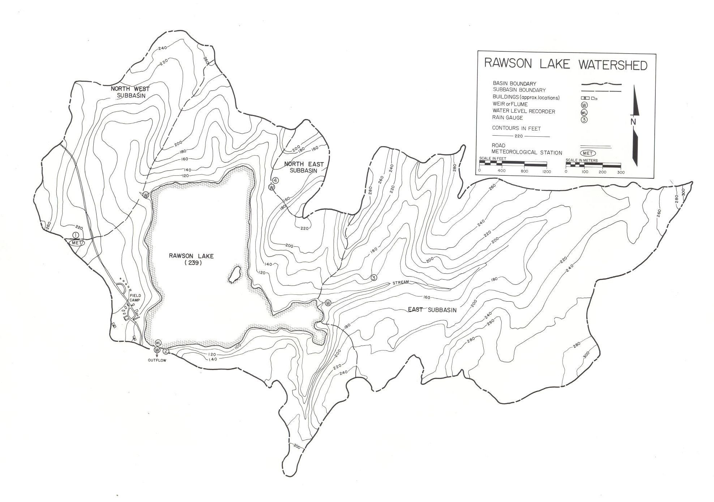

<figure>
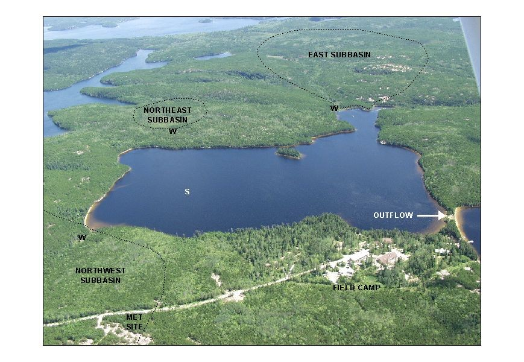
<figcaption>
Figure and Photograph 1. Map and oblique aerial photograph of the Rawson Lake Watershed.
</figcaption>
</figure>

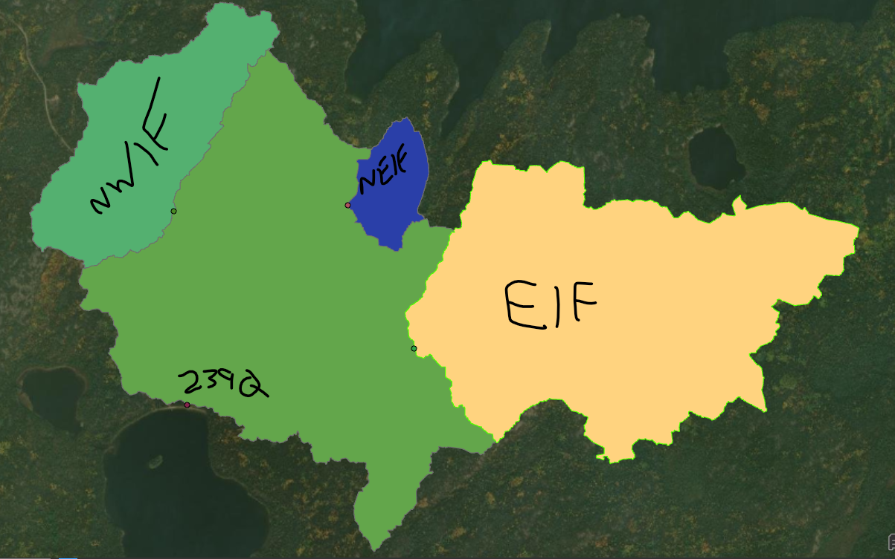

L239 watershed and sub-catchments as delineated using 2017 DEM and ground-truthing.

<figure>
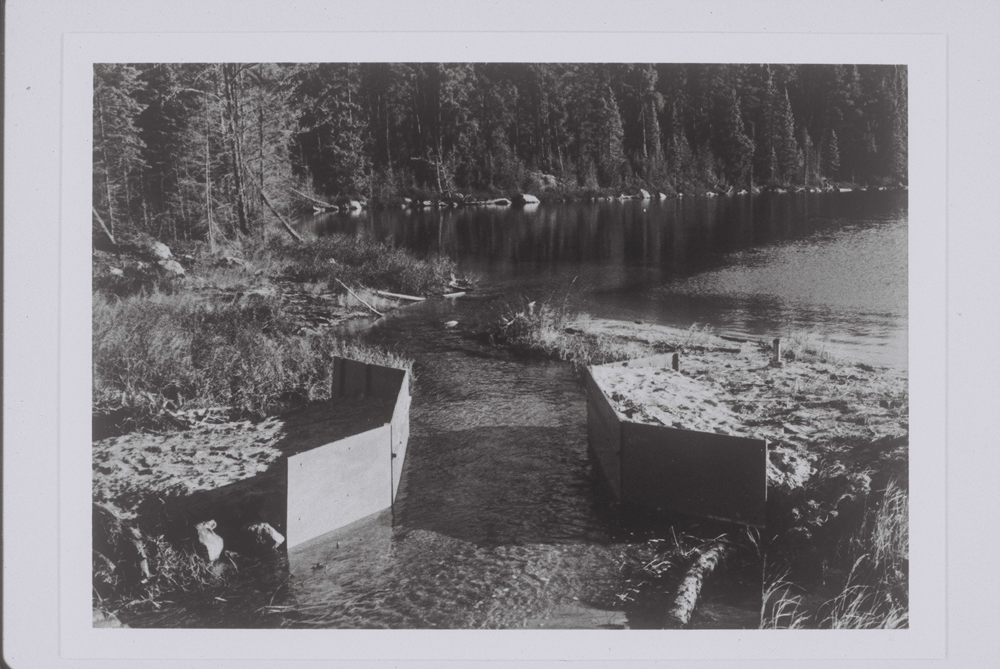
<figcaption>
Photograph 2. Lake 239 Outflow from June 1970 to June 1972.
</figcaption>
</figure>

<figure>

<figcaption>
Photograph 3. Installing the first Parshall flume in June 1972.
</figcaption>
</figure>

<figure>

<figcaption>
Photograph 4. Installing second Parshall flume in 2007.
</figcaption>
</figure>

<figure>
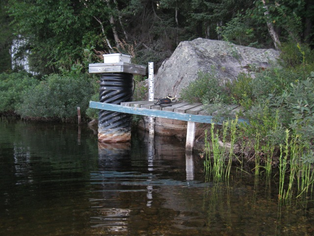
<figcaption>
Photograph 5. Lake 239 water level station, post 25 July 1994 relocation.
</figcaption>
</figure>

### Lake 239 - East Upper Weir

Click here to show information on the Lake 239 (east upper weir) hydrometric station.

<u>The Watershed</u>

Lake 239 East Upper Weir is located halfway up the East Subbasin where the stream conveniently flows over exposed bedrock effectively dividing the subbasin into two almost equal parts. The upper basin has an area of 90.78 ha which is 53% of the East Subbasin.

<u>Hydrometric Stations</u>

A weir was in place between 1973 to 1984 but this does not necessarily mean data was recorded or is available for that time period. The weir may have been unused, used intermittently, discontinued without removal, or operated for another data program, such as WSC. Sometimes other datasets like stream chemistry have even been collected before a weir was installed, or after a weir was removed, leading to stream data date ranges longer than years of weir presence. Data ranges are best determined by working directly with the data, and contacting us with any questions.

Hydrometric work at this station began August 22, 1973 when ELA staff constructed a 90o v-notch sharp crested weir. The initial intention was to only operate the station for one year and therefore only a temporary structure having a plywood and steel notch with sandbag walls was built. Only about 3 months of record were collected before, in May 1974, high storm runoff washed out the wing walls resulting in it being discontinued. In June 1974, the East Subbasin was completely burned by forest fire and it was decided to reconstruct the weir to monitor post fire runoff through forest regeneration. In July 1974, a 120o v-notch sharp crested concrete weir was built by ELA staff. The concrete was never treated. A Leupold and Stevens A-71 water level recorder provided continuous record from early or mid-April until the end of October (seven month record) each year from 1975 to 1984. This station has been referred to as the “rock lip weir” in some reports. Effects of the forest fire and preceding wind storm (1973) have been published by Schindler et al. (1980).

This station behaved very well during most flow seasons but was difficult to operate during the rising limb and peak segments of the spring hydrograph due to winter flood ice buildup at the weir. Due to the difficulty in accessing this station in winter, the normal winter observations made at most stations were not carried out here. Therefore, no data exists for the November to early April winter periods but flows were believed to be zero to very low.

Service and data computation was by ELA staff in 1973 and 1974 but this responsibility transferred to Water Survey of Canada in 1975. Records exist for the years 1973 to 1984. Original water level charts for 1973 and 1974 are Stevens Type F weekly charts on file with ELA Hydrologic Studies. Original Leupold and Stevens A-35 float water level recorder charts for the years 1975 to 1984 are on file with WSC. A standard rain gauge was located beside the weir and read weekly from 1976 to 1984. This station was discontinued at the end of the 1984 season.

<u>Clean-up</u>

In April 2014, the responsibility for ownership and operation of the ELA transferred from DFO to IISD. As part of that agreement, a major cleanup of many research sites was undertaken. The remains of the weir were not removed during the cleanup, and as of January 2025, persist just downstream of the trail.

### Lake 239 - East Inflow

Click here to show information on the Lake 239 (east inflow) hydrometric station.

Coordinates of control structure (UTM, WGS 84): 15 U 448535 E, 5501200 N

Watershed area (ha): 170.28 ha based on 1987 mapping

150.90 ha based on 2017 DEM \*

\* The watershed area of the EIF determined from the 2017 DEM was ground-truthed in fall 2023.

A weir has been in place since 1970, but this does not necessarily mean data was recorded or is available for that time period. The weir may have been unused, used intermittently, discontinued without removal, or operated for another data program, such as WSC. Sometimes other datasets like stream chemistry have even been collected before a weir was installed, or after a weir was removed, leading to stream data date ranges longer than years of weir presence. Data ranges are best determined by working directly with the data, and contacting us with any questions.

<u>1971 to 2025</u>

The East Inflow to L239 (Rawson Lake) drains the East Subbasin (170.28 ha) and is the largest stream that flows into the lake. This station has also been referred to as the East Lower Weir in some reports. The monitoring site is located approximately 75 m upstream of the lake. The stream channel is well defined for approximately 900 m of its length and flows most of the year, usually from early to mid-April until the end of November or early December. The lower 550 m of the stream has a very low slope (\<1%) and meanders along the central part of a broad flat valley bottom. Where the gauging station is located, the valley is 130 m wide and is underlain with a sandy till substrate with a maximum depth of 13 m to bedrock. Flow occasionally exceeds bank full stage during major rainstorm events making this stream difficult to monitor at times. It also reaches a state of zero flow that can last for several weeks during dry summers and most winters.

In June 1970, drilling was carried out across the mouth of the basin in the area bounded by the monitoring location and the lake to investigate the depth and type of substrate and to place piezometer and groundwater wells. Geochemical studies were conducted by Bottomley (1974) and Kennedy (1974). The entire subbasin was burned twice by major forest fires in 1974 and 1980. A post-forest fire sediment transport study was carried out by Beaty from 1975 to 1982 (Beaty, 1994). All piezometers and water table wells were removed in 2015 as a requirement of the transfer agreement between DFO and IISD-ELA.

Hydrometric work on this stream began on June 18, 1971. A small wooden box flume (1.22 m wide by 1.83 m) with staff gauge was installed to monitor storm runoff events during the open water season. A stage-discharge relationship was developed and daily discharge values were estimated for part of 1971 and 1972 based on manual gauge readings. On May 10, 1973, a Stevens Type-F weekly chart water level recorder was added to extend and improve the record. Following the 1974 forest fire, a new weir was constructed by ELA personnel and began operation August 2, 1974. This structure was a larger wooden box flume (1.52 m by 2.44 m) incorporating a shallow v-notch at the front end to improve the resolution of low baseflow. It was installed at a higher elevation than the first flume to reduce the occurrence of backwater and was fitted with a staff gauge and Leupold and Stevens Type-A float water level recorder. Diking was also improved for better containment of high flows. Following the second forest fire in June 1980, the monitoring station was once again upgraded when it was replaced by Water Survey of Canada (WSC) with a similar but slightly larger structure on October 14, 1982. The new station was a steel box flume (1.83 m by 2.44 m) with a shallow steel v-notch at the front end having the same degree of angle as the previous structure. This weir was installed slightly higher than the 1974 flume to eliminate the possibility of backwater from the downstream lake and dikes were also further improved. A Leupold and Stevens Type-A float water level recorder provided continuous record from early to mid-April until early November (seven-month record). In early November 1988, a large track mounted backhoe was brought in to again improve dikes and dig a trench across the valley on the upstream side of the dike. This structure performed well until it was replaced in August 2008. The new weir was fabricated to the same dimensions as the former one. The major difference was that large foundation ground screws (4) eight feet long were used to level and support the heavy steel structure. The stilling well, staff gauge and cat-walk are also supported with two ground screws. It is anticipated that they will prevent shifting due to frost heave in the sandy soils.

While attempts have been made since 1975 to obtain April spring record, poor accessibility due to risky ice conditions have often resulted in incomplete records. This station was normally operated from mid-April until early November. In winter, monthly streamflow observations were made since 1977 to determine the presence or absence of flow that would aid in the estimation of winter flow.

Recording equipment used was the Leupold and Stevens Type-A water level recorder until 2000. A Stevens Type A/F data logger was used for back-up in 2000. In 2001, a change was made when we began using OTT Thalimedes float-potentiometer data loggers. During the 2017 open water season, a Sutron SDR-0001-1 was used. Since 10 July 2018, a Sutron SDR-0001-4 has been used with the addition of a CDOM sensor, and the OTT Thalimedes logger was discontinued. A Solinst Levelogger 5 (model 3001) was deployed on 8 April 2019 and usually remains from April-October each year. The Solinst Levelogger (pressure sensor) collects early spring data, acts as a backup logger to the Sutron SDR, and records water temperature. An OTT Orpheus Mini data logger, which is also a pressure and temperature sensor, was used in April-May 2020, instead of the Solinst Levelogger.

Beavers are a frequent problem at this site, especially in year 2000, when these pests caused dike damage and blockage that forced us to estimate values for most of the flow season using data from the Northwest Inflow to Lake 239 station. In all years, daily flow values that were influenced by beaver have been flagged “D” in the data summaries and should be regarded as best estimates only.

<u>References</u>

BEATY, K.G. 1994. Sediment transport in a small stream following two successive forest fires. Can. J. Fish. Aquat. Sci. 51: 2723-2733.

BEATY, K.G. 1981. Hydrometeorological data for the Experimental Lakes Area, northwestern Ontario, 1969 through 1978 (in three parts). Can. Data Rep. Fish. Aquat. Sci. 285: 1-367.

BEATY, K.G. 1984. Hydrometeorological data for the Experimental Lakes Area, northwestern Ontario, 1979 through 1981. Can. Data Rep. Fish. Aquat. Sci. 480: 146 p.

BEATY, K.G., AND M.E. LYNG. 1989. Hydrometeorological data for the Experimental Lakes Area, northwestern Ontario, 1982 through 1987. Can. Data Rep. Fish. Aquat. Sci. 759: 280 p.

BOTTOMLEY, D. 1974. Influence of hydrology and weathering on the water chemistry of a small Precambrian Shield watershed. M.Sc. thesis, University of Waterloo, Waterloo, ON. 118 p.

KENNEDY, K. 1974. Geohydrology and hydrochemistry of a small Precambrian Shield watershed. M.Sc. thesis, University of Waterloo, Waterloo, ON. 248 p.

<u>  
Photographs</u>

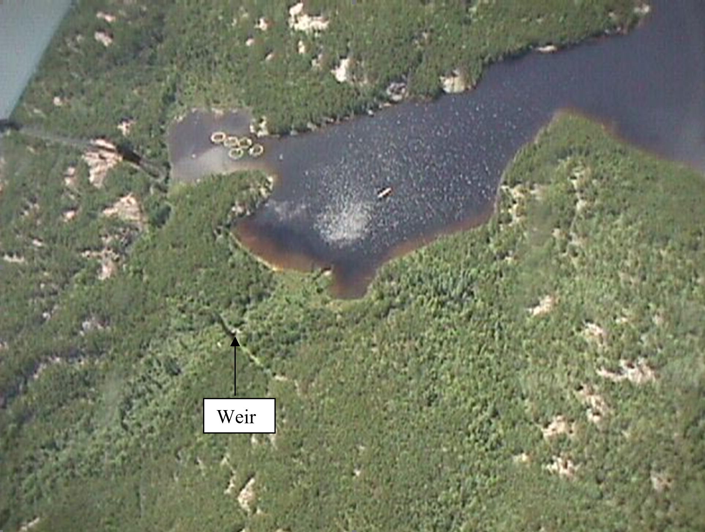

Photograph 1. Aerial view of East Inflow to Lake 239.

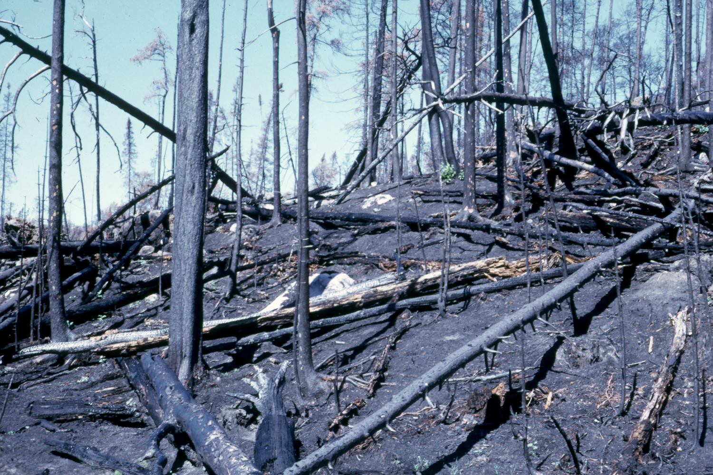

Photograph 2. East Subbasin after 1974 forest fire.

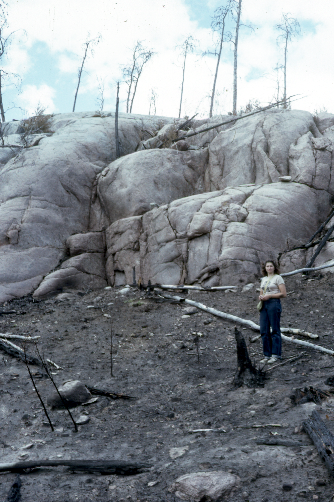

Photograph 3. East Subbasin after 1980 forest fire.

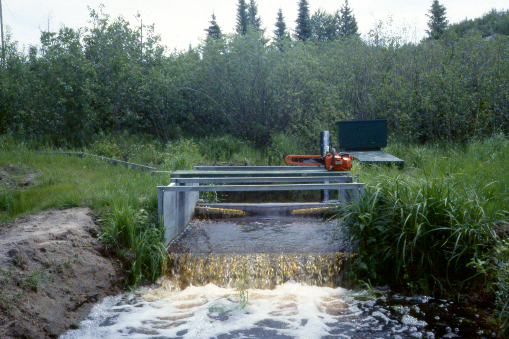

Figure 4. East Inflow Weir at moderate flow during the summer of 1989.

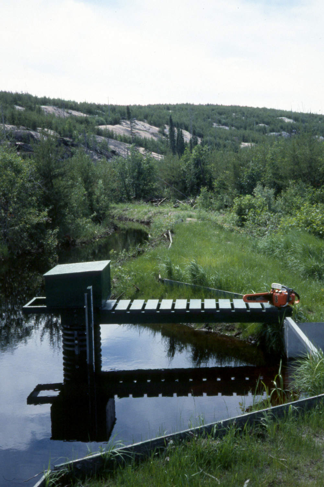

Figure 5. Looking SE along ditch and dike taken summer 1989.

Figure 6. East Inflow after late spring storm May 12, 2004.

Figure 7. Measuring discharge during snowmelt recession May 13, 2004.

Figure 8. The East Inflow to Lake 239 in the summer of 2006 during the longest dry period on record.

Figure 9. Installing a new replacement weir in August 2008.

Photograph 10. A new weir/flume was installed to the same dimensions as the previous structure in August 2008. The heavy steel structure is bolted to four ground screw anchors set to a depth of 2.4 metres.

### Lake 239 - Northeast Inflow

Click here to show information on the Lake 239 (northeast inflow) hydrometric station.

Coordinates of control structure (UTM, WGS 84): 15 U 448245 E, 5501810 N

Watershed area (ha): 12.43 ha based on 1987 mapping

12.36 ha based on 2017 DEM \*

\* The watershed area of the NEIF determined from the 2017 DEM was ground-truthed in fall 2023

<u>1971 to 2025:</u>

A weir has been in place since 1970, but this does not necessarily mean data was recorded or is available for that time period. The weir may have been unused, used intermittently, discontinued without removal, or operated for another data program, such as WSC. Sometimes other datasets like stream chemistry have even been collected before a weir was installed, or after a weir was removed, leading to stream data date ranges longer than years of weir presence. Data ranges are best determined by working directly with the data, and contacting us with any questions.

Hydrometric work on this stream began in July 1971 when a bedrock-controlled section of open channel was stabilized with a small metering section and staff gauge. A stage-discharge curve was developed for the section and in 1971, 1972 and 1973 mean daily discharges were calculated based on daily manual gauge readings. In 1974, a Leupold and Stevens Type-F weekly float recorder was placed on the stream to improve the quality and period of record. Only open water season flow data were collected. It was not until 1978 that the period of record was extended to include April spring runoff. In July 1979, this station was upgraded when the control section was replaced with a concrete flume. In 1983, the importance of this station increased when a new major project to study the effects of acidification on a wetland began. In 1983, an irrigation system was installed in the 3.67 ha wetland portion of the NE Subbasin to create artificial acidic precipitation events. Water was pumped from nearby Roddy Lake and sprayed onto the wetland on 9, 12, 13, 11, 9, 6, 11 and 6 occasions respectively in each of the years 1983 to 1990. Mean daily flow values for this station are flagged with an “S” on days that the irrigation system was operated. Volumes of Roddy Lake water pumped into the Subbasin are available. This system was described in detail by Beaty (1987). New mapping in 1982 and 1987 resulted in a new reported drainage area (Table 72) for the NE Subbasin.

On 18 July 1985, the concrete flume was replaced with a 120˚ V-notch concrete sharp crested weir at the same location. The concrete was not sealed in either structure. The v-notch weir greatly improved the quality of record, especially during the April spring snowmelt period. On 29 August 2020, the painted plywood weir wall was remade and the rotten concrete from below the notch, as well as the lower parts of the vertical concrete supports, were removed and re-poured, with bolts embedded in order to attach the new wall. The 120o v-notch was replaced with a 90o v-notch to improve the quality of the record for low-flow. The bolt-holes and edges of the concrete where they meet the painted plywood weir wall were caulked with Vulkem 116. Notch 0 elevation of the new v-notch was installed at an elevation of 45.326 m, which is ~ 0.023 m higher than the previous notch 0 elevation.

The rating formula for the 120o v-notch of this weir is Q = 4.1306H^2.602 (in operation from 18 July 1985 to 28 August 2020), calculated by ELA staff on 22 September 1989. The rating formula for the 90o v-notch of this weir (installed 29 August 2020) is Q = 1.3425H^2.47.

A Leupold and Stevens A-71 float water level recorder provided continuous record from late march to early November (seven-month record). In May 2001, this station was upgraded with an OTT Thalimedes float-potentiometer data logger. Historically, this stream froze up by mid to late November and started to run by the last week of March or first week of April. Depending on precipitation in the fall months, NEIF has continued to flow into January of the following calendar year. In winter, monthly stream flow observations have been made since 1978. No further changes occurred at this station to 11 May 2017.

This station was equipped with a Sutron SDR-0001-4 and CDOM sensor between 11 May 2017 and 10 July 2018 (not including winter months). Since 10 July 2018, this station has been equipped with a Sutron SDR-0001-1 during the open water season. On 7 April 2020, a Solinst Levelogger 5 (model 3001) was added and usually remains active from April-October each year. The Solinst Levelogger (pressure sensor) collects early spring data, acts as a backup logger to the Sutron SDR, and records water temperature. Station equipment was changed back to a Sutron SDR-0001-4 and CDOM sensor on 13 June 2022.

Seepage between the concrete edge and the plywood weir wall has been observed between August 2023-2025. Efforts were made in 2023 to reduce the leak by excavating, lying poly sheeting down, and filling cracks with concrete (Quikrete), but it continued to leak in 2024.

### Lake 239 - Northwest Inflow

Click here to show information on the Lake 239 (northwest inflow) hydrometric station.

Coordinates of control structure (UTM, WGS 84): 15 U 447503E 5501785N

Watershed area (ha): 56.38 ha based on 1987 mapping

55.90 ha based on 2017 DEM \*

\* The watershed area for the NWIF determined from the 2017 DEM was ground-truthed in fall 2023

<u>1969 to 2025</u>

A weir has been in place since 1970, but this does not necessarily mean data was recorded or is available for that time period. The weir may have been unused, used intermittently, discontinued without removal, or operated for another data program, such as WSC. Sometimes other datasets like stream chemistry have even been collected before a weir was installed, or after a weir was removed, leading to stream data date ranges longer than years of weir presence. Data ranges are best determined by working directly with the data, and contacting us with any questions.

Hydrometric work on this stream began in 1969 but consisted only of a few discharge measurements in that year. On June 24, 1970, Water Survey of Canada (WSC) constructed a temporary 120˚ V-notch sharp-crested weir of plywood with plastic lining. The weir was located along a segment of stream channel over a silt, sand and gravel substrate. A Leupold and Stevens A-35 provided continuous record from early to mid-April until the end of October each year (seven-month record). By 1976, and after several major repairs, serious weir deterioration required that a new weir be constructed. On August 28, 1976, a new 120˚ V-notch sharp crested weir was constructed by WSC approximately 2 m downstream of the original weir. It incorporated slightly wider wing walls to each side with 2.5 m lengths of corrugated sheet metal which were driven vertically to provide a seepage cutoff wall. By the end of 1985, a combination of frost heave and damage by storm flows made replacement of this weir necessary. On August 26, 1986 construction of a third new weir was completed by ELA staff at the same location as the previous weir. The new structure was a plywood and steel 120˚ V-notch plate in a treated timber structure with extensive earth dikes to each side. The weir was rebuilt again in June 1996 and September 2003. By 2010, the weir had tilted inward towards the pond due to frost heave. ELA staff used the excavator to return the weir to vertical. Despite the correction, the weir had once again leaned heavily towards the pond and required rebuilding. The weir was replaced entirely in 2019 by Kurt Hangle and ELA staff. The replacement weir was constructed to the same dimensions as the previous version, however it was anchored with 6 ground screws to prevent shifting. The weir wall dikes were improved and the notch was lowered to an elevation of 30.346 m. The vertical opening above the notch was also increased in order to handle extreme storm flows. A description of the rebuild can be found in ‘NWIF Weir Rebuild 2019.docx’ in the information sheet folder for NWIF.

A Leupold and Stevens A-71 float water level recorder provided continuous record from late March to early November (seven months) until the end of 1995. From April 1996 to November 1999, a Stevens Stand-Alone data logger was used to collect data and, in March 2000, the station was upgraded with an OTT Thalimedes float-potentiometer data logger. In winter, monthly streamflow observations have been made since 1978 to allow for winter estimates to be made.

As of 15 May 2017, the NWIF has had a Sutron SDR-0001-4 shaft encoder and a CDOM sensor, in place of the OTT Thalimedes. On 8 April 2019, a Solinst Levelogger 5 (model 3001) was added and usually remains active from April-October each year. The Solinst Levelogger (pressure sensor) collects early spring data, acts as a backup logger to the Sutron SDR, and records water temperature.

<u>Influence of the Flooded Uplands Dynamics Experiment (FLUDEX) on the NWIF to Lake 239</u>

Two experiments have been conducted at ELA that have introduced foreign Roddy Lake (468) water to the Lake 239 Watershed. From 1983 to 1990, water from Roddy Lake was sprayed by irrigation over the Northeast Subbasin. This “extra” water became incorporated in the natural runoff that passed over the weir and into Lake 239. The second experiment was the Flooded Uplands Dynamics Experiment (FLUDEX). The FLUDEX project created three small artificial reservoirs that received water by continuous pumping from Roddy Lake for approximately 110 to 120 days each year between 1999 and 2003. One of the sites, Site 2, was located along the divide between the Roddy Lake and Rawson Lake watersheds. While the outflow from the reservoir returned to Roddy Lake during the “flooded” period, some water did enter the Northwest Subbasin and therefore Lake 239. This water was in the form of ongoing daily seepage from the dam and also the emptying of the reservoir at the end of each season. Seepage input to the NW Subbasin averaged 1 L/s (0.001 m3/s) over the 5 flooded seasons. Since this water had to travel the length of the sub-catchment before reaching the weir, it is likely that much of it was likely lost to evapotranspiration before reaching the lake. At the end of each season, the reservoir volume (~4300 m3) was drained into the NW Subbasin over approximately a two-day period. This created a “false” pulse in the NWIF hydrograph that was “real” to the receiving waters (Lake 239) but “false” to the natural runoff behavior of the sub-catchment.

Users of this data during the years 1999 to 2003 are therefore cautioned that some interpretation of the runoff and its chemistry maybe necessary depending on the application of the data. Water volumes and dates effected are available on request.

\~\~\~\~\~\~\~\~\~\~\~\~\~\~\~\~\~\~\~~

Notes on FLUDEX circa 2003:

**NWIF to L 239**

**2003**

FLUDEX Reservoir 2 is located at the top of the Northwest Subbasin. Small but continuous seepage under the reservoir walls and dikes occurred at varying rates during the period of operation (approx 110 days each year) during the 5 years 1999 to 2003 inclusive. In the fall, the reservoir was emptied adding approximately 4266 m3 of foreign water to the NW Subbasin and Lake 239.

Period of operation in 2003: June 5 to Sept 24th

Period of reservoir draining: Sept 24 to 30

Seepage: In 2003, an average of 103.1 m3/d was estimated to have seeped down slope from the reservoir during the 112.1 day period.

ET Loss: While it is difficult to quantify, we can assume that there are losses to evapotranspiration and estimate that approximately 69 m3/d of that water entered the lake.

Weir construction: The weir was removed and replaced between Aug 12 and Sept 24. The weir was operational on Sept 24, in time for the beginning of the draining of Reservoir 2. The spike in flow from Sept 24 to 26 is from both reservoir 2 and a rain storm.

K. Beaty

\~\~\~\~\~\~\~\~\~\~\~\~\~\~\~\~\~\~\~~

### Lake 240

Click here to show information on the Lake 240 hydrometric station.

Coordinates of control structure (UTM, WGS 84): 15U 0447603E 5499862N

Watershed area (ha): 723.05 ha based on 1970 mapping

XX.X ha based on 2017 DEM\*

\* The watershed area of 240Q determined from the 2017 DEM has yet to be ground-truthed.

<u>The Watershed</u>

The Hayes Lake (Lake 240) watershed has a total drainage area of 723 hectares and has two major stream inflows from Lake 239 and from Lake 470. The lake 470 contribution also includes upstream lakes 661, 303 and 304. Together, these 5 tributary lakes account for 77% of the total Lake 240 drainage basin. The Lake 239 watershed alone makes up 54% of the Lake 240 watershed. Both of these inflow streams are monitored year-round and usually flow all year. The remainder of contributing drainage area is from the terrestrial areas surrounding the lake where inflow occurs in the form of ungauged direct runoff, both by overland flow and by small poorly defined intermittent streams. Drainage basin areas were determined from the topographical map produced by Western Photogrammetry Limited (1970) at a scale of 1:4800 and a contour interval of 10 feet (3 m). The watershed has been affected by two major forest fires since 1969. A fire that began June 26, 1974 swept much of the ELA burning more than 300 km2 including about 37% of the Lake 240 watershed. The portion affected was 100% of the terrestrial area east of a line running from the northeast corner of Lake 239 (the Roddy Trail) through the Lake 239 outflow to the Lake 240 outflow. A second fire that began June 19, 1980 burned the entire Lake 240 watershed with the exception of the immediate area around the field station buildings.

L240 Weir

2003

At low stage

<u>The Hydrometric Station</u>

A weir has been in place since 1969, but this does not necessarily mean data was recorded or is available for that time period. The weir may have been unused, used intermittently, discontinued without removal, or operated for another data program, such as WSC. Sometimes other datasets like stream chemistry have even been collected before a weir was installed, or after a weir was removed, leading to stream data date ranges longer than years of weir presence. Data ranges are best determined by working directly with the data, and contacting us with any questions.

Hydrometric work on the outflow of Lake 240 began March 27, 1969 when a concrete, compound weir was constructed by Water Survey of Canada (WSC) on the well-defined outflow stream at the south end of the lake. This station is referred to as Station ID: 05PD015 and Site Name: Lake 240 Outlet near Kenora in WSC publications and data base. This two-stage weir incorporates a 120o sharp crested steel v-notch for flows from 0 to 0.3 m of head and a flat crested overflow section for stages above 0.3 m. A stable metering section was established downstream, stream discharge measurements were collected over several years and a stage-discharge relationship was developed for both ranges of stage. Periodic measurements of discharge continue to be made for the purpose of verifying the relationship over time. The concrete has never been sealed with any chemical substance. This weir has been relatively maintenance free until October 11, 2001 when fairly major concrete repairs were carried out. At this time, the original 6” drain was filled with concrete since it had rusted shut.

Due to significant leaks and deterioration of concrete, further repairs occurred between early September and early October 2018, which included the demolition and re-design/construction of the v-notch portion of the weir. The flat crested overflow section was rebuilt to match its original condition, while the v-notch section was rebuilt out of 4x4 treated timbers instead of concrete. The base of the v-notch section is a 6x6 treated timber, seated in a layer of Duracrete, and anchored to the bedrock with rock bolts that are counter sunk into the timber. The treated 4x4s were then lag bolted into the 6x6 timber, and steel notch bolted on top. The upstream side of this section is covered with ¾ treated plywood. All joins are sealed with Vulkem 116 caulking. The original v-notch steel was refurbished and used once again, reinstalled at the same elevation as originally installed (confirmed by survey A-35 p.43 (after), p.46 (before)). An ABS 4” drain was installed near the notch through the concrete wall. The stable metering section will be rebuilt once flows are low again, and the stage-discharge relationship will be verified with the new design.

The weir incorporated a metal shed and concrete stilling well to house water level recording equipment that varied over time. From 1969 to 1975, a Leupold and Stevens Type-A analog chart float recorder was used. Continuous year-round record was made possible with the use of a propane heater in winter. This proved to be expensive, labour intensive and somewhat dangerous when, in the early 1970s, an explosion damaged the building and injured an ELA staff member. In 1975, the float system was replaced with a servo-manometer pressure gauge connected to a Type-A chart recorder. This system used a nitrogen gas purging system and manometer tube and reservoir containing elemental mercury. While this instrument had the advantage of providing data all year without requiring heat in winter, it also had the disadvantage of being somewhat more complex and problematic. This equipment was also potentially hazardous to the environment with respect to mercury spills. This gauge was discontinued in 1990 and replaced with a Leupold and Stevens Type-A float driven chart recorder. From 1990 to present, the recording equipment at this station was operated from mid-March to early November each year with monthly visits in winter to obtain flow estimates. For a few years, beginning in 1991 until 1995, a Stevens Type 420 data logger and SDII transducer was tried without much success and so the analog chart record remained our primary record until 1999. In March 1999, the equipment was replaced with an OTT Thalimedes data logger with float potentiometer. This logger provided digital record from mid-March to early November each year supplemented with monthly visits in winter to obtain manual flow measurements. In some years during the 2010’s when flow conditions permitted, flows during the winter were measured using a vented pressure transducer (OTT Orpheus Mini).

The OTT Thalimedes was replaced with a Sutron SDR-0001-1 in June 2020, and the OTT Orpheus Mini with a Solinst Levelogger 5 (model 3001) on 20 May 2022. The Solinst Levelogger (pressure sensor) usually remains active from April-October and collects early spring data, acts as a backup logger to the Sutron SDR, and records water temperature.

The data reported for this station is surface water discharge. The vicinity around the outflow is bedrock controlled and therefore the possibility of groundwater seepage out of the lake has always been considered to be highly unlikely. An investigation of the outflow lower stream channel and surrounding area during a dry, no flow period was carried out and no seepage areas between Lake 240 and downstream Lake 979 were found.

Access to this station is by boat during the open water period and snowmobile in winter. For approximately two or three weeks before ice-off and after ice-on, travel to the station is usually risky or not possible because of unsafe ice conditions.

<u>Rating Curve Equations</u>

The current rating curve equation is version 6, from 1989, which was computed by ELA staff from flow measurements. Beginning in 2023, flow measurements have been recorded using a Fluvia RC3 flow meter that measures the velocity of water, which will eventually be used to create an updated rating curve equation.

<u>Mercury Manometer Pressure Gauge</u>

From 1975 to 1990, a servo-manometer pressure gauge connected to a Type-A chart recorder belonging to Water Survey of Canada was located in the metal weir house at this station. The manometer and connected reservoir contained a substantial quantity (0.68 kg) of triple distilled mercury. This system was dismantled by ELA staff in 1990 and returned to WSC. All mercury was removed from ELA. In 2001, as part of an EC national project, all decommissioned mercury manometer sites were inspected and sampled. This site was sampled on September 14, 2001 and results were published in a report dated March 20, 2002 by Dillon Consulting (Assessment and Remediation of 25 Hydrometric Stations in Northwestern Ontario, Kenora/Thunder Bay Areas). Vapour readings from six sites in the immediate vicinity of the recorder shelter and a seventh background site were undetectable. Total soil mercury at 4 sites around the building (0.16, 0.12, 4.0 and 3.5 mg/kg) were below the MOE guideline of 10 mg/kg. Based on the field screening criteria, the findings concluded that site cleanup was not required. The building that housed this equipment was dismantled and removed from ELA by ELA staff in January 2002.

<u>Groundwater Seepage Inflow</u>

In 2003, a small seepage inflow site was located on the east shore of Lake 240. The up-welling water was from a point source approximately 1-2 m offshore in about 0.5 m depth. The point is approximately at the intersection of lines 575 m south from the outlet of Lake 239 and 624 m north from the outlet of Lake 240 to the north end of a sand beach on the east shore (UTM coordinates: 15U 0447916E 5500419N, WGS84). The emerging groundwater was 9.5oC while the ambient lake water was 23oC. Measurements of flow were not taken. Further investigations will be required to determine the behaviour and magnitude of this seepage source.

<u>Photographs</u>

Figure 1. Location of groundwater seepage into L240.

<figure>

<figcaption>
Figure 2. Lake 240 outflow weir at high flow in April 1974.
</figcaption>
</figure>

<figure>

<figcaption>
Figure 3. Lake 240 outflow weir at very high stage.
</figcaption>
</figure>

Lake 240 Outflow

2003

Figure 4. Lake 240 outflow weir at low stage in 2003.

L240 Weir

2003

At low stage

Figure 5. Lake 240 outflow weir at low stage in 2003.

OTT Thalimedes

Data Logger (2004)

Figure 6. OTT Thalamedes data logger installation (2004).

**<u>Weir repair 2018</u>**

Figure 7. Condition of weir during a dry period prior to repair in 2018.

Figure 8. After demolishing all the bad concrete where the v-notch had been, forms were used to pour a new concrete edge to hold the new v-notch section that would be made of 4x4 treated timbers.

Figure 9. Upstream view of almost complete v- notch section in 2018. A layer of plywood was attached on the upstream side for support.

Figure 10. Downstream view of completed weir in October 2018.

### Lake 260

Click here to show information on the Lake 260 hydrometric station.

Coordinates of water level gauge (UTM, WGS 84): 15U \#######E \#######N

Watershed area (ha): 97.48 ha based on 1972 mapping

XX.X ha based on 2017 DEM\*

166.8 ha based on OFAT\*\*

\* The watershed area of Lake 260 determined from the 2017 DEM has yet to be ground-truthed.

\*\* Ontario Flow Assessment Tool (<https://www.ontario.ca/page/watershed-flow-assessment-tool#section-1>)

<u>The Watershed</u>

Lake 260 is a second order lake that is located 4.5 km northwest of the ELA field station. It has a surface area of 33.23 ha and a total watershed area of 194.03 ha including the upstream Lake 112 tributary watershed (57.71 ha). Drainage areas are based on the topographical map produced by Lockwood Surveys (1972) at a scale of 1:7920 from aerial photos taken in 1969-70. Lake 260 flows north into Winnange Lake. Most of the L260 watershed, including L112 inflow stream and L260 outflow, consists of large boulders, making accurate determination of outflow volumes impossible using a control structure like a weir or flume. Due to underground seepage, estimates of lake outflow are modelled. Both L260 and upstream L112 have water level gauges to provide data for outflow models.

A forest fire in 1979 burned approximately 75% of L112 watershed, from the southwest side of the lake around to the northeast side. The same fire burned the south shoreline of L260. The combined area burned amounts to approximately 25% of the L260 watershed (an area of about 31 ha based on the OFAT watershed area).

<u>Hydrometric Stations</u>

1.  Lake 260 Outflow - ungauged

Lake 260 outflow is actively controlled by beaver. An ancient beaver dams exist across two-thirds of the north end of the lake. Water exits the lake overtop of the dam and through small intermittent channels throughout the beaver dam. Three 10” PVC pipes were installed in 2018 to help regulate water levels during the FOReSt and BOREAL experiments. These pipes extend approximately 3 m out into the lake and 2 m downstream of the dam, with the top of the pipes at an average elevation of 9.243 m relative to the lake level benchmark (p.45 survey book A-37). These pipes were installed at an approximate slope of 0.05 (m/m). Pipes removed May 2024, due to the winding down of FOReSt and BOREAL experiments, and no longer needing to regulate water levels.

The best location to physically measure discharge from L260 is at a culvert at the Lake 660 trail, approximately 450 m downstream of the beaver dam at the north end of the lake. This location channels all flow from the upstream watershed through a single culvert, however there is some seepage through the road. The watershed area for this culvert is approximately 231 ha, based on the Ontario Flow Assessment Tool.

2.  Lake 260 Lake Level

In early May 2017, a staff gauge and Sutron Stage-Discharge Recorder were installed on Lake 260. The station consists of a metric gauge plate fastened to a board, anchored to a very large boulder (embedded in the shoreline), as well as an 8” PVC stilling well and SDR shelter mounted to the same boulder. The staff gauge was installed to an original elevation of 9.627 m (top of gauge, A-37 p.15), relative to the benchmark installed on an adjacent boulder (assigned arbitrary elevation of 10.000 m). The station is located on the south shore of L260, about 5 m east of the dock. The Sutron SDR-0001-1 data logger is installed each spring and removed each fall, to obtain continuous record during the open-water season.

<u>Groundwater Seepage</u>

The presence of subsurface flow or groundwater seepage from ELA lakes has generally been assumed to not exist or, at least, be insignificant to the annual water budget. This is likely not the case for L260, as the watershed, shoreline, lake outlet and outflowing stream consist primarily of jumbled boulders above and below water level. The best location for a control structure is a culvert at the end of a wetland downstream of the lake, however seepage has been observed through the road in which the culvert is embedded. No seepage estimates have been carried out.

<u>Photographs</u>

### Lake 261

Click here to show information on the Lake 261 hydrometric station.

Watershed area (ha): 47.58 ha based on 1976 mapping

XX.X ha based on 2017 DEM\*

\* The watershed area of Lake 261 determined from the 2017 DEM has yet to be ground-truthed.

<u>The Watershed</u>

Lake 261 is located 6.1 kilometres north of the ELA field station. It is a small headwater lake (5.57 ha) that flows into Lake 262. The watershed area is 47.58 ha including the lake surface. This area was based on 1976 air photo interpretation as no suitable contour mapping currently exists for this location.

The Lake 261 watershed was not affected by any of the major forest fires that have touched or damaged some ELA study lakes.

<u>Hydrometric Stations</u>

1.  Lake 261 Outflow

A weir was in place between 1971 and 1980, but this does not necessarily mean data was recorded or is available for that time period. The weir may have been unused, used intermittently, discontinued without removal, or operated for another data program, such as WSC. Sometimes other datasets like stream chemistry have even been collected before a weir was installed, or after a weir was removed, leading to stream data date ranges longer than years of weir presence. Data ranges are best determined by working directly with the data, and contacting us with any questions.

Hydrometric work on Lake 261 was carried out in the years 1971 to 1980 when Water Survey of Canada operated an outflow weir to obtain seven-month record between April and October each year. A 60o v-notch sharp crested weir was constructed on the outflow stream by WSC on October 27, 1970. This was a temporary plywood and plastic lined structure with a stilling well and a Leupold and Stevens A-35 float water level recorder. During the November to March winter period, record does not normally exist, but flows were assumed to be zero or very low. Service of the hydrometric station, and computation of flows, was by WSC in all years with the exception of 1974 when ELA staff operated the station. Hydrometric monitoring was discontinued at the end of the 1980 season.

<u>Clean-up</u>

In April 2014, the responsibility for ownership and operation of the ELA transferred from DFO to IISD. As part of that agreement, a major cleanup of many research sites was undertaken. The remains of the weir and other debris were removed during the 2015 field season.

### Lake 265

Click here to show information on the Lake 265 hydrometric station.

Watershed area (ha): 71.0 ha based on 1976 mapping

XX.X ha based on 2017 DEM\*

\* The watershed area of Lake 265 determined from the 2017 DEM has yet to be ground-truthed.

<u>The Watershed</u>

Lake 265 is located 10.1 kilometres northeast of the ELA field station. It is a small headwater lake (13.1 ha) close to the north end of Teggau Lake. The watershed area is 71.0 ha including the lake surface. This area was determined from 1976 air photos as no suitable contour mapping currently exists for this location.

The Lake 265 watershed was not affected by any of the major forest fires that have touched or damaged some ELA study lakes

<u>Hydrometric Stations</u>

1.  Lake 265 Outflow

A weir was in place between 1971 and 1980, but this does not necessarily mean data was recorded or is available for that time period. The weir may have been unused, used intermittently, discontinued without removal, or operated for another data program, such as WSC. Sometimes other datasets like stream chemistry have even been collected before a weir was installed, or after a weir was removed, leading to stream data date ranges longer than years of weir presence. Data ranges are best determined by working directly with the data, and contacting us with any questions.

Hydrometric work on Lake 265 was carried out in the years 1971 to 1980 when Water Survey of Canada operated a flume on the outflow to obtain seven-month record between April and October. The flume, established October 29, 1970, was 2-inch H-flume, 2-foot deep abbreviated design, similar to the flume at Lake 114 Outflow. It was equipped with a stilling well and a Leupold and Stevens A-35 float water level recorder. The same rating table was used for both stations. During the November to March winter period, record does not normally exist, but flows were assumed to be zero or very low. Service of the hydrometric station, and computation of flows, was by WSC in all years with the exception of 1974 when ELA staff operated the station. Hydrometric monitoring was discontinued at the end of the 1980 season.

<u>Clean-up</u>

In April 2014, the responsibility for ownership and operation of the ELA transferred from DFO to IISD. As part of that agreement, a major cleanup of many research sites was undertaken. The remains of the weir and other debris were removed during the 2015 field season.

### Lake 302

Click here to show information on the Lake 302 hydrometric station.

Watershed area (ha): 102.5 ha based on 1972 mapping

XX.X ha based on 2017 DEM\*

\* The watershed area of Lake 302 determined from the 2017 DEM has yet to be ground-truthed.

<u>The Watershed</u>

Lake 302 is located along Pine Road approximately 3 km from the ELA field station. This headwater lake is approximately 414 m above mean sea level and has a surface area and total watershed area (including water surface) of 23.7 and 102.5 hectares, respectively. The lake has two basins of nearly equal proportions that are separated by a narrowing of the lake and a centrally located island. The upstream, or southwest basin, has a water surface area of 7.77 ha and a total drainage area (including water surface) of 48.69 ha. The downstream, or northeast basin, has a water surface area of 8.32 ha and a total drainage area (including water surface and excluding the southwest basin) of 48.48 ha. Drainage areas are based on the topographical map produced by Lockwood Surveys (1972) at a scale of 1:7920 from aerial photos taken in 1969-70. Flow from Lake 302 enters the much larger Roddy (468) Lake and, via Teggau and Eagle Lakes, eventually makes its way to Lake Winnipeg by the English, Wabigoon, and Winnipeg River systems.

Hydrological monitoring began in 1980 in support of a whole lake acidification experiment. Between June 11 and July 8, 1981, a “sea curtain” barrier was placed in each of the two passages (either side of the island) between the basins to prevent the movement of fishes and water mixing between the two basins. The curtain did not prevent the hydrologic movement of water from the upstream to downstream basin. Hydrometric instrumentation on this lake has consisted of a recording weir at the lake outflow, a recording lake level station and a recording weir on a small terrestrial subcatchment. A beaver dam located at the outlet and approximately 8 m above the outflow weir influenced lake water levels and, subsequently, the discharge hydrograph in most years.

<u>Hydrometric Stations</u>

**An outflow weir was present between 1982 and 2010, but data for the ELA was only collected up until 2006. It was discontinued in 2010 and subsequently removed in 2015.**

1.  Lake 302 Outflow.

Discharges reported for 1980 were computed (by ELA staff) based on a stage-discharge relationship between measured discharge in the natural open channel at the outflow and manually observed staff gauge readings of lake level. Discharges reported for 1981 were also computed by ELA staff and were also based on the same stage-discharge relationship but improved somewhat with the addition of a recording lake level station. From September 21 to 26, 1981, a 60o sharp crested v-notch concrete weir was constructed on the outflow stream by Water Survey of Canada (WSC). A helicopter was used to fly all building materials and wet concrete from Roddy Landing. The weir was constructed on bedrock and subsurface seepage in the vicinity of the weir and lower reaches of the stream channel could not be detected. The weir began operation on April 1, 1982 as a seven-month (April to October) seasonal station to obtain mean daily discharges. Typically, flow from small ELA lakes, in winter, is very low to non-existent. Field visits were made to the weir at least monthly, in winter, first of all to determine whether or not flow was present and obtain a discharge measurement if flow was occurring. This additional data allowed for winter flow estimates to be made by a combination of interpolation, comparison with other stations and examination of precipitation record. From 1982 to 1998, analog record was collected with a Leupold and Stevens A-71 float actuated chart water level recorder which was set to head. In 1999, the station was upgraded with an OTT Thalimedes float actuated data logger. Seasonal records from 1982 to 1984 were computed by WSC and, since April 1,1985, by ELA Hydrology staff. The calibration equation used in all years was Q = 0.8213H2.51 (theoretical) where H is hydraulic head (m) and Q is discharge (m3s-1) and has been verified with field discharge measurements. The weir was constructed with a v-notch capacity of 0.380 m and with a small overflow section to H = 0.450 m at which point the flow tops the concrete wall. Fairly extensive concrete repairs were made to the weir in 1995 and 2000. Monitoring of this station was discontinued after 2010 and remained idle until August 2015 when the station was fully removed, and the site restored according to the DFO and IISD-ELA transfer agreement.

2.  Lake 302 Lake Level.

A staff gauge was installed on Lake 302 on August 13, 1980 and was read almost daily until October 29, 1980. In the late fall of 1980, a stilling well, staff gauge and Leupold and Stevens A-71 float actuated chart recorder were installed by WSC to obtain continuous record of lake stage during the open water season. The record for this station begins in April 1981. In 2001, this station was upgraded with an OTT Thalimedes float actuated data logger. Data from 1981 to 1984 were computed by WSC and, since April 1, 1985, by ELA Hydrology staff. This station was removed during the DFO cleanup in 2014.

A new gauge board was installed on 30 June 2023 in the original location, with an OG top elevation of 28.338 m, and a DWL of 27.946 m. The gauge board read 0.560 m at install. All levels reported are relative to an assumed arbitrary benchmark elevation, not mean sea level. Gauge board removed on 17 May 2024.

3.  Lake Upland Terrestrial Watershed

This small 7.2 ha drainage basin was chosen in 1986 as a typical upland terrestrial watershed for chemical and hydrological monitoring. In August 1986, a concrete 90o sharp-crested weir was constructed by ELA personnel on the small intermittent stream from the catchment. This weir was instrumented with a Leupold and Stevens A-71 float actuated chart recorder and later upgraded to an OTT Thalimedes float actuated data logger in 2001. This station was operated primarily for seasonal record and, therefore, winter and some spring runoff record are marginal. This weir was built on bedrock and there has been no evidence of subsurface seepage. The concrete was sealed with a petroleum-based foundation coat at the time of construction. The station was fully removed in August 2015, and the site restored according to the DFO and IISD-ELA transfer agreement.

In 1987, Airquest Resource Surveys was contracted to take new aerial photographs and to produce a new contour map of this upland subcatchment at a scale of 1:1000 with 1 m contour resolution. The drainage basin area (7.20 ha) was determined by a closed traverse ground survey around the watershed boundary. Permanent markers were established at 26 inflection points by drilling and marking 1.6 cm diameter holes in the bedrock around the drainage basin.

In addition to this weir, there are also a number of very small (\<1 ha) “mini-catchments” with very small weirs that were later developed along the Lake 302 western ridge adjacent the 302 Upland Watershed. These small experimental sites were developed initially by graduate student, Craig Allan, in the late 1980’s and then were continued by Sebastein Lamontagne, also a graduate student. These sites are not part of the ELA Hydrology network.

<u>  
Photographs</u>

<figure>

<figcaption>
Figure 1. Aerial photograph of Lake 320 looking south. The Lake 302 Upland Terrestrial Watershed and weir are on the ridge to the right and the outflow weir from the lake is to the bottom with Roddy Lake in the foreground.
</figcaption>
</figure>

<figure>

<figcaption>
Figure 2. Lake 302 60o v-notch weir at outlet with beaver dam in the background.
</figcaption>
</figure>

<figure>

<figcaption>
Figure 3. Typical winter conditions at the Lake 302 60o v-notch weir at the outlet (Ken Beaty, January 3, 2007).
</figcaption>
</figure>

<figure>

<figcaption>
Figure 4. Beaver dam at Lake 302 outlet above the outflow weir.
</figcaption>
</figure>

<figure>

<figcaption>
Figure 5. Lake 302 lake level station installed October 1980 by Water Survey of Canada.
</figcaption>
</figure>

<figure>

<figcaption>
Figure 6. Concrete 90o v-notch weir constructed in August 1986 at the Lake 302 Upland Terrestrial Watershed.
</figcaption>
</figure>

### Lake 303

Click here to show information on the Lake 303 hydrometric station.

Watershed area (ha): 54.14 ha based on 1970 mapping

XX.X ha based on 2017 DEM\*

\* The watershed area of Lake 303 determined from the 2017 DEM has yet to be ground-truthed.

<u>The Watershed</u>

Lake 303 is located approximately 1 km west northwest of the ELA field station. L303 is a small 9.93 hectare 1st order lake that flows south into a wetland and eventually east into L661 and onwards. The watershed of L303 is 54.1 hectares.

During the November to March winter period, records do not exist. According to a direct water level (DWL) survey on October 5, 2010 of 56.482 m, beaver activity caused lake levels to rise over 0.400 m higher than during the high-water level during the 1969-1990 period. Subsequent DWL surveys (e.g. October 26, 2016, A-37, p16) show the lake level at 55.910 m. This level is 0.180 m above the average lake level value (55.730 m) reported during the 1969-1990 period. This survey was carried out after the removal of the outflow weir in 2015 as part of the DFO led clean-up during the transfer of ELA to IISD.

There is a large old beaver dam at the south end of the lake which regulates lake level. It has many small leaks but is covered in shrubs and grass and seems unlikely to change in the coming decades.

<u>Hydrometric Stations</u>

1.  Lake 303 Lake Level (WSC ID 05PD020)

Hydrological work began July 8, 1969 with the install of a stilling well and analog chart recorder. Water level data was recorded during the open water season until October 31, 1990. Weir, stilling well, logger, and data were installed by the WSC. Station removed in the fall of 2015, as per the cleanup agreement between DFO and IISD during the transfer of ELA.

A gauge board was installed 30 May 2024, and is intermittently monitored throughout April-October.

2.  Lake 303 Outflow (WSC ID 05PD019)

Lake 303 had a gauged outflow for the same period of time as the lake level station was in operation. A concrete weir equipped with a 120o v-notch and accompanying analog chart recorder were operated during the open water season. Station removed in the fall of 2015, as per the cleanup agreement between DFO and IISD during the transfer of ELA.

**A weir was installed and discharge measurements were collected between 1969 and 1990. Although the weir was present between 1991 until its removal in 2015, no data was collected for the ELA during this period.**

<u>History</u>

Early hydrological investigations were carried out jointly through an arrangement with the U of M and WSC, which included construction services, technical support, instrumentation and determination of mean daily discharge and mean daily lake level record as well as some financial support. The WSC continued to provide the loan of 22 water level recorders after 1985 until they became obsolete and were decommissioned.

The L303 outflow and water level were managed by the WSC (data can be found here: <https://tinyurl.com/L303WandL303Q>). These hydrometric stations were removed in the fall of 2015, as per the cleanup agreement between DFO and IISD during the transfer of ELA.

### Lake 304

Click here to show information on the Lake 304 hydrometric station.

Watershed area (ha): 26.42 ha based on 1970 mapping

XX.X ha based on 2017 DEM\*

\* The watershed area of Lake 304 determined from the 2017 DEM has yet to be ground-truthed.

<u>The Watershed</u>

Lake 304 is located approximately 1.3 km west of the ELA field station. L304 is a small 3.6 hectare 1st order lake that flows south and eventually east into L661 and onwards. The watershed of L304 is 26.4 hectares.

During the November to March winter period, records do not exist. The lake level was beaver controlled from the beginning of hydrometric observations in 1969. On June 2 1982, and 0.5 m trench was cut through the dam at the outflow down to the bedrock sill. Near zero flow at the sill was at a WL of 53.510. Beaver activity had not affected lake levels between 1982 and when the lake level station was decommissioned in 1990.

A direct water level (DWL) survey on July 1, 2010 of 53.567 m indicated that beaver activity had not affected lake levels in subsequent years. A more recent DWL survey (October 26, 2016, A-37, p16) show the lake level at 54.764 m. This level is 1.134 m above the average lake level value (53.630 m) reported during the 1969-1990 period, indicating beaver activity may once again control lake levels. This survey was carried out after the removal of the water level station in 2015.

<u>Hydrometric Stations</u>

1.  Lake 304 Lake Level (WSC ID 05PD018)

Hydrological work began July 8, 1969 with the install of a stilling well and analog chart recorder. Water level data was recorded during the open water season until October 31, 1990. Weir, stilling well, logger, and data were installed and managed by the WSC. Station dismantled and removed in the fall of 2015, as per the cleanup agreement between DFO and IISD during the transfer of ELA.

A gauge board was installed 30 May 2024 and is intermittently monitored throughout April-October.

<u>History</u>

Early hydrological investigations were carried out jointly through an arrangement with the U of M and WSC, which included construction services, technical support, instrumentation and determination of mean daily discharge and mean daily lake level record as well as some financial support. The WSC continued to provide the loan of 22 water level recorders after 1985 until they became obsolete and were decommissioned.

The L304 water level was managed by the WSC (data can be found here: <https://tinyurl.com/L304W>). This water level station has since been dismantled and removed in the fall of 2015, as per the cleanup agreement between DFO and IISD during the transfer of ELA.

### Lake 373

Click here to show information on the Lake 373 hydrometric station.

Coordinates of control structure (to Nov 1, 2002; UTM, WGS 84): 15U 442939E 5510663N

Coordinates of control structure (from Nov 1, 2002; UTM, WGS 84): 15U 442969E 5510654N

Coordinates of water level gauge (to July 2, 2020; UTM, WGS 84): 15U 442514E 5510842N

Coordinates of water level gauge (from July 2, 2020; UTM, WGS 84): 15U 442508E 5510376N

Watershed area (ha): 82.85 ha based on 1985 mapping

88.4 ha (for current 373Q location)

XX.XX ha based on 2017 DEM\*

\* The watershed area of 373Q determined from the 2017 DEM has yet to be ground-truthed.

<u>The Watershed</u>

Lake 373 is located along the Pine Road approximately 15 km to the northwest of the ELA field station. The Pine Road crosses through the eastern edge of the watershed between lakes 373 and 375. Access to the lake is by a short (~150 m) walking trail from the Pine Road. Lake 373 is a first order headwater lake with a surface area of 27.46 ha and total watershed area of 82.85 hectares above the lake outlet. The lake outflow stream flows out through a small wetland area by a poorly defined stream segment which at times is influenced by beaver. The stream from the outlet is well defined and passes through a “perched” road culvert under the Pine Road and down to Lake 375. It may be of some importance to note that both the culvert and bedrock above the culvert likely create a barrier to fish passage. Portions of the upper watershed were previously logged in the 1980’s. Drainage areas provided are based on the topographical map produced by Airquest Resource Surveys (1985) at a scale of 1:5000 based on aerial photos taken in 1982.

<u>Hydrometric Stations</u>

There are two hydrometric stations within the Lake 373 watershed, one is a weir on the outflow stream and the other is a lake level station on the lake.

1.  Lake 373 Outflow:

A weir has been in place since 1970, but this does not necessarily mean data was recorded or is available for that time period. The weir may have been unused, used intermittently, discontinued without removal, or operated for another data program, such as WSC. Sometimes other datasets like stream chemistry have even been collected before a weir was installed, or after a weir was removed, leading to stream data date ranges longer than years of weir presence. Data ranges are best determined by working directly with the data, and contacting us with any questions.

Two weirs have been operated for this station since 1989 at two different locations which, although very close in proximity, result in three different internal watershed area values. Therefore, care must be taken when using the data or extrapolating it to other locations. These three watershed areas (Aw) are for the area a) above the natural lake outlet (80.2 ha), b) above the first weir location (81.9 ha) and c) above the second weir location (88.4 ha). The first weir was a 120o sharp crested v-notch concrete weir on bedrock established November 1, 1989. It was located on the west side of the Pine Road on the upstream side of the road culvert. Unfortunately, this weir was often subject to serious winter and early spring freezing that resulted in lost record. This station was relocated approximately 20 m downstream on the east side of the Pine Road. This second weir, established November 1, 2002, was a 120o sharp crested v-notch weir constructed of painted pressure treated plywood imbedded in a plastic lined gravel dike. Stage record from 1990 to 1998 was from a Leupold and Stevens Type A-71 float actuated chart recorder. In 1999 and 2000, a Stevens Type A/F Stand-Alone logger was used. Since 2001, an OTT Thalimedes data logger and float potentiometer has been used to record weir stage. The old 373 weir was removed in December 2009 at a cost of \$1000 by C.J. Edwards and sons.

OTT Thalimedes was replaced with a Sutron SDR-0001-1 on 1 July 2020 and has been in use since. Plywood walls of weir are splitting, there are plans to install a temporary weir and repair this station in 2025.

2.  Lake 373 Lake Level:

Record of lake level begins September 1989 exists for all years to present with the exception of 1997, 1998, 1999 and 2001. From 1989 until June 2002, water levels consisted of occasional manual staff gauge readings. This gauge was located on the vertical rock face on the west side of the lake opposite the boat landing. In June 2002, a new staff gauge, stilling well and OTT Thalimedes data logger and float potentiometer were installed to obtain continuous lake level record during the open water season. This installation was located in the northwest corner of the lake. This resulted in two survey benchmarks being used, one for each location. Both benchmarks were arbitrarily assigned the same “working” elevation (10.000 m, assumed datum). In 2007, all data were summarized and loaded to the main ELA database. In order to standardize the reference datum, all manual readings from the first gauge location were adjusted by a standard gauge correction (-0.204 m) and the benchmark of the second location was adopted as the correct elevation reference.

On July 2, 2020, a new staff gauge, stilling well, and Sutron SDR 0001-01 shaft-encoder type data logger were established on the east side of the lake. Benchmark elevation was transferred via water level transfer on calm day, establishing a new benchmark elevation of 9.682 m (BM \# 78, survey book A-37, p.70).

<u>Photographs</u>

Figure . Lake 373 recording lake level station installed June 4, 2002, retired July 2 2020.

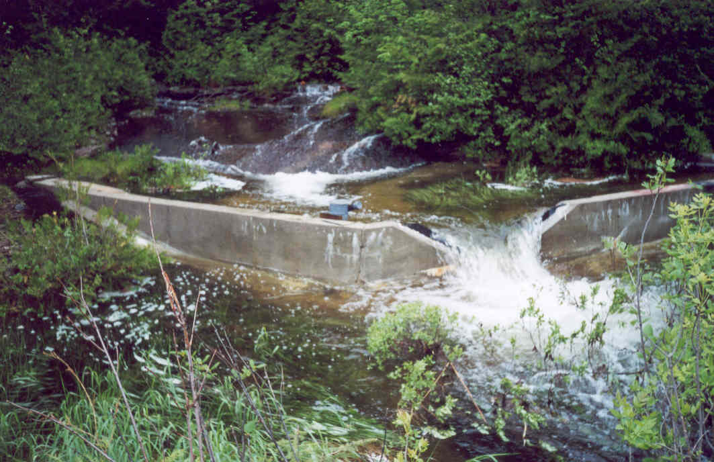

Figure 2. Lake 373 Outflow weir established November 1, 1989 on the west side of the Pine Road.

Figure 3. Lake 373 Outflow weir established November 1, 2002 on the east side of the Pine Road.

### Lake 375

Click here to show information on the Lake 375 hydrometric station.

Watershed area (ha): 219.3 ha based on 1985 mapping

XX.X ha based on 2017 DEM\*

218.5 ha based on OFAT\*\*

\* The watershed area of Lake 375 determined from the 2017 DEM has yet to be ground-truthed.

\*\* Ontario Flow Assessment Tool (<https://www.ontario.ca/page/watershed-flow-assessment-tool#section-1>)

<u>The Watershed</u>

Lake 375 is located along the Pine Road approximately 15 km to the northwest of the ELA field station. The Pine Road crosses through the watershed between lakes 373 and 375. Access to the lake is by a short (~200 m) walking trail from the Pine Road. Lake 375 is a second order lake with a surface area of 23.2 ha and total watershed area of 219.3 hectares above the lake outlet. The lake outflow stream flows out through a small wetland area by a poorly defined stream segment which eventually passes over a bedrock sill to a steep and rugged open channel to downstream Manomin Lake (L376). The upstream Lake 373 watershed is the tributary lake to Lake 375 and is the major inflow accounting for approximately 40% of the Lake 375 drainage basin area. Drainage areas are based on the topographical map produced by Airquest Resource Surveys (1985) at a scale of 1:5000 based on aerial photos taken in 1982. Portions of the upper watershed were previously logged in the 1980’s.

<u>Hydrometric Stations</u>

The outflow of Lake 375 is not monitored because of the absence of suitable construction sites on the outflow stream. Access to the outflow is also very difficult during the spring, late fall and winter. There are two hydrometric stations within the Lake 375 watershed, one is a weir on the major inflow from Lake 373 and the other is a lake level station on Lake 375.

1.  Lake 375 Inflow:

The Lake 373 Outflow Weir which monitors the major stream inflow to Lake 375 is described in greater detail in the “Lake 373: Hydrometric Station Information Sheet”. There were two weir locations for this station which, although very close in proximity, result in two different internal watershed area values. Therefore, care must be taken when using the data or extrapolating it to other locations. The first weir was a 120o sharp crested v-notch concrete weir on bedrock established November 1, 1989. It was located on the west side of the Pine Road. Unfortunately, it was often subject to serious winter and early spring freezing that resulted in lost record. This station was relocated approximately 25 m downstream on the east side of the Pine Road. The second weir was a 120o sharp crested v-notch weir constructed of painted pressure treated plywood imbedded in a plastic lined gravel dike. It was established November 1, 2002. The respective watershed areas above the 1989 and 2002 weirs were 81.9 and 88.4 hectares.

2.  Lake 375 Lake Level:

In 1991, a staff gauge and a survey benchmark were installed on Lake 375. From 1991 to 1995, 19 manual gauge readings were taken over 5 open water seasons. In June 2002, a new gauge board, stilling well and OTT Thalimedes data logger were installed to obtain continuous lake level record during the open water season. Logger record at this station was discontinued May 1, 2012, however was re-established May 1, 2021, using an OTT Thalimedes data logger. OTT Thalimedes replaced with a Sutron SDR-0001-1 on 9 June 2022.

<u>Photographs</u>

<figure>

<figcaption>
Figure 1. Lake 375 recording lake level station installed June 4, 2002.
</figcaption>
</figure>

### Lake 378

Click here to show information on the Lake 378 hydrometric station.

Coordinates of water level gauge (UTM, WGS 84): 15U 444274E 5506812N

Watershed area (ha): 136.0 ha based on 1985 mapping

XX.X ha based on 2017 DEM\*

143.7 ha based on OFAT\*\*

\* The watershed area of Lake 378 determined from the 2017 DEM has yet to be ground-truthed.

\*\* Ontario Flow Assessment Tool (<https://www.ontario.ca/page/watershed-flow-assessment-tool#section-1>)

<u>The Watershed</u>

Lake 378 is a first order lake that is located 6.4 km northwest of the ELA field station (~ 9.3 km by road). It has a surface area of 24.26 ha and a total watershed area of 136.0 ha. Drainage areas are based on the topographical map produced by Airquest Resource Surveys (1985) at a scale of 1:5000 from aerial photos taken in 1982. Lake 378 flows west into Sheila Lake. The L378 watershed includes much bedrock, some wetland, and a lake shoreline and outflow consisting mostly of large boulders, making accurate physical measurement of outflow volumes extremely difficult using a control structure like a weir or flume. Due to underground seepage, estimates of lake outflow must be modelled. Lake 378 has a water level gauge to provide data for outflow models.

<u>Hydrometric Stations</u>

1.  Lake 378 Lake Level

In early July 2020, a staff gauge and Sutron Stage-Discharge Recorder were installed on Lake 378. The station consists of a metric gauge plate fastened to a board, anchored to a very large boulder, as well as an 8” PVC stilling well and SDR shelter mounted to the same boulder and an adjacent boulder. The staff gauge was installed to an original elevation of 9.798 m (top of gauge, A-37 p.63), relative to the benchmark installed on an adjacent boulder (# 70, assigned arbitrary elevation of 10.000 m). The station is located on the east shore of L378, about 15 m north of the dock. The Sutron SDR-0001-1 data logger is installed each spring and removed each fall, to obtain continuous record during the open-water season.

<u>Groundwater Seepage</u>

The presence of subsurface flow or groundwater seepage from ELA lakes has generally been assumed to not exist or, at least, be insignificant to the annual water budget. This is not likely the case for L378, however, as parts of the watershed, most of the shoreline, and the outflow consist primarily of jumbled boulders above and below water level. The length of outflow stream was investigated for a suitable location of a control structure; seepage was observed throughout, including through the road which crosses the tributary. No seepage estimates have been carried out.

<u>Photographs</u>

### Lake 382

Click here to show information on the Lake 382 hydrometric station.

Watershed area (ha): 203.27 ha based on 1976 mapping

XX.X ha based on 2017 DEM\*

192.9 ha based on OFAT\*\*

\* The watershed area of Lake 382 determined from the 2017 DEM has yet to be ground-truthed.

\*\* Ontario Flow Assessment Tool (<https://www.ontario.ca/page/watershed-flow-assessment-tool#section-1>)

<u>The Watershed</u>

Lake 382 is located approximately 6 km northeast of the ELA field station. L382 is a 36.9 hectare 1st order lake that flows northwest into L262 and onwards to Winnange Lake. The watershed of L382 is 203.3 hectares, based on 1976 aerial photographs. This lake is accessed by crossing two lakes (start at L468 (Roddy), then cross L305; portage from north end of L305). A small forest fire burned 15 ha (or 8%) of the watershed in June 1978.

<u>Hydrometric Stations</u>

1.  Lake 382 Outflow (WSC ID 05QD025)

**A weir was installed in October 1986 and remained in place until it was removed in 2015; however, discharge measurements were only collected for the ELA during the period when the station was actively gauged between 1987 and 1997.**

Lake 382 had a gauged outflow between 1986 and 1997. A concrete weir equipped with a 120o v-notch and accompanying analog chart recorder were constructed in October 1986. The concrete weir was sealed with a tar foundation coat at the time of construction. The outflow area is bedrock controlled and the occurrence of subsurface seepage appears to be unlikely.

The hydrometric station was equipped with a Leupold and Stevens A-71 float water level recorder was operated during the open water season, while manual measurements were taken periodically in the winter months. In 1987, beaver caused problems by building their dams int eh V-notch. here beaver were accidentally trapped in fish nets that year. Days in which beaver activity affected flow have been assigned the qualifier code “D”.

<u>History</u>

Early hydrological investigations were carried out jointly through an arrangement with the U of M and WSC, which included construction services, technical support, instrumentation and determination of mean daily discharge and mean daily lake level record as well as some financial support. The WSC continued to provide the loan of 22 water level recorders after 1985 until they became obsolete and were decommissioned.

The L382 outflow was managed by the WSC from 1987 to 1995 (data can be found here: <https://tinyurl.com/L382Q>). This outflow weir has since been dismantled and removed during the fall of 2015, as per the cleanup agreement between DFO and IISD upon the transfer of ELA.

<u>References</u>

Beaty, K.G., and M.E. Lyng. 1989. Hydrometeorological data for the Experimental Lakes Area, northwestern Ontario, 1982 to 1987. Can. Data Rep. Fish. Aquatic. Sci. 759: v + 280 p.

### Lake 442

Click here to show information on the Lake 442 hydrometric station.

Coordinates of water level gauge (UTM, WGS 84): 15U 441244E 5513815N

Watershed area (ha): 161 ha based on 1985 mapping

XX.X ha based on 2017 DEM\*

178.1 ha based on OFAT\*\*

\* The watershed area of Lake 442 determined from the 2017 DEM has yet to be ground-truthed.

\*\* Ontario Flow Assessment Tool (<https://www.ontario.ca/page/watershed-flow-assessment-tool#section-1>)

<u>The Watershed</u>

Lake 442 is located directly off Pine Road, approximately 9.2 km from Highway 17. L442 is a small 16 hectare 2nd order lake with max and mean depths of 17.8 m and 9 m, respectively. L442 has one inflow at the north end and flows south into a wetland and eventually northwest into Geejay Lake (L653). The upstream lake, L438, is a slightly smaller lake that flows under Pine Rd approximately 0.5 km from L442. The watershed of L442 is approximately 161 hectares, based on 1985 mapping done by Airquest, using 1982 aerial photography. (McCullough and Campbell 1993).

During the November to March winter period, records do not exist. Beaver activity in some years has been a problem, causing lake levels to fluctuate drastically (~0.716 m). An extreme storm blew out the beaver dam between 8-10 June 2002.

<u>Hydrometric Stations</u>

1.  Lake 442 Lake Level

Hydrological work began September 9, 1986 with the install of a benchmark (red spray-painted arrow) and a manual reading. Manual readings were taken 1-2 times per month during the open water season in the years 1987 – 1996. Four manual readings were taken in 2000. In 2002, a permanent benchmark, stilling well, gauge board, and OTT Thalimedes logger were installed on July 24, 2002. The lake level gauge has been in operation every open-water season since then. The OTT Thalimedes was replaced with a Sutron SDR-0001-1 on 1 May 2021.

2.  Lake 442 Outflow

Lake 442 has never had a gauged outflow. This may change in the coming years. L442 has experienced a wide range of lake levels due to beaver activity at the outflow stream.

<u>History</u>

Studies began as part of the Natural Variability Program headed by Paul Campbell. Initial hydrology on L442 was carried out by Greg McCullough (GKM) outside of the regular ELA Hydrology Program (Beaty, Lyng). No water level data was collected in 1997, 1998, 1999, and 2001.

The first elevation reference (BM#58) was the tip of a red spray-painted arrow on bedrock face at south end of lake, and was set to an arbitrary of 10.000 m. Water level was taken by measuring down to the water’s surface from this point with a measuring tape, and subtracting that number from 10.000 m. The current benchmark (BM#58b) was established on September 11, 2002 (ref. A25 p43-44) and was established via water level transfer. The new benchmark elevation is 9.323 m.

A bathymetric survey was carried out by GKM and PC on August 29, 1989 (see G.K. McCullough and P. Campbell 1993 for methods). Bathymetric map created June 5, 1990 by GKM for WL of 8.945 m. Prior to June 2002, the lake was actively controlled at a higher level by a beaver. Since this date, the lake has largely remained at a lower level and fluctuated to a lesser extent. Bathymetry was sounded on 29 August 1989, when the lake was at a level of 8.945 m.

Bathymetric mapping has since been repeated and captured digitally by Lee Hrenchuk on July 6, 2018, when the lake was at a level of 8.644 m. The high-water mark for L442 is at an elevation of 9.250 m, relative to the benchmark.

### Lake 470

Click here to show information on the Lake 470 hydrometric station.

Coordinates of control structure (UTM, WGS 84): 15U 447134E 5500838N

Watershed area (ha): 167.71 ha based on 1970 mapping

XX.X ha based on 2017 DEM\*

165.7 ha based on OFAT\*\*

\* The watershed area of 470Q determined from the 2017 DEM has yet to be ground-truthed.

\*\* Ontario Flow Assessment Tool (<https://www.ontario.ca/page/watershed-flow-assessment-tool#section-1>)

<u>The Watershed</u>

Lake 470 is located approximately 350 m west of the ELA field station. L470 is a small 4.24 hectare, 4th order lake with max and mean depths of 1.7 m and 0.79 m, respectively. L470 has one inflow at the north end and flows south into Lake 240. The upstream lake, L661, is an even smaller lake that flows east into L470. The watershed of L470 is approximately 167.71 hectares (Beaty and Lyng, 1989), and includes lakes 303, 304, and 661.

<u>Hydrometric Stations</u>

1.  Lake 470 Outflow

A hydraulic control has been in place since 1969, but this does not necessarily mean data was recorded or is available for that time period. The weir may have been unused, used intermittently, discontinued without removal, or operated for another data program, such as WSC. Sometimes other datasets like stream chemistry have even been collected before a weir was installed, or after a weir was removed, leading to stream data date ranges longer than years of weir presence. Data ranges are best determined by working directly with the data, and contacting us with any questions.

Hydrological work began April 11, 1969 with manual readings at the natural outflow. By September 16th, 1969 an abbreviated 6” trapezoidal flume was installed, equipped with a Stevens A-35 chart recorder. Between 1994 and 2000, 470Q was equipped with a Leupold & Stevens Type A/F Logger. Since 2000, 470Q has been equipped with an OTT Thalimedes data logger. A Sutron Stage-Discharge Recorder (SDR) was installed in place of the OTT Thalimedes in the spring of 2020, however was swapped for an OTT Thalimedes shortly after due to a malfunction. Switched back to a Sutron SDR-0001-1 on 31 August 2020.

The L470 outflow is supplied with power by running a buried cable from the field station, parallel to the trail. In this way, the station was kept from freezing during the winter months, allowing for a year-round flow record. The initial setup, data collection, and data processing were carried out by the Water Survey of Canada (WSC). WSC was involved until the end of December 1995. Since 1995, the station has been run by ELA staff. Lake 470 outflow has been operated year-round since 1995 with the exception of 1999 and 2000. The outflow has not been operated during the winter months since 2012.

Construction on the weir occurred during October 2011 to repair leakage that was occurring. The beaver dam on L661 has occasionally been removed or modified to increase the flow of water through this station, data affected by this has the qualifier code for beaver activity (D2). Major rain event on 9-10 July 2019 resulted in station being flooded, water flowing overland on either side of weir, and missing data.

<u>References</u>

Beaty, K.G., and M.E. Lyng. 1989. Hydrometeorological data for the Experimental Lakes Area, northwestern Ontario, 1982 to 1987. Can. Data Rep. Fish. Aquatic. Sci. 759: v + 280 p.

### Lake 626

Click here to show information on the Lake 626 hydrometric station.

Coordinates of control structure (UTM, WGS 84): 15U 442373E 5511650N

Coordinates of water level gauge (UTM, WGS 84): 15U 442925E 5511730N

Watershed area (ha): 372.58 ha based on 1985 mapping\*

69.2 ha based on 1985 mapping \*\*

XX.XX ha based on 2017 DEM\*\*\*

373.6 ha (full watershed) based on OFAT\*\*\*\*

76.3 ha (headwater only) based on OFAT\*\*\*\*

\* this area is pre-diversion, while Lake 626 is still a 4th order lake, directly downstream of Lake 627.

\*\* this area is during diversion. Full L626 watershed area, less L627 watershed area.

\*\*\* The headwater watershed area of 626Q determined from the 2017 DEM has yet to be ground-truthed.

\*\*\*\* Ontario Flow Assessment Tool (<https://www.ontario.ca/page/watershed-flow-assessment-tool#section-1>).

<u>Water Diversion Study</u>

Hydrological monitoring on Lake 626 began in 2008 as part of a study to look at the effects of reduced water input to a lake on the aquatic biology and chemistry of the lake as well as changes in thermal regimes and evaporation. To accomplish this, Lake 626, a 25.77 ha, fourth order lake, was transformed to a headwater lake by damming the inflow from upstream Lake 627 and diverting the runoff from the three upstream tributary lakes around the study lake by means of a constructed diversion channel. At the end of the study, the watershed will be returned to its former state and the diversion channel will be filled and the area restored.

<u>The Watershed</u>

Lake 626 (Figure 1) is located on the west side of the Pine Road approximately 13 km south of Highway 17 and 17 km north of the ELA field station. The lake is road accessible. The UTM coordinates for the lake outlet are 15U 442400E 5511400N, WGS 84 datum.

Lake 626 is a small 26 ha, 4th order lake having a total watershed area of approximately 372.38 ha and a volume of 1,772,000 m3. The lake flows out over a hard gravel and rock sill and drops approximately 1 m over a 30 m bedrock stream channel before entering a large wetland. The stream then passes through a series of wetlands and drops totaling about 17 vertical metres over a distance of about 1 km before entering downstream Lake 625. The outflow stream channel is approximately 1 m in width and 5 – 30 cm in depth. Flow previously occurred through and under an old beaver dam at the outlet. In 2008, this dam was removed to stabilize water levels about the natural sill elevation during the time frame of the water diversion study.

There are three upstream lakes tributary to Lake 626. Lakes 429 and 628 flow into Lake 627 which flows into Lake 626 under the Pine Road through a single 61 cm (24 in.) diameter culvert (Figure 1). Table 1 provides a summary of drainage areas for the watersheds of interest. The three tributary lake watersheds account for 81.5 percent of the total Lake 626 watershed area.

On November 23, 2010, the water diversion began by damming off the three upstream lakes at the outlet of Lake 627 and diverting that water through a diversion channel thereby bypassing Lake 626 and moving the flow directly to Lake 625.

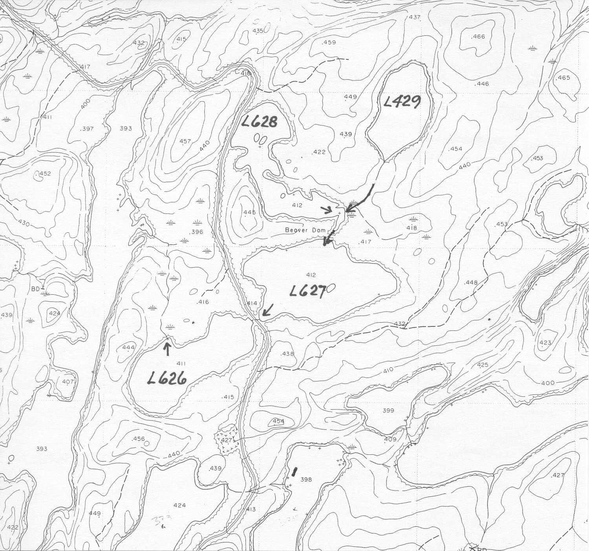

Figure 1. Lake 626 Watershed and Site location for ELA Water Diversion Experiment (2008 – 20xx).

Table 1. Drainage areas for the Lake 626 watershed.

| Lake | Lake Order | Aw (ha) | Ad (ha) | At (ha) | As (ha) |
|:----:|:----------:|:-------:|:-------:|:-------:|:-------:|
| 626  |     4      |  372.4  |  69.0   |  43.2   |  25.8   |
| 627  |     3      |  303.4  |  87.5   |  51.9   |  35.6   |
| 628  |     2      |  215.9  |  150.4  |  130.3  |  20.1   |
| 429  |     1      |  65.5   |  65.5   |  49.8   |  15.7   |

Where:

- Order is the number of lakes above the outflow.

- Aw is the total watershed area including all land and water surfaces and tributary areas.

- Ad is the watershed area including land and water surface but excluding tributary areas.

- At is the terrestrial area surrounding the lake including islands.

- As is the total water surface area of the lake excluding the island areas.

<u>  
Hydrometric Stations</u>

There are two hydrometric stations within the Lake 626 watershed, one is a recording weir on the lake outflow stream and the other is a recording lake level station. The inflow from upstream Lake 627 has never been monitored.

1.  Lake 626 Outflow:

A weir has been in place since 2008, but this does not necessarily mean data was recorded or is available for that time period. The weir may have been unused, used intermittently, discontinued without removal, or operated for another data program, such as WSC. Sometimes other datasets like stream chemistry have even been collected before a weir was installed, or after a weir was removed, leading to stream data date ranges longer than years of weir presence. Data ranges are best determined by working directly with the data, and contacting us with any questions.

The outflow of Lake 626 is located in the northwest bay at the far end of the lake. It can be accessed either by a short boat ride across the lake or a 15-minute walk by foot trail. A 150o sharp crested v-notch weir was constructed approximately 15 m below the lake outlet in October 2008. A stage-discharge relationship has been developed and an OTT Thalimedes data logger provides stage record for the weir from April until the end of October. Periodic manual observations are taken on a monthly basis during the winter. On June 3, 2020, the OTT Thalimedes was replaced with a Sutron SDR-0001-01 shaft-encoder type data logger.

2.  Lake 626 Lake Level:

On June 26, 2008, a 6” ABS stilling well and staff gauge were installed, secured to bedrock. An OTT Thalimedes data logger was installed to obtain continuous lake level record during the open water season. On May 15, 2019, a Sutron SDR-0001-01 shaft-encoder type data logger replaced the OTT Thalimedes.

3.  Lake 626 Inflow:

Upstream lakes 429, 627 and 628 are tributary to Lake 626 and entered the lake through a single road culvert. This inflow has never been monitored. As part of the Diversion Experiment, this inflow was dammed and diverted around Lake 626 on November 23, 2010 thereby altering this lake from a 4th order to a headwater lake.

<u>Repairs/Maintenance</u>

L626Q underwent repairs from September 14, 2017 to September 22, 2017. The small wall on the southeast side was leaking, as well along the length of the v-notch wall. Repairs involved replacing wood and re-creating the southeast wall. Repairs did not completely stop the leak, though have reduced it. Photographs 7-9 are of repair.

In late summer 2018, the main weir wall and v-notch were removed and refurbished. Steel notch was sanded and repainted. New caulking was used between notch and plywood to stop water seeping underneath the notch. During most of this time the lake level was so low there was no flow. Sandbags were used to prevent flow the days ahead of the re-install. A small leak remained on the small southeast wall, which was then patched with spray foam in the summer of 2019. The weir continued to leak in 2021, specifically, at the bottom of the weir plate. There have been no records of leaks since 2021.

<u>  
Lake Bathymetry</u>

A bathymetric survey was carried out and a map created in the 1980’s. Unfortunately, that map was not dated or referenced to a water level datum. The presence of a large beaver dam at the outlet is evidence that the lake has experienced considerable water level fluctuation over the years. A survey benchmark (#60) was established in 2008 at the lake shore near the inflow from Lake 627 and assigned an arbitrary elevation of 10.000 m. A new bathymetric survey, using modern techniques, was carried out on August 22, 2010 at water level 9.080 m. MNRF also provided a bathymetric map.

<u>Photographs:</u>

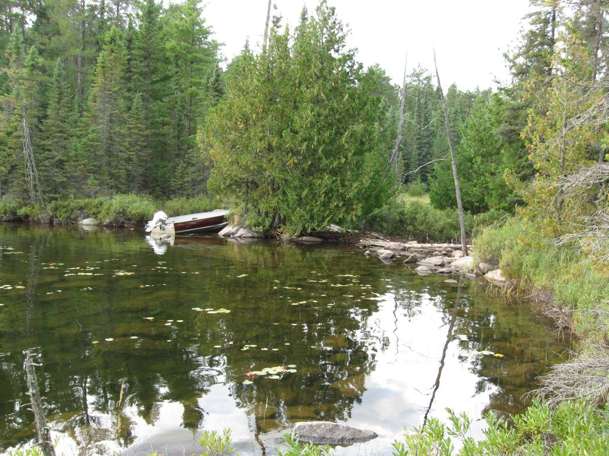

Photographs 1 and 2. View of the Lake 626 outflow above and below the v-notch weir.

Photograph 3. View from downstream during initial construction of 626Q weir.

Photographs 4 and 5. 150o v-notch weir at the Lake 626 Outlet on March 24, 2009 at a head of 0.116 m and discharge of 0.022 m3/s.

Photograph 6. Lake stage logger station on Lake 626.

Photograph 7. Typical OTT Thalimedes data logger installation for lake level and flow stations.

Photograph 8. 2017 repair; weir stripped back to wood and seams were freshly caulked

Photograph 9. Old poly was removed and replaced with new poly.

Photograph 10. Southeast wall was installed (new material), and poly was covered in sand and gravel. All visible seams were freshly caulked with Vulkem 116.

### Lake 627

Click here to show information on the Lake 627 hydrometric station.

Watershed area (ha): 303.4 ha based on 1985 mapping

XX.X ha based on 2017 DEM\*

297.3 ha based on OFAT\*\*

\* The watershed area of Lake 627 determined from the 2017 DEM has yet to be ground-truthed.

\*\* Ontario Flow Assessment Tool (<https://www.ontario.ca/page/watershed-flow-assessment-tool#section-1>)

<u>Water Diversion Study</u>

Hydrological monitoring on Lake 627 began in 2008 as part of a study to look at the effects of reduced water input to a lake, including changes to the aquatic biology and chemistry, as well as changes in thermal regimes and evaporation. To accomplish this, the outflow of L627 into Lake 626 was dammed, and a diversion channel was blasted to direct water from L627 around L626. At the end of the study, the watershed will be returned to its former state, the diversion channel will be filled and the area restored.

<u>The Watershed</u>

Lake 627 (Figure 1) is located on the west side of the Pine Road approximately 13 km south of Highway 17 and 17 km north of the ELA field station. The lake is road accessible.

Lake 627 is a small 35.5 ha, 3rd order lake having a total watershed area of approximately 303 ha. Historically, the lake flows out under Pine Rd. through a 61 cm diameter culvert. Currently, L627 flows through a channel blasted in bedrock on the southwest side of the lake. The stream then passes through a series of wetlands and drops totaling about 17 vertical metres over a distance of about 1 km before entering downstream Lake 625.

There are two upstream lakes tributary to Lake 627. Lakes 429 and 628 flow into Lake 627. Table 1 provides a summary of drainage areas for the watersheds of interest. The two tributary lake watersheds account for 92.7 percent of the total Lake 627 watershed area.

On November 23, 2010, the water diversion began by damming off the three lakes at the outlet of Lake 627 and diverting that water through a diversion channel (photographs 2 and 3) thereby bypassing Lake 626 and moving the flow directly to Lake 625.

Figure 1. Lake 627 Watershed and Site location for ELA Water Diversion Experiment (2008 – 20xx).

Table 1. Drainage areas for the Lake 626 watershed.

| Lake | Lake Order | Aw (ha) | Ad (ha) | At (ha) | As (ha) |
|:----:|:----------:|:-------:|:-------:|:-------:|:-------:|
| 626  |     4      |  372.4  |  69.0   |  43.2   |  25.8   |
| 627  |     3      |  303.4  |  87.5   |  51.9   |  35.6   |
| 628  |     2      |  215.9  |  150.4  |  130.3  |  20.1   |
| 429  |     1      |  65.5   |  65.5   |  49.8   |  15.7   |

Where:

- Order is the number of lakes above the outflow.

- Aw is the total watershed area including all land and water surfaces and tributary areas.

- Ad is the watershed area including land and water surface but excluding tributary areas.

- At is the terrestrial area surrounding the lake including islands.

- As is the total water surface area of the lake excluding the island areas.

<u>  
</u>

<u>Hydrometric Stations</u>

There is one hydrometric station within the Lake 627 watershed; the recording lake level station. The outflow from Lake 627 has never been monitored.

1.  Lake 627 Lake Level:

On November 2, 2010, a staff gauge, stilling well and survey benchmark with an assigned arbitrary elevation (10.000 m) were installed on Lake 627. A wooden timber sill was also installed at the mouth of the channel at this time. Manual readings were taken approximately once per month during the open water season between 2008 and 2010. An OTT Thalimedes data logger was installed on April 7, 2011 to obtain continuous lake level record during the open-water season. The OTT Thalimedes was replaced with a Sutron SDR-0001-1 on 1 May 2021.

<u>Photographs:</u>

Photograph 1. L627 Water Level station: stilling well, logger, and gauge board.

Photograph 2. Earthen dike blocking flow from L627 into L626 through historical outflow culvert underneath Pine Rd.

\*Need to capture this\*

Photograph 3. Aerial view of the diversion channel.

Photograph 4. Cross-section of diversion channel lengthwise, indicating overall grade.

### Lake 632

Click here to show information on the Lake 632 hydrometric station.

Watershed area (ha): 40.2 ha based on 1978(?) mapping

XX.X ha based on 2017 DEM\*

30.9 ha based on OFAT\*\*

\* The watershed area of Lake 632 determined from the 2017 DEM has yet to be ground-truthed.

\*\* Ontario Flow Assessment Tool (<https://www.ontario.ca/page/watershed-flow-assessment-tool#section-1>)

<u>The Watershed</u>

Lake 632 is located approximately 5 km west northwest of the ELA field station. L632 is a tiny 0.8 hectare first order lake that flows northeast into L259 and onwards. The watershed of L632 is 40.2 hectares.

<u>Hydrometric Stations</u>

1.  Lake 632 Outflow (WSC ID 05QD027):

A weir was in place between 1991 and 1997, but this does not necessarily mean data was recorded or is available for that time period. The weir may have been unused, used intermittently, discontinued without removal, or operated for another data program, such as WSC. Sometimes other datasets like stream chemistry have even been collected before a weir was installed, or after a weir was removed, leading to stream data date ranges longer than years of weir presence. Data ranges are best determined by working directly with the data, and contacting us with any questions.

Lake 632 had a gauged outflow between 1991 and 1997. The station consisted of a plywood and plastic lined weir equipped with a 90o v-notch and accompanying Stevens A-71 recorder in California-type shelter. The recorder was set to head. This station operated during the open-water season, and manual measurements were taken periodically in the winter months. Site was established June 7 1991. The notch had a capacity of 0.304 m and the weir walls a capacity of 0.305 m.

2.  Lake 632 Water Level (WSC ID 05QD028):

Lake 632 had a gauged lake level station from 1991 to 1993. The station consisted of a Brancker XL-100 water level logger housed in a plexiglass shelter with float set to an outside gauge. The water level station was operated during the open-water season. Site was established May 17, 1991

<u>History</u>

Early hydrological investigations were carried out jointly through an arrangement with the U of M and WSC, which included construction services, technical support, instrumentation and determination of mean daily discharge and mean daily lake level record as well as some financial support. The WSC continued to provide the loan of 22 water level recorders after 1985 until they became obsolete and were decommissioned.

The L632 outflow and water level stations were managed by the WSC from 1991 to 1995 and 1991 to 1993, respectively. ELA managed the outflow station until 1997 (WSC data can be found here: <https://tinyurl.com/L632QandL632W>).

This outflow weir has since been dismantled and removed during the fall of 2015, as per the cleanup agreement between DFO and IISD upon the transfer of ELA.

### Lake 658

Click here to show information on the Lake 658 hydrometric station.

Coordinates of water level gauge and outflow structure (UTM, WGS 84): 15U 447000E 5509100N

Coordinates of upland control structure (UTM, WGS 84): 15U 446754E 5509378N

Watershed area (ha): 52.14 ha based on 2003 mapping

XX.XX ha based on 2017 DEM\*

\* The watershed area of 658Q determined from the 2017 DEM has yet to be ground-truthed.

<u>The Watershed</u>

Lake 658 is located along the west shore of the south basin of Winnange Lake. The boat landing is accessed via a 2.3 km trail off Pine Road, approximately 20.5 km from Highway 17. L658 is an 8.4 hectare, 1st order lake, with a watershed area of approximately 52.1 ha. L658 is a double basin lake with approximate maximum depths of 13 m and 10 m in the west and east basins, respectively.

For hydrometric purposes, the L658 watershed was considered as three separate components: a wetland sub-catchment, an upland sub-catchment, and remaining direct runoff. Areas for these three components are 8.13 ha for the wetland draining through flume, 7.7 ha for the upland draining through flume, and 27.9 ha for the remaining direct runoff. (These areas are from ‘658 areas revised Mar2004.xls’ document).

<u>Hydrometric Stations</u>

1.  Lake 658 Lake Level

Hydrological work began November 16, 1999 with the survey of high-water marks, ice scour lines, and water levels of L658 and L660. Manual surveys were taken ~1-2 times per month between June 2000 and 29 May 2003. All surveys were to a benchmark of arbitrary datum 10.000 m, near the outflow of L628 into L660. On August 25, 2003, an OTT Thalimedes logger was installed to capture continuous water level data. The lake level gauge was decommissioned on October 27, 2011.

2.  Lake 658 Outflow

A hydraulic control was in place between 2001 and 2008, but this does not necessarily mean data was recorded or is available for that time period. The weir may have been unused, used intermittently, discontinued without removal, or operated for another data program, such as WSC. Sometimes other datasets like stream chemistry have even been collected before a weir was installed, or after a weir was removed, leading to stream data date ranges longer than years of weir presence. Data ranges are best determined by working directly with the data, and contacting us with any questions.

Flow measured using Marsh McBirney Flow-Tote flow sensor and dye slug test. Full details of control structure included in appendix at end of this document. Logged data was collected between July 9th, 2001 and October 20th, 2008, during the open-water season. Station was removed sometime after 2010. 658Q structure UTM coordinates: 15U 447000, 5509100

3.  Lake 658 Wetland

Flume here operated by USGS.

4.  Lake 658 Upland

Flume here operated by USGS. Upland Flume UTM coordinates: 15U 446754, 5509378

<u>History</u>

Studies began as part of the METAALICUS study. Initial hydrology on L660 was carried out by Ken Beaty, with additional instrumentation and hydrological data collected by USGS members involved with the study.

The first elevation reference (BM#55a) was a large spike in a 6” diameter jack pine, on the right side of the L658 outflow control structure and 6 m downstream. This benchmark was set to an arbitrary of 10.000 m. Initial water levels were surveyed in reference to this benchmark. Additional benchmarks were created at a later date in reference to this original benchmark.

A bathymetric survey was carried out by the Ontario Ministry of Natural Resources.

**Photographs:**

Photograph 1. Flume in L658 upland portion of watershed.

Photograph 2. Upland sub-catchment area (ELA, Beaty; USGS, M. Tate).

Photograph 3. Flume in wetland portion of L658 watershed.

Photograph 4. Installing L658 outflow structure. This structure consists of a cradle supporting a 15” pipe. This pipe also had an 8” pipe fitted within it to restrict flow during low flow, in order to increase the quality of the discharge estimates.

Photograph 5. Installing instrumentation and finishing touches on L658 outflow structure.

Photograph 6. Carrying out dye slug test to calculate flow rates through L658 outflow structure.

Photograph 7. Dye plume on downstream side of L658 outflow structure.

Photograph 8. Marsh McBirney Flow-Tote flow sensor installed in the L658 outflow structure.

Photograph 9. Aerial view of L658 watershed.

***  ***

***APPENDIX***:

From outflow permit letter written by KB to OMNR:

**Flow monitoring structure:** The structure that will resemble a wall of gravel contained by wood extending from bank to bank that will house a submerged smooth walled flow pipe (similar to a culvert). The pipe will be sized large enough so not to impound water in L.658. A flow meter is to be installed in the tube capable of measuring flow velocity in either direction. This main flow tube will be slightly oversized in order to allow for the insertion of smaller flow tubes within it as a way of reducing the cross sectional area as required to satisfy flow meter sensitivity. These reduction pipes will be installed and secured using a system of baffles or small inflatable inner tubes. We estimate that a main flow tube diameter of 38 cm (15 inches) is required to safely handle anticipated peak flows.

The structure would be built in two stages. First, a base of gravel bags would be built across the section measuring 2 m wide and 0.3 m high. This would serve as a base on which to build a pair of parallel wooden walls 1 m apart to house the flow pipe and contain gravel fill. The walls would be adequately secured to each other to contain the gravel. This wood and gravel wall would extend 1.2 m (3.9 ft.) above the base at the deepest point. We estimate that 25 m3 (33 yards) of gravel would be required. All materials (gravel and wood) would be transported by helicopter. No machinery would be used on site. We estimate that this construction approach would require about a third of the material required for a conventional gravel dike.

### Lake 660

Click here to show information on the Lake 660 hydrometric station.

Watershed area (ha): 11489 ha based on 1984 MNR mapping 20864.5 ha based on OFAT\*

\*Ontario Flow Assessment Tool (<https://www.ontario.ca/page/watershed-flow-assessment-tool#section-1>)

<u>The Watershed</u>

Lake 660 is located via a 2.3 km trail off Pine Road, approximately 20.5 km from Highway 17. L660 is a 2388 hectare, 142nd order lake, and is one of the larger lakes in the ELA region. The watershed of L660 is approximately 11489 hectares. Winnange is a complex lake, with an approximate maximum depth of 110 metres.

<u>Hydrometric Stations</u>

1.  Lake 660 Lake Level

Hydrological work began November 16, 1999 with the survey of high-water marks, ice scour lines, and water levels of L660 and L658. Manual surveys were taken ~1-2 times per month between June 2000 and 29 May 2003. All surveys were to a benchmark of arbitrary datum 10.000 m, near the outflow of L628 into L660. On June 5, 2003, a logger was installed to capture continuous water level data. The lake level gauge was decommissioned on October 27, 2011.

<u>History</u>

Studies began as part of the METAALICUS study. Initial hydrology on L660 was carried out by Ken Beaty, with additional instrumentation and hydrological data collected by USGS members involved with the study.

The first elevation reference (BM#55a) was a large spike in a 6” diameter jack pine, on the right side of the L658 outflow control structure and 6 m downstream. This benchmark was set to an arbitrary of 10.000 m. Initial water levels were surveyed in reference to this benchmark. Additional benchmarks were created at a later date in reference to this original benchmark.

A bathymetric survey was carried out by the Ontario Ministry of Natural Resources.

### Lake 661

Click here to show information on the Lake 661 hydrometric station.

Watershed area (ha): 125.4 ha based on 1985 mapping

XX.X ha based on 2017 DEM\*

118.1 ha based on OFAT\*\*

\* The watershed area of Lake 661 determined from the 2017 DEM has yet to be ground-truthed.

\*\* Ontario Flow Assessment Tool (<https://www.ontario.ca/page/watershed-flow-assessment-tool#section-1>)

<u>The Watershed</u>

Lake 661 is located approximately 800 m west southwest of the ELA field station. L661 is a small 1.3 hectare 3rd order lake that flows southeast into L470 and beyond. The watershed of L661 is 125.4 hectares. Lake 661 has a maximum depth of 1 m. During the November to March winter period, discharge is interpolated or estimated based on monthly manual readings.

<u>Hydrometric Stations</u>

1.  Lake 661 Outflow (WSC ID 05PD028)

A weir was in place between 1983 and 1997, but this does not necessarily mean data was recorded or is available for that time period. The weir may have been unused, used intermittently, discontinued without removal, or operated for another data program, such as WSC. Sometimes other datasets like stream chemistry have even been collected before a weir was installed, or after a weir was removed, leading to stream data date ranges longer than years of weir presence. Data ranges are best determined by working directly with the data, and contacting us with any questions.

Lake 661 had a gauged outflow between January 1, 1983 and December 31, 1997. A concrete weir equipped with a 120o v-notch and accompanying Stevens A-35 Analog Chart Recorder were operated during the open water season by the Water Survey of Canada between 1983 and the end of 1995. ELA staff collected and processed data between 1995 and 1997. The weir was in place but not operated or maintained between 1997 and 2015, when it was removed as part of the DFO cleanup.

<u>History</u>

Early hydrological investigations were carried out jointly through an arrangement with the U of M and WSC, which included construction services, technical support, instrumentation and determination of mean daily discharge and mean daily lake level record as well as some financial support. The WSC continued to provide the loan of 22 water level recorders after 1985 until they became obsolete and were decommissioned.

The L661 outflow was managed by the WSC for most years. Publicly available data can be found here: <https://tinyurl.com/y6uq2uuv>).

### Lake 979

Click here to show information on the Lake 979 hydrometric station.

Watershed area (ha): 821 ha based on 1991 mapping

XX.X ha based on 2017 DEM\*

813.0 ha based on OFAT\*\*

\* The watershed area of Lake 979 determined from the 2017 DEM has yet to be ground-truthed.

\*\* Ontario Flow Assessment Tool (<https://www.ontario.ca/page/watershed-flow-assessment-tool#section-1>)

<u>The Watershed</u>

The Lake 979 watershed has a total drainage area of 821 hectares and receives most of its input from the Lake 240 watershed. The Lake 240 contribution is monitored and includes upstream lakes 239, 470, 661, 303 and 304. Together, these 6 tributary lakes account for 88% of the total Lake 979 drainage basin. There is also a well-defined terrestrial drainage area to the east of the lake. This stream lacks a suitable monitoring site and is best estimated by using the East Inflow to Lake 239 as a surrogate sub-catchment. The remainder of contributing drainage area is from the terrestrial areas surrounding the lake where inflow occurs in the form of ungauged direct runoff, both by overland flow and by small poorly defined intermittent streams. Drainage basin areas were determined from the topographical map produced by Western Photogrammetry Limited (1970) at a scale of 1:4800 for the Lake 240 watershed and topographical mapping of the Lake 979 basin below Lake 240 by Airquest Resource Surveys (1991) at scale of 1:1000. The watershed has been affected by two major forest fires since1969. Significant areas within the Lake 979 and tributary watersheds were burned by fires in 1974 and 1980 (see “forest fire history”).

<u>The Hydrometric Stations</u>

A weir was in place between 1991 and 2009, but this does not necessarily mean data was recorded or is available for that time period. The weir may have been unused, used intermittently, discontinued without removal, or operated for another data program, such as WSC. Sometimes other datasets like stream chemistry have even been collected before a weir was installed, or after a weir was removed, leading to stream data date ranges longer than years of weir presence. Data ranges are best determined by working directly with the data, and contacting us with any questions.

The outlet of Lake 979 is located at latitude 49o 38” 40” and longitude 93o 43’ 30”. Hydrometric work on the outflow of Lake 979 began in June, 1991 with preliminary surveys and the beginning of construction for the ELA Reservoir Project (ELARP) dam and weir. On June 17, 1991, a stilling well was located on the Lake 979 pond equipped with a Stevens A-71 chart recorder and Stevens A/F data logger. A concrete 150o v-notch sharp crested weir was constructed on sound bedrock by ELA staff on the well defined outflow stream at the south end of the lake. The weir was operational with record beginning on October 23, 1991. Thirty stream discharge measurements were obtained for a range of flows and a stage-discharge rating curve was developed by March 1993. The concrete weir wall was sealed with a tar based foundation coat to extend the life of the concrete. A stilling well and box shelter to house recording equipment with a connecting wooden walkway were also constructed with the weir. Recording equipment varied over time. From 1991 to 1994, a Leupold and Stevens Type A71 analog chart float recorder was used in conjunction with a Stevens 420 data logger and SDII transducer. While for most of that period, the 420 data logger system served as the primary record supplemented by chart record, the system eventually proved to be problematic and was discontinued in 1994. The A71 chart recorder was used in all years and served as the primary record until the end of 1998. From March 1999 to 2009, an OTT Thalimedes data logger with float assembly has been used as the primary record for this station with chart record serving as backup. The recording equipment at this station was operated seasonally from mid-March to early November each year with routine monthly visits in winter to obtain manual flow estimates (see “winter flow”). Data collection ceased for this outflow station at the end of 2009.

Lake levels were similarly recorded in a separate stilling well located on the wall of the dam from 1993 to 2008 with occasional observations in 2009. No pond level data was collected after the 2009 season.

<u>Record of Impoundment</u>

Lake 979 was regulated during all open water seasons from June 1993 to October 2008 by adding timbers to a stop-log structure in a low level (1.5 m) dam at the outflow in spring and removing them in the fall. The time to fill and drawdown varied each year depending on the magnitude of inflow to the system. While the time to fill ranged from one week to several weeks, drawdown could usually be achieved in 5 to 8 days. Subsequently, the regulation of Lake 979 resulted in decreased flows in the spring during filling and irregular high flows in October during drawdown. For a more information on regulation refer to the discussion for station 979W.

Table 1. Dates for the beginning of reservoir filling and drawdown from 1993 to 2008.

| Year \# | Year | Begin Fill | Begin Drawdown |
|:-------:|:----:|:----------:|:--------------:|
|    1    | 1993 |   Jun 10   |     Oct 5      |
|    2    | 1994 |   May 14   |     Oct 3      |
|    3    | 1995 |   May 5    |     Oct 2      |
|    4    | 1996 |   Apr 16   |     Oct 7      |
|    5    | 1997 |   May 14   |     Oct 20     |
|    6    | 1998 |   Apr 21   |     Oct 5      |
|    7    | 1999 |   Mar 25   |     Oct 13     |
|    8    | 2000 |   Apr 13   |     Oct 18     |
|    9    | 2001 |   Apr 4    |     Oct 9      |
|   10    | 2002 |   Mar 21   |     Oct 7      |
|   11    | 2003 |   Mar 26   |     Oct 6      |
|   12    | 2004 |   Apr 7    |     Oct 18     |
|   13    | 2005 |   Apr 5    |     Oct 12     |
|   14    | 2006 |   Mar 27   |     Oct 10     |
|   15    | 2007 |   Apr 2    |     Oct 16     |
|   16    | 2008 |   Apr 10   |     Oct 7      |

There was no flooding in 2009. The reservoir was maintained at normal winter levels until July 28 when the outflow control part of the structure was removed. From July 29, 2009 forward the 979 pond was at pre-construction levels. Beaver activity was not managed after this date.

<u>The Hydrometric Data</u>

The data reported for this station is surface water discharge. The vicinity around the outflow is bedrock controlled and therefore the possibility of groundwater seepage is assumed to be highly unlikely. Investigation of the outflow lower stream channel and surrounding area during a dry, no flow period revealed no wet or seepage areas. The area between upstream Lake 240 and Lake 979 were also investigated. Based on careful examination, both the major inflow and outflow areas are believed to be hydrologically sound.

Access to this station is by boat and canoe during the open water period and snowmobile in winter. For approximately two or three weeks before ice-off and after ice-on, travel to the station is risky and usually not possible because of unsafe ice conditions. Recording equipment was normally operated from mid-April until early November. In winter, monthly visits to the station were made to obtain estimates of streamflow from manual observations. These values have been coded in the data base (“A”). Often beaver interfere with the operation of this station by damming either the outflow control structure or the v-notch weir. When beaver activity has affected the record, the mean daily values have been coded “D” to imply that the value is a “best estimate” due to the presence of beaver.

At times record may be missing either because recording equipment could not be operated at times such as in winter, or due to malfunction or disturbance (animal or otherwise). Wherever possible, missing record has been estimated and has marked with a qualifying code (see “quality of record”).

<u>Site Decommissioning and Clean-up</u>

As a requirement of the transfer of the ELA from DFO to IISD-ELA, a major clean-up of lakes and watersheds was carried out under a DFO initiated contract during the 2015 field season. As part of this initiative, all installations and debris from the ELARP study, including the dam, weir and lake level installations were removed.

<u>Photographs</u>

<figure>

<figcaption>
Figure 1. Lake 979 Outflow Weir located below Lake 979 Dam.
</figcaption>
</figure>

<figure>

<figcaption>
Figure 2. Lake 979 Outflow, stilling well, instrument shelter, and gauge board in weir stilling pond below Lake 979 Dam.
</figcaption>
</figure>

## Data Usage Considerations

### Survey Benchmarks

Where long-term or continuous water level records are to be collected, it is necessary to establish and frequently refer to local survey benchmarks. Since there are no survey benchmarks with an established elevation above mean sea level (MSL) in the ELA area, survey benchmarks at ELA have been assigned arbitrary elevations that are not relative to MSL. Approximate MSL elevations are shown on 1:50,000 scale National Topographic Survey Maps for some lakes and is the reference datum for the land contours provided on those maps. Local survey benchmarks have been established in most ELA watersheds and have been assigned elevations relative to an arbitrary datum that are specific, in most cases, only to that particular watershed. The exception is for benchmarks 1 to 24a, 45 and 46 which are all relative to BM \#1 which was established by WSC on February 25, 1969 with an assigned elevation of 30.480 m (100.00 ft.). BM \#1 is approximately 391 m above MSL.

The following benchmarks were destroyed by forest fires in 1974 and 1980: 2, 3, 4, 6, 7, 9, 11, 12, 13, 13a, 14, 15, 16, 17, 18, 21, and 22. BM \#’s 27 and 28 at 114 Outflow were destroyed during weir re-construction in 2000. The following table summarizes survey benchmark information according to each lake basin.

Notes:

1.  The orientation convention used for all stream surveys and notes is that the right bank or side is on the right while looking downstream.

2.  BR means bedrock.

3.  BC means a brass cap benchmark.

4.  AB means an anchor bolt or lag bolt benchmark.

5.  CR means chipped ring in bedrock as a benchmark.

6.  The specified elevation is the highest point on the BC, AC or inside the CR.

7.  Survey accuracy is generally to 1 mm.

    
| Lake | Station | BM# | Elevation (m) | Description  (BR – bedrock) |
| --- | --- | --- | --- | --- |
| 114 | Lake level | 25  | 27.712 | Head of AB horizontal in BR 0.6 m west of S end of catwalk |
| 114 | Lake level | 26  | 29.018 | BC in BR, 4 m SW of S end of catwalk |
| 223 | Lake level | 29  | 30.644 | BC in BR 8 m NW of instrument shelter marked with iron rod |
| 223 | Outflow weir | 30  | 30.480 | BC on weir wall |
| 223 | Outflow weir | 31  | 30.203 | BC in rock 3 m N of weir |
| 224 | Lake level | 50  | 10.000 | AB on BR rock face, S shore between L.225 stream and BM58 |
| 224 | Lake level | 59  | 8.505 | AB in BR face beside new (2002) WL well and approx. 0.5 m above water level at SW end of lake (ref. survey notebook A25 p.38) |
| 225 | Outflow weir | 33  | 30.480 | BC 1.5 m W of left weir wall in BR |
| 225 | Outflow weir | 34  | 30.721 | BC on right weir wall |
| 226 | Lake level | 51  | 10.000 | AB in BR 1 m from waters edge on sloping rock 20 m N of outlet and 20 m S of dock |
| 226 | Outflow weir | 35  | 30.480 | AB in 25 cm diameter tree 4 m N of stilling well |
| 226 | Outflow weir | 36  | 30.834 | CR in BR rock face 1 m SW of end of walkway |
| 227 | Lake level | 37  | 32.129 | BC 3 m W of catwalk |
| 227 | Outflow weir | 38  | 29.050 | BC in rock outcrop 0.9 m NE of weir |
| 239 | Lake level | 7a  | 31.260 | BC in BR 23 m N of pump house |
| 239 | Outflow | 11b | 31.583 | BC in rock outcrop 122 m SE of flume |
| 239 | Northwest Sub-basin weir | 10  | 31.059 | BC in rock outcrop 61 m S of stream mouth at NW corner of lake and 3 m from waters edge |
| 239 | East Sub-basin, lower weir | 14c | 31.964 | AB set in vertical rock face 30 m N of weir |
| 239 | East Sub-basin, upper weir | 24a | 45.854 | CR in rock outcrop, right side of weir |
| 239 | Northeast Sub-basin weir | 13c | 45.763 | BC on BR, left bank, 1 m from end of wall |
| 240 | Outflow weir | 1   | 30.480 | BC in BR, right side, 8 m downstream of weir, 6 m W of stream. This is the master BM for 239 and 240 watersheds. |
| 240 | Outflow weir | 1a  | 30.328 | BC on right abutment of weir |
| 240 | Outflow weir | 1b  | 30.389 | BC on wall of concrete well, downstream side. |
| 302 | Lake level | 39  | 30.279 | BC in BR, 6 – 7 m ESE of stilling well |
| 302 | Outflow weir | 40  | 30.000 | BC in BR 1 m upstream of weir, on left side of stilling well |
| 302 | Upland weir | 42  | 10.000 | AB on weir wall |
| 303 | Lake level | 19  | 57.927 | BC in BR 15 m S of stilling well location |
| 303 | Outflow weir | 20a | 54.678 | BC on wall of weir, right side |
| 304 | Lake level | 23  | 55.726 | BC in BR 3 m S of stilling well |
| 304 | Lake level | 24  | 54.843 | Head of iron flag anchor for catwalk |
| 305 | Lake level | 48  | 10.000 | AB in BR at start of portage trail to L.227 |
| 373 | Lake level | 49  | 10.000 | AB in vertical rock face about 7 m S of first staff gauge (discontinued in 2000) |
| 373 | Lake level | 49b | 10.000 | AB in vertical rock face 1 m SW of stilling well (established 2000). Reference survey book A25 p.31 and A27 p.17 for datum correction between two benchmarks. |
| 375 | Lake level | 56  | 10.000 | AB in BR 4 m from stilling well |
| 382 | Outflow weir | 43  | 10.000 | No description |
| 442 | Lake level | 58  | 10.000 | Temporary BM established by GKM. Bottom tip of downward facing red painted arrow on cliff on S shore right of outflow stream. |
| 442 | Lake level | 58b | 9.323 | AB in BR 1.2 m from stilling well (established 2002). |
| 470 | Outflow flume | 5   | 35.659 | BC in Br, 6 m downstream, 2 m left of stream |
| 470 | Outflow flume | 5a  | 36.152 | BC on right abutment of concrete wall |
| 470 | Outflow flume | 5b  | 36.158 | BC on left abutment of concrete wall |
| 626 | Lake level | 60  | 10.000 | Bolt in BR on trail to lake gauge |
| 626 | Wetland @ RG | 61  | 12.068 | Bolt in BR near road and RG24 |
| 627 | Div. Channel | 62  | 10.044 | Bolt in BR south side lower end in clearing |
| 627 | Lake level | 63  | 10.419 | Bolt in BR, north side, upper channel, near lake gauge |
| 627 | Lake level | 64  | 9.882 | Top edge of metal gauge board bracket against boulder |
| 632 | Lake level | 52  | 10.000 | AB on vertical rock face at end of catwalk |
| 658 | Outflow | 55a | 10.000 | Large spike in 15 cm diameter Jack Pine, right side, 6 m below monitoring structure |
| 658 | Outflow | 55b | 10.218 | AB in BR face 5 m below structure, right side |
| 658 | Lake level | 55c | 9.401 | AB on angle support of staff gauge (survey book ref. A26 p.24) |
| 658 | Wetland | 55d | 10.522 | AB in large rock on main trail near entrance to wetland, opposite USGS boardwalk 1 (survey book ref. A25 p.8) |
| 658 | Wetland | 55e | 10.219 | AB in BR on main trail, opposite flume and USGS boardwalk 2. |
| 658 | Wetland | 55f | 11.773 | AB in BR on main trail, at narrows, opposite USGS boardwalk 3 (ref. M. Tate, USGS) |
| 658 | Wetland | 55g | 11.307 | AB in BR on main trail, opposite USGS boardwalk 4 (ref. M. Tate, USGS) |
| 661 | Outflow weir | 44  | 30.000 | BC in BR 9.7 m SSW of stilling well |
| 979 | Inflow from L.240 | 45  | 26.821 | Paint mark on top of large boulder, right bank of L.240 stream, near edge of wetland. |
| 979 | Outflow | 46  | 26.852 | CR with orange paint on BR at 979 outflow, 1 m from dam wall and 4 m from stream |

### Station UTM Coordinates

This section is under development. Contact the author directly for information on this topic.

Note: UTM coordinates are for Zone 15 U.

| Lake | Station                 | Easting | Northing | Datum |
|:-----|:------------------------|:--------|:---------|:------|
| 112  | Lake Level              | 445360  | 5505104  | WGS84
| 114  | Outflow Weir            | 444917  | 5502165  | NAD83 |
| 114  | Lake Level              | 445257  | 5502248  | NAD83 |
| 114  | Terrestrial Inflow      |         |          |       |
| 120  | Outflow Weir            |         |          |       |
| 223  | Outflow Weir            |         |          |       |
| 223  | Lake Level              |         |          |       |
| 224  | Outflow Weir            |         |          |       |
| 224  | Lake Level              | 447881  | 5504278  | NAD83 |
| 225  | Outflow Weir            |         |          |       |
| 226  | Outflow Weir            | 446834  | 5504496  | NAD83 |
| 226  | Lake Level              | 446824  | 5504507  | NAD83 |
| 227  | Outflow Weir            |         |          |       |
| 227  | Lake Level              |         |          |       |
| 230  | Outflow Weir            |         |          |       |
| 239  | Lake Level              | 447540  | 5501165  | NAD83 |
| 239  | Outflow Flume           | 447564  | 5500960  | NAD83 |
| 239  | Northeast Inflow        | 448245  | 5501810  | NAD83 |
| 239  | Northwest Inflow        | 447503  | 5501785  | NAD83 |
| 239  | East Inflow, lower weir | 448535  | 5501200  | NAD83 |
| 239  | East Upper Weir         |         |          |       |
| 240  | Outflow Weir            | 447603  | 5499862  | NAD83 |
| 261  | Outflow Weir            |         |          |       |
| 265  | Outflow Weir            |         |          |       |
| 302  | Outflow Weir            | 445353  | 5503349  | NAD83 |
| 302  | Lake Level              | 444924  | 5502396  | NAD83 |
| 302  | Upland Weir             | 444660  | 5502628  | NAD83 |
| 303  | Outflow Weir            |         |          |       |
| 303  | Lake Level              | 446367  | 5501246  | NAD83 |
| 304  | Lake Level              | 445977  | 5500930  | NAD83 |
| 373  | Outflow Weir            | 442939  | 5510663  | NAD83 |
| 373  | Lake Level              | 442520  | 5510841  | NAD83 |
| 375  | Lake Level              | 443365  | 5510654  | NAD83 |
| 382  | Outflow Weir            |         |          |       |
| 442  | Lake Level              | 441244  | 5513815  | NAD83 |
| 470  | Outflow Flume           | 447134  | 5500838  | NAD83 |
| 626  | Outflow Weir            | 442376  | 5511643  | NAD83 |
| 626  | Lake Level              | 442931  | 5511730  | NAD83 |
| 627  | Lake Level              | 442873  | 5512135  | NAD83 |
| 632  | Outflow Weir            |         |          |       |
| 632  | Lake Level              |         |          |       |
| 658  | Outflow                 | 447307  | 5509500  | NAD83 |
| 658  | Lake Level              | 447000  | 5509100  | WGS84 |
| 661  | Outflow Weir            |         |          |       |
| 661  | Outflow Weir            |         |          |       |
| 979  | Outflow Weir            | 447481  | 5499262  | NAD83 |
| 979  | Lake Level              | 447482  | 5499271  | NAD83 |

### Rating Curve Equations

This section is under development. Contact the author directly for information on this topic.

Typically, the measurement of hydrometric interest is rate of flow or discharge from a terrestrial stream or lake outflow. Discharge values may be expressed as an instantaneous value for a specific point in time or as a mean value for a specified time period. Prior to metrification in Canada (August 1978), the standard units were feet (ft.) for hydraulic head and cubic feet per second (f3s-1) for discharge. After metrification, the standard units became metres (m) for hydraulic head and cubic metres per second (m3s-1) for discharge. The convenience is that multiplying the mean discharge for a period by the number of seconds in the period yields the flow volume for that period.

With the exception of Lake 658 outflow, all discharge monitoring stations are either a v-notch sharp crested weir (of varying degrees) or a flume (of varying shapes and sizes). The geometry at the outlet of Lake 658 required a different approach. At that site a crib structure was constructed to house long submerged flow pipe fitted with a flow sensor and data logger. Discharges are calculated simply by multiplying the average flow velocities by the cross-sectional area of the pipe. Flow velocities are routinely verified with field measurements. Refer to the information sheets for hydrometric stations of interest for details on structures and methods.

In the case of weirs and flumes, typically theoretical calibration equations are adopted until enough field measurements can be accumulated through the full range of stage to generate a “computed equation” for a station. This can take several years to accomplish. The following table summarizes rating curve or calibration equations for various stations at ELA.

\*Note: The following codes identify the source of the calibration equation.

1 – theoretical, hydraulics textbook

2E – theoretical table, English units, provided by WSC

2 – theoretical, provided by WSC

3 – computed by ELA-HYD from field discharge measurements

Units: where Q is discharge in m3/s and H is head in metres.

     
| #   | Station | Rating Formula | Version, dd/mm/yyyy | Code | Type of Control |
| --- | --- | --- | --- | --- | --- |
| 1   | 114 Outflow | Q = 0.8438H 2.137 | 4, 03/04/1983 | 2   | 2” H-flume, abbreviated, to 1994 |
|     | 114 Outflow | Q = 2.344 H 2.5 | 1, 2001 | 1   | 120o v-weir from 2000 |
| 2   | 114 Inflow | Q = 1.3425H 2.47 |     | 2   | 90o v-weir to 1979-83 |
|     | 114 Inflow | Q = 2.0444H 2.445 | Adopted 303 | 2   | 120o v-weir from 1983-87 |
|     | 114 Inflow | Q = 1.3425H 2.47 | 2, 06/1987 | 2   | 90o v-weir from 1987 |
| 3   | 120 Outflow | Table, WSC, English units | 1, 30/04/1970 | 2E  | 60o v-weir from 1972-74 |
| 4   | 223 Outflow | Q = 1.3425H 2.47 | 3, 01/04/1983 | 2   | 90o v-weir from 1975-98 |
| 5   | 224 Outflow | Q = 1.046H 2.366 | 1, 15/12/1987 | 3   | 90o v-weir |
|     | 224 Outflow | Q = 1.3425H 2.47 |     | 2   | 90o v-weir from 1975-86 |
|     | 224 Outflow | Q = 1.4197H 2.47 | 3, 08/02/1989 | 3   | 90o v-weir from 1986-99 |
| 7   | 225 Outflow | Q = 0.8212H 2.51 | 2, 30/04/1971 | 2   | 60o v-weir from 1975-92 |
| 8   | 226 Outflow | Q = 1.3425H 2.47 | 1, 30/04/1971 | 2   | 90o v-weir from 1971-88 |
|     | 226 Outflow | Q = 2.3278 H 2.642 | 2, 30/01/1989 | 3   | 90o v-weir from 1989-98 |
| 9   | 227 Outflow | Q = 1.3425H 2.47 | 1, 30/04/1971 | 2   | 90o v-weir from 1969-98 |
| 10  | 230 Outflow | Q = 0.8212H 2.51 | 2, 30/04/1971 | 2   | 60o v-weir from 1971-80 |
| 11  | 239 Outflow | Q = 1.624 H 1.876 | 7, 14/02/1989 | 3   | 12” trapezoidal flume |
| 12  | 239 NEIF | Q = 4.1306 H 2.602 | 18, 22/09/1989 | 3   | 120o v-weir from 1985-2020 |
|     | 239 NEIF | Q = 1.3425 H 2.47 | 19, 31/08/2020 | 2   | 90o v-weir from 2020 |
| 13  | 239 NWIF | Q = 2.9802 H 2.5511 | 8, 12/11/1991 | 3   | 120o v-weir, 1986 rebuild |
| 14  | 239 EIF | Q = 13.1892 H 2.407 | 8, 01/06/2004 | 3   | Shallow v in steel box flume |
| 15  | 239 EUW |     |     |     | 90o v-weir from 1973-74 |
|     | 239 EUW | Q = 2.3506 H 2.48 | 4, 01/04/1983 | 2   | 120o v-weir from 1974-84 |
| 16  | 240 Outflow | a) Q = 2.4052 H 2.3853 for H ≤ 0.3 m  b) Q = 7.5587 H 3.0436 for H > 0.3 m | 6, 22/09/1989 | 3   | Combination weir, 120o v-notch to H = 0.305 m, concrete broad-crested overflow above that. |
| 17  | 261 Outflow | Q = 1.47 H 2.51 | 1, 30/04/1971 | 2E  | 60o v-weir from 1971-80 |
| 18  | 265 Outflow | Table, WSC, English units | 3, 16/08/1973 | 2E  | 2” H-flume, abbreviated, 1971-80 |
| 19  | 302 Outflow | Q = 0.8213 H 2.51 | 2, 01/04/1983 | 2   | 60o v-weir |
| 20  | 302 Upland | Q = 1.4135 H 2.4752 | 5, 01/10/1996 | 3   | 90o v-weir |
| 21  | 303 Outflow |     |     |     |     |
| 22  | 373 Outflow | Q = 2.344 H 2.5 | 1, 21/01/1991 | 1   | 120o v-weir |
| 23  | 382 Outflow |     |     |     |     |
| 24  | 470 Outflow | Q = 2.024 H 2.155 | 5, 02/02/1989 | 3   | 6” trapezoidal flume, abbreviated |
| 25  | 626 Outflow | Q = 7.0839 H 2.6835 | 1, 17/12/2010 | 3   | 150o v-weir |
| 26  | 627 Div. Channel |     |     |     |     |
| 27  | 632 Outflow |     |     |     |     |
| 28  | 658 Outflow | Q = A \* V | n/a | 1   | Recorded V in a 20 cm diameter pipe |
| 29  | 661 Outflow |     |     |     |     |
| 30  | 979 Outflow | Q = 6.3674 H 2.5588 | 4, 01/06/2005 | 3   | 150o v-weir |

### Raw Data Files

Beginning in 1969 and through the 1980’s all original record was on analog charts. From 1969 to April 30, 1985 (except 1974), data was analyzed by WSC, initially by hand-scaling and later by computer digitizer. Record was made available to ELA users and published in EC-WSC data publications in the form of mean daily discharges (initially f3s-1 then m3s-1 after 1982) water levels (initially in ft. then m after 1982). On April 1, 1985, WSC withdrew support and ELA assumed full responsibility for all hydrometric monitoring activities. Software was developed and hardware acquired to digitize water level charts and process data to a standard comparable with the methods and formats used by WSC. By the late 1990’s, data loggers that provided direct digital data were being phased in to replace chart recorders. By 2002, all hydrometric stations at ELA were equipped with data loggers.

The only hydrometric data that have been archived in the ELA database for general use are mean daily discharges and water levels. Raw data files from digitized record or data loggers exist outside of the ELA database. While these files provide the capability to examine flow and level to a greater resolution (i.e. storm hydrograph analysis), this capability has not been fully developed yet.

### Station Record

The following table summarizes the station-years that are available. To the end of 2024, **1,119** station-years have been collected. Some records of low priority may not yet be processed or loaded into the ELA database.

**Discharge Stations**: 747 station-years collected to end of 2024.

\*\*Some station-years remain unprocessed due to low priority or “unfunded” status.\*\*

| \# | Station Name | Year Start/End | Num. Stn. Years | Status |
|:--:|:---|:--:|:---|:---|
| 1 | L 114 Outflow | 1971 to 1994; 2001 to present | 47 | active |
| 2 | L 114 Inflow | 1984 to 2000 | 17 | discontinued |
| 3 | L 120 Outflow | 1973, 1974 | 2 | discontinued |
| 4 | L 223 Outflow | 1975 to 1998 | 24 | discontinued |
| 5 | L 224 Outflow | 1975 to 1999 | 25 | discontinued |
| 6 | L 225 Outflow | 1975 to 1992 | 18 | discontinued |
| 7 | L 226 Outflow | 1972 to 1994; 1998 | 24 | discontinued |
| 8 | L 227 Outflow | 1970 to 1998 | 29 | discontinued |
| 9 | L 230 Outflow | 1971 to 1980 | 10 | discontinued |
| 10 | L 239 Outflow | 1970 to present | 55 | active |
| 11 | L 239 East Inflow | 1971 to present | 54 | active |
| 12 | L239 East Upper Weir | 1973 to 1984 | 12 | discontinued |
| 13 | L 239 Northwest Inflow | 1970 to present | 55 | active |
| 14 | L 239 Northeast Inflow | 1971 to present | 54 | active |
| 15 | L 240 Outflow | 1969 to present | 56 | active |
| 16 | L 261 Outflow | 1971 to 1978 | 8 | discontinued |
| 17 | L 265 Outflow | 1971 to 1980 | 10 | discontinued |
| 18 | L 302 Outflow | 1981 to 2008 | 28 | discontinued |
| 19 | L 302 Upland Weir | 1986 to 2009 | 24 | discontinued |
| 20 | L 303 Outflow | 1970 to 1997 | 28 | discontinued |
| 21 | L 373 Outflow | 1990 to present | 35 | active |
| 22 | L 382 Outflow | 1986 to 1997 | 12 | discontinued |
| 23 | L 470 Outflow | 1969 to 2013; 2014 to present | 54 | active |
| 24 | L 626 Outflow | 2009 to present | 16 | active |
| 25 | L 632 Outflow | 1991 to 1997 | 7 | discontinued |
| 26 | L 658 Outflow | 2000 to 2008 | 9 | discontinued |
| 27 | L 661 Outflow | 1983 to 1997 | 15 | discontinued |
| 28 | L 979 Outflow | 1991 to 2009 | 19 | discontinued |

**Lake Level Stations:** 372 station-years collected to end of 2024

| \# | Lake Level Station | Year Start/End | Num. Stn. Years | Status |
|:--:|:--:|:---|:---|:---|
| 1 | L 112 | 2018 to present | 7 | active |
| 2 | L 114 | 1981 to 1990; 2001 to present | 33 | active |
| 3 | L 223 | 1981 to 1998 | 18 | discontinued |
| 4 | L 224 | 2002 to present | 23 | active |
| 5 | L 226 | 1995 to 1998 | 4 | discontinued |
| 6 | L 227 | 1969, 1970; 1977 to 1998 | 24 | discontinued |
| 7 | L 239 | 1969 to present | 56 | active |
| 8 | L 260 | 2017 to present | 8 | active |
| 9 | L 302 | 1981 to 2008 | 28 | discontinued |
| 10 | L 303 | 1969 to 1990; 2024 to present | 22 | active |
| 11 | L 304 | 1969 to 1990; 2024 to present | 22 | active |
| 12 | L 373 | 2003 to present | 22 | active |
| 13 | L 375 | 2002 to 2012; 2021 to present | 14 | active |
| 14 | L378 | 2020 to present | 5 | active |
| 15 | L 442 | 2002 to present | 23 | active |
| 16 | L 626 | 2008 to present | 17 | active |
| 17 | L 632 | 1991 to 1993 | 3 | discontinued |
| 18 | L 658 | 2000 to 2011 | 12 | discontinued |
| 19 | L 660 | 2000 to 2011 | 12 | discontinued |
| 20 | L 979 | 1991 to 2009 | 19 | discontinued |

### Human and Natural Disruptions

<u>Logging</u>: This section is under development. Contact the author directly for information on this topic.

Lake 114: Portions of the watershed were previously logged and scarified in the 1970’s. By 1977, approximately 60% of the terrestrial basin had been logged. The cutting took place in two stages, with the south and southeast portions being cut in the winter of 1973/74 and the east and northeast portions being cut in 1976. In July, 1979, the area that was cut in 1976 was scarified to encourage forest regeneration (Beaty, 1981, 1984).

<u>Storms:</u> This section is under development. Contact the author directly for information on this topic.

July 7, 1973: severe windstorm, with winds up to 150 kph, struck the ELA. The entire Lake 230 watershed and parts of the Lake 239 watershed were severely affected by blowdown.

June 8-10, 2002: extreme storm blew out beaver dam on Lake 442 causing lake level to fluctuate.

July 9-10, 2019: major rain event (~146 mm) resulted in the flooding of ELA’s streams, particularly Lake 470 Outflow, which experienced flooding, water flowing overland on either side of weir, and missing data.

<u>Forest fires:</u> This section is under development. Contact the author directly for information on this topic.

From 1968 to 2006, ELA designated watersheds with or without hydrometric installations affected by forest fire were as follows:

> 1\. 1974 - Lakes 239, 240, and 230
>
> 2\. 1978 - Lake 382
>
> 3\. 1979 - Lakes 226, 260, 221, 222
>
> 4\. 1980 - Lakes 240, 239, 470, 661, 303, and 304
>
> 5\. 1983 – Lakes 658, 659, and Winnange
>
> 6\. 1988 – Lake 302
>
> 7\. 2006 – Lakes 383, 265, Winnange, Teggau

### Surveys, Mapping and Aerial Photography

<u>Mapping:</u>

This section is under development. Contact the author directly for information on this topic.

Accurate catchment and lake surface area data is fundamental to understanding hydrologic behaviour in watersheds and carrying out hydrometric computations. These areas are usually derived from topographic and bathymetric maps and aerial photographs.

The accuracy of area measurements is based on a number of factors including the quality and scale of the mapping, the scale of the photography, the experience of the individual and whether or not ground truthing or ground measurements were incorporated in the analysis.

<u>Aerial Photography:</u>

There are multiple years of aerial photographs available for the Experimental Lakes Area region. These photographs were captured over multiple contracts, by multiple companies, at various scales and altitudes. The ELA Air Photo Catalogue contains a list of all the available photographs, as well as how to use them and an image sign-out. In general, there are physical photographs for parts of the ELA from 1965, 1968, 1969, 1970, 1976, 1982, 1988, 1991, 1992, 1993, and 1995. Some of these photographs are accompanied by flight line maps. In the near future, we hope to digitize all of these photographs. There are also high-resolution digital images for the region, captured in 2017.

Digital elevation maps are being created using ArcGIS software, based on digital aerial photography carried out as part of the North West Ontario Orthophotos Project (NWOOP). The images were received from the Ontario Ministry of Natural Resources. Photo acquisition was contracted out to Fugro Geospatial. An ADS100 Leica digital camera system was used to capture the imagery which covers approximately 22,700 kilometres square in northwest Ontario and was taken during leaf off conditions between May 7th and May 19th, 2017. The 4 band Red Green Blue Near infrared (RGBNir) imagery has a pixel resolution of 20 cm and is available in 1 km tiles.

Flights over ELA took place between May 7 and May 9, 2017, at approximately 2,437 m above mean terrain. The grid patterned area in the image below indicates where aerial photos were captured.

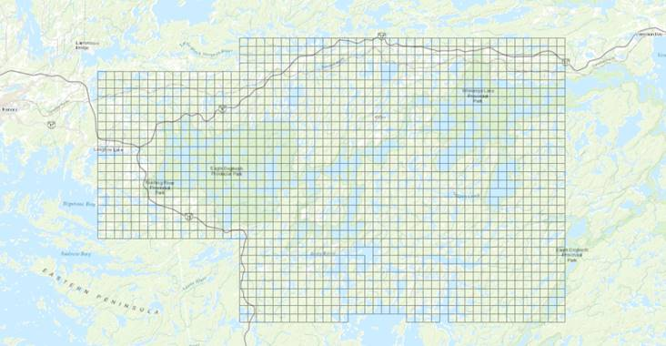

Photographed region surrounding ELA captured during in the NWOOP flights in 2017.

These georeferenced images are available in Universal Transverse Mercator (UTM) coordinates; horizontal datum is North American Datum (NAD) 83. Data are stored as 1km x 1km jpg2 tiles.

These data are provided for personal use for academic, research, and/or teaching purposes. The Ontario Ministry of Natural Resources must be acknowledged on any derivative product, whether printed or electronic, including for example, a printed map, a raster or vector graphic, a web-based application, etc. Patrons are advised to fully respect the provisions of Canada's Copyright Act as well as terms and conditions imposed by the data provider.

Discuss UTM, WGS84 NAD83 NAD27.

<u>History of mapping at ELA</u>

This section is under development. Contact the author directly for information on this topic.

<u>Survey datum:</u> Where long term or continuous lake level records are to be collected, it is necessary to refer local survey benchmarks to a selected reference datum. Since there was no geodetic survey benchmark close to ELA to relate local elevations to mean sea level (MSL), the lake levels in the following data tables have been referenced to an arbitrary assumed datum. In most cases, individual lakes were not related to the same datum. The exception was for the Lake 240 drainage basin (includes 239, 470, 661, 303 and 304) in which all surveys were referenced to a master assumed benchmark at the Lake 240 outflow weir.

<u>Lake ordering:</u> Lake order is a number that we use to describe a watershed in terms of how many lakes are contained within the entire drainage basin. The order number is simply the number of lakes above the outflow including its own lake. For example, Lake 223 is an order 3 system meaning that it has 3 lakes above its outflow while Lake 239 is an order 1 or headwater lake.

### Other considerations

<u>Construction methods and materials:</u> It is possible that factors such as disturbance due to construction, weir relocation, or choice of building materials may be thought responsible for local changes in chemistry or biology. With this in mind, the station discussions that follow provide information including dates of construction or major modification and also the type of materials used i.e.: concrete (sealed or unsealed), lumber containing preservatives, etc. Whether construction was conducted by Water Survey of Canada (WSC) or ELA hydrologic studies personnel has also been indicated. All construction, repairs or changes after October 1984 were carried out by ELA staff due to the withdrawal of WSC support.

<u>Station relocations:</u>

In some instances, hydrometric stations have been relocated for various reasons. It is therefore important to read the information sheets for the stations to a data analysis. A good example is in the case of Lake 373 Outflow Weir. The first weir was located above the road, some distance below the natural lake outlet. Due to serious ice conditions in most winter and spring periods, the weir was relocated to a better site downstream of the road. This resulted in an increase in the catchment area. This is discussed in full in the information sheet for Lake 373.

## Data Dictionary

### List of columns
Here is a list of columns in the four tables from the IISD-ELA master database, in the order they appear (columns in *italic* have been excluded from the online EDI repository):
* *dataset_code*
* dataset_name
* monitoring_location_name
* date
* time (only for hourly datasets)
* mean_daily_discharge / mean_hourly_discharge / mean_daily_level / mean_hourly_level
* qualifiers
* *level_type* (only for level daily)
* comments
* *account*
* *update_date*
* *version*

### Data dictionary
 **column name (alphabetical)** | **data type** | **unit** | **definition** | **dataset(s)** 
---|---|---|---|---
 *account* | character varying | N/A | Username of the IISD-ELA staffmember who added or most recently edited the data record. This may be generated through bulk loads or manually updated as records are edited individually. | all four 
 comments | character varying | N/A | Remarks about the record or its collection. | all four 
 *dataset_code* | character varying | N/A | A three character code made up of upper case letters and numbers unique for each IISD-ELA dataset. Should always start with a letter and may or may not end with a number. Used as a short consistent abbreviation for the dataset, whereas dataset_name is longer and may be changed and refined over time. | all four 
 dataset_name | character varying | N/A | Name of the dataset. A dataset is a collection of data to which several individual data records (rows) belong. Dataset names are useful to distinguish groups of data across different research fields and provide some descriptive context. Directly associated with dataset_code (each code has a different name). | all four 
 date | date | N/A | The calendar or climatological day (YYYY-MM-DD) for the associated record, indicating when the observation, measurement, sample collection, or other recording method happened. All air temperature and precipitation datasets from IISD-ELA are based on the climatological day (at IISD-ELA, 8AM CST is used as the start of the climatological day) using the Meteorological Service of Canada’s definition of climatological day (see the info sheets for more information). Other datasets use regular calendar days. | all four 
 *level_type* (only for level daily) | character varying | N/A | <to be defined> | level daily 
 mean_daily_discharge | numeric | cubic metres per second | <to be defined> | discharge daily 
 mean_daily_level | numeric | metres | <to be defined> | level daily 
 mean_hourly_discharge | numeric | cubic metres per second | <to be defined> | discharge hourly 
 mean_hourly_level | numeric | metres | <to be defined> | level hourly 
 monitoring_location_name | character varying | N/A | Name of sampled or surveyed geographic location at the IISD Experimental Lakes Area field site. | all four 
 qualifiers | character varying | N/A | Qualifiers conveying specific information about the record. | all four 
 time | character varying / time without time zone | HH:MM:SS | The time the field sampling or surveying activity was carried out to collect the data in the record. | the two hourly datasets 
 *update_date* | date | N/A | Date as calendar day that the record in the IISD-ELA Postgres Master Database table was uploaded to the database or most recently modified. | all four 
 *version* | numeric | N/A | The version number for a row of data is 1 when it is first added to a table, and increments by 1 every time the row is updated. | all four 

### Units of measure and accuracy
In Canada, metrification occurred in 1978. Prior to 1979, the unit of measure for discharge was cubic feet per second (f3s-1) reported to two decimal places. Flow volumes were reported in acre-feet reported to one decimal place. The unit of measure for lake level was feet reported to two decimal places. All data collected and previously reported in English units have been converted for the ELA database for consistency. Hydrological units are as follows:

- Discharge = cubic metres per second (m3s-1) reported to 4 decimal places

- Flow volume = cubic metres (m3) reported to the nearest whole cubic metre

- Lake level (stage) = metres (m) reported to 3 decimal places (1 mm precision).

### Qualifiers

Historically, internally, letter codes were used to qualify discharge and water level data where necessary. Now we no longer provide the *codes* in public data, just the qualifier *names*, corresponding to descriptions here. Please take note of these, as they are often important caveats to consider when using the data! That said, this section of the info sheet may need some cleanup.
* manual observation: Mean daily flow or water level were coded “A” to indicate that the value was an estimate based on one or more manual gauge readings or in combination with partial recorded record for that day,
* ice conditions: The presence of ice in the channel or structure affected, or may have affected, the stage-discharge relationship. The value reported is a “best estimate” due to the presence of ice,
* capacity exceeded: A major or unusual runoff event occurred resulting in flow that exceeded the station capacity for all or part of the day reported. This code indicates that flow for the reported value was in the overflow range of the gauging structure or outside of the range of calibration and should be regarded as a “best estimate”,
* beaver activity: Mean daily discharge values were coded “D” when beaver have placed debris or constructed a dam directly in the gauging structure resulting in false recorded stage data. Estimates were made for missing or suspicious data during the period of beaver influence. If estimates were not possible, the entry in the ELA Data Base will be “null”. In either case the entry was coded “D”,
* beaver activity: Beaver have constructed a dam above or below the gauging structure that may have influenced the “best estimate” reported value,
* beaver activity: A beaver dam located above the gauging station was opened resulting in an increase in flow not associated with a normal precipitation event but indicated a valid flow value,
* estimated value: This indicates a value that was determined by some indirect method such as interpolation, graph of observed readings, discharge measurement, comparison with other stations or by considering meteorological data,
* frozen conditions: The hydrometric gauging station was frozen resulting in missing record. Estimates were made when possible.
* FLUDEX effect: This code applies to the Lake 239 NW Inflow station only. From 1999 to 2003 inclusive, The Upland Flooding Experiment (FLUDEX) operated a reservoir (Site 2) at the top end of the Northwest Sub-basin of the Lake 239 Watershed. While the reservoir discharged to Roddy Lake, seepage and end-of-season draining resulted in additional water, originating from Roddy Lake, to the NW Sub-basin. This additional water is included in the reported values for those station years of record.
* linear interpolation: This indicates a value that was estimated by linear interpolation between two manual observations. In most cases, estimates by interpolation were made to complete data sets during stable low flow periods (i.e. winter) that were not influenced by precipitation events or other hydrologic events in order to provide complete data sets for analyses such as chemical mass balances. Mean daily values that could not be estimated by interpolation resulted in “null” values in the data base that were coded “M”.
* leakage: This indicates that leakage or seepage under or around a weir or flume was present and that an adjustment was made to the reported value.
* missing record: Mean daily values that could not be reliably estimated were considered “missing record” resulting in a “null” entry in the data base,
* regulated flow or water level: This indicates that the reported discharge or water level value was influenced by human regulation for experimental or other purposes. This code is intended for “natural” systems that are not normally regulated and is reserved for situations that last only days or weeks in duration. Stations that were regulated for longer periods (one or more seasons) are noted in station discussions.
* unnatural flow or water level: This code indicates a mean daily value that was influenced by unnatural causes resulting water being removed or foreign water being added to the system. Examples have included pumped water for irrigation (NE Sub-basin), pumped water to fill FLUDEX reservoirs (NW Sub-basin), and the siphoning of water from Lake 226.
* controlled flow release: This code indicates a value that was influenced by a manual flow release of water such as spilling water impounded by a dam.

## References

The following reports or papers are referenced in some of the hydrometric station information sheets that follow and are available in the ELA electronic data base.

1.  Assessment and Remediation of 25 Hydrometric Stations in Northwestern Ontario, Kenora/Thunder bay Areas. Project Summary Report. March 30, 2002. Dillon Consulting (for PWGSC and EC-Water Survey of Canada).

2.  BEATY, K.G. 1981. Hydrometeorological data for the Experimental Lakes Area, northwestern Ontario, 1969 through 1978 (in three parts). Can. Data Rep. Fish. Aquat. Sci. 285: 1-367.

3.  BEATY, K.G. 1984. Hydrometeorological data for the Experimental Lakes Area, northwestern Ontario, 1979 through 1981. Can. Data Rep. Fish. Aquat. Sci. 480: 146 p.

4.  BEATY, K.G., AND M.E. LYNG. 1989. Hydrometeorological data for the Experimental Lakes Area, northwestern Ontario, 1982 through 1987. Can. Data Rep. Fish. Aquat. Sci. 759: 280 p.

5.  LONG, J. A., P. Eng. 1972. A preliminary assessment of the weirs and flumes operating in the Kenora Experimental Lakes Area. Water Survey of Canada, Inland Waters Branch, Department of the Environment, Winnipeg, Manitoba, May, 1972. 58 p.

6.  CANADA. DEPARTMENT OF THE ENVIRONMENT. WATER SURVEY OF CANADA (WSC). 1969-1987. Surface water data: Ontario.

7.  ENVIRONMENT CANADA. INLAND WATERS DIRECTORATE. WATER RESOURCES BRANCH. OTTAWA, CANADA, 1984. Methods for the Estimation of Hydrometric Data. 23 p.

8.  HESSLEIN, R. 1980. Whole-lake radiocarbon experiment in an oligotrophic lake at the Experimental Lakes Area, northwestern Ontario. Canadian Journal of Fisheries and Aquatic Sciences. Vol. 37, 3 pages: 454-463.

9.  NEWBURY R.W. and J.A. CHERRY. April 1971. Geohydrology of the Kenora Research Watershed FRB Experimental Lakes Area, northwestern Ontario. (unpublished) Report no. 2. Departments of Civil Engineering and Earth Sciences, University of Manitoba.