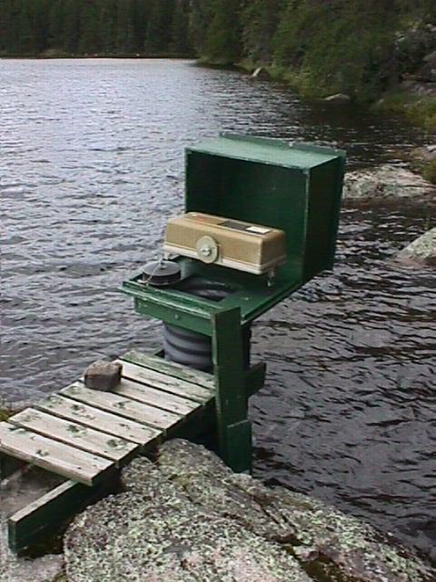

**Lake 223: Hydrometric Station Information Sheet**

Author: Ken Beaty, Paul Fafard

Last update: September 13, 2019 (PF)

Watershed area (ha): 259.96 ha based on 1972 mapping

XX.XX ha based on 2017 DEM\*

\* The watershed area of 223Q determined from the 2017 DEM has yet to be ground-truthed.

<u>The Watershed</u>

Lake 223 is located approximately 5 km north of the ELA field station. Lake 223 has a surface area of 27.3 ha and a total watershed area of 259.9 ha including the upstream Lake 224 and Lake 225 tributary watershed. L223 is a 3rd order lake. Drainage areas are based on the topographical map produced by Lockwood Surveys (1972) at a scale of 1:7920 from aerial photos taken in 1969. Hydrological instrumentation to the end of 1987 consisted of an outflow weir, a lake stage level recorder and inflow weir. The old beaver dam at the lake outflow was opened in 1986 to allow the lake levels to fluctuate naturally over a narrow range.

<u>Hydrometric Stations</u>

1.  Lake 223 Outflow

In August 1975, a 90˚ V-notch sharp crested concrete weir was constructed by the Water Survey of Canada (WSC). The weir was located on bedrock about 50m downstream of the lake outlet and beaver dam. A Leupold and Stevens A-35 float water level recorder, which were housed in a California-type shelter, provided continuous record from early April to the beginning of November each year (seven-month record). The natural outlet of Lake 223 is beaver dam controlled and therefore flow often occurs as seepage through or under the dam allowing flow to happen in winter. Because the weir is located downstream of the outlet and beaver dam, the recorded flow was unaffected. In winter, monthly observations were taken since 1982. The concrete was not sealed at the time of construction. However, in 1987, sections of the concrete wall around the notch were repaired and this concrete was sealed with a tar foundation coat.

The outflow weir was located on bedrock and assume subsurface seepage outflow to be unlikely. Users of this data should realize that groundwater seepage out of upstream Lake 224 into adjacent Lake 222 was detected by tritium analysis (Beaty, 1984). This leakage therefore reduces the surface water outflow yield to values lower than would be expected.

This station was discontinued at the end of October 1998. The weir was removed during the 2015 field season as part of the major site decommissioning and cleanup that was a requirement of the transfer of ELA from DFO to IISD-ELA.

2.  Lake 223 Lake Level

In October 1980, a staff gauge, stilling well and Leupold and Stevens A-35 float water level recorder were installed on the lake by WSC. Continuous records were obtained from the end of March to the beginning of November each year since 1981(seven month record). This station was discontinued at the end of October 1998. The lake gauge was removed during the 2015 field season as part of the major site decommissioning and cleanup that was a requirement of the transfer of ELA from DFO to IISD-ELA.

<u>Photographs</u>

Figure 1. Rain gauge and stream segment between beaver dam at lake outlet above and weir downstream.

Figure 2. Lake 223 90o v-notch weir.

Figure 3. Lake 223 lake stage recorder and stilling well.
