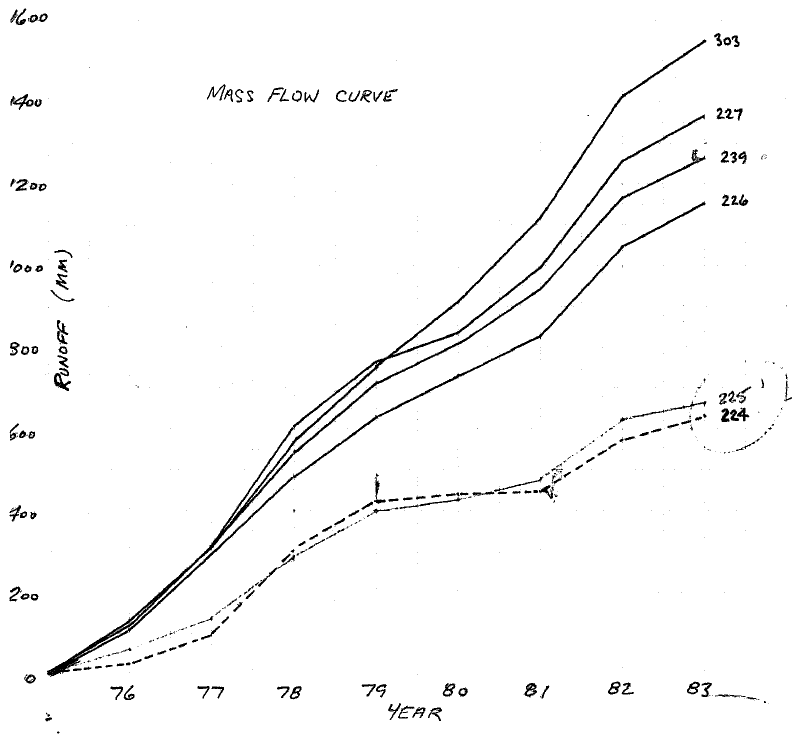
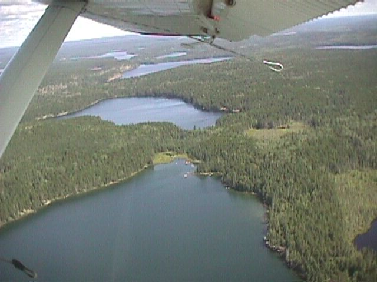
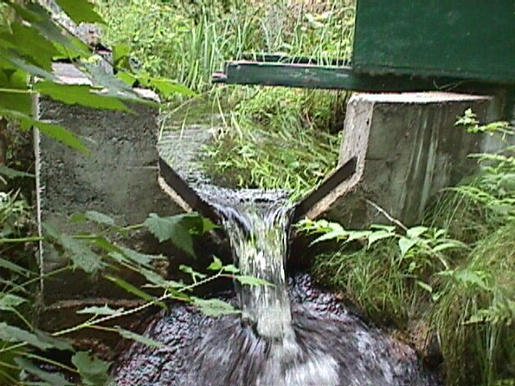
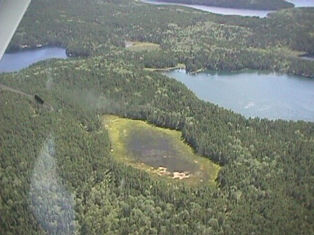

**Lake 224: Hydrometric Station Information Sheet**

Author: Ken Beaty, Paul Fafard

Last update: April 1, 2025 (LNT)

Coordinates of water level gauge (UTM, WGS 84): 15U 0447881E 5504278N

Watershed area (ha): 97.48 ha based on 1972 mapping

XX.X ha based on 2017 DEM\*

\* The watershed area of Lake 224 determined from the 2017 DEM has yet to be ground-truthed.

<u>The Watershed</u>

Lake 224 is a second order lake that is located 3.0 km north of the ELA field station. It has a surface area of 25.9 ha and a total watershed area of 97.5 ha including the upstream Lake 225 tributary watershed (26.48 ha). L224 is a 2nd order lake. Drainage areas are based on the topographical map produced by Lockwood Surveys (1972) at a scale of 1:7920 from aerial photos taken in 1969-70. Lake 224 flows north into Lake 223. A groundwater seepage problem within the watershed was identified in 1982 and is explained below.

<u>Hydrometric Stations</u>

1.  Lake 224 Outflow

Hydrological work on the lake began in August 1975 when a hydrometric control was established on the outflow stream by Water Survey of Canada (WSC). The structure was a temporary plywood 90o sharp crested v-notch weir equipped with a Leupold and Stevens A-35 analog chart and float actuated water level recorder and staff gauge. This weir was located approximately 75% of the distance downstream from the outlet. The outflow stream and valley bottom are not bedrock controlled and are underlain by undetermined material and boulders. On June 18, 1986, this weir was replaced with a new concrete 90o sharp crested v-notch weir at a new location 50 m upstream of the old weir. A Leupold and Stevens A-35 float actuated chart recorder provided record from early to mid-April to the end of October each year (seven-month record) from 1975 to 1999. In winter, monthly visits were made to obtain manual flow measurements (see “winter flow”). In some years, beaver activity on the lake and in the stream above the weir affected flow.

This station was discontinued October 27, 1999. The weir was removed during the 2015 field season as part of the major site decommissioning and cleanup that was a requirement of the transfer of ELA from DFO to IISD-ELA.

2.  Lake 224 Lake Level

In 1978, a staff gauge was installed on Lake 224 and 24 manual gauge readings were taken from May through October. These readings were recorded in the first data report series of hydrometeorological data (Beaty, 1981) but are not relative to the datum used for data in the years to follow. Occasional manual gauge readings were also obtained in 1989 through 1998. The original station was a metric gauge plate fastened to a board bolted to the bedrock. It was located on a rock face on the south shore of the lake a little west of inflow the inflow stream from Lake 225. Level records were not collected for the years 1999 to 2001. In May 2002, this station was re-activated and upgraded in support of the Long-Term Ecological Research (LTER) project as a reference lake. A new benchmark, staff gauge, stilling well and OTT Thalimedes data logger were installed in July 2002 to obtain continuous record during the open water season. An elevation for the new benchmark was determined relative to the former datum by surveyed water level transfer. This improved station was located in the southwest corner of the lake on the closest bedrock point east of the trailhead from Roddy Lake and boat landing. As of, 12 September 2019, this station is equipped with a Sutron SDR-0001-1 shaft-encoder type water level logger. The OTT Thalimedes logger was removed and use discontinued on 12 September 2019.

<u>Groundwater Seepage</u>

The presence of subsurface flow or groundwater seepage from ELA lakes has generally been assumed to not exist or, at least, be insignificant to the annual water budget. Examination of monitored lake outflow records suggested that this was not the case for Lakes 224 and 225. Records indicated that annual runoff values were well below that of other lakes in the area. A visible seepage stream entering the southwest corner of an adjacent lake (Lake 222) was previously thought to originate from an elevated bog in that basin. The source of the stream was found to be Lake 224 or a combination of the bog and Lake 224.

In 1976, Lake 224 had been injected with tritiated water as a tracer for vertical diffusion experiments (Hesslein et al. 1980). In 1982, Tritium levels were still easily detectable therefore offering a unique groundwater tracing method. In the summer of 1982, samples were taken from the epilimnions of lakes 222 and 224 as well as the seepage inflow into Lake 222. Values were compared to background samples taken from the epilimnions of four other nearby lakes. The samples were analysed by Andy Herczeg from the Lamont-Doherty Geological Observatory of Columbia University. The results are summarized in the following table.

| Sample        | DPM/L         | T.U.             |
|---------------|---------------|------------------|
| Location      |               |                  |
| L. 222        | 1187 +/- 38   | 164.8 +/- 5.2    |
| L. 222 inflow | 6111 +/- 244  | 848.7 +/- 33.9   |
| L. 224        | 22859 +/- 822 | 3174.8 +/- 114.2 |
|               |               |                  |
| Background    |               |                  |
| Location      |               |                  |
| L. 383        | 425 +/- 25    | 59.1 +/- 3.5     |
| Teggau Lake   | 901 +/- 46    | 125.1 +/- 6.3    |
| L. 259        | 633 +/- 28    | 88.1 +/- 3.9     |
| Roddy Lake    | 774 +/- 22    | 107.5 +/- 3.1    |

Where:

- T.U. are Tritium units corresponding to the number of Tritium atoms per 1018 Hydrogen atoms.

- DPM/L refer to decays per minute per litre.

Herczeg offered the following interpretation of the results. “It is clear that Lake 222 is contaminated with water from Lake 224. A lake the size of Lake 222 should have only about 80 T.U. if its only source was bomb Tritium. The seepage water is clearly over one order of magnitude higher than expected. A rough calculation of water budget indicates that the contribution of this inflow is about 2 percent per year of the total volume of Lake 222.”

Furthermore, a mass curve analysis of the outflow data for lakes 223, 224, 226, 227, 303, and 239 for the period 1976 to 1983 demonstrates that the average yield of lakes 224 and 225 is approximately 50% lower than the average of lakes 226, 227, 239 and 303. This provides a strong indication of a seepage problem, not only from Lake 224 but also Lake 225.

While most ELA watersheds appear to be bounded by sound bedrock control, the assumption that groundwater flow or seepage does not exist should not be made without careful examination of the lake basin and hydrometric record where it exists.

<u>Photographs</u>

Figure 1. Lake 224 in foreground looking toward the outlet area with Lake 223 downstream. The outflow of Lake 225 is barely visible in the lower right corner of the photograph.

Figure 2. Lake 224 Outflow weir which was discontinued in 1999.

Figure 3. Lake 224 lake level station installed in 2002.

Figure 4. Aerial photo of the groundwater seepage location from Lake 224 (upper left) to Lake 222 (upper right). Samples containing tritium from Lake 224 were taken in the bay of Lake 222 were the portage trail ends.
