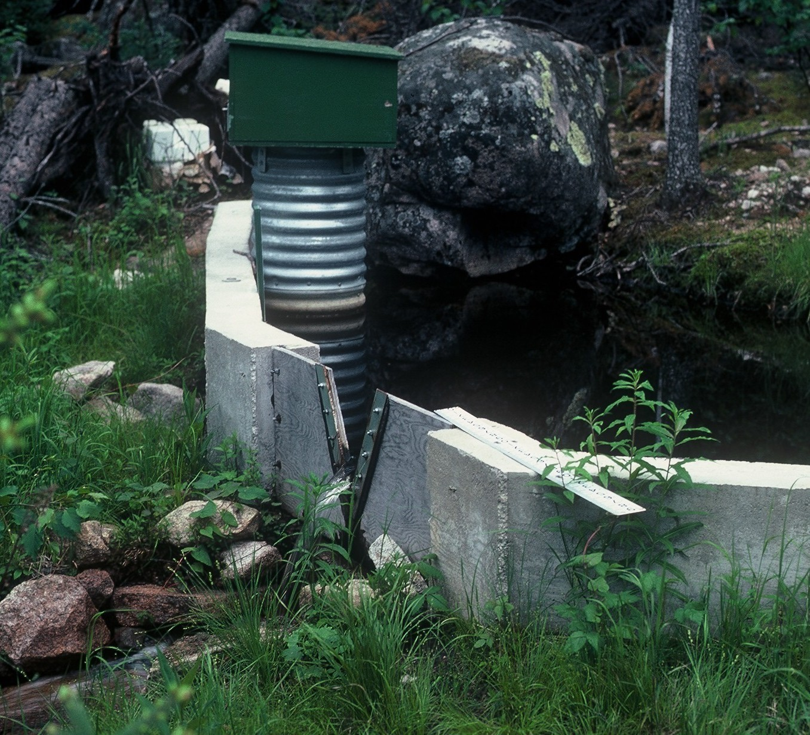

**Lake 225: Hydrometric Station Information Sheet**

Author: Ken Beaty, Paul Fafard

Last update: 13 September 2019

Watershed area (ha): 30.5 ha based on 1972 mapping

XX.X ha based on 2017 DEM\*

\* The watershed area of Lake 225 determined from the 2017 DEM has yet to be ground-truthed.

<u>The Watershed</u>

Lake 225 is located approximately 3 km north of the ELA field station. The lake is a headwater lake with a surface area of 3.99 ha and total watershed area of 30.5 ha above the hydrometric monitoring station. L225 is a 1st order lake. These areas are based on the topographical map produced by Lockwood Surveys (1972) at a scale of 1:7920 from aerial photos taken in 1969-70. The outflow stream flows a short distance over bedrock to downstream Lake 224.

<u>Hydrometric Stations</u>

1.  Lake 225 Outflow.

Hydrometric work on Lake 225 began in August 1975 when Water Survey of Canada (WSC) constructed a 60o sharp crested v-notch concrete weir on the outflow stream. It was instrumented with a Leupold and Stevens A-35 analog float actuated chart water level recorder and staff gauge. The weir was built on bedrock and the presence of seepage or bedrock fractures was not evident. This station was operated from early to mid-April to the end of October each year as a seasonal station (seven-month record) from August 1971 to the end of 1992. From 1982, monthly visits in winter were made to obtain manual flow measurements (see “winter flow”). This weir was treated with a tar foundation sealer at the time of construction.

This station was inactive since it was discontinued (1992). The weir was removed during the 2015 field season as part of the major site decommissioning and cleanup that was a requirement of the transfer of ELA from DFO to IISD-ELA.

<u>Groundwater Seepage</u>

Please refer to the discussion on seepage in the information sheet for Lake 224. A mass flow curve analysis strongly suggests that the same situation may exist for Lake 225 as Lake 224.

<u>  
Photographs</u>

Photographs 1 and 2: Lake 225 outflow weir.
