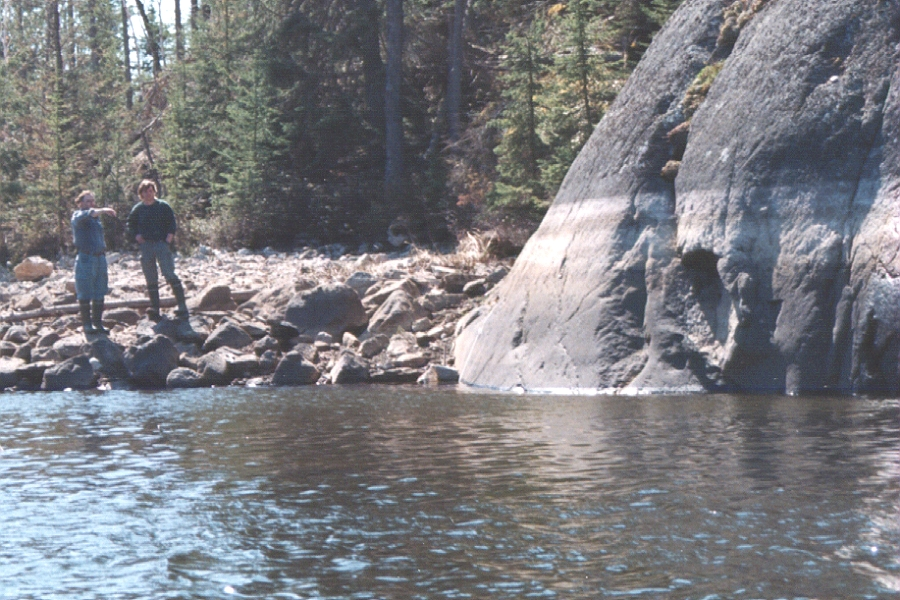
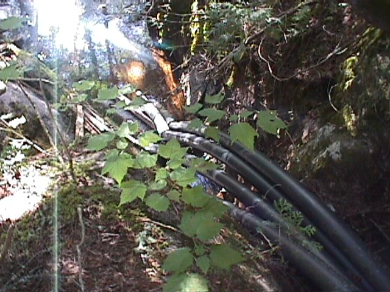
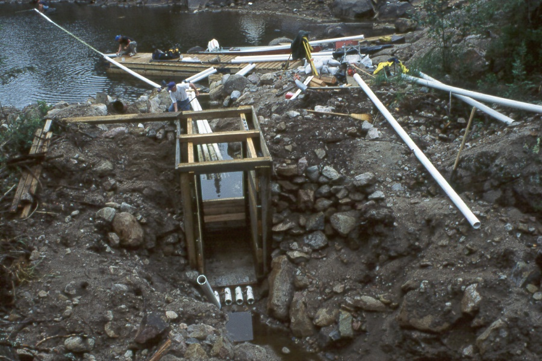
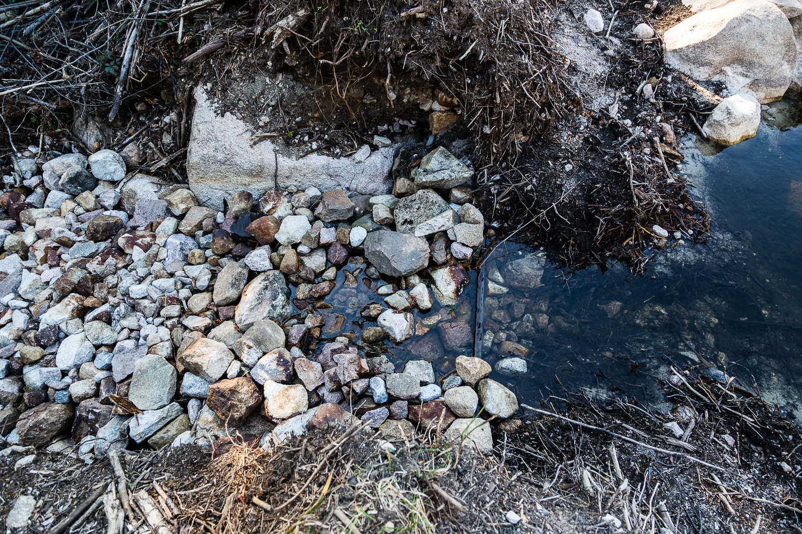
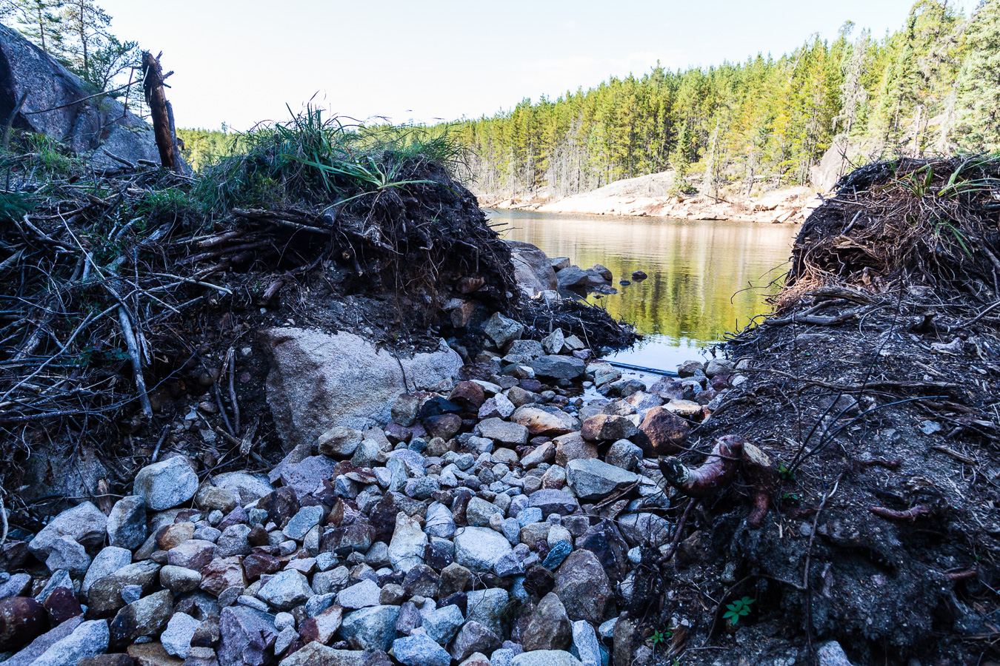

**Lake 226: Hydrometric Station Information Sheet**

Author: Ken Beaty, Paul Fafard

Last updated: September 13, 2019 (PF)

Watershed area (ha): 97.17 ha based on 1972 mapping

XX.X ha based on 2017 DEM\*

\* The watershed area of Lake 226 determined from the 2017 DEM has yet to be ground-truthed.

<u>The Watershed</u>

Lake 226 is located approximately 3 km north of the ELA field station. The lake is a headwater lake with a surface area of 16.1 ha and total watershed area of 97.2 ha above the hydrometric outflow monitoring station. L226 is a 1st order lake. These areas were based on the topographical map produced by Lockwood Surveys (1972) at a scale of 1:7920 with 10 foot contours determined from aerial photographs taken in 1969-70. Hydrological instrumentation within the watershed has consisted of a weir at the outflow, and a staff gauge and lake level recorder or data logger in some years. The watershed has experienced disruption from wild fire and the lake from a water level manipulation study. In 1979, an OMNR (Ontario Ministry of Natural Resources) controlled fire burn north of Roddy Lake went out of control and spread to the Lake 226 watershed. This resulted in a forest fire which burned 28.1 ha of the northern terrestrial portion of the basin. Between 1994 and 1997 the lake was lowered in three consecutive winters by controlled drawdown using a stop-log control and siphons to examine divergent impacts of experimental lake-level drawdown on planktonic and benthic plant communities and spawning white fish egg survival. A summary report of this study was prepared by Wolfgang Jansen (March 11, 2000).

Hydrological speaking, the watershed is believed to be “tight”. The basin is bedrock controlled and the long reach of stream channel from the outflow to downstream Roddy Lake has revealed no obvious sign of seepage during times of no flow. This was further supported by the analysis of Tritium additions to Lake 226 between August 2, 1989 and May 10, 1994. The results for outflow from the lake by Tritium analysis checked to within 2% of reported monitored outflow from the weir. (personal communication with Glenn Bird, research scientist, Atomic Energy of Canada, Pinawa, Manitoba, February 12, 1997).

<u>Water Level and Bathymetry</u>

Since work began on Lake 226 in the early 1970’s, water level on the lake has often been affected by the presence of nuisance beaver activity which were very difficult to control.

Fluctuating water levels can be a problem when relating depth at sample sites to bathymetry or when accurate lake volume is required. For this reason, it is very important to know the date, conditions and water level reference at the time of bathymetric field surveys. Because of beavers, this lake has often reached elevation 9.5 m above datum, which is a full 1 m above the natural outflow sill elevation of 8.45 m. The field survey for the current lake bathymetry map was carried out by I. Davies and B. Ayles in February 1975. Unfortunately, the map that resulted was not referenced with respect to the survey date or water level at the time of the survey. It was several years later, about 1994, that the water level reference for that map was determined to be very close to the natural sill elevation (8.45 m) by G. McCullough. This elevation was determined by examination of vertical and oblique aerial photographs, field survey and ground truthing. It was from this analysis 20 years later that we learned that the map currently in use for Lake 226 represents a low water level situation not influenced by beaver. The highest water level observed on the lake was 10.015 m on August 7, 2015, a full 1.56 m above the original natural outflow sill elevation.

Between December 14, 1994 and January 29, 1996, drawdown was carried out during the winter months (December to March): 1994/95, 2.1 m, 1995/96, 3.1 m and 1996/97, 3.1 m below the historic average water level. Because of beaver activity, the lake remained high from the end of that study until the middle of August 2015 when the lake was lowered and the control structure removed in September 2015. At that time, the lake was restored close to the original sill (zero flow) elevation to a new elevation of 8.496 m with a water level of 8.507 m (survey Sept. 23, 2015; Survey book A-36, p34).

<u>Hydrometric Stations</u>

1.  Lake 226 Outflow

Hydrological monitoring began in 1971 when a 90˚ V-notch sharp crested weir was constructed about 20m below the beaver dam and lake outlet by WSC. The weir consisted of a plywood and steel notch section with earth fill dikes and plastic lining. The weir was relined with plastic in 1982 and completely rebuilt in 1985 with similar materials. A Leupold and Stevens A-35 float water level recorder provided continuous record from late March to early November each year since 1972 (seven-month record). The weir was discontinued January 25, 1995 for the three-year period of the lake draw down study that followed. The weir was completely rebuilt at the same location and reactivated October 22, 1997. It was operated until the end of the 1998 season. From 1999 and onward this station was declared “unfunded”. Regardless, attempts to continue record were made but were largely unsuccessful due to time constraints, recorder issues and the continuing battle with beaver. Some record does exist for the years 1999 to 2003 but it has not been processed. In May 2001, the chart recorder was replaced with an OTT Thalimedes data logger. In winter, monthly streamflow observations were made since 1982. From 2005, the weir remained completely buried in beaver debris until its removal in September 2015. In spring and early winter, Roddy Lake becomes a hazardous barrier for travel due to unsafe ice conditions during these shoulder seasons making site visits to collect record at this site difficult or impossible. There has been no evidence of groundwater flow from this lake.

2.  Lake 226 Lake Level

A benchmark was established at Lake 226 between the boat landing and the outlet stream and was assigned an arbitrary elevation of 10.000 m. All lake level data were referenced to this datum. Level record on Lake 226 consisted of periodic direct water level measurements or staff gauge readings in several years beginning in 1977. In June 1995, a stilling well and Leupold & Stevens AF water level recorder were installed and operated until October 1998. In several of the years between 1999 and 2015, occasional measurements of water level have been made. Except for the three draw down years, this lake has experienced a very high range of fluctuation from the natural sill elevation at the outlet of 8.45 m to maximum observed level of 10.015 m in August 2015.

3.  Lake Level Control Structure

A timber, stop-log control structure was constructed at the lake outlet for the water level draw down study. Four self-priming siphon tubes were imbedded in the floor of the structure (see photographs that follow). At the end of the study, stop-logs were set to allow the lake return to the pre-study water level target of elevation 9.2 m. The structure remained in place following the study until it was removed during the site restoration in September 2015.

<u>Site Decommissioning and Clean-up</u>

As part of the site decommissioning agreement between DFO and IISD-ELA, the outflow weir, water level control structure, lake level stilling well and staff gauge were removed in September 2015. The survey benchmark was left as a reference for future work. The outflow sill elevation was set at elevation 8.496 m.

<u>References</u>

1.  Wolfgang Jansen, Ph.D. March 11, 2000. Experimental drawdown of Lake 226 in the Experimental lakes Area, Ontario: Implications for fish habitat management in lakes and reservoirs with fluctuating water levels. Unpublished report to the Department of Fisheries and Oceans, Central and Arctic Region.

<u>Photographs</u>

Lake 226 outflow weir constructed in October 1997, removed in September 2015 (by DFO).

Lake 226 staff gauge (removed in 2015 by DFO)

Lake 226 recording water level station removed September 2015 by DFO.

Lake 226 during Water Level Drawdown Study 1994 to 1997.

Four 6-inch diameter siphons used to draw down Lake 226.

Stop-log control structure and siphons under construction at Lake 226 outlet in 1994.

Beaver debris in Lake 226 Outlet control structure.

Beaver debris in Lake 226 Outflow Weir.

Lake 226 outlet after drawdown structure removal and lake restored to historic sill elevation (September 2015).
