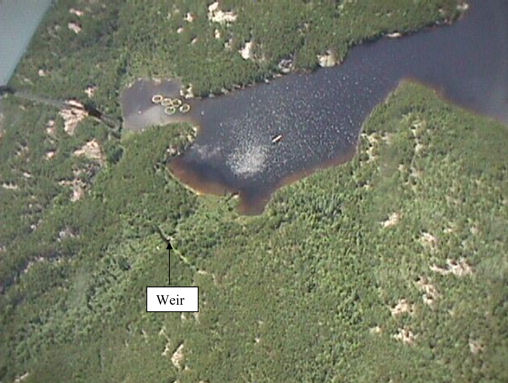
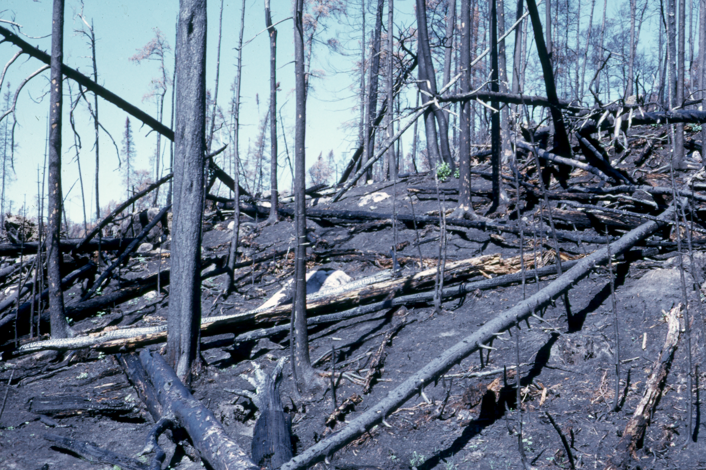
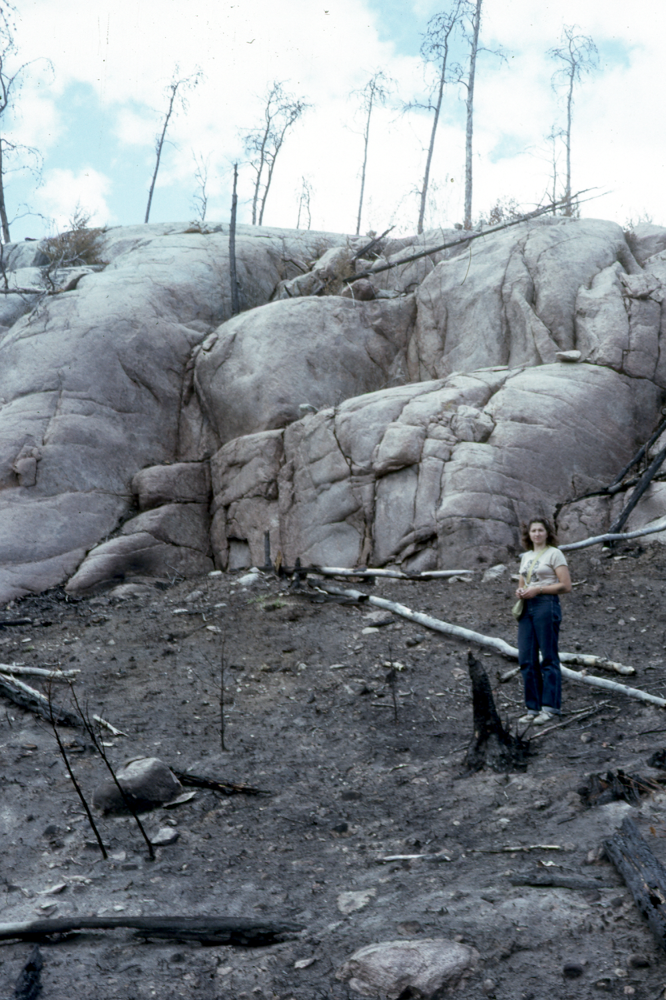
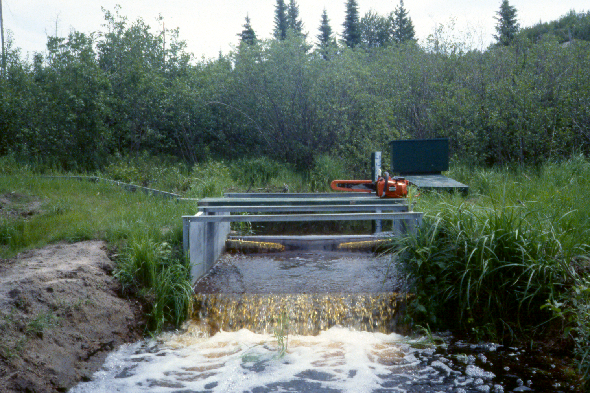
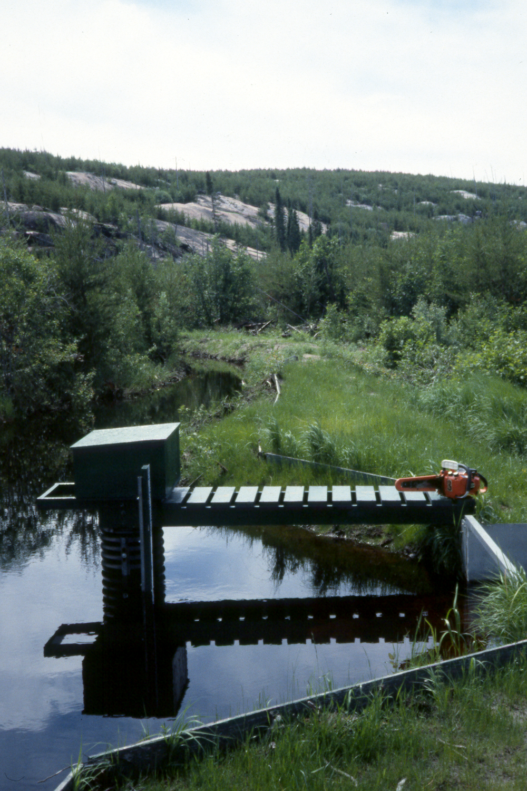

**East Inflow to Lake 239: Hydrometric Station Information Sheet**

Author: Ken Beaty, Paul Fafard

Last update: November 23, 2018 (PF); 15 April 2024 (PF); 1 April 2025 (LNT)

Coordinates of control structure (UTM, WGS 84): 15 U 448535 E, 5501200 N

Watershed area (ha): 170.28 ha based on 1987 mapping

150.90 ha based on 2017 DEM \*

\* The watershed area of the EIF determined from the 2017 DEM was ground-truthed in fall 2023

<u>1971 to 2025</u>

The East Inflow to L239 (Rawson Lake) drains the East Subbasin (170.28 ha) and is the largest stream that flows into the lake. This station has also been referred to as the East Lower Weir in some reports. The monitoring site is located approximately 75 m upstream of the lake. The stream channel is well defined for approximately 900 m of its length and flows most of the year, usually from early to mid-April until the end of November or early December. The lower 550 m of the stream has a very low slope (\<1%) and meanders along the central part of a broad flat valley bottom. Where the gauging station is located, the valley is 130 m wide and is underlain with a sandy till substrate with a maximum depth of 13 m to bedrock. Flow occasionally exceeds bank full stage during major rainstorm events making this stream difficult to monitor at times. It also reaches a state of zero flow that can last for several weeks during dry summers and most winters.

In June 1970, drilling was carried out across the mouth of the basin in the area bounded by the monitoring location and the lake to investigate the depth and type of substrate and to place piezometer and groundwater wells. Geochemical studies were conducted by Bottomley (1974) and Kennedy (1974). The entire subbasin was burned twice by major forest fires in 1974 and 1980. A post-forest fire sediment transport study was carried out by Beaty from 1975 to 1982 (Beaty, 1994). All piezometers and water table wells were removed in 2015 as a requirement of the transfer agreement between DFO and IISD-ELA.

Hydrometric work on this stream began on June 18, 1971. A small wooden box flume (1.22 m wide by 1.83 m) with staff gauge was installed to monitor storm runoff events during the open water season. A stage-discharge relationship was developed and daily discharge values were estimated for part of 1971 and 1972 based on manual gauge readings. On May 10, 1973, a Stevens Type-F weekly chart water level recorder was added to extend and improve the record. Following the 1974 forest fire, a new weir was constructed by ELA personnel and began operation August 2, 1974. This structure was a larger wooden box flume (1.52 m by 2.44 m) incorporating a shallow v-notch at the front end to improve the resolution of low baseflow. It was installed at a higher elevation than the first flume to reduce the occurrence of backwater and was fitted with a staff gauge and Leupold and Stevens Type-A float water level recorder. Diking was also improved for better containment of high flows. Following the second forest fire in June 1980, the monitoring station was once again upgraded when it was replaced by Water Survey of Canada (WSC) with a similar but slightly larger structure on October 14, 1982. The new station was a steel box flume (1.83 m by 2.44 m) with a shallow steel v-notch at the front end having the same degree of angle as the previous structure. This weir was installed slightly higher than the 1974 flume to eliminate the possibility of backwater from the downstream lake and dikes were also further improved. A Leupold and Stevens Type-A float water level recorder provided continuous record from early to mid-April until early November (seven-month record). In early November 1988, a large track mounted backhoe was brought in to again improve dikes and dig a trench across the valley on the upstream side of the dike. This structure performed well until it was replaced in August 2008. The new weir was fabricated to the same dimensions as the former one. The major difference was that large foundation ground screws (4) eight feet long were used to level and support the heavy steel structure. The stilling well, staff gauge and cat-walk are also supported with two ground screws. It is anticipated that they will prevent shifting due to frost heave in the sandy soils.

While attempts have been made since 1975 to obtain April spring record, poor accessibility due to risky ice conditions have often resulted in incomplete records. This station was normally operated from mid-April until early November. In winter, monthly streamflow observations were made since 1977 to determine the presence or absence of flow that would aid in the estimation of winter flow.

Recording equipment used was the Leupold and Stevens Type-A water level recorder until 2000. A Stevens Type A/F data logger was used for back-up in 2000. In 2001, a change was made when we began using OTT Thalimedes float-potentiometer data loggers. During the 2017 open water season, a Sutron SDR-0001-1 was used. Since 10 July 2018, a Sutron SDR-0001-4 has been used with the addition of a CDOM sensor, and the OTT Thalimedes logger was discontinued. A Solinst Levelogger 5 (model 3001) was deployed on 8 April 2019 and usually remains from April-October each year. The Solinst Levelogger (pressure sensor) collects early spring data, acts as a backup logger to the Sutron SDR, and records water temperature. An OTT Orpheus Mini data logger, which is also a pressure and temperature sensor, was used in April-May 2020, instead of the Solinst Levelogger.

Beavers are a frequent problem at this site, especially in year 2000, when these pests caused dike damage and blockage that forced us to estimate values for most of the flow season using data from the Northwest Inflow to Lake 239 station. In all years, daily flow values that were influenced by beaver have been flagged “D” in the data summaries and should be regarded as best estimates only.

<u>References</u>

BEATY, K.G. 1994. Sediment transport in a small stream following two successive forest fires. Can. J. Fish. Aquat. Sci. 51: 2723-2733.

BEATY, K.G. 1981. Hydrometeorological data for the Experimental Lakes Area, northwestern Ontario, 1969 through 1978 (in three parts). Can. Data Rep. Fish. Aquat. Sci. 285: 1-367.

BEATY, K.G. 1984. Hydrometeorological data for the Experimental Lakes Area, northwestern Ontario, 1979 through 1981. Can. Data Rep. Fish. Aquat. Sci. 480: 146 p.

BEATY, K.G., AND M.E. LYNG. 1989. Hydrometeorological data for the Experimental Lakes Area, northwestern Ontario, 1982 through 1987. Can. Data Rep. Fish. Aquat. Sci. 759: 280 p.

BOTTOMLEY, D. 1974. Influence of hydrology and weathering on the water chemistry of a small Precambrian Shield watershed. M.Sc. thesis, University of Waterloo, Waterloo, ON. 118 p.

KENNEDY, K. 1974. Geohydrology and hydrochemistry of a small Precambrian Shield watershed. M.Sc. thesis, University of Waterloo, Waterloo, ON. 248 p.

<u>  
Photographs</u>

Photograph 1. Aerial view of East Inflow to Lake 239.

Photograph 2. East Subbasin after 1974 forest fire.

Photograph 3. East Subbasin after 1980 forest fire.

Figure 4. East Inflow Weir at moderate flow during the summer of 1989.

Figure 5. Looking SE along ditch and dike taken summer 1989.

Figure 6. East Inflow after late spring storm May 12, 2004.

Figure 7. Measuring discharge during snowmelt recession May 13, 2004.

Figure 8. The East Inflow to Lake 239 in the summer of 2006 during the longest dry period on record.

Figure 9. Installing a new replacement weir in August 2008.

Photograph 10. A new weir/flume was installed to the same dimensions as the previous structure in August 2008. The heavy steel structure is bolted to four ground screw anchors set to a depth of 2.4 metres.
