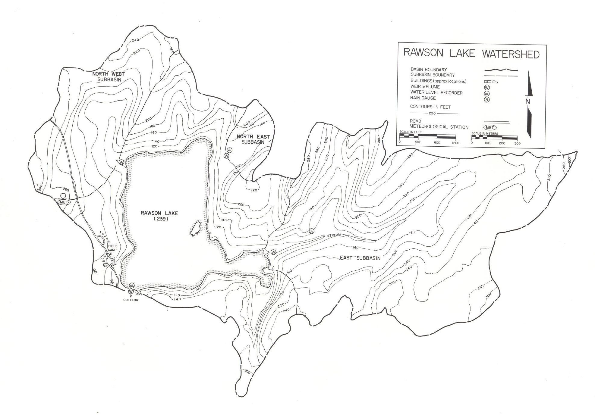

**Lake 239: Hydrometric Station Information Sheet**

Author: Ken Beaty, Paul Fafard

Last update: 04 April 2023 (PF); 15 April 2024 (PF); 1 April 2025 (LNT)

Coordinates of control structure (UTM, WGS 84): 15U 0447564E 5500960N

Coordinates of water level gauge (UTM, WGS 84): 15U 0447540E 5501165N

Watershed area (ha): 393.34 ha based on 1987 mapping

388.28 ha based on 2017 DEM\*

\* The watershed area of 239Q determined from the 2017 DEM was ground-truthed in fall 2023.

<u>The Watershed</u>

Lake 239 is located at the end of the Pine Road, 30 km south of Ontario Highway 17. The ELA field station facility is located at the SW corner of the Lake 239 Watershed and near the lake outlet. Lake 239, named Rawson Lake in the 1970’s, is a headwater lake with a surface area of 54.38 hectares and total watershed area of 393.34 ha. It is separated from downstream Lake 240 (Hayes Lake) by a narrow strip of land approximately 100 m long by 15 to 20 m in width. The lake flows out through a small short stream channel 15 m in length and 1.5m in width. The surface elevation of Lake 239 is approximately 0.2m higher than that of Lake 240. The outflow sill elevation has been controlled since 1972 when a flow measuring flume was installed. The terrestrial portion of the watershed consists of three well defined subbasins referred to as the Northwest Subbasin, Northeast Subbasin and East Subbasin as well as four undefined direct drainage areas. The three subbasins each have a well-defined stream and together account for 70% of the runoff to the lake. The Rawson Lake Watershed and its hydrologic processes have been previously described by Schindler et al. (1976), Newbury and Beaty (1977), Newbury et al. (1979) and Schindler et al. (1980).

This Lake 239 Watershed has been monitored continuously since 1969 with respect to its chemistry, aquatic biology, hydrology and meteorology and has served as a reference for much of the work that has been carried out at the ELA.

Watershed drainage areas were initially based on the topographical map produced by Western Photogrammetry (1970) at a scale of 1:4800 with 10 foot contour interval and based on an assumed datum. A re-mapping of the Northeast Subbasin in 1982 and 1987 resulted in a minor adjustment to the drainage area for the watershed.

The watershed has experienced an extreme wind event and two forest fires since 1969. At 05:00 on July 7, 1973, a severe windstorm, with winds up to 150 kph, struck the ELA. Parts of the Rawson Lake Watershed were severely affected by blowdown. Almost one year later, on June 26, 1974, a major forest fire started that swept the area burning 70% of the watershed (Schindler et al. 1980). In June 1980, another fire started south of Lake 240 and burned most of the Rawson Lake basin with only the immediate field station area and buildings being saved. With the exception of these three events, the watershed has remained relatively pristine.

<u>  
Hydrometric Stations</u>

Since 1969, hydrometric stations have been operated at six locations in the Rawson Lake Watershed: 239 Outflow, 239 Lake Level, NW inflow, NE inflow, East inflow and East Upper Weir. This information section provides only discussion on the outflow and lake level locations.

1.  Lake 239 Outflow

Hydrometric work on Lake 239 began June 4, 1969 when WSC established a servo-manometer pressure gauge and Leupold and Stevens A-35 stage level recorder in the pump house building located 150 m north of the outflow stream. This gauge served a dual function as a lake stage recorder for storage calculations and for stage level values in the stage-discharge relationship for the outflow stream. Initially there was no structure on the outflow stream to measure flow. A section of open channel was rated, and the first reported outflow record was for 1970. The streambed was mobile, comprised of sand and fine gravel. In June 1970, a plywood metering flume was installed by WSC. This proved to be only a slight improvement due to the shifting streambed, effect of wind, and the possibility of backwater from the downstream lake. The lake 239 outflow sill elevation from 1969 to 1972 was in the range of 29.446 m. On June 6, 1972, a 12-inch (30.5 cm) steel trapezoidal cutthroat Parshall flume was installed, with a zero-flow elevation of 29.415 m. The flume was constructed in the metal shop at Stoney Mountain Penitentiary to Water Survey of Canada specifications and installed by ELA staff. This greatly improved the quality of record and reduced the threat of backwater. On November 6, 1975, the pressure gauge and stage recorder were removed and a stilling well and Leupold and Stevens A-35 float stage level recorder were installed by WSC on the side of the helicopter landing pad at the outflow approximately 3 m upstream of the flume. As before, this single recorder provided stage level data for both lake storage and outflow discharge values. Between installation and 30 August 1973, the original steel flume had shifted to an elevation of 29.443 m. By 18 July 1985, the flume sill was at 29.435 m. In August/September 2007, a new steel flume was installed which was built to the same specifications and again at Stoney Mountain Penitentiary. The original flume was at a sill elevation of 29.437 m and the replacement flume was installed at a sill elevation of 29.466 m at time of replacement. A survey in 2012 determined the sill elevation of the flume to be at 29.469 m.

In 1976, a variable head loss situation was noticed between the water levels at the lake stage recorder and at the flume caused by sand deposition from wind and waves. To overcome this problem, a Leupold and Stevens A-71 float water level recorder and stilling well were installed July 12, 1976 on the outflow flume. In all years, continuous stage records were maintained (12-month record). Winter discharge records were further improved in 1976 by the use of a snow shelter with four 250 W electric heat lamps in the flume and one in the stilling well. In 2000, data recording was upgraded when the analog chart recorder was replaced with a float driven OTT Thalimedes data logger. Since 2017, 239Q has been outfitted with the OTT Thalimedes data logger as well as a Sutron SDR-0001-4 and Turner Cyclops CDOM sensor. The OTT Thalimedes was removed and discontinued in 2020.

In winter, the stilling well is kept ice free with one 250 W electric heat lamp as well as a 250 W cattle trough heater around the intake pipe (as of 2019). The flume continues to have four 250 W electric heat lamps in the winter to maintain flow.

2.  Lake 239 Lake Level

Lake level records began June 4, 1969 when WSC established a servo-manometer pressure gauge and Leupold and Stevens A-35 stage level recorder in the pump house building 150 m north of the outflow. On November 6, 1975, this was replaced with a stilling well and Leupold and Stevens A-35 float stage level recorder on the side of the helicopter landing pad at the outflow. On July 25, 1994, the lake level stilling well was relocated 150 m north in the vicinity of the pump house, where it has remained. In spring 2022 the stilling well was pushed over by a mobile yet strong ice pan, due to extremely high water levels. The well was replaced in the same location in June 2022. The stilling well is kept ice free in winter with one 250-Watt electric heat lamp and full year records were maintained.

From 2000 to August 2018 the station was equipped with an OTT Thalimedes data logger. On 17 December 2016, the station was also equipped with a Sutron SDR-0001-01 data logger, which has been in use ever since and is the current data logger.

<u>Figures and Photographs</u>

<figure>

<figcaption>
Figure and Photograph 1. Map and oblique aerial photograph of the Rawson Lake Watershed.
</figcaption>
</figure>

L239 watershed and sub-catchments as delineated using 2017 DEM and ground-truthing.

<figure>

<figcaption>
Photograph 2. Lake 239 Outflow from June 1970 to June 1972.
</figcaption>
</figure>

<figure>

<figcaption>
Photograph 3. Installing the first Parshall flume in June 1972.
</figcaption>
</figure>

<figure>

<figcaption>
Photograph 4. Installing second Parshall flume in 2007.
</figcaption>
</figure>

<figure>

<figcaption>
Photograph 5. Lake 239 water level station, post 25 July 1994 relocation.
</figcaption>
</figure>

