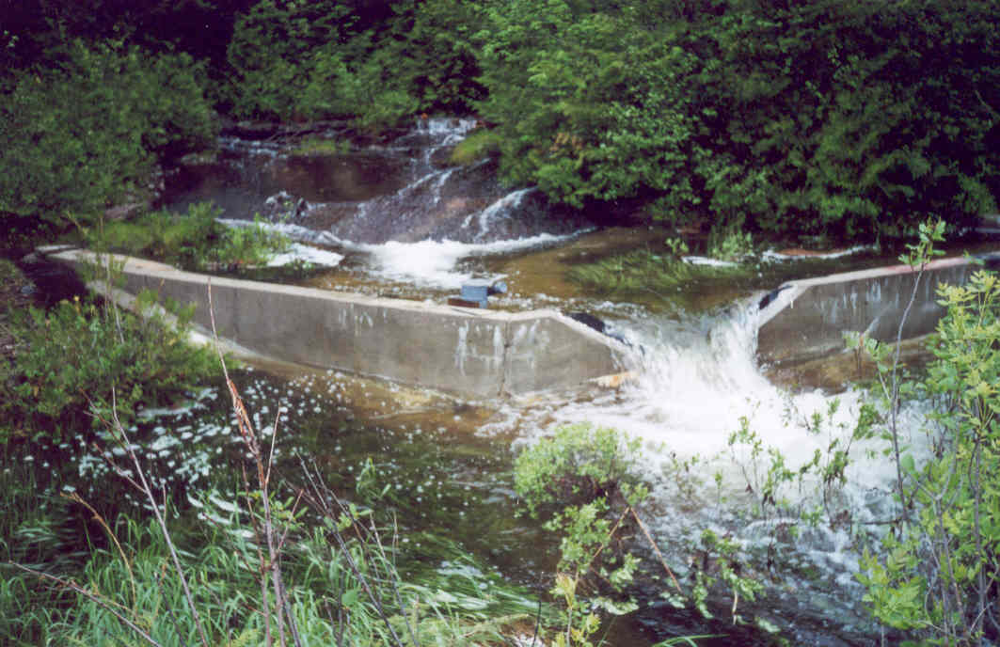

**Lake 373: Hydrometric Station Information Sheet**

Author: Ken Beaty, Paul Fafard

Last updated: July 20, 2020 (PF), 01 June 2023 (PF); 2 April 2025 (LNT)

Coordinates of control structure (to Nov 1, 2002; UTM, WGS 84): 15U 442939E 5510663N

Coordinates of control structure (from Nov 1, 2002; UTM, WGS 84): 15U 442969E 5510654N

Coordinates of water level gauge (to July 2, 2020; UTM, WGS 84): 15U 442514E 5510842N

Coordinates of water level gauge (from July 2, 2020; UTM, WGS 84): 15U 442508E 5510376N

Watershed area (ha): 82.85 ha based on 1985 mapping

88.4 ha (for current 373Q location)

XX.XX ha based on 2017 DEM\*

\* The watershed area of 373Q determined from the 2017 DEM has yet to be ground-truthed.

<u>The Watershed</u>

Lake 373 is located along the Pine Road approximately 15 km to the northwest of the ELA field station. The Pine Road crosses through the eastern edge of the watershed between lakes 373 and 375. Access to the lake is by a short (~150 m) walking trail from the Pine Road. Lake 373 is a first order headwater lake with a surface area of 27.46 ha and total watershed area of 82.85 hectares above the lake outlet. The lake outflow stream flows out through a small wetland area by a poorly defined stream segment which at times is influenced by beaver. The stream from the outlet is well defined and passes through a “perched” road culvert under the Pine Road and down to Lake 375. It may be of some importance to note that both the culvert and bedrock above the culvert likely create a barrier to fish passage. Portions of the upper watershed were previously logged in the 1980’s. Drainage areas provided are based on the topographical map produced by Airquest Resource Surveys (1985) at a scale of 1:5000 based on aerial photos taken in 1982.

<u>Hydrometric Stations</u>

There are two hydrometric stations within the Lake 373 watershed, one is a weir on the outflow stream and the other is a lake level station on the lake.

1.  Lake 373 Outflow:

Two weirs have been operated for this station since 1989 at two different locations which, although very close in proximity, result in three different internal watershed area values. Therefore, care must be taken when using the data or extrapolating it to other locations. These three watershed areas (Aw) are for the area a) above the natural lake outlet (80.2 ha), b) above the first weir location (81.9 ha) and c) above the second weir location (88.4 ha). The first weir was a 120o sharp crested v-notch concrete weir on bedrock established November 1, 1989. It was located on the west side of the Pine Road on the upstream side of the road culvert. Unfortunately, this weir was often subject to serious winter and early spring freezing that resulted in lost record. This station was relocated approximately 20 m downstream on the east side of the Pine Road. This second weir, established November 1, 2002, was a 120o sharp crested v-notch weir constructed of painted pressure treated plywood imbedded in a plastic lined gravel dike. Stage record from 1990 to 1998 was from a Leupold and Stevens Type A-71 float actuated chart recorder. In 1999 and 2000, a Stevens Type A/F Stand-Alone logger was used. Since 2001, an OTT Thalimedes data logger and float potentiometer has been used to record weir stage. The old 373 weir was removed in December 2009 at a cost of \$1000 by C.J. Edwards and sons.

OTT Thalimedes was replaced with a Sutron SDR-0001-1 on 1 July 2020 and has been in use since. Plywood walls of weir are splitting, there are plans to install a temporary weir and repair this station in 2025.

2.  Lake 373 Lake Level:

Record of lake level begins September 1989 exists for all years to present with the exception of 1997, 1998, 1999 and 2001. From 1989 until June 2002, water levels consisted of occasional manual staff gauge readings. This gauge was located on the vertical rock face on the west side of the lake opposite the boat landing. In June 2002, a new staff gauge, stilling well and OTT Thalimedes data logger and float potentiometer were installed to obtain continuous lake level record during the open water season. This installation was located in the northwest corner of the lake. This resulted in two survey benchmarks being used, one for each location. Both benchmarks were arbitrarily assigned the same “working” elevation (10.000 m, assumed datum). In 2007, all data were summarized and loaded to the main ELA database. In order to standardize the reference datum, all manual readings from the first gauge location were adjusted by a standard gauge correction (-0.204 m) and the benchmark of the second location was adopted as the correct elevation reference.

On July 2, 2020, a new staff gauge, stilling well, and Sutron SDR 0001-01 shaft-encoder type data logger were established on the east side of the lake. Benchmark elevation was transferred via water level transfer on calm day, establishing a new benchmark elevation of 9.682 m (BM \# 78, survey book A-37, p.70).

<u>Photographs</u>

Figure . Lake 373 recording lake level station installed June 4, 2002, retired July 2 2020.

Figure 2. Lake 373 Outflow weir established November 1, 1989 on the west side of the Pine Road.

Figure 3. Lake 373 Outflow weir established November 1, 2002 on the east side of the Pine Road.
