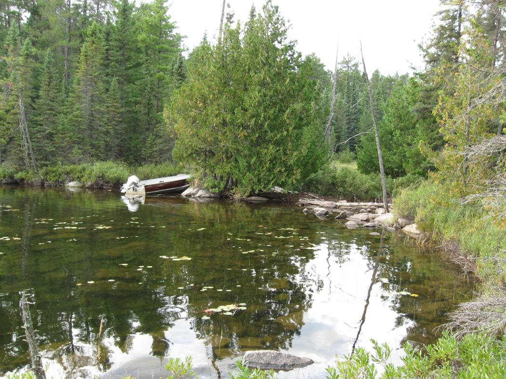

**Lake 626: Hydrometric Station Information Sheet**

Author: Ken Beaty, Paul Fafard

Last updated: July 20, 2020 (PF); 2 April 2025 (LNT)

Coordinates of control structure (UTM, WGS 84): 15U 442373E 5511650N

Coordinates of water level gauge (UTM, WGS 84): 15U 442925E 5511730N

Watershed area (ha): 372.58 ha based on 1985 mapping\*

69.2 ha based on 1985 mapping \*\*

XX.XX ha based on 2017 DEM\*\*\*

373.6 ha (full watershed) based on OFAT\*\*\*\*

76.3 ha (headwater only) based on OFAT\*\*\*\*

\* this area is pre-diversion, while Lake 626 is still a 4th order lake, directly downstream of Lake 627.

\*\* this area is during diversion. Full L626 watershed area, less L627 watershed area.

\*\*\* The headwater watershed area of 626Q determined from the 2017 DEM has yet to be ground-truthed.

\*\*\*\* Ontario Flow Assessment Tool (<https://www.ontario.ca/page/watershed-flow-assessment-tool#section-1>).

<u>Water Diversion Study</u>

Hydrological monitoring on Lake 626 began in 2008 as part of a study to look at the effects of reduced water input to a lake on the aquatic biology and chemistry of the lake as well as changes in thermal regimes and evaporation. To accomplish this, Lake 626, a 25.77 ha, fourth order lake, was transformed to a headwater lake by damming the inflow from upstream Lake 627 and diverting the runoff from the three upstream tributary lakes around the study lake by means of a constructed diversion channel. At the end of the study, the watershed will be returned to its former state and the diversion channel will be filled and the area restored.

<u>The Watershed</u>

Lake 626 (Figure 1) is located on the west side of the Pine Road approximately 13 km south of Highway 17 and 17 km north of the ELA field station. The lake is road accessible. The UTM coordinates for the lake outlet are 15U 442400E 5511400N, WGS 84 datum.

Lake 626 is a small 26 ha, 4th order lake having a total watershed area of approximately 372.38 ha and a volume of 1,772,000 m3. The lake flows out over a hard gravel and rock sill and drops approximately 1 m over a 30 m bedrock stream channel before entering a large wetland. The stream then passes through a series of wetlands and drops totaling about 17 vertical metres over a distance of about 1 km before entering downstream Lake 625. The outflow stream channel is approximately 1 m in width and 5 – 30 cm in depth. Flow previously occurred through and under an old beaver dam at the outlet. In 2008, this dam was removed to stabilize water levels about the natural sill elevation during the time frame of the water diversion study.

There are three upstream lakes tributary to Lake 626. Lakes 429 and 628 flow into Lake 627 which flows into Lake 626 under the Pine Road through a single 61 cm (24 in.) diameter culvert (Figure 1). Table 1 provides a summary of drainage areas for the watersheds of interest. The three tributary lake watersheds account for 81.5 percent of the total Lake 626 watershed area.

On November 23, 2010, the water diversion began by damming off the three upstream lakes at the outlet of Lake 627 and diverting that water through a diversion channel thereby bypassing Lake 626 and moving the flow directly to Lake 625.

Figure 1. Lake 626 Watershed and Site location for ELA Water Diversion Experiment (2008 – 20xx).

Table 1. Drainage areas for the Lake 626 watershed.

| Lake | Lake Order | Aw (ha) | Ad (ha) | At (ha) | As (ha) |
|:----:|:----------:|:-------:|:-------:|:-------:|:-------:|
| 626  |     4      |  372.4  |  69.0   |  43.2   |  25.8   |
| 627  |     3      |  303.4  |  87.5   |  51.9   |  35.6   |
| 628  |     2      |  215.9  |  150.4  |  130.3  |  20.1   |
| 429  |     1      |  65.5   |  65.5   |  49.8   |  15.7   |

Where:

- Order is the number of lakes above the outflow.

- Aw is the total watershed area including all land and water surfaces and tributary areas.

- Ad is the watershed area including land and water surface but excluding tributary areas.

- At is the terrestrial area surrounding the lake including islands.

- As is the total water surface area of the lake excluding the island areas.

<u>  
Hydrometric Stations</u>

There are two hydrometric stations within the Lake 626 watershed, one is a recording weir on the lake outflow stream and the other is a recording lake level station. The inflow from upstream Lake 627 has never been monitored.

1.  Lake 626 Outflow:

The outflow of Lake 626 is located in the northwest bay at the far end of the lake. It can be accessed either by a short boat ride across the lake or a 15-minute walk by foot trail. A 150o sharp crested v-notch weir was constructed approximately 15 m below the lake outlet in October 2008. A stage-discharge relationship has been developed and an OTT Thalimedes data logger provides stage record for the weir from April until the end of October. Periodic manual observations are taken on a monthly basis during the winter. On June 3, 2020, the OTT Thalimedes was replaced with a Sutron SDR-0001-01 shaft-encoder type data logger.

2.  Lake 626 Lake Level:

On June 26, 2008, a 6” ABS stilling well and staff gauge were installed, secured to bedrock. An OTT Thalimedes data logger was installed to obtain continuous lake level record during the open water season. On May 15, 2019, a Sutron SDR-0001-01 shaft-encoder type data logger replaced the OTT Thalimedes.

3.  Lake 626 Inflow:

Upstream lakes 429, 627 and 628 are tributary to Lake 626 and entered the lake through a single road culvert. This inflow has never been monitored. As part of the Diversion Experiment, this inflow was dammed and diverted around Lake 626 on November 23, 2010 thereby altering this lake from a 4th order to a headwater lake.

<u>Repairs/Maintenance</u>

L626Q underwent repairs from September 14, 2017 to September 22, 2017. The small wall on the southeast side was leaking, as well along the length of the v-notch wall. Repairs involved replacing wood and re-creating the southeast wall. Repairs did not completely stop the leak, though have reduced it. Photographs 7-9 are of repair.

In late summer 2018, the main weir wall and v-notch were removed and refurbished. Steel notch was sanded and repainted. New caulking was used between notch and plywood to stop water seeping underneath the notch. During most of this time the lake level was so low there was no flow. Sandbags were used to prevent flow the days ahead of the re-install. A small leak remained on the small southeast wall, which was then patched with spray foam in the summer of 2019. The weir continued to leak in 2021, specifically, at the bottom of the weir plate. There have been no records of leaks since 2021.

<u>  
Lake Bathymetry</u>

A bathymetric survey was carried out and a map created in the 1980’s. Unfortunately, that map was not dated or referenced to a water level datum. The presence of a large beaver dam at the outlet is evidence that the lake has experienced considerable water level fluctuation over the years. A survey benchmark (#60) was established in 2008 at the lake shore near the inflow from Lake 627 and assigned an arbitrary elevation of 10.000 m. A new bathymetric survey, using modern techniques, was carried out on August 22, 2010 at water level 9.080 m. MNRF also provided a bathymetric map.

<u>Photographs:</u>

Photographs 1 and 2. View of the Lake 626 outflow above and below the v-notch weir.

Photograph 3. View from downstream during initial construction of 626Q weir.

Photographs 4 and 5. 150o v-notch weir at the Lake 626 Outlet on March 24, 2009 at a head of 0.116 m and discharge of 0.022 m3/s.

Photograph 6. Lake stage logger station on Lake 626.

Photograph 7. Typical OTT Thalimedes data logger installation for lake level and flow stations.

Photograph 8. 2017 repair; weir stripped back to wood and seams were freshly caulked

Photograph 9. Old poly was removed and replaced with new poly.

Photograph 10. Southeast wall was installed (new material), and poly was covered in sand and gravel. All visible seams were freshly caulked with Vulkem 116.
