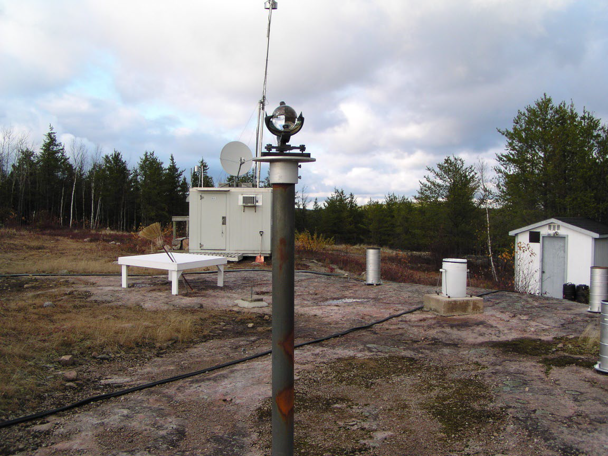
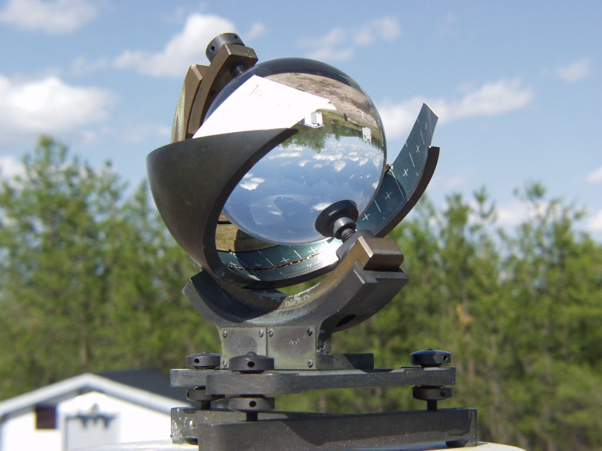

# Meteorology – Bright Sunshine – Information Sheet
Authors: Ken Beaty, Paul Fafard, Ken Sandilands  

## Contents
- [General information](#general-information)
- [Methods](#methods)
  * [Site location](#site-location)
  * [Collection methods](#collection-methods)
- [Data dictionary](#data-dictionary)
- [References](#references)
- [Photos](#photos)

<!-- # IISD-ELA Database Fields for Bright Sunshine:
\*\*Bright sunshine data is not currently in the database, though the dataset exists from 1969 to present \*\*  
Date (calendar day)  
Location ID, Sublocation, Station ID  
Total hours  
Data Set ID = -->

## General information

Bright sunshine record at the Experimental Lakes Area began in July 1969. In all years, data was measured using the same methods and protocol as well as the same instrument in the same location. Based on the 30-year ‘Normal’ for Canada for the period 1941 to 1970, the Experimental Lakes Area can expect to receive approximately 2000 hours of ‘bright sunshine’ each year (Environment Canada). The ‘duration of bright sunshine’ is defined as the duration of sunshine of sufficient intensity to scorch or burn the standard sunshine card installed in the Campbell-Stokes Sunshine Recorder. The duration of bright sunshine does not refer to the period during which the sun is visible to the human eye.

Year-round bright sunshine was recorded up to fall 2017 (the great snowstorm of 2017); bright sunshine has been recorded only during the open-water season in 2018, overlapping with the calculated method.

Since April 27, 2018 bright sunshine has been measured and recorded on a Campbell Scientific CR1000 datalogger.

## Methods

### Site Location

The IISD-ELA meteorological station ("METSITE" in the data tables) is land based and is located 370 m west of Rawson Lake (L239), 400 m northwest of the field station, and 43 m above the lake surface. Altitude above sea level is 433m.

UTM Coordinates:
* 15 U 0447128 5501551 (NAD83)  
* 15 U 0447138 5501331 (NAD27)  

DMS Coordinates:
* 49°39′51″ N
* 93°43′58″ W

### Collection Methods

<u>Campbell-Stokes Bright Sunshine Recorder</u>

Data was collected with a Campbell-Stokes Bright Sunshine Recorder. This instrument consists of an optical glass sphere that focuses the rays of the sun onto a curved, specially treated burn-chart. A trace is recorded on the chart only when the sun is at an angle greater than 3 degrees elevation and completely unobstructed by haze, smoke, fog or cloud. Charts are changed every evening in order to receive the sun for the next day. In winter, the device was inspected early each morning and cleared of any snow or frost. The data are hand-scaled from charts and compiled as hourly and daily values. The times which are used for reporting hours of sunshine are those which are shown on the sunshine cards. These times correspond to the local apparent time for the station. The EC report ‘Manual of Standard Procedures for Obtaining Sunshine Data’ provides complete instructions for instrument maintenance, adjustments and data abstracting.

This instrument is a duration sunshine recorder only and provides no information about the actual solar energy received at the site. Data has been archived within the ELA Database and is also contributed to the Ontario Climate Centre of Environment Canada. While collection of this data by Environment Canada ended around 2005, we have continued this data set at the ELA in the interest of climate change science.

>“It continues to be a most elegant and interesting example of scientific instrumentation that still fascinates all who are lucky enough to see it.”- Ken Beaty, date unknown.

<u>Maximum possible hours of sunshine</u>

One useful way to express this data is as a percentage of the maximum possible hours of “bright” sunshine. The maximum possible will vary according to latitude.

Monthly maximum hours possible at the ELA site are provided in the following table. Daily maximums can be computed but are not listed here.

| Month     | Maximum Possible Hours\* |
|-----------|--------------------------|
| January   | 267.0                    |
| February  | 281.5                    |
| March     | 317.5                    |
| April     | 412.9                    |
| May       | 477.3                    |
| June      | 488.9                    |
| July      | 492.6                    |
| August    | 448.5                    |
| September | 379.4                    |
| October   | 334.2                    |
| November  | 273.0                    |
| December  | 253.3                    |
| Total     | 4426.1 h                 |
\* Environment Canada

<u>Calculated Bright Sunshine</u>

The Sunshine Hours sensor module is used to calculate the number of sunshine hours based on a site's solar radiation measurement and its location. In this instance, sunshine hours is defined as when the current global radiation is higher than 0.4 times the current potential solar radiation outside the earth's atmosphere. This calculation is done by the CR1000 Campbell Scientific datalogger, and uses the Total Solar Radiation sensor. The potential solar radiation is calculated by the datalogger by using the SolarPosition function which calculates the maximum real time potential solar radiation possible based on the latitude and longitude, elevation, air temperature, and the sun angle.

## Data dictionary

Coming soon...

## References

Sunshine – Manual of Standard Procedures For Obtaining Sunshine Data. January 1974. Environment Canada. Atmospheric Environment Service. U.D.C. 551.508.23

Sunshine Hours – Campbell Scientific Short Cut help menu/ user manual.

## Photos

