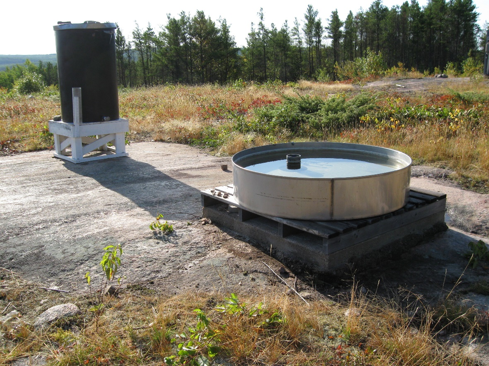
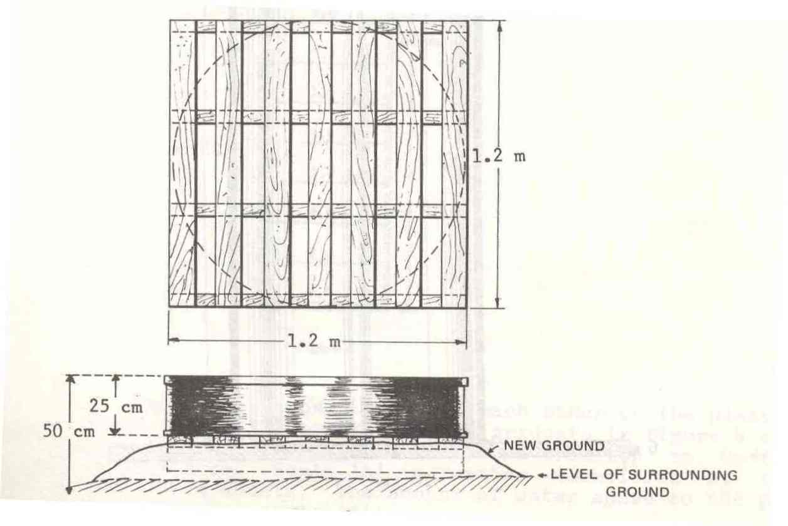
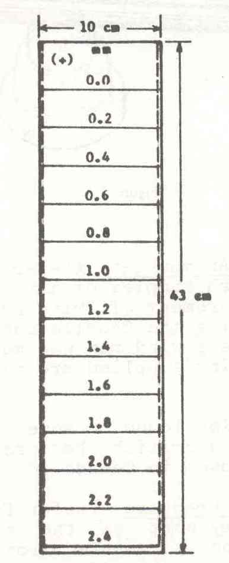
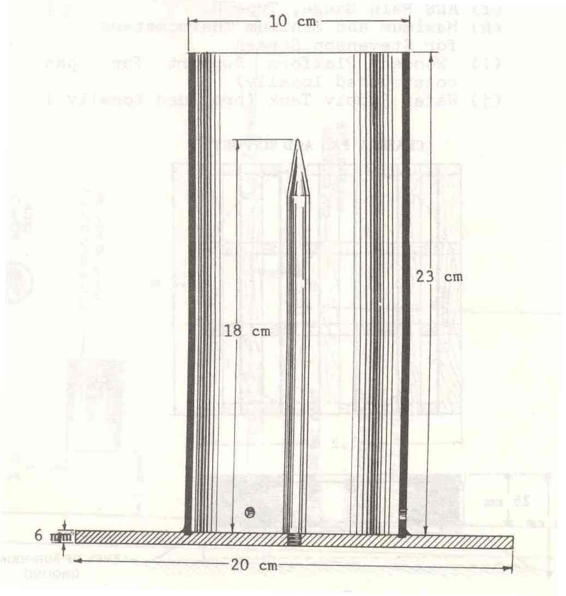
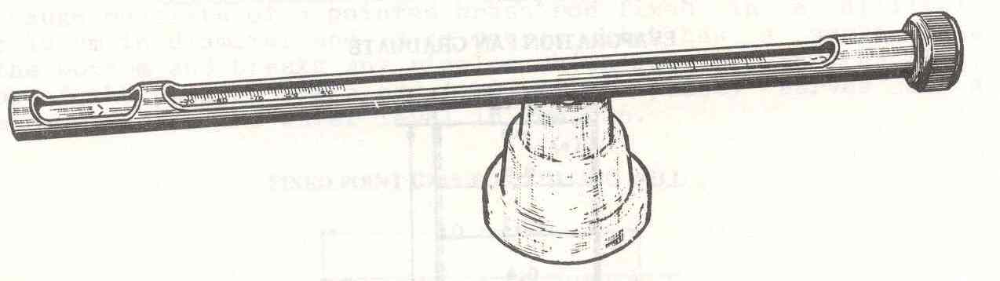
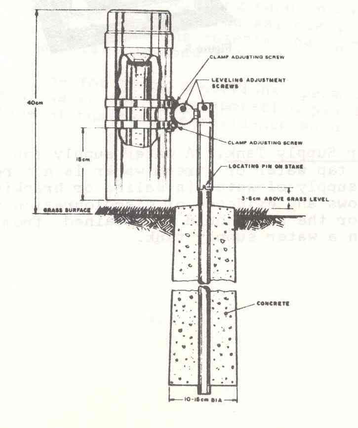
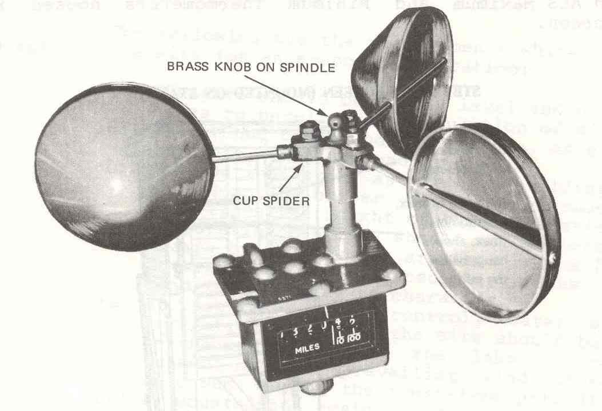

# Meteorology – Evaporation Pan – Information Sheet
Authors: Ken Beaty, Paul Fafard, Ken Sandilands  

## Contents
- [General information](#general-information)
- [Methods](#methods)
  * [Site Location](#site-location)
  * [Collection methods](#collection-methods)
  * [Pan coefficients](#pan-coefficients)
  * [Collection method codes](#collection-method-codes)
- [Data dictionary](#data-dictionary)
- [References](#references)
- [Photos and figures](#photos-and-figures)

<!-- # IISD-ELA Database Fields for Evaporation:
Location ID, Sublocation ID, Station ID  
Evaporation Day  
Net pan water loss for day (mm)  
Daily wind run (Km)  
Maximum Pan Water Temp  
Minimum Pan Water Temp  
Maximum Air Temp  
Minimum Air Temp  
Qualifier Code  
Collection Authority  
Collection Method  
Data Set ID = H06   -->

## General information

The problem of measuring and calculating evaporation and transpiration from lakes, forests and entire drainage basins is a difficult one. Methods rely on indirect measurements or empirical calculations of evaporation. Four methods of determining lake surface evaporation have been or are presently being used in hydrologic studies at the Experimental Lakes Area (ELA):

1.  solving for lake evaporation as the residual term in Rawson Lake water budgets
2.  the energy budget approach
3.  empirical mass transfer techniques, and
4.  the evaporation pan

Of these four methods, the evaporation pan has probably been the most commonly used in the world (Bruce and Clark 1966).

Evaporation pans can be installed in three ways: floating on the lake, sunk in the ground, and installed on a low stand above ground. The first method more closely simulates surface temperature, wind and radiation effects, but is not practical with respect to servicing. The second is impractical because of potential problems of soil temperature, undetected leaks, wind exposure, and overgrown vegetation. Most pans are installed the third way, on a low stand above the ground in an exposed clearing.

## Methods

### Site Location

The IISD-ELA meteorological station ("METSITE" in the data tables) is land based and is located 370 m west of Rawson Lake (L239), 400 m northwest of the field station, and 43 m above the lake surface. Altitude above sea level is 433m.

UTM Coordinates:
* 15 U 0447128 5501551 (NAD83)  
* 15 U 0447138 5501331 (NAD27)  

DMS Coordinates:
* 49°39′51″ N
* 93°43′58″ W

### Collection methods

The evaporation pan at ELA is located at the meteorological station (Station 1). It is a U.S. Weather Bureau Class A pan which was adopted as an interim international standard for the International Geophysical Year (1957-1957), is recommended by the World Meteorological Organization, and is the standard that has been used in Canadian Atmospheric Environment Services sites. The pan is serviced each day according to the protocol described in the service manual “Evaporation – Manual of Standard Procedures for Obtaining Evaporation Data, May 1978, Environment Canada, Atmospheric Environment Service”.

The Class A pan is 122 cm in diameter, 25 cm in depth and made of non-corrosive metal. It is installed in an open site on a low stand that permits free air circulation under and around the pan. Each morning, the water level in the pan is adjusted to a standard height determined by a fixed point gauge. The depth of water added or removed is added to, or subtracted from, the depth of precipitation that may have occurred, and a daily net water loss is calculated. A totalizing anemometer, installed near the pan at a height of 1m, records the wind run passing directly over the pan each day. Mean air and water temperatures were calculated from observations from maximum and minimum thermometers in the pan and in the nearby Stevenson Screen instrument shelter. This wind and temperature data can be used to correct the pan evaporation for advected energy as suggested by Kohler et al. (1955). This correction is generally quite small.

The ELA evaporation pan was serviced daily at 08:00 central standard time (CST). Therefore dates in the database are for an “evaporation day” beginning after the morning observation and ending at the time of the morning observation of the next day. For example, readings taken on July 15 are recorded as the evaporation of July 14.

The Net pan water loss for day (mm) is the amount of water added (or removed) from the pan each day plus the rainfall amount that occurred over the evaporation day. In some cases where there has been a large amount of rain, the net pan loss for the day is negative, meaning the amount of rain was greater than the evaporation for that day.

### Pan coefficients

In order to convert evaporation pan data to lake evaporation, a conversion factor known as a pan coefficient is required. The pan coefficient is equal to the ratio of lake evaporation to pan evaporation. Several different investigators have shown that the annual pan coefficient is less than unity, ranging from 0.6 to 0.8 (Hounam 1973). Our investigations at ELA using Rawson Lake water budgets from 1972 to 1976 yield an average annual pan coefficient of 0.64 for data uncorrected for advected energy, and 0.70 for corrected data (Newbury and Beaty 1977).

Monthly pan coefficients for Rawson Lake based on water budget evaporation varied from 0.30 to 1.10 (Newbury and Beaty 1977). For this reason the pan method is not recommended for weekly or monthly evaporation estimates. This is because the lake and the pan do not behave in exactly the same way throughout the open water season. The pan is small in relation to the lake and its water temperature fluctuates closely with the air temperature. The heat storage capacity of lakes is important, and evaporation is not closely related to daily solar energy received. In the fall season, large amounts of lake evaporation occur when surface temperatures are much higher than the air temperatures. The opposite takes place during the late spring, when the lake evaporation is low due to low surface temperatures.

### Collection method codes

> EV1 – Currently used for all data.

Evaporation pan records at ELA began on June 27, 1969 and are continuing. Data resides in the main ELA data base and has also been contributed to the Environment Canada, Ontario Climate Centre, however, in 2005 EC ended their interest in this data. Observations before 1979 were made in English units (inches, o F and miles) and converted for the data base. Corrections for advected energy and pan coefficients have not been applied. The periods of observation or measurements in each case are always less than the ice-free period or open water season for Rawson Lake. This is because the pan record must be discontinued once freezing temperatures are common. While it may be assumed that evaporation from the pan and lake are low during the late October period of missing record, it is at the discretion of the user as to whether adjustments for this unaccounted period are warranted.

Pan water temperature monitoring was discontinued after the 2007 season.

Maximum and minimum air temperature data for the evaporation pan data table are climatological daily max/min values. These data were collected using method code VT1 until the end of the 2017 season. For 2018 to 2022, data were based on hourly avg max and min data using method code VT4. For 2023 and going forward, maximum and minimum daily air temperatures were collected using method code VT5, and are from 1 minute data.

## Data Dictionary

 **Column name (alphabetical)** | **data type** | **unit** | **definition** 
---|---|---|---
 account | character varying | N/A | Username of the IISD-ELA staffmember who added or most recently edited the data record. This may be generated through bulk loads or manually updated as records are edited individually. 
 comments | character varying | N/A | Remarks about the record or its collection. 
 daily_wind_run | numeric | km | The speed of the air passing over the evaporation pan, measured as a daily mean in kilometres. Measured via a totalizing anemometer installed near the pan at a height of 1 metre. Wind and temperature data can be used to correct pan evaporation for advected energy, but the correction is usually small. See the info sheet for more information. 
 dataset_code | character varying | N/A | A three character code made up of upper case letters and numbers unique for each IISD-ELA dataset. Should always start with a letter and may or may not end with a number. Used as a short consistent abbreviation for the dataset, whereas dataset_name is longer and may be changed and refined over time. 
 dataset_name | character varying | N/A | Name of the dataset. A dataset is a collection of data to which several individual data records (rows) belong. Dataset names are useful to distinguish groups of data across different research fields and provide some descriptive context. 
 date | date | N/A | The calendar or climatological day (YYYY-MM-DD) for the associated record, indicating when the observation, measurement, sample collection, or other recording method happened. All air temperature and precipitation datasets from IISD-ELA are based on the climatological day (at IISD-ELA, 8AM CST is used as the start of the climatological day) using the Meteorological Service of Canada’s definition of climatological day (see the info sheets for more information). Other datasets use regular calendar days. 
 max_air_temp | numeric | degrees Celsius | Maximum air temperature value over the calendar day (during the 24hrs after 8AM on the date of the record). 
 max_pan_water_temp | numeric | degrees Celsius | Maximum daily temperature of the water in the evaporation pan, measured with a thermometer. Wind and temperature data can be used to correct pan evaporation for advected energy, but the correction is usually small. See the info sheet for more information. 
 method_sample_code_air_temp | character varying | N/A | A short and unique code associated with a description of a method of sampling for data (i.e., how the physical sample was collected or measured in the field). Since the evaporation data table includes both air temperature and evaporation data, this sample code refers specifically to the air temperature data. 
 method_sample_code_evap | character varying | N/A | A short and unique code associated with a description of a method of sampling for data (i.e., how the physical sample was collected or measured in the field). Since the evaporation data table includes both air temperature and evaporation data, this sample code refers specifically to the evaporation data. 
 method_sample_desc_air_temp | character varying | N/A | A short description of the method used to sample the data (collect or measure the data, in a field or lab environment). Since the evaporation data table includes both air temperature and evaporation data, this sample code refers specifically to the air temperature data. 
 method_sample_desc_evap | character varying | N/A | A short description of the method used to sample the data (collect or measure the data, in a field or lab environment). Since the evaporation data table includes both air temperature and evaporation data, this sample code refers specifically to the evaporation data. 
 min_air_temp | numeric | degrees Celsius | Minimum air temperature value over the calendar day (during the 24hrs after 8AM on the date of the record). 
 min_pan_water_temp | numeric | degrees Celsius | Minimum daily temperature of the water in the evaporation pan, measured with a thermometer. Wind and temperature data can be used to correct pan evaporation for advected energy, but the correction is usually small. See the info sheet for more information. 
 monitoring_location_name | character varying | N/A | Name of sampled or surveyed geographic location at the IISD Experimental Lakes Area field site. 
 net_pan_water_loss_for_day | numeric | mm | The net pan water loss for day (mm) is the amount of water added (or removed) from the evaporation pan each day plus the rainfall amount that occurred over the evaporation day. In some cases where there has been a large amount of rain, the net pan loss for the day is negative, meaning the amount of rain was greater than the evaporation for that day. 
 update_date | date | N/A | Date as calendar day that the record in the IISD-ELA Postgres Master Database table was uploaded to the database or most recently modified. 
 version | numeric | N/A | The version number for a row of data is 1 when it is first added to a table, and increments by 1 every time the row is updated. 

## References

BRUCE, J. P., and R. H. CLARK. 1966. Introduction to hydrometeorology. 319 p.

EVAPORATION – Manual of Standard Procedures for Obtaining Evaporation Data, May 1978, Environment Canada, Atmospheric Environment Service.

HOUNAM, C. W. 1973. Comparison between pan and lake evaporation. WMO Tech. Note 126, WMO No. 354: 52 p.

KOHLER, M. A., T. J. NORDENSEN, and W. E. FOX. 1955. Evaporation from pans and lakes. U. S. Weather Bur. Tech. Pap. 38.

NEWBURY, R. W., and K. G. BEATY. 1977. Water budgets in small Precambrian lake basins in northwestern Ontario Canada. P. 132-139. *In* Second Conference on Hydrometeorology, October 25-27, 1977, Toronto, ON. American Meteorology Society, Boston, MA.

## Photos and figures

<figure>

<figcaption>
<strong>Figure 1:</strong> Evaporation pan in operation
</figcaption>
</figure>
 

<figure>

<figcaption>
<strong>Figure 2:</strong> Class 'A' evaporation pan and support
</figcaption>
</figure>
 

<table>
  <tr>
    <td></td>
    <td></td>
  </tr>
  <tr>
    <td align="center">Graduate</td>
    <td align="center">Point Gauge</td>
  </tr>
</table>

<strong>Figure 3:</strong> Evaporation pan graduate (left) and fixed point gauge in stilling well (right)

 

<figure>

<figcaption>
<strong>Figure 4:</strong> Stand for max. and min. thermometers; no longer in use.
</figcaption>
</figure>
 

<figure>

<figcaption>
<strong>Figure 5:</strong> Rain gauge type B (large capacity)
</figcaption>
</figure>
 

<figure>

<figcaption>
<strong>Figure 6:</strong> Cup counter anemometer
</figcaption>
</figure>
 
