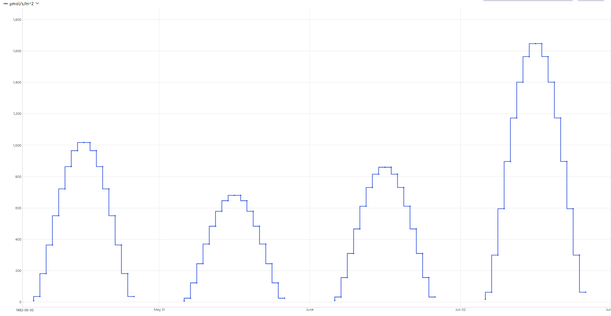
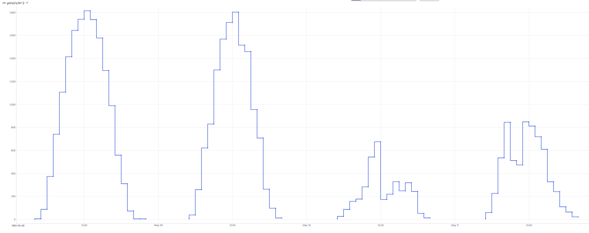

# Meteorology – Solar Radiation – Information Sheet
Authors: Ken Sandilands, Paul Fafard

## Contents
- [General information](#general-information)
- [Methods](#methods)
  * [Site Location](#site-location)
  * [Instrumentation](#instrumentation)
  * [Historical Data Collection](#historical-data-collection)
- [Data Dictionary](#data-dictionary)

<!--## IISD-ELA Database Fields for Solar Radiation:
PAR (Photosynthetically Active Radiation)  
PAR_den - 15 min averages (µmol/s/m²)  
PAR_Tot - Totalized 15 min values (mmol/m²)  
Total Solar Radiation  
Hourly and 15 min averages (Watts/m^2)  
Totalized for hourly and 15 mins (KJoules/m^2)  
Bright Sunshine  
SunHours – 15 min and hourly totals (hrs)  
Environment Canada public data for IISD Experimental Lakes Area found below:  
Rawson Lake (AUT): <https://tinyurl.com/ELAmetsite> -->

## General information

There are four IISD-ELA solar radiation datasets:
* Bright sunshine (as of writing, some information is in this info sheet, but some is in the separate bright sunshine info sheet)
* Total solar radiation
* PAR (Photosynthetically Active Radiation, a.k.a. PAR; in the air, vs. PAR profiles collected in lakes, which are part of the limnology datasets)
* UV A B

## Methods

### Site Location

The IISD-ELA meteorological station ("METSITE" in the data tables) is land based and is located 370 m west of Rawson Lake (L239), 400 m northwest of the field station, and 43 m above the lake surface. Altitude above sea level is 433m.

UTM Coordinates:
* 15 U 0447128 5501551 (NAD83)  
* 15 U 0447138 5501331 (NAD27)  

DMS Coordinates:
* 49°39′51″ N
* 93°43′58″ W

### Instrumentation

Solar radiation is measured at the IISD-ELA metsite and recorded on a Campbell Scientific CR1000 datalogger which takes measurements every 5 seconds and calculates averages and totalizes as listed above. Solar radiation is measured continuously year round, however snow buildup on the sensors may affect readings. Snow is cleaned off the sensors daily during the morning metsite check (~ 08:00 CST ± 1 hour).

PAR is measured with a Licor quantum sensor (LI-190R) connected to the data logger via a 604 ohm millivolt adapter (2290) and is calibrated every two years by Licor.

Total Solar Radiation is measured with a pyranometer (Kipp & Zonen SP Lite) and is calibrated every two years.

Bright sunshine (SunHours) is calculated by the CR1000 datalogger using the total solar radiation as a reference. Sun hours are calculated based on solar position which takes into account longitude and latitude, time of day, solar azimuth, solar elevation above horizon, declination, air pressure, air temperature, altitude, and air mass coefficient.

### Historical Data Collection

<u>Total Solar Radiation</u>

Total Solar Radiation data start on 2012-11-09 there is no data prior to this date.

<u>PAR</u>

Over the years there have been several research groups/staff in charge of collecting the PAR data at the metsite, which has resulted in datasets collected with differing units, intervals, and sensors.

As of 2008-10-16 the PAR sensor has been on a CR1000 Campbell Scientific datalogger, and collected consistently at 15 min intervals, continuously (year-round, and during the night), with units of µmol/s/m². Since this setup, the data are more reliable, and there are no time shift issues.

Prior to 2008-10-16, it isn’t clear who collected the PAR data, and how it was collected. Likely a Licor sensor was used paired with a Licor datalogger. PAR data starts on 1973-04-15 and was only collected during daylight hours during the open water seasons. From 1973 to 1982 it appears that perhaps only a maximum daily PAR value was recorded and the data are fitted equally on each side of the daily maximum, as each day has uniform raise and fall but with differences in peaks between days:

Starting in 1983, it appears that there are true 30min values since the daily plot of the values is not always raising and falling at a constant rate:

It is assumed that the 30 min data starts in 1983 as the peaks are no longer uniform and prior to this, the data are only daily maximums.

<u>Time drift problems</u>

Prior to 2008 there are parts of the data where it appears that there have been some time drift problems, which could be due to errors, mismatch between dataloggers and download computers, equipment mistakenly set to DST instead of CST, and time drift of early dataloggers. Parts of these data have been adjusted using the clock drift tool in Aquarius Time Series software in an attempt to line up the data with solar noon for Kenora as provided by NRC for the entire period. These time corrections are tricky as it isn’t possible to line up the peak daily PAR with solar noon on cloudy days, and it is difficult to determine when a block of data needs to be started/ended due to cloudy days. For a list of time corrections made to the data, see table below.

|  | **Category** | **Type** | **Processing priority** | **Comment or Note** | **Start** | **End** | **Created** | **Created by** | **Tags** |
|----|----|----|----|----|----|----|----|----|----|
|  | Correction | Override | Normal | Override: Clock Drift‌ Start offset: 60:00.‌ End offset: 60:00.‌ | 2004-05-05 16:00:00 | 2004-06-07 19:00:00 | 2023-12-01 10:13:59 | Julie |  |
|  | Correction | Override | Normal | Override: Clock Drift‌ Start offset: 30:00.‌ End offset: 30:00.‌ | 2003-09-18 06:00:00 | 2003-10-06 17:30:00 | 2023-12-01 10:10:02 | Julie |  |
|  | Correction | Override | Normal | Override: Clock Drift‌ Start offset: 30:00.‌ End offset: 30:00.‌ | 2003-07-19 04:00:00 | 2003-09-04 18:30:00 | 2023-12-01 10:08:27 | Julie |  |
|  | Correction | Override | Normal | Override: Clock Drift‌ Start offset: 30:00.‌ End offset: 30:00.‌ | 2003-06-23 03:30:00 | 2003-07-02 20:00:00 | 2023-12-01 10:06:25 | Julie |  |
|  | Correction | Override | Normal | Override: Clock Drift‌ Start offset: 30:00.‌ End offset: 30:00.‌ | 2003-06-14 03:30:00 | 2003-06-20 18:30:00 | 2023-12-01 10:05:16 | Julie |  |
|  | Correction | Override | Normal | Override: Clock Drift‌ Start offset: 30:00.‌ End offset: 30:00.‌ | 2003-06-10 03:30:00 | 2003-06-10 20:30:00 | 2023-12-01 10:04:23 | Julie |  |
|  | Correction | Override | Normal | Override: Clock Drift‌ Start offset: 30:00.‌ End offset: 30:00.‌ | 2003-05-22 04:00:00 | 2003-05-22 20:00:00 | 2023-12-01 10:03:19 | Julie |  |
|  | Correction | Override | Normal | Override: Clock Drift‌ Start offset: 30:00.‌ End offset: 30:00.‌ | 2003-01-13 07:30:00 | 2003-01-27 16:30:00 | 2023-12-01 09:58:02 | Julie |  |
|  | Correction | Override | Normal | Override: Clock Drift‌ Start offset: 60:00.‌ End offset: 60:00.‌ | 2003-01-11 07:00:00 | 2003-01-12 16:00:00 | 2023-12-01 09:57:26 | Julie |  |
|  | Correction | Override | Normal | Override: Clock Drift‌ Start offset: 30:00.‌ End offset: 30:00.‌ | 2003-01-10 07:30:00 | 2003-01-10 16:30:00 | 2023-12-01 09:57:01 | Julie |  |
|  | Correction | Override | Normal | Override: Clock Drift‌ Start offset: 30:00.‌ End offset: 30:00.‌ | 2002-11-22 07:30:00 | 2002-12-02 16:00:00 | 2023-12-01 09:55:18 | Julie |  |
|  | Correction | Override | Normal | Override: Clock Drift‌ Start offset: 30:00.‌ End offset: 30:00.‌ | 2002-10-31 07:00:00 | 2002-11-10 16:30:00 | 2023-12-01 09:54:16 | Julie |  |

## Data Dictionary

Only the PAR dataset has a data dictionary ready at this time. Others will be added in future.

**Column name (alphabetical)** | **data type** | **unit** | **definition** | **dataset(s)** 
---|---|---|---|---
 account | character varying | N/A | Username of the IISD-ELA staffmember who added or most recently edited the data record. This may be generated through bulk loads or manually updated as records are edited individually. | Solar PAR (air) 
 dataset_code | character varying | N/A | A three character code made up of upper case letters and numbers unique for each IISD-ELA dataset. Should always start with a letter and may or may not end with a number. Used as a short consistent abbreviation for the dataset, whereas dataset_name is longer and may be changed and refined over time. | Solar PAR (air) 
 dataset_name | character varying | N/A | Name of the dataset. A dataset is a collection of data to which several individual data records (rows) belong. Dataset names are useful to distinguish groups of data across different research fields and provide some descriptive context. | Solar PAR (air) 
 date | date | N/A | The calendar or climatological day (YYYY-MM-DD) for the associated record, indicating when the observation, measurement, sample collection, or other recording method happened. All air temperature and precipitation datasets from IISD-ELA are based on the climatological day (at IISD-ELA, 8AM CST is used as the start of the climatological day) using the Meteorological Service of Canada’s definition of climatological day (see the info sheets for more information). Other datasets use regular calendar days. | Solar PAR (air) 
 gear_type_code | character varying | N/A | A short code that refers to a specific gear type, typically starting with two or three capital letters and ending with one number. | Solar PAR (air) 
 gear_type_desc | character varying | N/A | A short description of the type of gear (equipment used for sampling or surveying). | Solar PAR (air) 
 monitoring_location_name | character varying | N/A | Name of sampled or surveyed geographic location at the IISD Experimental Lakes Area field site. | Solar PAR (air) 
 par_umol_s_m2 | text | micromoles per second per square metre | The value of photosynthetically active radiation (PAR) density. Note that although the value is stored as text, it is actually a numeric value. | Solar PAR (air) 
 qualifiers | character varying | N/A | Qualifier code(s) conveying specific information about the record. See the associated info sheets for more information. | Solar PAR (air) 
 sensor_code | character varying | N/A | Sensor code for the solar PAR sensor. Refers to a record in the gear reference table with more information. | Solar PAR (air) 
 sensor_desc | character varying | N/A | Sensor description for the solar PAR sensor. | Solar PAR (air) 
 time | time without time zone | HH:MM:SS | The time the field sampling or surveying activity was carried out to collect the data in the record. | Solar PAR (air) 
 update_date | date | N/A | Date as calendar day that the record in the IISD-ELA Postgres Master Database table was uploaded to the database or most recently modified. | Solar PAR (air) 
 version | numeric | N/A | The version number for a row of data is 1 when it is first added to a table, and increments by 1 every time the row is updated. | Solar PAR (air) 

