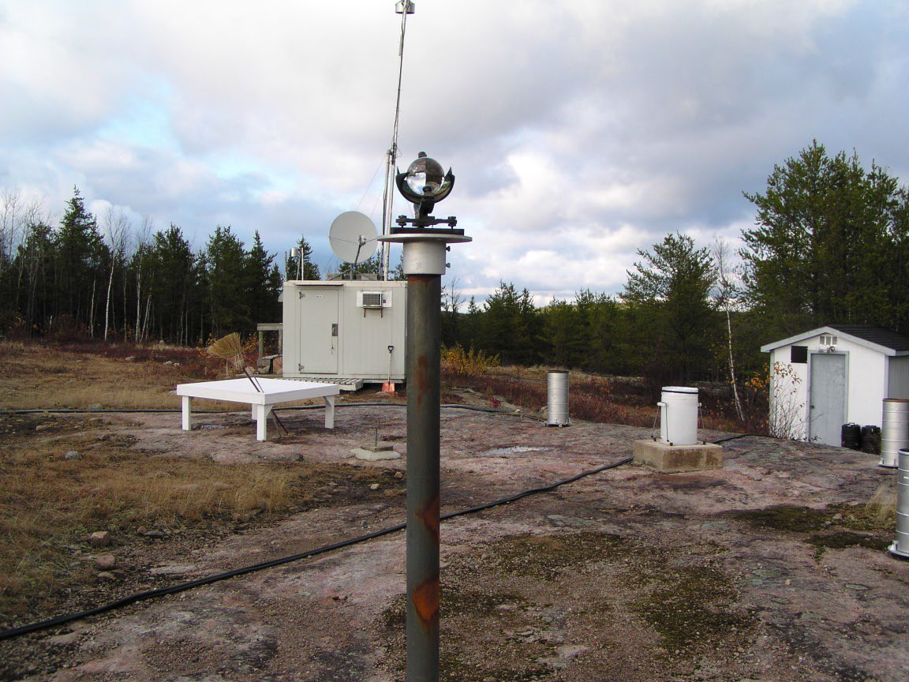
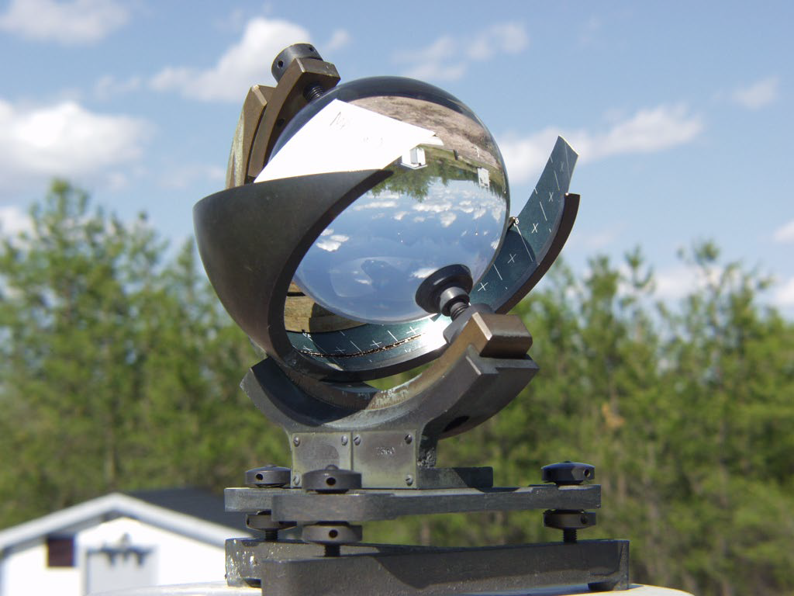
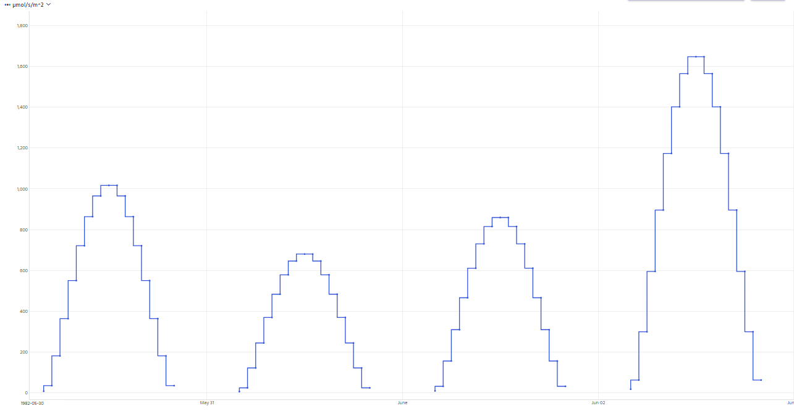
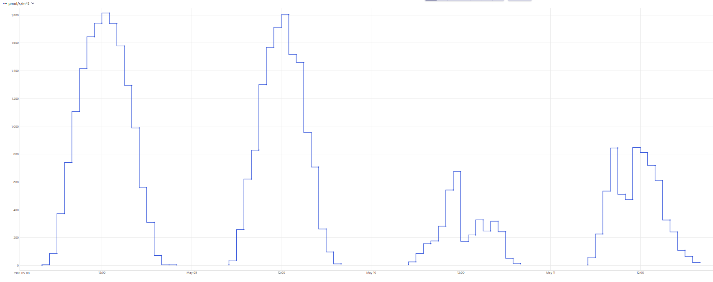

# Meteorology – Solar Radiation – Information Sheet
Authors: Ken Sandilands, Paul Fafard; Edited by Chris Hay and Idil Yaktubay

## Contents
- [General information](#general-information)
- [Methods](#methods)
  * [Site Location](#site-location)
  * [Instrumentation (current)](#instrumentation-current)
  * [Historical Data Collection](#historical-data-collection)
  * [Quality Control and Corrections](#quality-control-and-corrections)
- [Data Dictionary](#data-dictionary)
- [References](#references)

## General information

There are four IISD-ELA solar radiation datasets:
* **Bright sunshine** (rarely also called "sun hours" or "sunshine hours")
* **Total solar radiation (TSR)**
* **Photosynthetically Active Radiation (PAR)** — That is, PAR in the air at the meteorological station, vs. PAR profiles collected in lakes, which are part of our limnology datasets.
* **UV A B (Ultraviolet A & B)**

### Considerations and Applications

At present, the notes in this section are regarding only bright sunshine data.

<u>Maximum possible hours of sunshine</u>

Based on the 30-year ‘Normal’ for Canada for the period 1941 to 1970, the Experimental Lakes Area can expect to receive approximately 2000 hours of ‘bright sunshine’ each year (Environment Canada). The ‘duration of bright sunshine’ is defined as the duration of sunshine of sufficient intensity to scorch or burn the standard sunshine card installed in the Campbell-Stokes Sunshine Recorder. The duration of bright sunshine does not refer to the period during which the sun is visible to the human eye.

One useful way to express this data is as a percentage of the maximum possible hours of “bright” sunshine. The maximum possible will vary according to latitude.

Monthly maximum hours possible at the ELA site are provided in the following table. Daily maximums can be computed but are not listed here.

| Month     | Maximum Possible Hours\* |
|-----------|--------------------------|
| January   | 267.0                    |
| February  | 281.5                    |
| March     | 317.5                    |
| April     | 412.9                    |
| May       | 477.3                    |
| June      | 488.9                    |
| July      | 492.6                    |
| August    | 448.5                    |
| September | 379.4                    |
| October   | 334.2                    |
| November  | 273.0                    |
| December  | 253.3                    |
| Total     | 4426.1 h                 |
Source: Environment Canada

## Methods

### Site Location

The IISD-ELA meteorological station ("METSITE" in the data tables) is land based and is located 370 m west of Rawson Lake (L239), 400 m northwest of the field station, and 43 m above the lake surface. Altitude above sea level is 433m. All four solar radiation datasets are collected at this location.

UTM Coordinates:
* 15 U 0447128 5501551 (NAD83)  
* 15 U 0447138 5501331 (NAD27)  

DMS Coordinates:
* 49°39′51″ N
* 93°43′58″ W

### Instrumentation (current)

Solar radiation (in general, across all four datasets) is measured at the IISD-ELA metsite and recorded on a Campbell Scientific CR1000 datalogger. The data logger takes measurements every 5 seconds, calculates averages, and totalizes. Solar radiation is measured continuously year round, however snow buildup on the sensors may affect readings. Snow is cleaned off the sensors daily during the morning metsite check (~ 08:00 CST ± 1 hour).

**PAR** is measured with a Licor quantum sensor (LI-190R) connected to the data logger via a 604 ohm millivolt adapter (2290) and is calibrated every two years by Licor.

**Total Solar Radiation** is measured with a pyranometer (Kipp & Zonen SP Lite) and is calibrated every two years. The dataset starts on 2012-11-09 and data were not collected with a different historical method prior to that date.

**Bright sunshine** (sunshine hours) is calculated by the CR1000 Campbell Scientific data logger (sunshine hours sensor module) using the data from the Total Solar Radiation sensor as a reference. The data logger uses the SolarPosition function, which calculates the maximum real time potential solar radiation possible. That is based on solar position, which takes into account latitude and longitude, elevation, time of day, solar azimuth (compass direction of sun), solar elevation above horizon (sun angle), declination, air pressure, air temperature, altitude, and air mass coefficient.

In this instance, sunshine hours is defined as when the current *global* radiation is higher than 0.4 times the current *potential* solar radiation outside the earth's atmosphere.

This modern method was used starting April 27, 2018, overlapping with the historical method (see below section) for comparison during the 2018 open water season, with the historical method being fully replaced with the modern method after that point.

**UV AB** (ultraviolet A & B) is measured with an on-site UV sensor, however, details regarding the specific gear or logger used to collect UV AB data are currently unavailable and will be added once provided by the IISD-ELA Hydrolim team.

### Historical Data Collection

**Bright Sunshine**

Bright sunshine data was collected with the historical method year-round from July 1969 through to fall 2017 (when there was a large snowstorm at the site). It was also collected in 2018 but only in the open water season of 2018, at which point this historical collection method was overlapping with the current modern method. Across all those years (1969-2018), the historical data was measured using the same methods and protocol, the same instrument, and in the same location.

Data was collected with a Campbell-Stokes Bright Sunshine Recorder. This instrument consists of an optical glass sphere that focuses the rays of the sun onto a curved, specially treated burn-chart. A trace is recorded on the chart only when the sun is at an angle greater than 3 degrees elevation and completely unobstructed by haze, smoke, fog or cloud. Charts are changed every evening in order to receive the sun for the next day. In winter, the device was inspected early each morning and cleared of any snow or frost. The data are hand-scaled from charts and compiled as hourly and daily values. The times which are used for reporting hours of sunshine are those which are shown on the sunshine cards. These times correspond to the local apparent time for the station. The EC report ‘Manual of Standard Procedures for Obtaining Sunshine Data’ provides complete instructions for instrument maintenance, adjustments and data abstracting.

This instrument is a duration sunshine recorder only and provides no information about the actual solar energy received at the site. The data was contributed to the Ontario Climate Centre of Environment Canada, and as of writing, we are planning to add the data to our interal master database and external public repositories. While collection of this data by Environment Canada ended around 2005, we continued this data set at the ELA in the interest of climate change science.

>“It continues to be a most elegant and interesting example of scientific instrumentation that still fascinates all who are lucky enough to see it.”- Ken Beaty, date unknown.

  

  
 
 

**Total Solar Radiation**

There is no other historical method that was used prior to the current method. Total Solar Radiation data start on 2012-11-09 with the modern method and there are no records prior to this date.

**PAR**

Over the years there have been several research groups/staff in charge of collecting the PAR data at the metsite, which has resulted in datasets collected with differing units, intervals, and sensors.

As of 2008-10-16 the PAR sensor has been on a CR1000 Campbell Scientific datalogger, and collected consistently at 15 min intervals, continuously (year-round, and during the night), with units of µmol/s/m². Since this setup, the data are more reliable, and there are no time shift issues.

Prior to 2008-10-16, it isn’t clear who collected the PAR data, and how it was collected. Likely a Licor sensor was used paired with a Licor datalogger. PAR data starts on 1973-04-15 and was only collected during daylight hours during the open water seasons. From 1973 to 1982 it appears that perhaps only a maximum daily PAR value was recorded and the data are fitted equally on each side of the daily maximum, as each day has uniform raise and fall but with differences in peaks between days:

Starting in 1983, it appears that there are true 30min values since the daily plot of the values is not always raising and falling at a constant rate:

It is assumed that the 30 min data starts in 1983 as the peaks are no longer uniform and prior to this, the data are only daily maximums.

**UV AB**

There is no other historical method that was used prior to the current method. UV AB data start on 2023-07-14 with the modern method and there are no records prior to this date.

### Quality Control and Corrections

**Shading issue**

An anemometer tower (to collect wind data) that was installed at the meteorological station late October 2020 was shading the solar sensors slightly each morning on clear days, for part of each year. This resulted in basically an artificial shadow, appearing as a recurring notch in the solar values. Typically this appeared March to September, to varying extends (depending on time of year and sun instensity) within 8:15 to 9:30 CST (a smaller, more specific range within that, depending on time of year).

To resolve the issue, the tower was relocated on July 30, 2025 between 13:00 and 15:00 CST. The affected data records were corrected by removing them and replacing them with linear interpolated values. These can be identified by filtering for comments like "Linear interpolated value, due to accidental shadow over sensor."

The correction was done for each affected dataset using an R script developed for this purpose by Scott Higgins (IISD-ELA research scientist). The corrected values were replaced in the master database between November 2025 and April 2026. Version number for each row is incremented when changes like these are made, so users of data provided before then should switch to the updated datasets. The R script may be added to this info sheet or a separate repository in future.

**Time drift problems**

Prior to 2008 there are parts of the data where it appears that there have been some time drift problems, which could be due to errors, mismatch between dataloggers and download computers, equipment mistakenly set to DST instead of CST, and time drift of early dataloggers. Parts of these data have been adjusted using the clock drift tool in Aquarius Time Series software in an attempt to line up the data with solar noon for Kenora as provided by NRC for the entire period. These time corrections are tricky as it isn’t possible to line up the peak daily PAR with solar noon on cloudy days, and it is difficult to determine when a block of data needs to be started/ended due to cloudy days. For a list of time corrections made to the data, see table below.

|  | **Category** | **Type** | **Processing priority** | **Comment or Note** | **Start** | **End** | **Created** | **Created by** | **Tags** |
|----|----|----|----|----|----|----|----|----|----|
|  | Correction | Override | Normal | Override: Clock Drift‌ Start offset: 60:00.‌ End offset: 60:00.‌ | 2004-05-05 16:00:00 | 2004-06-07 19:00:00 | 2023-12-01 10:13:59 | Julie |  |
|  | Correction | Override | Normal | Override: Clock Drift‌ Start offset: 30:00.‌ End offset: 30:00.‌ | 2003-09-18 06:00:00 | 2003-10-06 17:30:00 | 2023-12-01 10:10:02 | Julie |  |
|  | Correction | Override | Normal | Override: Clock Drift‌ Start offset: 30:00.‌ End offset: 30:00.‌ | 2003-07-19 04:00:00 | 2003-09-04 18:30:00 | 2023-12-01 10:08:27 | Julie |  |
|  | Correction | Override | Normal | Override: Clock Drift‌ Start offset: 30:00.‌ End offset: 30:00.‌ | 2003-06-23 03:30:00 | 2003-07-02 20:00:00 | 2023-12-01 10:06:25 | Julie |  |
|  | Correction | Override | Normal | Override: Clock Drift‌ Start offset: 30:00.‌ End offset: 30:00.‌ | 2003-06-14 03:30:00 | 2003-06-20 18:30:00 | 2023-12-01 10:05:16 | Julie |  |
|  | Correction | Override | Normal | Override: Clock Drift‌ Start offset: 30:00.‌ End offset: 30:00.‌ | 2003-06-10 03:30:00 | 2003-06-10 20:30:00 | 2023-12-01 10:04:23 | Julie |  |
|  | Correction | Override | Normal | Override: Clock Drift‌ Start offset: 30:00.‌ End offset: 30:00.‌ | 2003-05-22 04:00:00 | 2003-05-22 20:00:00 | 2023-12-01 10:03:19 | Julie |  |
|  | Correction | Override | Normal | Override: Clock Drift‌ Start offset: 30:00.‌ End offset: 30:00.‌ | 2003-01-13 07:30:00 | 2003-01-27 16:30:00 | 2023-12-01 09:58:02 | Julie |  |
|  | Correction | Override | Normal | Override: Clock Drift‌ Start offset: 60:00.‌ End offset: 60:00.‌ | 2003-01-11 07:00:00 | 2003-01-12 16:00:00 | 2023-12-01 09:57:26 | Julie |  |
|  | Correction | Override | Normal | Override: Clock Drift‌ Start offset: 30:00.‌ End offset: 30:00.‌ | 2003-01-10 07:30:00 | 2003-01-10 16:30:00 | 2023-12-01 09:57:01 | Julie |  |
|  | Correction | Override | Normal | Override: Clock Drift‌ Start offset: 30:00.‌ End offset: 30:00.‌ | 2002-11-22 07:30:00 | 2002-12-02 16:00:00 | 2023-12-01 09:55:18 | Julie |  |
|  | Correction | Override | Normal | Override: Clock Drift‌ Start offset: 30:00.‌ End offset: 30:00.‌ | 2002-10-31 07:00:00 | 2002-11-10 16:30:00 | 2023-12-01 09:54:16 | Julie |  |

**Additional Quality Control Checks**

Total solar radiation, UV AB, and PAR data are quality-checked for flat-line behavior and trend inconsistencies across all three sensors, based on expected patterns derived from existing datasets. In addition, since bright sunshine data is derived from total solar radiation, any flagged total solar radiation values automatically result in corresponding bright sunshine values being flagged for review. All flagged data points are reviewed and manually corrected by the IISD-ELA Hydrolim team as needed, and no flagged values are entered into the database until they have been corrected and approved in the source dataset.

## Data Dictionary

| **Column name (alphabetical)** | **data type** | **unit** | **definition** | **dataset(s)** |
|---|---|---|---|---|
| account | character varying | N/A | Username of the IISD-ELA staffmember who added or most recently edited the data record. This may be generated through bulk loads or manually updated as records are edited individually. | TSR, Bright Sun, PAR, UVAB |
| avg_total_solar_rad_watts_m2 | numeric | watts per metre squared | Average total solar radiation values. | Total Solar Radiation (15min) |
| bright_sunshine_hours | numeric | hours | Number of hours of bright sunshine, within the time interval of the data record (e.g. 1 = 1 hour, 0.5 = 30 minutes, 0.25 = 15 minutes). See the info sheet for more information. | Bright Sunshine (15min) |
| comments | character varying | N/A | Remarks about the record or its collection. | TSR, Bright Sun, PAR, UVAB |
| dataset_code | character varying | N/A | A three character code made up of upper case letters and numbers unique for each IISD-ELA dataset. Should always start with a letter and may or may not end with a number. Used as a short consistent abbreviation for the dataset, whereas dataset_name is longer and may be changed and refined over time. | TSR, Bright Sun, PAR, UVAB |
| dataset_name | character varying | N/A | Name of the dataset. A dataset is a collection of data to which several individual data records (rows) belong. Dataset names are useful to distinguish groups of data across different research fields and provide some descriptive context. Directly associated with dataset_code (each code has a different name). | TSR, Bright Sun, PAR, UVAB |
| date | date | N/A | The calendar or climatological day (YYYY-MM-DD) for the associated record, indicating when the observation, measurement, sample collection, or other recording method happened. All air temperature and precipitation datasets from IISD-ELA are based on the climatological day (at IISD-ELA, 8AM CST is used as the start of the climatological day) using the Meteorological Service of Canada’s definition of climatological day (see the info sheets for more information). Other datasets use regular calendar days. | TSR, Bright Sun, PAR, UVAB |
| eff_uvab_watts_m2 | numeric | watts per metre squared | Effective ultraviolet radiation A and B values. | Ultraviolet Radiation (UV) A and B (15min) |
| gear_type_code | character varying | N/A | A short code that refers to a specific gear type, typically starting with two or three capital letters and ending with one number. | TSR, Bright Sun, PAR, UVAB |
| gear_type_desc | character varying | N/A | A short description of the type of gear (equipment used for sampling or surveying). Corresponds directly to the gear_type_code (one description for each code). | TSR, Bright Sun, PAR, UVAB |
| monitoring_location_name | character varying | N/A | Name of sampled or surveyed geographic location at the IISD Experimental Lakes Area field site. | TSR, Bright Sun, PAR, UVAB |
| par_umol_s_m2 | text | micromoles per second per square metre | The value of photosynthetically active radiation (PAR) density. Note that although the value is stored as text, it is actually a numeric value. | Solar PAR (air) |
| qualifiers | character varying | N/A | Qualifier code(s) conveying specific information about the record. See the associated info sheets for more information. | Solar PAR (air) |
| sensor_code | character varying | N/A | Sensor code for the solar PAR sensor. Refers to a record in the gear reference table with more information. | Solar PAR (air) |
| sensor_desc | character varying | N/A | Sensor description for the solar PAR sensor. | Solar PAR (air) |
| time | time without time zone | HH:MM:SS | The time the field sampling or surveying activity was carried out to collect the data in the record. | TSR, Bright Sun, PAR, UVAB |
| update_date | date | N/A | Date as calendar day that the record in the IISD-ELA Postgres Master Database table was uploaded to the database or most recently modified. | TSR, Bright Sun, PAR, UVAB |
| version | numeric | N/A | The version number for a row of data is 1 when it is first added to a table, and increments by 1 every time the row is updated. | TSR, Bright Sun, PAR, UVAB |

## References

Environment Canada public data for IISD Experimental Lakes Area (Rawson Lake (AUT)): [https://tinyurl.com/ELAmetsite](https://tinyurl.com/ELAmetsite)

Sunshine – Manual of Standard Procedures For Obtaining Sunshine Data. January 1974. Environment Canada. Atmospheric Environment Service. U.D.C. 551.508.23

Sunshine Hours – Campbell Scientific Shortcut help menu/ user manual.
