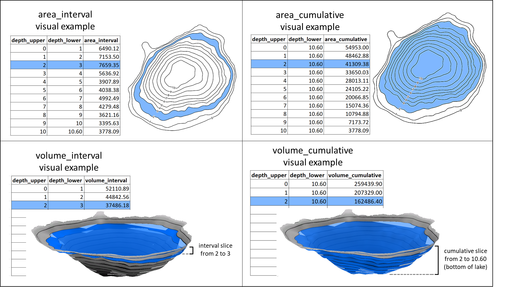
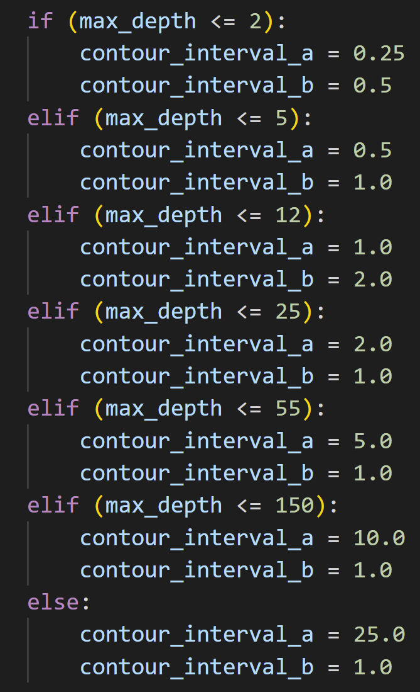
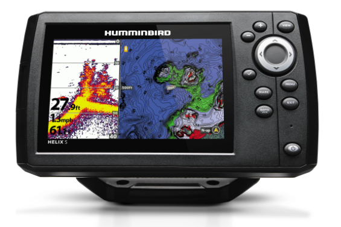
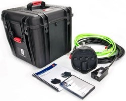
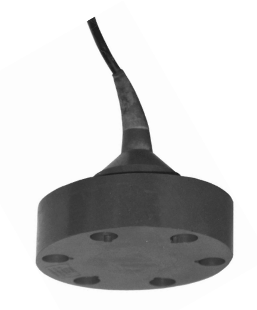
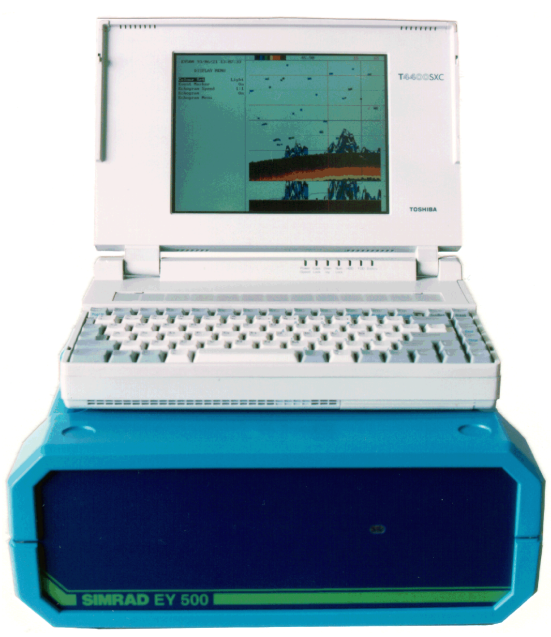

# Bathymetry Data - Information Sheet

**Authors**: Chris Hay, Lee Hrenchuk  
**Last Updated**: 2024-08-29  
**Last Updated By**: CH  

## Contents
- [Bathymetry Data - Information Sheet](#bathymetry-data---information-sheet)
  - [Contents](#contents)
  - [General](#general)
  - [Data Dictionary](#data-dictionary)
    - [Lists of columns by table](#lists-of-columns-by-table)
      - [Column Definitions](#column-definitions)
      - [Domains](#domains)
      - [Visual descriptions](#visual-descriptions)
  - [Methods](#methods)
    - [Site Location](#site-location)
    - [Sampling Methods](#sampling-methods)
      - [Bathymetric transects via boat and sonar equipment](#bathymetric-transects-via-boat-and-sonar-equipment)
      - [IISD-ELA (Hrenchuk 2018)](#iisd-ela-hrenchuk-2018)
      - [Milne Technologies (Milne 2017)](#milne-technologies-milne-2017)
      - [Other](#other)
      - [Bathymetric transects via boat and rock on rope](#bathymetric-transects-via-boat-and-rock-on-rope)
    - [Processing Methods](#processing-methods)
      - [Bathymetry ArcGIS data processing Python script](#bathymetry-arcgis-data-processing-python-script)
      - [Hybrid for Milne Technologies data processing](#hybrid-for-milne-technologies-data-processing)
    - [Gear](#gear)
      - [Humminbird (sic) Helix5 Chirp GPS G2PT (aka fish finder)](#humminbird-sic-helix5-chirp-gps-g2pt-aka-fish-finder)
      - [Kongsberg-Mesotech M3 multi-mode multibeam sonar](#kongsberg-mesotech-m3-multi-mode-multibeam-sonar)
      - [Kongsberg-Mesotech single beam 120 kHz echosounder](#kongsberg-mesotech-single-beam-120-khz-echosounder)
      - [Simrad EY500 split beam 120 kHz transducer](#simrad-ey500-split-beam-120-khz-transducer)
      - [Rock on rope](#rock-on-rope)
    - [References](#references)

## General

The IISD Experimental Lakes Area (IISD-ELA) holds bathymetric data for IISD-ELA lakes. Data are collected and processed in more than one way, which this document will outline. Data may not be available in every format for every lake.

## Data Dictionary

### Lists of columns by table

Keys are indicated with asterisks (here they are compound keys with more than one field)

**Summary Stats**
- monitoring_location_name\*
- activity_start_date\*
- perimeter_surface
- area_surface
- volume_total
- depth_mean
- depth_max
- update_date

**Interval**
- monitoring_location_name\*
- activity_start_date\*
- depth_upper
- depth_lower
- area_interval
- volume_interval
- update_date

**Cumulative**
- monitoring_location_name\*
- activity_start_date\*
- depth_upper
- depth_lower
- area_cumulative
- volume_cumulative
- update_date

**Metadata**
- dataset_name
- monitoring_location_name\*
- activity_start_date\*
- activity_end_date
- method_sample_description
- method_sample_detail
- method_process_description
- method_process_detail
- gear_type_desc
- lake_level_m
- benchmark_id
- lake_level_m_asl_est
- lake_level_asl_method
- general_comment
- update_date

#### Column Definitions

| **column name (alphabetical)** | **data type** | **unit** | **definition** |
|----|----|----|----|
| activity_end_date | date | N/A | Day field sampling or surveying activity ended. Null or blank values indicate the end date is unknown (probably the same day or within a few days). |
| activity_start_date | date | N/A | Day field sampling or surveying activity began. |
| area_cumulative | numeric | metres squared | A bathymetric concept for measuring lake area at a defined depth. The upper depth represents the depth at which the area is calculated for a theoretical 2D plane (horizontal sheet). The lower depth will always be the max depth, and can be ignored. The cumulative area at upper depth 0 will be equivalent to the lake's total surface area. Compare against the concept of "area_interval". See the bathymetry info sheet for visual diagram representation of the concept. Values are calculated to 0.01 metres squared, but the error would be greater than 1 (in most cases the DEM has 1 metre resolution). |
| area_interval | numeric | metres squared | A bathymetric concept for measuring lake area at defined depth ranges. The depth ranges produce a three-dimensional horizontal slice of lake. The area is calculated as the top-down view of the lower surface (floor) of the lake captured within that depth range. Essentially it is a representation of the amount of ground or lake floor present within a depth range. However, it is a planimetric (flat) calculation of the area as it would be represented on a map (in reality, the area is 3D so would be larger). The concept may also be understood as the area filling the space between two contours of a lake on a bathymetric map (concentric "donuts"). Compare against the concept of "area_cumulative". See the bathymetry info sheet for visual diagram representation of the concept. Values are calculated to 0.01 metres squared, but the error would be greater than 1 (in most cases the DEM has 1 metre resolution). |
| area_surface | numeric | metres squared | The surface area of a lake, excluding islands and protruding boulders (where survey methods differentiated). In other words, the area_cumulative when depth_upper is zero. Values are calculated to 0.01 metres squared, but the error would be greater than 1 (in most cases the DEM has 1 metre resolution). |
| benchmark_id | character varying | N/A | A unique identification to differentiate each benchmark at IISD Experimental Lakes Area. Benchmarks are drilled into bedrock surrounding lakes, to ensure they remain consistent. The ID is an integer and may include a letter (e.g., 58b). The benchmark ID is associated with lake level data for bathymetric surveys, and benchmark metadata such as location and elevation measurements. |
| dataset_name | character varying | N/A | Name of the dataset - a collection of data to which several individual data records (rows) belong. This is mainly used within IISD-ELA to define groups of data across different research fields, but can also serve as a descriptive contextual definition within and outside of IISD-ELA data users. Internal database users should compare "dataset" against "data type" which is a broader category of classification. |
| depth_lower | numeric | metres | In bathymetry, the lower depth level in consideration of the depth range for the characteristic and value in question. For example, in a depth range of 2.5 to 5.0 metres deep, the lower depth is 5.0. |
| depth_max | numeric | metres | In bathymetry, the maximum depth of the lake. That is, the depth at the deepest point on the day of survey. It is derived from GIS interpolated raster. Values are calculated to 0.01 metres, corresponding in most cases with raw sonar readings provided to 0.01 metres, but the degree of error would be greater. |
| depth_mean | numeric | metres | In bathymetry, the mean (average) depth of the lake. It is a value calculated from a GIS interpolated raster, based on the depth values across the entire lake. Values are calculated to 0.01 metres, corresponding in most cases with raw sonar readings provided to 0.01 metres, but the degree of error would be greater. |
| depth_upper | numeric | metres | In bathymetry, the upper depth level in consideration of the depth range for the characteristic and value in question. For example, in a depth range of 2.5 to 5.0 metres deep, the upper depth is 2.5. |
| gear_type_desc | character varying | N/A | A short description of the type of gear (equipment used for sampling or surveying). |
| general_comment | character varying | N/A | Optional additional remarks about the record that are not otherwise captured in existing fields. |
| lake_level_asl\_ method | character varying | N/A | A description of the method used to calculate lake level in metres above sea level. |
| lake_level_m | numeric | metres | The water level of the lake on the day of survey, as measured in metres against a measuring board surveyed to a benchmark for the lake. Since there are few benchmarks at IISD-ELA that are surveyed relative to elevation above sea level, most benchmarks at ELA have been assigned an arbitrary elevation that is not relative to elevation above sea level, and in most cases are specific only to the watershed in which it is located. |
| lake_level_m\_ asl_est | numeric | metres | An estimate of the water level of the lake on the day of survey, in metres above sea level. The value is based on a calculation requiring lake level recorded at the arbitrary lake benchmark and a survey of the elevation above sea level for the benchmark. Few benchmarks at IISD-ELA have been accurately surveyed relative to elevation above sea level. A current exception is benchmark 7a at 239 LA, which has been surveyed accurately. Other benchmark elevations were estimated from a hand-held GPS measurement or from a historical survey to the original master benchmark, with unknown accuracy. |
| method_process\_ description | character varying | N/A | A short description of the method used to process the data (from raw to derived, or further derived). |
| method_process\_ detail | character varying | N/A | A long description of the method used to process the data (from raw to derived, or further derived). |
| method_sample\_ description | character varying | N/A | A short description of the method used to sample the data (collect the data, in a field or lab environment). |
| method_sample\_ detail | character varying | N/A | A long description of the method used to sample the data (collect the data, in a field or lab environment). |
| monitoring\_ location_name | character varying | N/A | Name of sampled or surveyed geographic location at the Experimental Lakes Area field site. The name consists of: \<location\> or \<location sublocation\> or \<location sublocation station\>. Typically location is the lake number (watershed area), sublocation specifies LA for "lake" (or a basin, e.g. NB - north basin), and station is usually CB ("centre buoy"). Some names do not have all three parts since a broader area is in question (e.g. for bathymetry, the entire lake, not just the centre buoy). |
| perimeter_surface | numeric | metres | In bathymetry, the distance around the lake at the water's surface level. Typically calculated from the GIS polygon outline, which is usually drawn based on satellite imagery and encompassing bathymetry transect survey points (see processing method for details and confirmation). Values are provided to 0.01 metres but the +/- error is about 25 metres for a 1000 metre perimeter lake. |
| update_date | date | N/A | Date the record in the IISD-ELA Postgres Master Database table was most recently uploaded or modified. |
| volume_cumulative | numeric | metres cubed | A bathymetric concept for measuring lake volume at defined depth ranges, where the lower depth is always the maximum depth. Essentially it is a representation of the volume of the lake if it were to be drained down to various degrees. The volume when the upper depth is zero is equivalent to the total volume (volume of the entire lake). Compare against the concept of "volume_interval". See the bathymetry info sheet for visual diagram representation of the concept. Values are calculated to 0.01 metres cubed, but the error would be greater than 1 (in most cases the DEM has 1 metre resolution). |
| volume_interval | numeric | metres cubed | A bathymetric concept for measuring lake volume at defined depth ranges. Imagine the lake cut into horizontal slices at defined depth intervals. Essentially it represents the volume of the lake at upper to lower layers of the lake and can be used to calculate approximate volumes of the epilimnion, metalimnion, and hypolimnion. Compare against the concept of "volume_cumulative". See the bathymetry info sheet for visual diagram representation of the concept. Values are calculated to 0.01 metres cubed, but the error would be greater than 1 (in most cases the DEM has 1 metre resolution). |
| volume_total | numeric | metres cubed | In bathymetry, a summary statistic specifying the total volume of the lake. It is calculated via GIS tools based on the raster DEM. Values are calculated to 0.01 metres cubed, but the error would be greater than 1 (in most cases the DEM has 1 metre resolution). |

#### Domains

All date fields (activity_end_date, activity_start_date, and update_date) include year, month, and day in ISO 8601 format (YYYY-MM-DD), but may be null (except for activity_start_date, which is a key field).

Many of the metadata-related columns are derived from internal lookup tables of a restricted list of values (dataset_name, method_process_description, method_process_detail, method_sample_description, and method_sample_detail).

Most numeric values are rounded to two decimal points, but the true degree of precision may be more coarse.

#### Visual descriptions

## Methods 
### Site Location

Bathymetry data are collected for a selection of many of the lakes at IISD Experimental Lakes Area. The IISD-ELA is located in northwestern Ontario, Canada. The research facility buildings are located at about 49.660, -93.728, and the experimental lakes surround the facility by several kilometres.

### Sampling Methods

#### Bathymetric transects via boat and sonar equipment
This method name is intentionally vague so it can be applied broadly to include transects conducted by IISD-ELA, Milne Technologies, and the Department of Fisheries and Oceans (DFO), using a variety of sonar equipment.

#### IISD-ELA (Hrenchuk 2018)
IISD-ELA transects, when using the Humminbird Helix5 Chirp GPS G2PT, followed a protocol described in detail in Hrenchuk 2018. A summary is provided here.

The transducer is mounted as level as possible just below the surface of the water, and the fish finder put in a place so the boat driver can observe data collection as they drive. Transects are pre-loaded to the device as a guide. There are two transects: N-S and E-W, or whatever makes sense for the lake (in any case, the two transects cross each other at perpendicular angles). The transects are spaced about 25 m apart, and the boat is driven slowly (max 7 km/hr) to avoid errors. When finished driving each transect, it is downloaded to an SD card. The data on the SD cards are converted to decimal degree coordinates and z depths in metres.

*Photo of Humminbird transducer and fish finder.*

The water level of the lake is marked while out at the lake conducting the transect survey. The mark is made either by using survey spray paint on a rock sloped towards horizontal, or by using flagging tape if the shore is weedy or does not have rocks. A GPS point is collected at the mark point. The water level mark is then surveyed to determine the water level at the time of survey relative to the benchmark measured in metres, to the nearest millimetre. Benchmarks are drilled into bedrock surrounding the lake and are assumed to remain stationary. The benchmarks are an arbitrary but consistent elevation (i.e., not comparable across lakes, only comparable within each lake over time, and few benchmarks have been reliably surveyed to calculate the corresponding elevation “at sea level”).

#### Milne Technologies (Milne 2017)

Milne Technologies, when using the Kongsberg-Mesotech M3 multi-mode multibeam sonar on a contract for IISD-ELA in 2017, followed a protocol described in more detail in Milne 2017. A brief summary is provided here.

The Kongsberg-Mesotech sonar device was mounted to the boat, with the transducer positioned approximately 47.5 cm below the water surface. Survey data were limited to a minimum depth of 95 cm. Real-time kinematic (RTK) GPS and vessel altitude (heave, pitch, and roll) corrections were conducted, to achieve horizontal accuracy better than 12 cm.

The sonar device echogram data were logged in .mmb format, a 3D point cloud was exported in .all data format and imported to Hypack HySWEEP software. The Hypack software generated .hsx multibeam data and imported to the HySWEEP editor. Wiggle plots were generated to remove outliers, fish detections, side-lobe and sub-bottom detections. Patch test data were processed to determine roll, pitch, ya, and sensor latency offsets. Cleaned .hs2x files were compiled onto a 0.5m x 0.5m grid and average depths were assigned to each cell. The cells were exported as xyz coordinate .txt files, and .shp files. IISD-ELA converted the shape file points from UTM to decimal degrees and re-exported as .csv, to store alongside raw IISD-ELA transect data.

Lake levels were recorded by IISD-ELA via automated lake level gauges (previously installed on all four of the lakes surveyed for the Milne Tech contract in 2017). However, lake level elevations in mean sea level (msl) were estimated using real-time kinematic (RTK) corrected global positioning system (GPS).

#### Other

Further details are not available for transect surveys conducted by the DFO or Milne Tech in other years using other gear, but can be assumed to follow a similar approach.

#### Bathymetric transects via boat and rock on rope

The rock and rope is lowered into the water from the side of a boat (summer) or a hole in the ice (winter) until reaching the bottom of the lake. Then the depth is recorded along with the location. It is believed that this was the method used to produce the historical IISD-ELA bathymetric maps, which may be inaccurate as a result.

### Processing Methods

#### Bathymetry ArcGIS data processing Python script

Raw xyz coordinate data were processed using ArcGIS geospatial analysis and cartographic tools, to produce a variety of usable outputs included in the data package. In brief, raw coordinates were interpolated to produce a raster DEM, which was used to produce maps, geospatial files, and to calculate numerical statistics for the lake (area, volume, mean depth, etc.). The processing workflow is split into five parts, described incompletely below.

1.  Variables

    1.  Defines folder path locations and lake data and metadata.

2.  Raster DEM
    1.  Raw coordinate points are converted from tabular to geospatial points.
    2.  A rough lake polygon is manually corrected to contain survey points and to fit current satellite imagery.
    3.  The associated attribute table is cleaned up to include mainly the lake name.
    4.  The lake polygon is exported as a final product.
    5.  The lake polygon outline is converted to points at depth 0, and merged with the survey points.
    6.  Points are manually examined to remove outliers (sonar errors).
    7.  Points are interpolated to produce a raster DEM using the Spatial Analyst “Topo to Raster” tool.
    8.  The raster DEM is blurred using a low pass filter and focal statistics and clipped to a mask of the lake polygon area, to obscure surveying and interpolation artifacts and to better reflect reality and actual survey accuracy. The raster DEM is exported as a final product.

3.  Contour Lines
    1.  Two sets of contour lines are produced: typically one at 1 m intervals and the other at greater or lesser intervals depending on the max depth of the lake – see below section of code (all numbers are in units of metres).  
    

    3.  Contours are generated using the “Contour” tool from the Spatial Analyst toolset, clipped to the mask of the lake polygon area (using the raster DEM as the input).
    4.  The lake polygon outline is used to replace the outer contour of 0 m.
    5.  The associated attribute table is cleaned up to include only the lake name and contour line depth values.
    6.  The two sets of contour lines are exported as final products.

<!-- -->

4.  Tabular – area, volume, summary stats, metadata
    1.  The Spatial Analyst “Contour” tool is essential (with the raster DEM as input), this time to generate polygons for math calculations
        1.  area_interval – contour polygon
        2.  area_cumulative – contours polygon shell up
        3.  volume_cumulative – contours polygon shell up
        4.  volume_interval – math built on volume_cumulative values, using the contours poly feature class as a convenient place to do this
    2.  Area and volume calculations are based on the following concepts:
        1.  Area – the metres squared value for the contour polygon area, determined using the Spatial Analyst tool “Zonal Statistics”.
        2.  Mean depth – the mean of raster DEM cell values (depths) within contour polygon area, determined using the Spatial Analyst tool “Zonal Statistics”.
        3.  Contour depth – for volume_cumulative, the upper depth, representing a range from upper depth to max depth.
        4.  For volume_interval, the volume cumulative value from the contour level below is subtracted from the one above. This is done by conducting a “Join” offset by one row, and then using the “Field Calculator” tool to do the math.
    3.  Summary statistics are mostly collected by taking the appropriate area or volume values from the attribute tables of final or intermediate geospatial files from previous steps. The mean and max depth are calculated using the Data Management “Get Raster Properties” tool.
    4.  Tables are built by copying values into template tables.
    5.  The metadata table depends on the script user manually entering the metadata values in the first part (“Variables”) for the script. They are copied into a template table to build a separate metadata table.

5.  Maps
    1.  The maps are manually produced in ArcGIS Pro, following a protocol in an additional how-to file included in the GitHub repository (Hay 2022).
    2.  Maps combine the lake polygon, raster DEM, contour lines, and certain tabular data and metadata, as visual summary products.

The script along with associated materials are publicly available on GitHub (Hay 2022) and should be consulted for further details. 

Tabular outputs are input to an internal FME workbench pipeline. This further refines and formats the tables, and inserts them into the IISD-ELA postgres master database. The master database contains views based on the input tables, which are exported to be used as final products (i.e., in the repository data package).

#### Hybrid for Milne Technologies data processing

A hybrid of the aforementioned script (Hay 2022) was used to process data provided to IISD-ELA by contractor Milne Technologies (Milne Tech.). Essentially, only the part of the script generating tabular data outputs was used. The raster DEM and lake polygon outline provided by Milne Tech. were used as inputs for tabular data generation. The raster DEM, contour lines, and lake outline were already provided as products of the Milne Tech. contract, so those are provided as-is and were not re-created by IISD-ELA using raw xyz coordinate data.

The generation of the raster DEM, contour lines, and lake outline are described in detail in Milne 2017. A short summary is provided here. Lake outlines were modified using satellite imagery and to ensure all surveyed coordinate points were contained by the outline. Boulders and islands were accounted for. The outline was assigned a depth of 0 metres. Since the sonar survey was limited to depths of 95 cm or deeper, in nearshore areas that could not be surveyed the depth was estimated by drawing 30 cm contour lines. A triangulated irregular network (TIN) was generated using the 3D Analyst ArcGIS extension, with three inputs: the xyz bathymetry grid points, estimated nearshore contours as points (30 cm), and the modified shoreline (lake outline) as points (0 m). The TIN was cleaned using the ArcGIS tool “Delineate TIN Data Area”, removing TIN components with edges greater than 1 m. The raster DEM was produced by using the “Converted TIN to Raster” tool. The raster DEM was produced as an ArcGIS GRID (file format) with a resolution of 0.5 m x 0.5 m cell sizes.

The tabular data script section was undertaken much the same way as for IISD-ELA input data. The tabular data are also put through an FME workbench pipeline to be entered into the IISD-ELA postgres master database, and added to the same tables and views exported for final use.

Maps were re-created by IISD-ELA using the Milne Tech. raster DEM, lake outline polygon, and contour lines, but showing tabular data produced from IISD-ELA processing of the raster DEM. Maps were also provided by Milne Tech. as contract deliverables, so IISD-ELA holds two versions of maps for the lakes surveyed by Milne Tech using the Kongsber-Mesotech M3 multi-mode multibeam sonar.

### Gear

#### Humminbird (sic) Helix5 Chirp GPS G2PT (aka fish finder)

The Humminbird brand has produced a variety of “fish finder” devices, which have GPS and Sonar capabilities. Marketed as a tool for angling outings, the device can also be used to collect raw bathymetric data by logging location (x,y) and depth (z) geographic coordinate points while boating transects across a lake when using the “AutoChart” function.

Consult the manufacturer’s website or device manual for further details.

https://johnsonoutdoors.widen.net/content/q8ds6x8zvr/pdf/532509-5EN_B-HELIX-Series-Operations-Manual.pdf

#### Kongsberg-Mesotech M3 multi-mode multibeam sonar

Kongsberg is a professional sonar brand, and this device is intended for applications such as marine engineering and site inspection, search and recovery, underwater vehicle instrumentation, and environmental monitoring. The device uses linear FM, CW, and Doppler pulses, can read up to 4000m water depth, and is claimed to produce single-beam image quality with the speed of multibeam.

The system is made of three components:

- Sonar head – transmits and receives acoustic pulses (can be used to
  generate both images and bathymetric data)

- Operations cable and power supply – supplies power to the sonar head

- Computer – operates M3 software, communicates with the sonar head, and presents sonar imagery to the operator

Consult the manufacturer’s website or device manual for further details.

https://www.mesotech.online/m3_sonar/documents.htm

#### Kongsberg-Mesotech single beam 120 kHz echosounder

The manufacturer of this device is Simrad (a Kongsberg company, based in Norway). The transducer can withstand a pressure at a depth of 1000 m. It is single beam (vs. multi beam).

Consult the manufacturer’s website or device manual for further details.

https://www.kongsberg.com/contentassets/d106c9aa05de423a8b02cf5fae6d6ad1/164023_120-25.pdf

#### Simrad EY500 split beam 120 kHz transducer

The manufacturer of this device is Simrad (a Kongsberg company, based in Norway). The device was designed for biomass estimation where portability and low power usage was important. The system consists of a PC, transceiver, and transducer. The instruction manual was first revised in 1992 and most recently in 1998, so the device seems to be a fairly old example of sonar equipment.

Consult the manufacturer’s website or device manual for further details.

https://www.kongsberg.com/contentassets/d1e3ce1c81914898889ca934a70c34eb/130078ag_ey500_instruction_manual_english.pdf

#### Rock on rope

A heavy weight attached to a rope with regular markings, like a large ruler.

### References

Hay, C. R. J. 2022. IISD-ELA Bathymetry Data Processing Repository (Version 15.2). DOI: https://doi.org/10.5281/zenodo.18237230 URL: https://github.com/IISD-ELA/bathymetry

Milne, S.W. 2017. 2017 IISD-ELA Multibeam Sonar Bathymetry Mapping Report. “2017_IISD-ELA_MBES_Bathymetry_Mapping_Report.pdf”. Internal IISD-ELA document.

Hrenchuk, L. 2018. Protocol - collecting data for a bathymetric map. “Protocol - collecting data for a bathymetric map.docx”. Internal IISD-ELA document. Last updated 2019-06-10.
