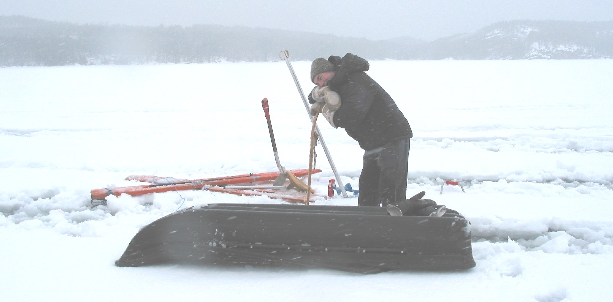
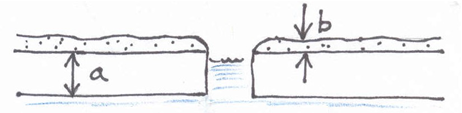
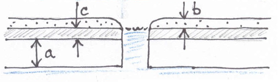
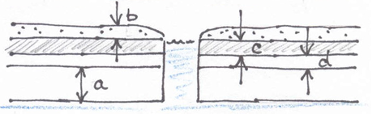
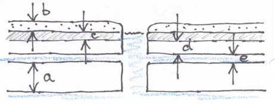
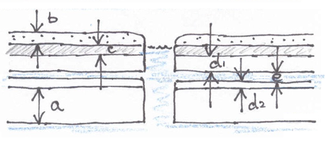

# Limnology – Ice Thickness Data – Information Sheet

Authors: Ken Beaty, Ken Sandilands, Paul Fafard, Chris Hay  
Last Updated: 2024-10-21

## Contents
- [General Information](#general-information)
  * [Background](#background)
  * [Understanding Lake Ice Layers](#understanding-lake-ice-layers)
- [Data Dictionary](#data-dictionary)
  * [Column definitions](#column-definitions)
- [Sampling Methods](#sampling-methods)
  * [General method code](#general-method-code)
  * [Current methods](#current-methods)
  * [Past methods](#past-methods)

# General Information

## Background

Ice thickness observations have generally been linked to the winter lake chemistry surveys. Up until 1991, winter surveys were carried out on approximately a monthly basis meaning that five or six measurements may have been made each winter. In 1992, the number of winter surveys was reduced to twice each winter, one in early winter and one in late winter. The selection of lakes sampled each winter was not consistent across time, and so ice thickness data exists for multiple lakes. The most comprehensive data set for ice thickness exists for Rawson Lake (239). A complementary data set of ice-on and ice-off dates for Rawson Lake is also available. More recently, ice-on and ice-off records and complementary ice thickness records exist for multiple other lakes in the ELA, as part of the collaboration between ELA research scientist Scott Higgins and Natural Resources Canada scientist, Hugo Drouin.

## Understanding Lake Ice Layers

At ELA, lake ice initially forms as a single layer of “black ice”. As the winter progresses snowfall on the ice can cause the ice profile to change from a simple state to one that is more complex. This accumulation of snow exerts a downward pressure on the surface of the ice sheet which forces lake water up through cracks and “blow-holes”. This water spreads laterally over the lake between the black ice and the snow cover forming a “slush” layer under the snow. The snow acts as an insulating layer which may prevent the slush from freezing. Because the slush can’t be seen it often creates hazardous travel situations requiring a great deal of caution.

*Deep slush on Winnange made for exhausting travel conditions (pictured: Ken Beaty on March 26, 2004)*

As the winter progresses and air temperatures decline, this “slush ice” can change to an ice layer often referred to as “white ice”. So sometimes the slush layer may not exist, but other layers may be present.

It is possible to have a variety of ice conditions ranging from simple to complex over the course of the same winter, depending on factors such as snow thickness and air temperatures. It is even possible for more complex profiles to change to more simple profiles.

Here is a diagram of ice conditions that may be experienced, from simple to more complex profiles:
<table>
  <tr>
    <td>1. Simple &emsp;a = black ice &emsp;b = snow</td>
    <td></td>
  </tr>
  <tr>
    <td>2. Complex &emsp;a = black ice &emsp;b = snow &emsp;c = hidden slush</td>
    <td></td>
  </tr>
  <tr>
    <td>3. More complex: &emsp;a = black ice &emsp;b = snow &emsp;c = slush &emsp;d = white ice</td>
    <td></td>
  </tr>
  <tr>
    <td>4. More complex: &emsp;a = black ice &emsp;b = snow &emsp;c = slush &emsp;d = white ice &emsp;e = water or slush</td>
    <td></td>
  </tr>
  <tr>
    <td>5. Most complex: &emsp;a = black ice &emsp;b = snow &emsp;c = slush &emsp;d1 = white ice (upper) &emsp;d2 = white ice (lower) &emsp;e = water or slush</td>
    <td></td>
  </tr>
</table>

<!-- 
Note: The above table is in html, otherwise the markdown version doesn't convert nicely to html when you want to use pandoc to convert md to html, e.g. to have static copies of the info sheet for repository submissions. But I am including the markdown version of the table here too, in case it is useful in future.
| **column name (alphabetical)** | **data type** | **unit** | **definition** |
| --- | --- | --- | --- |
| black\_ice\_thickness | numeric | cm  | The thickness of the black ice layer above the lake water. It is an automatically calculated value based on subtracting the thickness of any white ice layer(s) and slush or water layers between the ice from the total ice thickness. See ‘a’ in diagrams above. |
| comments | character varying | N/A | Remarks about the record or its collection. |
| dataset\_name | character varying | N/A | Name of the dataset. A dataset is a collection of data to which several individual data records (rows) belong. Dataset names are useful to distinguish groups of data across different research fields and provide some descriptive context. |
| depth\_units | character varying | N/A | This column exists for the ice depths dataset only to convey that all the layers are measured in centimetres. All the records in this dataset have thickness of ice, slush, snow, or water measured in centimetres. This column is included to help ensure the data user interprets the units correctly, in case the metadata are not examined, and without having to append "\_cm" to each of the seven thickness column names. |
| method\_sample\_code | character varying | N/A | A short and unique code associated with a description of a method of sampling for data (i.e., how the physical sample was collected or measured in the field). A key to codes and descriptions should be included with the associated Information Sheet for the dataset in question. |
| monitoring\_location\_name | character varying | N/A | Name of sampled or surveyed geographic location at the IISD Experimental Lakes Area field site. The name consists of: <location> or <location sublocation> or <location sublocation station>. Location is typically the lake number (each lake is named with a number, representing the lake's geographical watershed), sublocation which typically specifies LA for "lake" (or a basin, e.g. NB - north basin, or other), and station which is usually CB ("centre buoy" - at about the deepest point of the lake). Some names do not have all three parts since a broader area is in question (e.g. for bathymetry, the entire lake, not just the centre buoy). |
| sample\_date | date | day | The day the field sampling or surveying activity was carried out to collect the data in the record. Format: YYYY-MM-DD |
| sample\_time | character varying | minute | The time the field sampling or surveying activity was carried out to collect the data in the record. Format: HH:MM |
| slush\_depth\_over\_ice | numeric | cm  | The thickness of the slush layer above the lake ice (if present). It is measured to nearest half centimetre. See ‘c’ in diagrams above. |
| slush\_present | boolean | N/A | A boolean note for whether slush was present (slush\_present = TRUE) or absent (slush\_present = FALSE). Slush is partially melted or waterlogged snow, with a thick texture. Historically, this was recorded as a parameter when measuring ice thickness, so in some cases it may be TRUE although slush was not measured, or was only noted in the comments. In recent years, it is automatically calculated based on if slush\_depth\_over\_ice is greater than zero (note: it is associated with slush over the ice, not the slush between ice layers, if present). |
| snow\_depth\_over\_ice | numeric | cm  | The thickness of the snow layer above the lake ice (if present). It is measured to nearest half centimetre. See ‘b’ in diagrams above. |
| total\_ice\_thickness | numeric | cm  | The total ice thickness over the lake at the measured location, in centimetres (cm). It is measured in the field and includes everything from the top of the upper white ice layer down to the bottom of the black ice layer. That is, it represents the sum of: the upper white ice layer, the slush or water layer between the ice, the lower white ice layer, and the black ice layer (i.e. does not include the upper layers of snow or slush, if present). |
| update\_date | date | day | Date the record in the IISD-ELA Postgres Master Database table was uploaded to the database or most recently modified. Format: YYYY-MM-DD. |
| water\_or\_slush\_layer \_bw\_ice\_thickness | numeric | cm  | The thickness of the water or slush layer between layers of lake ice, if present. It is measured to nearest half centimetre. See ‘e’ in diagrams above. |
| white\_ice\_lower\_thickness | numeric | cm  | The thickness of the lower white ice layer, if upper and lower white ice layers are present (if there is only one white ice layer, the measurement is noted as the upper white ice layer thickness). It is measured to nearest half centimetre. See ‘d2’ in diagram above. |
| white\_ice\_upper\_<thickness | numeric | cm  | The thickness of the white ice layer (or upper white ice, if a lower white ice layer is present). It is measured to nearest half centimetre. See ‘d’ and ‘d1’ in diagrams above. |
-->

# Data Dictionary

## Column definitions

| **column name (alphabetical)** | **data type** | **unit** | **definition** |
| --- | --- | --- | --- |
| black\_ice\_thickness | numeric | cm  | The thickness of the black ice layer above the lake water. It is an automatically calculated value based on subtracting the thickness of any white ice layer(s) and slush or water layers between the ice from the total ice thickness. See ‘a’ in diagrams above. |
| comments | character varying | N/A | Remarks about the record or its collection. |
| dataset\_name | character varying | N/A | Name of the dataset. A dataset is a collection of data to which several individual data records (rows) belong. Dataset names are useful to distinguish groups of data across different research fields and provide some descriptive context. |
| depth\_units | character varying | N/A | This column exists for the ice depths dataset only to convey that all the layers are measured in centimetres. All the records in this dataset have thickness of ice, slush, snow, or water measured in centimetres. This column is included to help ensure the data user interprets the units correctly, in case the metadata are not examined, and without having to append "\_cm" to each of the seven thickness column names. |
| method\_sample\_code | character varying | N/A | A short and unique code associated with a description of a method of sampling for data (i.e., how the physical sample was collected or measured in the field). A key to codes and descriptions should be included with the associated Information Sheet for the dataset in question. |
| monitoring\_location\_name | character varying | N/A | Name of sampled or surveyed geographic location at the IISD Experimental Lakes Area field site. The name consists of: <location> or <location sublocation> or <location sublocation station>. Location is typically the lake number (each lake is named with a number, representing the lake's geographical watershed), sublocation which typically specifies LA for "lake" (or a basin, e.g. NB - north basin, or other), and station which is usually CB ("centre buoy" - at about the deepest point of the lake). Some names do not have all three parts since a broader area is in question (e.g. for bathymetry, the entire lake, not just the centre buoy). |
| sample\_date | date | day | The day the field sampling or surveying activity was carried out to collect the data in the record. Format: YYYY-MM-DD |
| sample\_time | character varying | minute | The time the field sampling or surveying activity was carried out to collect the data in the record. Format: HH:MM |
| slush\_depth\_over\_ice | numeric | cm  | The thickness of the slush layer above the lake ice (if present). It is measured to nearest half centimetre. See ‘c’ in diagrams above. |
| slush\_present | boolean | N/A | A boolean note for whether slush was present (slush\_present = TRUE) or absent (slush\_present = FALSE). Slush is partially melted or waterlogged snow, with a thick texture. Historically, this was recorded as a parameter when measuring ice thickness, so in some cases it may be TRUE although slush was not measured, or was only noted in the comments. In recent years, it is automatically calculated based on if slush\_depth\_over\_ice is greater than zero (note: it is associated with slush over the ice, not the slush between ice layers, if present). |
| snow\_depth\_over\_ice | numeric | cm  | The thickness of the snow layer above the lake ice (if present). It is measured to nearest half centimetre. See ‘b’ in diagrams above. |
| total\_ice\_thickness | numeric | cm  | The total ice thickness over the lake at the measured location, in centimetres (cm). It is measured in the field and includes everything from the top of the upper white ice layer down to the bottom of the black ice layer. That is, it represents the sum of: the upper white ice layer, the slush or water layer between the ice, the lower white ice layer, and the black ice layer (i.e. does not include the upper layers of snow or slush, if present). |
| update\_date | date | day | Date the record in the IISD-ELA Postgres Master Database table was uploaded to the database or most recently modified. Format: YYYY-MM-DD. |
| water\_or\_slush\_layer \_bw\_ice\_thickness | numeric | cm  | The thickness of the water or slush layer between layers of lake ice, if present. It is measured to nearest half centimetre. See ‘e’ in diagrams above. |
| white\_ice\_lower\_thickness | numeric | cm  | The thickness of the lower white ice layer, if upper and lower white ice layers are present (if there is only one white ice layer, the measurement is noted as the upper white ice layer thickness). It is measured to nearest half centimetre. See ‘d2’ in diagram above. |
| white\_ice\_upper\_<thickness | numeric | cm  | The thickness of the white ice layer (or upper white ice, if a lower white ice layer is present). It is measured to nearest half centimetre. See ‘d’ and ‘d1’ in diagrams above. |

# Sampling Methods

## General method code

| **sample_method_code** | **description**                  |
|------------------------|----------------------------------|
| X05                    | Field ice measurement with ruler |

## Current methods

Most often ice depths are measured at centre buoys during water sampling trips. After a hole is drilled, snow is cleared down to the ice layer and the total ice thickness is measured in cm by hooking a metre stick onto the bottom of the layer and reading the measurement at the top of the ice. When white ice is present (or one of the more complicated cases described above) these layer(s) are also measured. The presence of slush is noted, and may also be measured, depending on the observer. Snow depth is measured by inserting the metre stick into the snow until it hits solid ice, and that depth is noted. Usually an average of 3 or 4 of these measurements is recorded.

## Past methods

Past methods were not always documented. Black and white ice has only been measured in more recent years. When slush is present, it is not always clear if the depth of slush and snow depth were measured separately, or if the snow depth includes the slush. In some instances, the slush depth is greater than the snow depth, which suggests that they were measured separately. The value of slush and snow depths is debatable. Slush can vary greatly spatially over the surface of the lake and can form into white ice during a cold snap. Snow depth is also variable over the lake and is subject to wind causing drifts or sweeping snow off the lake. Total ice thickness may be the only variable that is likely to have been measured consistently over the data record.
