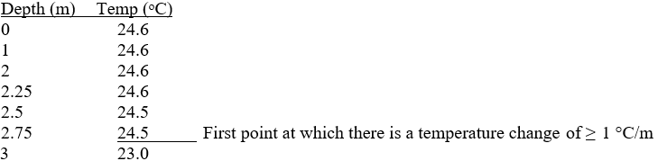
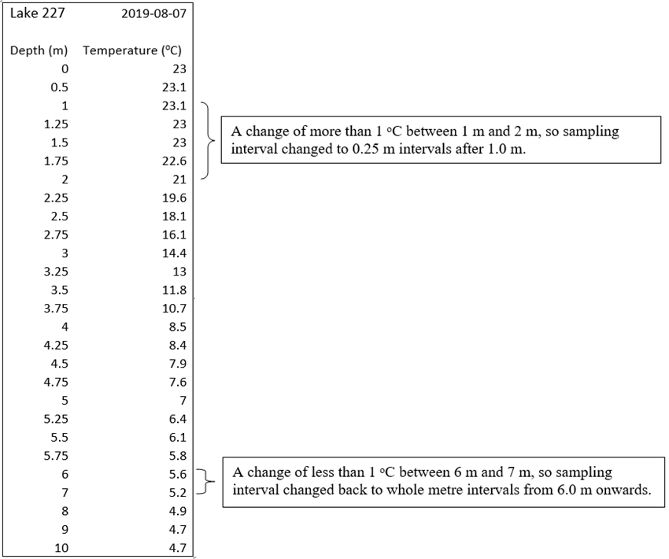
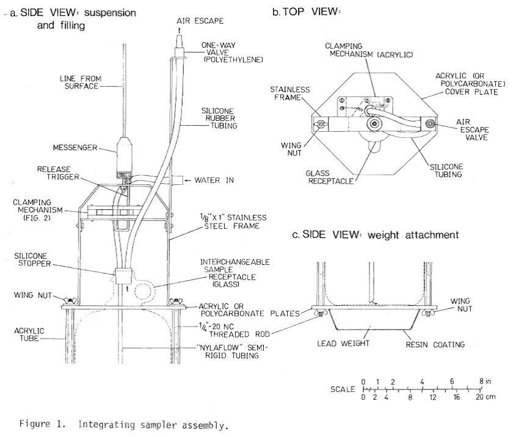

# Lake Sampling and Field Observations: Physical Limnology information Sheet

Author(s): Ken Sandilands; Paul Fafard  
Last update: 25th January, 2023 (KS); 09April2024 (PF); 17March2025(IY)

## Contents
- [Background](#background)
- [Data Dictionary](#data-dictionary)
  * [Column Definitions Table](#column-definitions-table)
  * [Additional Notes on Certain Columns](#additional-notes-on-certain-columns)
- [Collection Methods](#collection-methods)
  * [Current Sampling Methods (as of 2017)](#current-sampling-methods--as-of-2017-)
    + [Conditions at time of sampling](#conditions-at-time-of-sampling)
    + [Water observations](#water-observations)
    + [Lake profiles](#lake-profiles)
  * [Method changes](#method-changes)
- [References](#references)
- [Appendix](#appendix)

# Background

This information sheet describes the method used to obtain limnological observations and water chemistry, phytoplankton and primary production samples at the Experimental Lakes Area for the regular Lake Sampling program.

An attempt to describe the sampling methods for the Lake Variation and Climate Change Study (Natural Variability) is provided in the “composite” method below.

The ELA data retriever also contains data on the Northwestern Ontario Lake Size Series (NOLSS). Description of the NOLSS methods can be found in Fee et.al. 1992.

The current method is described first, then an attempt to document method changes over the years is presented as well.

Related information sheets:
* PAR Light Attenuation Information Sheet
* Lake Surface Temperature Information Sheet
* Water Chemistry Information Sheet
* RBR Information Sheet
* Zooplankton Abundance Collection Method

Lake Sampling managers:
* Ron Reid May 1971 to October 1975
* Eric Matheson October 1975 to September 1977
* John Penny 1978 to August 1980
* Dave Findlay September to October 1980
* Dana Cruikshank October 1980 to January 1998
* Eva Schindler February 1998 to October 1998
* Mark Lyng November 1998 to November 2007
* Ken Sandilands April 2008 to 2013
* Colin Charles 2014
* Ken Sandilands 2015 to present
* Paul Fafard (Technician) Oct 2016 to present

# Data Dictionary

## Column Definitions Table

| **column name (alphabetical)** | **data type** | **unit** | **definition** |
|----|----|----|----|
| dataset_code | character varying | N/A | A three-character code made up of upper-case letters and numbers unique for each dataset in ref_dataset. Should always start with a letter and may or may not end with a number. Used as a short consistent abbreviation for the dataset, whereas dataset_name is longer and may be changed and refined over time. |
| dataset_name | character varying | N/A | Name of the dataset from ref_dataset- a collection of data to which several individual data records (rows) belong. This is mainly used within IISD-ELA to define groups of data across different research fields but can also serve as a descriptive contextual definition within and outside of IISD-ELA data users. Internal database users should compare "dataset" against "data type" which is a broader category of classification. |
| project_name | character varying | N/A | A name for a project that the data record is associated with (e.g. FOReSt). |
| sample_num | character varying | N/A | For profiles done for chemistry profile sampling, this is a unique key in the format YYYYMMDD_XXX where XXX represents the chemistry sample ID. For recently updated records, this is most likely null. |
| profile_id | character varying | N/A | The ID for the profile that has been used to make the thermocline (plan_therm_depth) calculations. It is mainly based on original_location_name if available or monitoring_location_name otherwise, and date, as well as other parameters as needed to distinguish each profile. |
| monitoring_location_name | character varying | N/A | Name of sampled or surveyed geographic location at the IISD Experimental Lakes Area field site. The name consists of: \<location\> or \<location sublocation\> or \<location sublocation station\>. Location is typically the lake number (each lake is named with a number, representing the lake's geographical watershed), sublocation typically specifies LA for "lake" (or a basin, e.g. NB - north basin, or other), and station is usually CB ("centre buoy" - at about the deepest point of the lake). Some names do not have all three parts since a broader area is in question (e.g. for bathymetry, the entire lake, not just the centre buoy). |
| year | double precision | N/A | Year that the sample was taken, in Central Time and in YYYY format. |
| date | date | N/A | Date of sampling in Central Time and ISO format (YYYY-MM-DD). |
| start_time | character varying | N/A | Time of field sampling in 24 hour and Central Time format (HH:MM). |
| air_temperature | numeric | degrees celsius | Temperature in degrees celsius, of air. |
| wind_speed_lower | numeric | kilometres per hour | The minimum wind speed, in kilometres per hour, measured over a thirty-second period. |
| wind_speed_upper | numeric | kilometres per hour | The maximum wind speed, in kilometers per hour, measured over a thirty-second period. |
| wind_direction | character varying | N/A | Wind direction determined by pointing a compass arrow into the wind and recorded in relation to the 4 cardinal points (N, NE, ENE). |
| cloud_cover | numeric | N/A | Subjective cloud cover estimation by the observer on a scale of 0 to 10 (10 being 100% cloud cover). |
| water_colour_secondary | character varying | N/A | Descriptor for the apparent dominant color of the white quadrants of the Secchi disk at 1/2 the Secchi depth. For example, for blue-green, blue is the descriptive secondary color, and green is the dominant color described as having a hint of blue. |
| water_colour_dominant | character varying | N/A | The apparent dominant color of the white quadrants of the Secchi disk at 1/2 the Secchi depth. For example, for blue-green, green is the dominant color described as having a hint of blue. |
| field_epilimnion | numeric | metres | For records in and after 2009, this is the last depth measured before a temperature change of greater than or equal to 1 degree Celsius per metre. This is calculated and entered in the field. |
| calculated_epilimnion | numeric | metres | This is the deepest isothermal (i.e., a region where the rate of temperature decrease is less than 1°C/m) depth above the region where the rate of temperature decrease is greater than or equal to 1°C/m. If there are two regions where the rate of temperature decrease is greater than or equal to 1°C/m, this is the deepest isothermal depth above the deeper region of the two. This is calculated by an FME workbench rather than entered in the field. |
| false_epilimnion | numeric | metres | If there are two regions in the lake where the rate of temperature decrease is greater than or equal to 1°C/m, this is the deepest isothermal depth above the shallower region of the two (not a real epilimnion). This is calculated by an FME workbench rather than entered in the field. |
| secchi_depth | numeric | metres | The depth at which the observer can no longer see the different quadrants of the Secchi disk, which is lowered into the water on the shaded side of the boat to measure water transparency. |
| plan_therm_depth | numeric | metres | The planar depth at which the maximum rate of temperature decrease with respect to depth occurs. The rate of temperature decrease with respect to depth must be greater than or equal to 1 degree celcius per metre. |
| epi_sample_start | numeric | metres | Lake surface (zero-metre depth). |
| epi_sample_end | numeric | metres | Either 0.5 m above the thermal epilimnion or the depth of 1% of surface PAR when the thermal epilimnion extends beyond this depth by at least 0.5 m. Check epi_end_defn to see which scenario applies. |
| met_sample_start | numeric | metres | The bottom of the thermal epilimnion. |
| met_sample_end | numeric | metres | The depth at which 1% of surface PAR occurs. |
| wave_height_upper | integer | centimetres | Crest height, in centimeters, for water wave. |
| wave_height_lower | integer | centimetres | Trough height, in centimeters, for water wave. |
| epi_end_defn | character varying | N/A | "1 pct light" if the integrated epilimnion sample end depth is defined as the depth of 1% surface PAR or "temperature" otherwise. |
| chem_profile_done | character varying | N/A | Whether or not an extra profile was taken for the same location on the same day for chemistry profile sampling. |
| method_sample_code | character varying | N/A | A short and unique code associated with a description of a method of sampling for data (i.e., how the physical sample was collected in the field). |
| method_sample_desc | character varying | N/A | A short description of the method used to sample the data (collect the data, in a field or lab environment). |
| gear_type_code | character varying | N/A | A three-digit code that refers to a specific gear type, typically starting with two capital letters and ending with one number. |
| gear_type_desc | character varying | N/A | A short description of the type of gear (equipment used for sampling or surveying). |
| collection_authority_userid | character varying | N/A | The userid of the person who is the authority or manager over the record. Often this is different from who was in the field collecting the data. This is usually similar (though not confirmed directly connected) with the current data owner specified in the ref dataset table. An example of a collection authority: for much of met/hyd/lim data the collection authority used to be Ken Beaty but is now Ken Sandilands for more recent records, so the records authorized to Ken Sandilands have collection_authority_userid = SandilandsK. |
| collected_by | character varying | N/A | Initials for primary person who collected the sample or data in the field (i.e. who did the field work?), or the name of the crew that collected the data (e.g., 'hydrolim crew'). |
| comments | character varying | N/A | Remarks about the record or its collection. |
| update_date | date | N/A | Date the record in the IISD-ELA Postgres Master Database table was most recently uploaded or modified. |
| account | character varying | N/A | Username of IISD-ELA staff who added or most recently edited the data record in the postgres master database. This may be generated through bulk loads or manually updated as records are edited individually. |
| version | numeric | N/A | The version number for a row of data is 1 when it is first added to a table, and increments by 1 every time the row is updated. |

## Additional Notes on Certain Columns

<u>epilimnion_depth</u>

If we look at the temperature change rates with respect to depth for some records, we may find false epilimnions. Once lakes have stratified, an extra layer of warm water develops within the normal epilimnion if it's been hot calm weather. The surface water (perhaps up to a few metres) warms up but doesn't mix with the rest of the epilimnion, and so you get a drop in temp (sometimes more than 1C/m) occurring in the middle of the normal the epilimnion. If you keep going deeper, the temperature stabilizes again, then drops again at the true thermocline within the metalimnion. These false epilimnions can look like the bottom of the epilimnion and could have a drop that appears to be a thermocline, but this is temporary and will disappear the next time it is windy. The values in this column account for false epilimnion cases and are hence all true epilimnions.

Epilimnion depth depends on depth resolution. Some instruments may have a depth resolution of every metre or every half metre or more. Although this does not affect how the epilimnion is defined, it does affect the numerical value of the epilimnion depth.

<u>plan_therm_depth</u>

Thermocline depth depends on depth resolution. Some instruments may have a depth resolution of every metre or every half metre or more. Although this does not affect how the thermocline is defined, it does affect the numerical value of the thermocline depth.

# Collection Methods

Field observations have been made using various types of equipment over the years, though the observation variables themselves have remained consistent or have been added to. Below are the field observations and sampling protocols used over the span of the program.

<u>Field Observations</u>
* Date and time of sampling
* Air temperature (°C)
* Cloud cover (tenths of sky)
* Wind speed and direction (km/h and cardinal direction)
* Wave height (cm)
* Secchi depth (m)
* Water colour
* Temperature profile (see RBR Information Sheet)
* Epilimnion depth (m)
* Thermocline depth (m)
* Photosynthetically active radiation (PAR) profile (see PAR Light Attenuation Information Sheet)

## Current Sampling Methods (as of 2017)

### Conditions at time of sampling

*<u>Air Temperature</u>*

Air temperature is recorded in º Celsius measured with a Kestrel 2000 anemometer in the same manner as for measuring wind speed.

*<u>Cloud Cover</u>*

Cloud cover is estimated by the observer. The entire sky is surveyed, and cloud cover is estimated from a scale of 0 to 10 (10 being 100% cloud cover). This observation is subjective, especially when thin clouds such as cirrus, cirrostratus, or cirrocumulus are present where some sunlight still penetrates.

*<u>Wind Speed</u>*

Wind speed is measured (in km/h) with a small hand-held Kestrel 2000 anemometer. The observer faces the direction the wind is coming from, holds the anemometer out at arms length, and observes the range of wind speeds over a ~ 30 second period. Wind direction is then determined using a compass (pointing the compass arrow into the wind) and is recorded in relation to the 4 cardinal points (e.g. N, NE, ENE), rather than degrees.

*<u>Wave Height</u>*

Wave height is an estimate of relative wave height on the lake surface, from trough to crest. Wave height is recorded within the following categories: 0 (calm), 1-5 cm, 5-10 cm etc.

### Water observations

*<u>Secchi Depth</u>*

Secchi depth is a measure of water transparency. The Secchi depth is taken by lowering the Secchi disk into the water on the shaded side of the boat until the observer can no longer see the different quadrants of the disk. The disk is then slowly brought back up in the water column until it is just visible. The depth at which this occurs is recorded to the nearest shallowest 0.25 m increment. **The observer should not be wearing sunglasses for this procedure.**

*<u>Water Colour</u>*

The apparent colour of the white quadrants of the Secchi disk at ½ the Secchi depth is recorded as the water colour. Water colour data has two components, the second component is the main colour of the water observed, and the first component either describes the intensity of that colour (light, dark) or describes other colours which are also present (e.g. blue-green is mostly green hue with a hint of blue, vs. green-blue which is mostly blue with a hint of green).

### Lake profiles

*<u>Temperature Profiles</u>*

We collect temperature and depth data using an RBR XRX-620 CTD + multi-function probe (see RBR Information Sheet). These temperature profiles are used in the field to determine depths of strata to be sampled with the integrated sampler (described below). Surface temperature (0 m depth) is taken by dipping the temperature sensor into the water and allowing it to equilibrate. Temperature is then measured at depths 0.5 m, 1 m, and each 1 metre intervals thereafter until there is a 1 oC or more difference between whole metre intervals. Once this temperature change occurs, the probe is brought back to the shallowest whole metre depth where the temperature was stable and from there is lowered by 0.25 m intervals until there is less than 1 oC change between whole metre intervals. When temperatures stabilize once again, measurements are made at 1 metre intervals down to the bottom of the lake. The last depth interval that has less than 0.25 oC change from the previous 0.25 metre interval represents the bottom of the thermal **epilimnion**.

The **thermocline** is defined as the plane of maximum rate of decrease of temperature with respect to depth, i.e. the depth at which the greatest rate of temperature decrease occurs in the lake.

\*\*An example temperature profile is included in the **appendix** for reference\*\*

Temperature profile data is used to determine the appropriate sampling depth for collecting integrated water samples from the **epilimnion** and **metalimnion**.

\*Data from the RBR appear in two places on the ELA data retriever: 1) Physical Limnology – Water Temperature profiles (RBR Collection Method), and 2) Multi-Parameter Field Instruments. These two data sets may not match. Data in the Water Temp Profiles section are **instantaneous** values recorded in the field after the probe has stabilized, however, data under Multi-parameter Field Instruments is the actual logger data, which is an **average** over 10 seconds after the probe stabilized (See RBR Information Sheet).

*<u>PAR Profiles</u>*

PAR profiles are measured using an LI-192 Underwater Quantum Sensor, starting just above the lake surface (in air), then at a depth of 0.5 m and every whole metre interval until the measured PAR is 1% or less of the surface PAR measurement (see PAR Light Attenuation Information Sheet). This data is then used to determine the depth of the **metalimnion** integrated water sample.

<u>Water sampling</u>

Water sampling is done in two ways: 1) only EPI/META integrated water samples are collected with the integrated sampler, or 2) EPI/META integrated water samples are collected in addition to water chemistry profile sampling. Currently, the protocol is to include water chemistry profile sampling every 4 weeks.

*<u>Integrated Water Samples</u>*

Integrated water samples are collected using the integrated sampler (Shearer 1978; diagram at end of this document). Integrated water samples are used for water chemistry analysis and/or primary production, and/or algal identification samples.

Integrated epilimnion samples (**EPI**) are collected starting from the lake surface to 0.5 m above the bottom of the thermal epilimnion, or to the depth of 1% of surface PAR when the thermal epilimnion extends beyond this depth by at least 0.5 m.

The thermal epilimnion has stable temperature throughout, with changes in temperature of less than 1 oC / 1 m increase in depth. The bottom of the thermal epilimnion is defined as the shallowest depth with a stable temperature, after which a temperature change of ≥ 0.25 oC occurs within a 0.25 m increase in depth. An example can be found under ‘Definition of thermal epilimnion’ below.

Integrated metalimnion samples (**META**) are collected between the bottom of the thermal epilimnion and the depth at which 1% of surface PAR occurs. When the thermal epilimnion extends beyond the depth of 1% of surface PAR, no integrated metalimnion sample is collected. When taking a META sample, the inlet tube is closed off using the clamping mechanism before entering the water, and later opened via a messenger weight when at the proper depth. In this way, epilimnetic water is not inadvertently sampled as the sampler descends to the proper sampling depth of the metalimnion.

*<u>Water Chemistry Profile Sampling</u>*

Water chemistry profile sampling involves taking samples of the water column at pre-determined depths (e.g. Lake 239 depths are 1, 5, 10, 15, 20, 25, 30 m). Water is pumped from depth using a marked sampling line (Kuri Tec KLEARON food grade PVC tubing: 1/4'” inner diameter, 3/8” outer diameter for the marked line and 3/16” inner diameter, 5/16” outer diameter to connect the line to the pump), and a 24v Greylor gear pump (part number: 001-240103 - 24V, HDPE Gears, Heat Sink w/No Holes, Viton Seal). **The pump must not be run dry- the gears will melt and cause the pump to stop working properly.**

While sampling with the pump, care is taken to ensure that the pump does not introduce air (bubbles) to the sample. The connection between the pump hose and the sampling line is inspected to ensure air is not being introduced, and the out-line of the pump is also inspected for bubbles. If bubbles are present in the out-line but not the in-line, this indicates that the seals on the pump need to be replaced.

Bottles are rinsed twice with water from the target depth before filling, and when filling a bottle for analysis that is sensitive to air being introduced (e.g. an oxygen bottle) the hose from the pump is inserted to the bottom of the bottle during filling, in order to reduce air being mixed into the sample.

*<u>Stream Sampling</u>*

Water samples taken at the L239 streams are collected near the control structures. For the NWIF, NEIF, and L239 outflow, bottles are filled from the pool of water just upstream of the V-notch or flume, where there is sufficient depth to submerge the sample bottle. For the EIF, bottles are filled at the end of a catwalk a few metres upstream of the flume (49.66115196, -93.71295403; coordinates in WGS84). At the NE@LA station, sample bottles are filled with water flowing out of the PVC pipe (there is no pond). In all instances, each bottle is rinsed twice before being filled with sample water.

*<u>Epi Archive Samples</u>*

Epi archives were samples taken at a depth of ~1-5 cm. These stay in a fridge (or freezer) somewhere in case someone, sometime in the future wants to analyze them for something. Epi Archive samples were taken until the end of 2011, though unfortunately were all disposed of by DFO during the transfer of ELA to IISD. Collection of Epi Archive samples has not been resumed to date.

<u>Zooplankton sampling</u>

See the Zooplankton Abundance Collection Method information sheet for a detailed description of sample collection, preservation, and processing methods. Zooplankton abundance samples are collected using one of two methods:

*<u>Salki/Patalas integrating tube (zootube)</u>*

The zootube method is used on lakes 114, 260, 373, 378, and 442 for example. This method uses a flexible vinyl hose that is lowered to a pre-determined depth at specific sampling stations throughout each lake. The tube is then brought back up, and the contents poured through a 53µm net to collect the zooplankton, then transferred to the sample bottle containing ~ 100 mL of methanol.

*<u>Double-barrel net (zoonet)</u>*

The zoonet method is used on most other lakes. This method uses two ~ 1 m long nets, each attached to solid plexiglass cylinders on a frame. The 53µm nets are lowered to ~1m from the sediments, and then hauled vertically through the entire water column. The contents of the net are then transferred to the sample bottle containing ~ 100 mL of methanol.

All zooplankton abundance samples are preserved with ~25 mL of a sugar-formalin solution per 500 mL of sample once back in lab. Samples are further processed at least 24 hours after preservation in lab.

## Method changes

*<u>Collection Method Codes</u>*

Field observation data in the retriever has the following method codes:
* X01 - Field observations and procedures until 1990
* X02 - Field observations and procedures until 1991 and 1992
* X03 - Field observations and procedures from 1993 onward
* X04 - NOLSS Field observations and procedures
These codes seem to reflect when integrated sampling was started and the definition of the epilimnion changed (see below). Other sampling changes are described below as well.

*<u>Samplers/Pumps for Collecting Samples from Depth</u>*
* 1968 to 1973 - A Van Dorn sampler was used to collect samples from depth.
* 1974 to 1996 - MasterFlex pump and tygon tubing.
* 1996 to 1998 - Smaller electric pumps were used (non-peristaltic). These pumps were taken to the field where there was a battery charged with a solar panel.
* 1999 to 2007 - Small electric Greylor pumps (12v) were used with tygon tubing. These pumps were tested by Mike Stainton.
* 2008 to present - Switched to the 24-volt version of the Greylor pumps, these pumps run at half the speed of the 12volt pumps and helps to reduce turbulence and bubble formation.

*<u>Epilimnion Samples and Integrated Samples</u>*

1968 to 1990. Epilimnion samples are dip samples taken at the surface. These samples may have been taken at a depth of an arm’s length.

In 1990, Dipped epilimnion samples were compared to integrated epilimnion samples (as described above). It was decided that the integrated samples were better, so from 1991 onward, epilimnion samples were collected using the integrated sampler.

*<u>Metalimnion Integrated Sampling</u>*

Integrated metalimnion sampling by the lake sampling crew started in 1998. These are integrated samples from the bottom of the thermal epilimnion (last whole metre, see below) to the depth (to the nearest metre) at which 1% (or less) of surface light occurs.

Metalimnion samples taken before 1998 were the responsibility of and obtained by the primary production crew.

*<u>Definition of Thermal Epilimnion</u>*

Up to 1990, the epilimnion depth was defined as an average of the last measured depth where there is a less than 1°C/m change, and the first measured depth after a greater than 1°C/m change.

As of 1991, the definition was changed to the last whole metre before a change of ≥1°C/m (Cruikshank, 1994).

E.g.

Before 1991, the thermal epilimnion depth would be recorded as **2.875 m** (average of 2.75 m and 3.0 m).

After 1991, the thermal epilimnion depth in the example would be recorded as **2.0 m** (the last whole metre interval before the temperature decline) and epilimnion integrated sampling would be from 0 - 2 m. This creates a problem since part of the integrated metalimnion sample could contain epilimnetic water in cases where the actual thermal epilimnion depth is deeper than a whole metre.

Using the example above, if sampling occurred before 1991, the metalimnion sample would be taken from 3 m to 1% light depth. However, if sampling occurred after 1991, the metalimnion sample would be from 2 m to 1% light depth, which could incorporate epilimnion water. If the true thermal epilimnion depth had been 2 m, then the metalimnion sample would not contain epilimnetic water.

Since 2009, the definition of the thermal epilimnion depth was changed to be defined as the last depth measured before a temperature change of ≥1 °C/m (i.e. 0.25 oC/0.25 m). In the example above, the thermal epilimnion depth would be 2.75 m based on the current definition.

*<u>Water Column Sampling Methods</u>*

There have been two basic sampling methods used over the years. The **depth profile method**, and the **composite method**.

Most lakes in most years have been sampled with the depth profile method with the exception of Lakes 109, 224, 226NE, 226SW, 239, 240, 305, 373, 375, 377, 442, and 938 for the years 1991, 92, 93 and maybe 1994, which were sampled with the composite method.

*Depth Profile Method*

Samples are obtained from predetermined depths. Often these depths are at 5 metre intervals (e.g. Lake 239 sampling depths are 1, 5, 10, 15, 20, 25 & 30m). To calculate masses of chemicals or algae in the lake, the concentration is used with the volume of the strata from which the sample was taken (see other information sheets).

In 2001 chemistry samples were no longer taken at 1m (except for the oxygen sample since it cannot be taken from the integrated sampler). Integrated EPI samples were taken instead.

Starting in 2017, any profile sample depths that occur within the Integrated EPI sample are dropped, to cut down on \# of duplicate samples taken. E.G. if the Epilimnion in Lake 239 is 6m, the integrated EPI sample is from 0 to 5.5m and thus overlaps with the 5m profile sampling depth, the 5m sample is then omitted.

*Composite Method*

Lakes 109, 224, 226NE, 226SW, 239, 240, 305, 373, 375, 377, 442, and 938 were sampled by the composite method for the years 1991-93 and maybe 1994.

This method was developed by Paul Campbell. This method was probably also used for the Lake Variation and Climate Change Study lakes. The masterflex pump and Tygon tubing were used to sample at 1m depth intervals, and the samples were then pooled in the lab to make composite samples for each stratum of interest of the lake-- Epilimnion (EPI), Euphotic zone (EUP), Metalimnion (MET), and Hypolimnion (HYP). The bathymetric data for each lake was used in order to determine the volume of sample used for the composite. The volume used from each depth was proportional to the volume of each metre slice relative to the volume of the lake.

Integrated EPI’s were continued through this period for Primary Production however only SuspN, DIC, DOC, SUSP C and Chlorophyll *a* were measured.

*<u>Temperature Probes</u>*

Montedoro-Whitney thermisters (models TC-5A and TC-5C) were used to measure temperature profiles from 1968 to 1983. Flett Research Mark II digital telethermometers were used from 1984 to 2009. The RBR XRX620 was used from temperature profiles from 2010 onward. Starting in 2023, RBR Maestro3 are used in place of RBR XRX620 when possible.

Air temperature was measured using a small thermometer up until 2016. The thermometer was placed somewhere in the boat, out of the sun to measure air temperature. Temperatures were recorded to the nearest 0.5 °C. Starting in 2017 air temperature was measured using the Kestrel hand held anemometer.

*<u>Oxygen Bottles</u>*

Originally, glass BOD bottles were used to collect oxygen samples.

At some point there was a switch to plastic bottles with screw on displacement caps, and then another switch (probably in the Lyng years) was made to plastic BOD style bottles, which are currently still used. As of ~2013 oxygen samples for Winkler Titration are no longer collected other than occasionally to verify the calibration of the optodes (see related RBR Information Sheet).

# References

Chang, P.S.S., D.F. Malley, W.J. Findlay, G. Mueller, and R.T. Barnes. 1980. Species composition and seasonal abundance of zooplankton in Lake 227, Experimental Lakes Area, northwestern Ontario, 1969-1978. Can. Data Rep. Fish. Aquat. Sci. 182: iv + 101 p.

Cruikshank, D.R. 1994. Temperature profiles and Secchi transparency for 23 lakes in the Experimental Lakes Area, 1988-1993. Can. Data. Rep. Fish. Aquat. Sci. **911**:x+157p.

Fee, E.J., J.A. Shearer, E.R. DeBruyn, and E.U. Schindler. 1992. Effects of lake size on phytoplankton photosynthesis. Can. J. Fish. Aquat. Sci. 49: 2445-2459.

Salki, A.G. 1993. Lake variation and climate change study: VII. Crustacean plankton of a lake flushing rate series in the Experimental Lakes Area, Northwestern Ontario, 1987-1990. Can. Data Rep. Fish. Aquat. Sci. 880:v + 74p.

Shearer, J.A. 1978. Two devices for obtaining water samples integrated over depth. Can. Fish. Mar. Serv. Tech. Rep. **772**: iv+9p.

Lyng M.E. and D.R. Cruikshank. 1985. Temperature Profiles for 19 Lakes in the Experimental Lakes Area, Northwestern Ontario, 1984. Can. Data. Rep. Fish. Aquat. Sci. **534**: iv + 189p.

# Appendix

*Temperature profile outlining where depth interval changes occur based on current sampling methods.*

In the example above, the epilimnion depth is 1.5 m and the thermocline depth is 3.875 m (assumed to be half way between 3.75 m and 4.0 m where the maximum temperature drop occurs.

*Original Integrated Sampler design, from Shearer, J.A. 1978.*  

The overall design has remained largely unchanged since its inception. The sample bottle is now a ~2 L Nalgene bottle encased and insulated within a large PVC shell, and the weight/bottle holder is constructed of a single piece of a solid stainless steel. The frame with the clamping mechanism clips into the weight/bottle holder with small metal clips, rather than wing-nuts.
