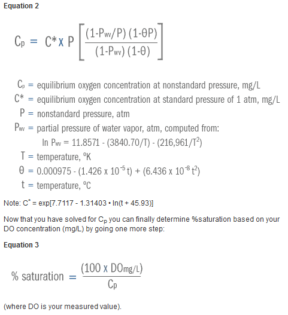
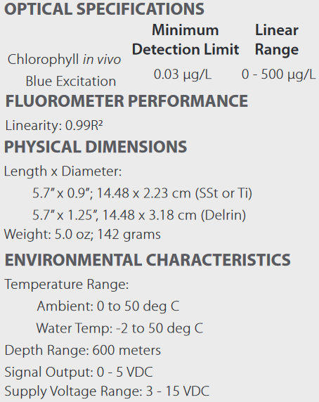
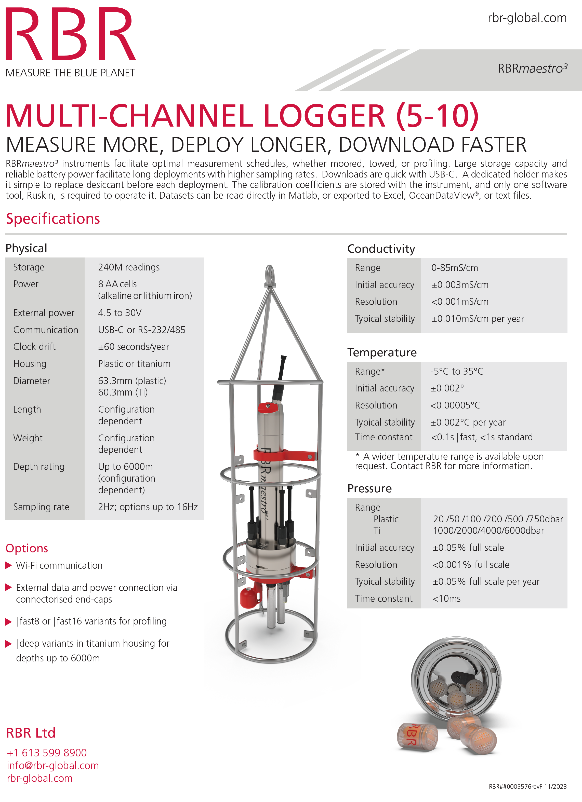
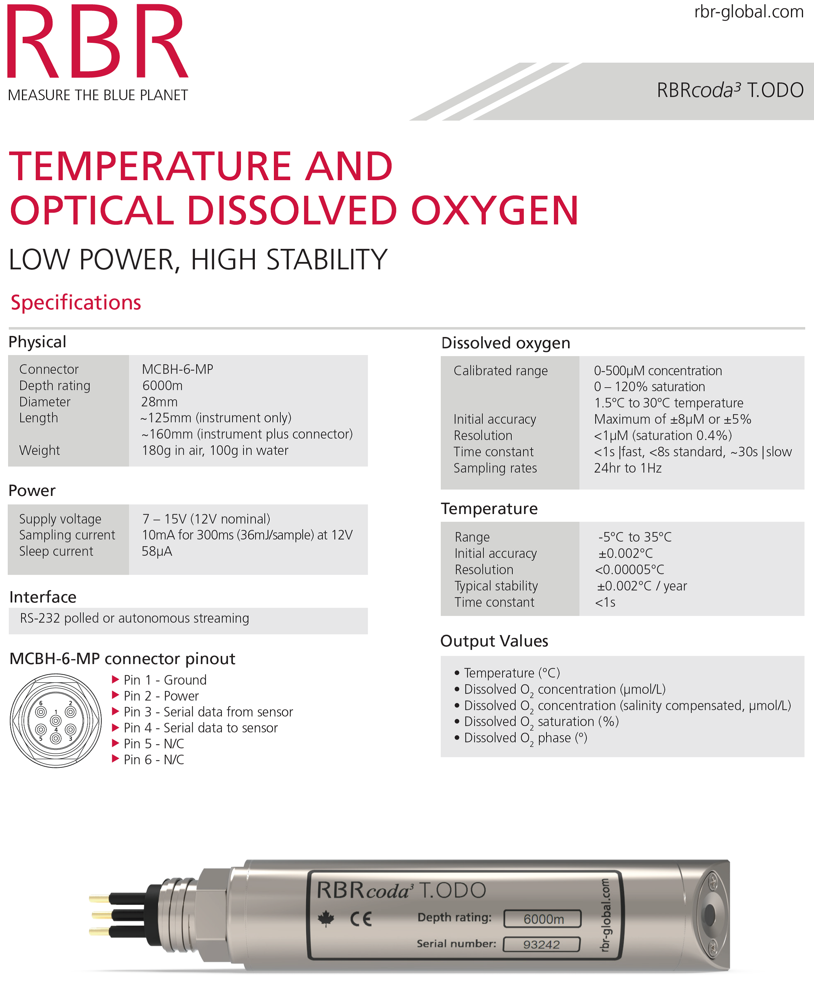
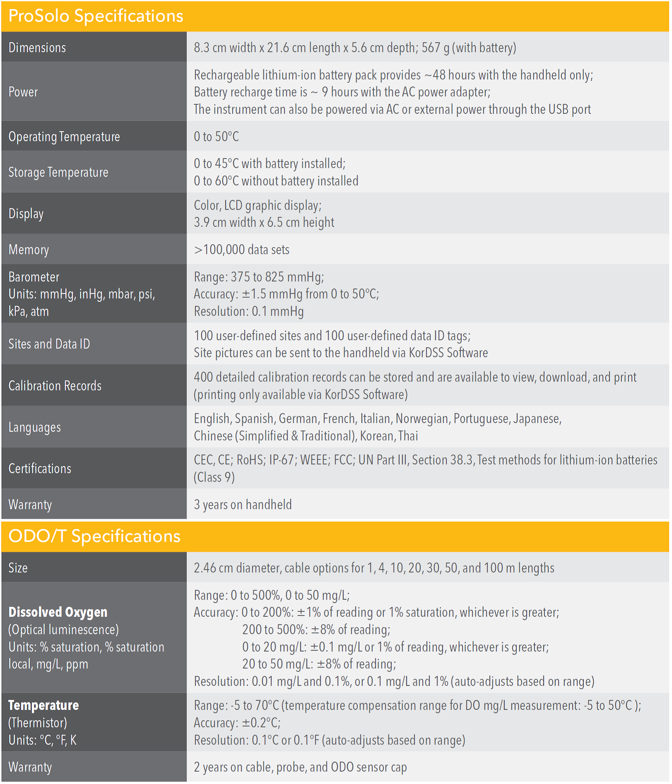

# Limnology Profiles – Information Sheet

Authors: Ken Sandilands; Paul Fafard; Chris Hay  

## Contents
- [General](#general)
  * [Background](#background)
- [Data Dictionary](#data-dictionary)
  * [Column Definitions Table](#column-definitions-table)
  * [Additional notes on certain columns](#additional-notes-on-certain-columns)
  * [Reference tables](#reference-tables)
  * [Domains](#domains)
- [Methods](#methods)
  * [Sampling](#sampling)
  * [Processing](#processing)
- [Gear / Instrumentation](#gear--instrumentation)
  * [Temperature Probes](#temperature-probes)
  * [CR1000 logger box](#cr1000-logger-box)
  * [RBR XRX620 CTD+](#rbr-xrx620-ctd)
  * [Aanderaa Oxygen Optode 4330F](#aanderaa-oxygen-optode-4330f)
  * [Seapoint Chlorophyll Fluoromoeter](#seapoint-chlorophyll-fluoromoeter)
  * [CR350 logger box](#cr350-logger-box)
  * [RBR Maestro3](#rbr-maestro3)
  * [RBRcoda3 ODO (fast) sensor](#rbrcoda3-odo-fast-sensor)
  * [YSI probes](#ysi-probes)
- [References](#references)

# General

This information sheet is intended as a data-users guide to the limnology profiles data. It includes a data dictionary as well as details on sampling methods, processing methods, and gear/instrumentation. This info sheet is based on a previous info sheet focused more specifically on RBRs. RBR data make up the majority of recent limnology profile data. Historically RBRs were not used at ELA as the technology did not yet exist, and in more recent years although RBRs are used, we also sometimes use other instruments as well for additional data collection. Some sections of this info sheet need some copy/edit work to better fit this broader context (profile data broadly, vs. RBRs specifically).

The RBR info sheet (that this info sheet is based on) described the methods for operating the RBR XRX620 CTD+ multi-parameter probes and RBR Maestro3 multi-channel loggers (RBRs). RBRs are used to collect data on multiple physical limnological parameters, listed under ‘Instrumentation’ below. These instruments are used in concert with Campbell Scientific CR1000 data loggers (for XRX620 CTD+) or Campbell Scientific CR350 (for Maestro3), which provide power to the RBRs and storage for the high-resolution data collected. This instrument setup is the standard used for the collection of temperature and oxygen profile data by the ELA HydroLim team. All active lakes (both LTER and experimental) are sampled by the HydroLim team each season.

Data are offloaded from the data loggers using LoggerNet software. Profile data are stored and processed using AQUARIUS software, before being uploaded to the ELA master database.

<!-- This text was transferred from the original info sheet, maybe someone was starting a paragraph or table and never actually added it? This: \*\* These probes are integrated with the RBR. -->

This dataset of profiles from sondes comes from a variety of sampling programs at IISD-ELA. Most of our profile data comes from regular sampling of reference lakes from our LTER program (Long-Term Ecological Research) and is collected by the hydrolim crew (with RBR sondes in recent years). Since 2017, data have also been collected with a YSI sonde for our BSM program (BroadScale Monitoring), which is conducted by fish crew staff on different, rarely-surveyed lakes each year. The BSM program has a data gap in 2020 and 2021 due to logistical constraints from the COVID pandemic, and the number of records varies year-to-year depending on the number of lakes surveyed and their depth. Prior to 2017, the fish crew also used YSI sondes to survey lakes used for specific projects (e.g. manipulated lakes). Various other survey efforts have been conducted over the years, but hydrolim LTER and fish crew BSM and project-related data are the main three sources of data, at least in recent years (2000 onward). 

## Background

Over the years, the hydrolim lake profiles dataset progressed from including one parameter to several. In the early years of ELA (1968 into the 80s), profiles were collected with unknown gear equipment and only for temperature. In 1981 a man named Bob Flett started creating a temperature probe and the “Flett research meter” was used by ELA from 1982 to 2011.

From an email with Carol Kelly, a scientist who conducted research at IISD-ELA: (2024-10-07)

> *\[Bob Flett\] did his Ph.D. at ELA, went to McGill for a few years as a postdoc and then came back to Winnipeg to start up his company, Flett Research. I talked to him, and he looked up his records. He didn’t start making his temperature probe until 1981.*

Besides the Flett research meter, in the late 80s, a pocket thermometer and Brackner digital logger were introduced as additional options to collect temperature data.

In 1999, ELA started using YSI devices to collect data for both temperature and oxygen. Some of the previous gear was still used, to also continue collecting just temperature. It is also important to note that although oxygen data are not available in the hydrolim profiles dataset until this point, oxygen profile data do exist for ELA lakes 1968 through 2015 (and later for lake 239) from the inclusion of dissolved oxygen as a parameter in the chemistry profiles dataset (obtained via Winkler titration method). Once RBR oxygen profiles were confirmed as high enough quality, dissolved oxygen was phased out from being measured for inclusion in the ELA chemistry dataset.

In 2009 and 2010, two RBRs were purchased (SNs 18018 and 18033, respectively) to replace the Flett Research Mark II digital telethermometers used for lake sampling. RBR XRX620 CTD+ were chosen because they have a fast temperature sensor and can sample at a high frequency (6Hz). These multi-parameter probes can also accommodate additional sensors- the current array includes sensors for conductivity, temperature, depth, dissolved oxygen, and chlorophyll α. The dissolved oxygen sensor is an Aanderaa 4330F Oxygen Optode, and the chlorophyll α sensors are either a Seapoint Chlorophyll Fluorometer or a Turner Cyclops 7 Fluorometer.

One of the goals in upgrading the sampling equipment was to collect high-resolution data on multiple lake quality parameters. For example, sensors like the Aanderaa 4330F optodes allow for more detailed oxygen profiles (i.e. each metre) compared to the previous standard of taking water samples for Winkler titration at pre-determined chemistry profile sampling depths. All sensors on the RBRs record data simultaneously, providing a detailed snapshot of lake quality at each logged interval.

Since September 2010, one RBR has been equipped with a Seapoint Chlorophyll Fluorometer. The other RBR was outfitted with a Turner Cyclops 7 Fluorometer in May of 2019. Both fluorometers were calibrated using rhodamine dye in June 2020, after sampling was completed for the month. Prior to this date, neither fluorometers had been calibrated. The Seapoint Fluorometer had experienced intermittent data cable issues over the years. The data prior to July 2020 from these probes should be used with extreme caution, and because of this we have pre-emptively flagged (removed, for most users) those chlorophyll data values (only available with special request). This is also true for RBR2 in 2024, since the sensor was not calibrated. Both of these scenarios are also noted in the "Quality control and issue flagging" section later in this info sheet. While the Seapoint Fluorometer produces data in µg/l, the Turner Cyclops 7 produces data in volts, which must then be converted into µg/l using an equation determined through lab analysis of water samples.

In 2023, two RBR Maestro3 (SNs 211416 and 211417) were purchased to replace the aging RBR XRX620 CTD+ multiparameter probes. These instruments included underwater PAR sensors, which are used in place of the separate underwater PAR instruments previously used for light profiles. Surface PAR sensors were also used so that the percentage of surface PAR could be calculated in real-time to determine the extent of the photic zone to a finer resolution. More information on PAR can be found in the PAR light attenuation information sheet.

In late January 2024, the two Maestro3 units had pH sensors added to them while in for calibration.

# Data Dictionary

## Column Definitions Table

| **column name (alphabetical)** | **data type** | **unit** | **definition** |
|----|----|----|----|
| dataset_code | character varying | N/A | A three character code made up of upper case letters and numbers unique for each dataset in ref_dataset. Should always start with a letter and may or may not end with a number. Used as a short consistent abbreviation for the dataset, whereas dataset_name is longer and may be changed and refined over time. |
| dataset_name | character varying | N/A | Name of the dataset from ref_dataset- a collection of data to which several individual data records (rows) belong. This is mainly used within IISD-ELA to define groups of data across different research fields, but can also serve as a descriptive contextual definition within and outside of IISD-ELA data users. Internal database users should compare "dataset" against "data type" which is a broader category of classification. |
| profile_id | character varying | N/A | For limnology profiles, profile_id is defined as \[location name\] \[profiling date\] \[any applicable qualifiers\] (e.g., \[114 LA CB\] \[2023-03-02\] \[Extra\]). The qualifiers noted in profile_id are either 'Extra' (extra profile), 'Redo' (redone profile), or 'Extra for Chem' (extra profile done for chem data specifically). |
| monitoring_location_name | character varying | N/A | Name of sampled or surveyed geographic location at the IISD Experimental Lakes Area field site. The name consists of: \<location\> or \<location sublocation\> or \<location sublocation station\>. Location is typically the lake number (each lake is named with a number, representing the lake's geographical watershed), sublocation typically specifies LA for "lake" (or a basin, e.g. NB - north basin, or other), and station is usually CB ("centre buoy" - at about the deepest point of the lake). Some names do not have all three parts since a broader area is in question (e.g. for bathymetry, the entire lake, not just the centre buoy). |
| date | date | N/A | Date of sampling in Central Time and ISO format (YYYY-MM-DD). |
| time_sample | 24hr time | N/A | Time of field sampling in 24 hour and Central Time format (HH:MM:SS) |
| depth_m | numeric | metres | A depth from the surface of the water, in metres. |
| depth_bin_m | numeric | metres | A discrete binned depth from the surface of the water, in metres. Typically this is a value derived from an original depth value using certain rounding rules. Check the info sheet for further details on how this is calculated. Binned depths are provided for convenience when wrangling data, such as to standardize depths to be able to compare between multiple profiles. |
| temp_c | numeric | degrees celsius | Temperature in degrees celsius, of water. |
| cond_us_cm1 | numeric | µS/cm2 | Conductivity of water. |
| cond_spec_us_cm1 | numeric | µS/cm2 | Specific conductivity of water. |
| oxygen_mg_l1 | numeric | mg/L | Oxygen concentration in water. |
| oxygen_saturation_pct | numeric | percent | Oxygen saturation percent in water. |
| chla_ug_l1 | numeric | µg/L using the Seapoint Fluorometer, volts using the Turner Cyclops 7 | Chlorophyll α concentration in water. |
| ph | character varying | N/A | A measure of how basic or acidic the water is. The scale ranges from 0 to 14. 7 is neutral, less than 7 is increasingly more acidic, greater than 7 is increasingly more basic. |
| gear_type_code | character varying | N/A | A three-digit code that refers to a specific gear type, typically starting with two capital letters and ending with one number. |
| gear_type_desc | character varying | N/A | A short description of the type of gear (equipment used for sampling or surveying). |
| optode | numeric | N/A | Serial number of the optode used for limnology profiling |
| qa_level | character varying | N/A | A code representing a degree of quality control conducted on the data. (Ideally each level is defined in more detail in each Info Sheet, but this is a work in progress.) |
| collected_by | character varying | N/A | Initials for primary person who collected the sample or data in the field (i.e. who did the field work?), or the name of the crew that collected the data (e.g., 'hydrolim crew') |
| method_sample_code | character varying | N/A | A short and unique code associated with a description of a method of sampling for data (i.e., how the physical sample was collected in the field). |
| method_sample_desc | character varying | N/A | A short description of the method used to sample the data (collect the data, in a field or lab environment). |
| ph_absdiff | character varying | N/A | The difference in instantaneous pH values measured every 5 seconds. As long as pH measurements remain less than 0.04 different between measurements, pH is considered ‘stable’ and allows the sonde sampling device's ‘stable time’ counter to increment upwards. This could be used as an indicator of whether pH was stable or not when the value was recorded, so could be useful if there are concerns over specific values. |
| ph_ignored | boolean | N/A | This has to do with how samples are collected by the sonde device in the lake, and implies a level of in/accuracy for the associated pH value. Occasionally this field has '-1', meaning 'true' i.e. pH is ignored, even when the pH is calibrated. When pH is ignored, the program only relies on oxygen to determine when conditions are stable and doesn't wait for pH to be stable before writing data points in the summary table. |
| ph_calibrated | boolean | N/A | Whether the pH sensor on the sonde device was calibrated at the time of sampling. TRUE means yes, the sensor was calibrated, and the pH value should be reliable and accurate. FALSE means the pH sensor was not calibrated at the time of sampling, so the pH value is suspect and probably should not be used. Those values are flagged in our master database table and excluded from the view (typically not sent to data users, but available on request). |
| researcher_code | integer | N/A | A code that refers to a specific researcher (individual person, or group in some cases) associated with the record in question. |
| researcher_name | text | N/A | Name of a researcher (individual person, or group in some cases) associated with the record in question. |
| project_code | character varying | N/A | A short and unique code associated with a project (e.g. the FOReSt project has code F01). |
| project_name | character varying | N/A | A name for a project that the data record is associated with (e.g. FOReSt). |
| qualifiers | character varying | N/A | Qualifier code(s) conveying specific information about the record. See Info Sheet table for more information. (“Reference tables” section below) |
| comments | character varying | N/A | Remarks about the record or its collection. |
| update_date | date | N/A | Date the record in the IISD-ELA Postgres Master Database table was most recently uploaded or modified (YYYY-MM-DD). |
| account | character varying | N/A | Username of IISD-ELA staff who added or most recently edited the data record in the postgres master database. This may be generated through bulk loads or manually updated as records are edited individually. |
| version | integer | N/A | The version number for a row of data is 1 when it is first added to a table, and increments by 1 every time the row is updated. |

## Additional notes on certain columns

<u>cond_us_cm1 and cond_spec_us_cm1</u>

When the device hits the bottom of the lake, it seems conductivity values can go very high. It is suspected that this is because sediments are disturbed and become suspended in the surrounding water, increasing the conductivity.

<u>depth_m and depth_bin_m</u>

Although field staff try to measure at depths either at the whole metre or quarter metre intervals, it can be difficult to hold the measuring device at a consistent depth while waiting for parameter measurements to stabilize. For this reason, many of the data records are at other depths near the desired depth but not exactly equal. For example, during a windy day on the lake, it may be difficult to hold an RBR at exactly 6.25m, so the reading may be at 6.29 instead.

Since there are many depths that do not match the intended sampling depths exactly, the depth-bin field was created so that depths within 0.1 m (10 cm) of the intended depth are binned into pre-determined depth intervals. For example, a depth of 3.40 m would be put in the 3.5 depth bin, 3.39 would not fall into a depth bin as it is not within 10cm of either 3.25 or 3.50m. Depths bins for less than 10 m are in 0.25m increments, and 1m increments for greater than 10 m. In some cases, the cutoff number is not 10 but some arbitrary number greater than 10, based on the data collector’s best judgement of the lake and data needs.

This table shows examples of the binning rules in effect:

<table>
<colgroup>
<col style="width: 100px" />
<col style="width: 100px" />
<col style="width: 250px" />
<col style="width: 150px" />
<col style="width: 100px" />
</colgroup>
<thead>
<tr>
<th><strong>Depth Example</strong></th>
<th><strong>Resulting Bin</strong></th>
<th style="text-align: center;"><strong>Scenario / Rule</strong></th>
<th style="text-align: center;"><strong>Non-binned ranges</strong></th>
<th style="text-align: center;"><strong>examples</strong></th>
</tr>
</thead>
<tbody>
<tr>
<td>5</td>
<td>5</td>
<td rowspan="21" style="text-align: center;">≤10 (or arbitrary higher number) / 
Round to nearest 0.25 if difference is 
≤ ± 0.10, else depth bin assigned to null</td>
<td style="text-align: center;"> </td>
<td style="text-align: center;"> </td>
</tr>
<tr>
<td>5.05</td>
<td>5</td>
<td style="text-align: center;"> </td>
<td style="text-align: center;"> </td>
</tr>
<tr>
<td>5.1</td>
<td>5</td>
<td style="text-align: center;">5.10 &lt; x &gt; 5.15</td>
<td style="text-align: center;">5.12</td>
</tr>
<tr>
<td>5.15</td>
<td>5.25</td>
<td style="text-align: center;"> </td>
<td style="text-align: center;"> </td>
</tr>
<tr>
<td>5.2</td>
<td>5.25</td>
<td style="text-align: center;"> </td>
<td style="text-align: center;"> </td>
</tr>
<tr>
<td>5.25</td>
<td>5.25</td>
<td style="text-align: center;"> </td>
<td style="text-align: center;"> </td>
</tr>
<tr>
<td>5.3</td>
<td>5.25</td>
<td style="text-align: center;"> </td>
<td style="text-align: center;"> </td>
</tr>
<tr>
<td>5.35</td>
<td>5.25</td>
<td style="text-align: center;">5.35 &lt; x &gt; 5.40</td>
<td style="text-align: center;">5.39</td>
</tr>
<tr>
<td>5.4</td>
<td>5.5</td>
<td style="text-align: center;"> </td>
<td style="text-align: center;"> </td>
</tr>
<tr>
<td>5.45</td>
<td>5.5</td>
<td style="text-align: center;"> </td>
<td style="text-align: center;"> </td>
</tr>
<tr>
<td>5.5</td>
<td>5.5</td>
<td style="text-align: center;"> </td>
<td style="text-align: center;"> </td>
</tr>
<tr>
<td>5.55</td>
<td>5.5</td>
<td style="text-align: center;"> </td>
<td style="text-align: center;"> </td>
</tr>
<tr>
<td>5.6</td>
<td>5.5</td>
<td style="text-align: center;">5.60 &lt; x &gt; 5.65</td>
<td style="text-align: center;">5.63</td>
</tr>
<tr>
<td>5.65</td>
<td>5.75</td>
<td style="text-align: center;"> </td>
<td style="text-align: center;"> </td>
</tr>
<tr>
<td>5.7</td>
<td>5.75</td>
<td style="text-align: center;"> </td>
<td style="text-align: center;"> </td>
</tr>
<tr>
<td>5.75</td>
<td>5.75</td>
<td style="text-align: center;"> </td>
<td style="text-align: center;"> </td>
</tr>
<tr>
<td>5.8</td>
<td>5.75</td>
<td style="text-align: center;"> </td>
<td style="text-align: center;"> </td>
</tr>
<tr>
<td>5.85</td>
<td>5.75</td>
<td style="text-align: center;">5.85 &lt; x &gt; 5.90</td>
<td style="text-align: center;">5.86</td>
</tr>
<tr>
<td>5.9</td>
<td>6</td>
<td style="text-align: center;"> </td>
<td style="text-align: center;"> </td>
</tr>
<tr>
<td>5.95</td>
<td>6</td>
<td style="text-align: center;"> </td>
<td style="text-align: center;"> </td>
</tr>
<tr>
<td>6</td>
<td>6</td>
<td style="text-align: center;"> </td>
<td style="text-align: center;"> </td>
</tr>
<tr>
<td colspan="5" style="text-align: center;">~&emsp;&emsp;&emsp;~&emsp;&emsp;&emsp;~</td>
</tr>
<tr>
<td>16</td>
<td>16</td>
<td rowspan="21" style="text-align: center;">&gt;10 (or arbitrary higher number) / 
Round to nearest 1.0 if difference is 
≤ ± 0.10, else depth bin assigned to null</td>
<td style="text-align: center;"> </td>
<td style="text-align: center;"> </td>
</tr>
<tr>
<td>16.05</td>
<td>16</td>
<td style="text-align: center;"> </td>
<td style="text-align: center;"> </td>
</tr>
<tr>
<td>16.1</td>
<td>16</td>
<td style="text-align: center;"> </td>
<td style="text-align: center;"> </td>
</tr>
<tr>
<td>16.15</td>
<td rowspan="15">&lt;null&gt;</td>
<td rowspan="15" style="text-align: center;">16.1 &lt; x &gt; 16.9</td>
<td rowspan="15" style="text-align: center;">16.12, 
16.48, 
16.89</td>
</tr>
<tr>
<td>16.2</td>
</tr>
<tr>
<td>16.25</td>
</tr>
<tr>
<td>16.3</td>
</tr>
<tr>
<td>16.35</td>
</tr>
<tr>
<td>16.4</td>
</tr>
<tr>
<td>16.45</td>
</tr>
<tr>
<td>16.5</td>
</tr>
<tr>
<td>16.55</td>
</tr>
<tr>
<td>16.6</td>
</tr>
<tr>
<td>16.65</td>
</tr>
<tr>
<td>16.7</td>
</tr>
<tr>
<td>16.75</td>
</tr>
<tr>
<td>16.8</td>
</tr>
<tr>
<td>16.85</td>
</tr>
<tr>
<td>16.9</td>
<td>17</td>
<td style="text-align: center;"> </td>
<td style="text-align: center;"> </td>
</tr>
<tr>
<td>16.95</td>
<td>17</td>
<td style="text-align: center;"> </td>
<td style="text-align: center;"> </td>
</tr>
<tr>
<td>17</td>
<td>17</td>
<td style="text-align: center;"> </td>
<td style="text-align: center;"> </td>
</tr>
</tbody>
</table>

## Reference tables

<u>Qualifiers</u>

| **Qualifier** | **Meaning** |
|----|----|
| RBR_AVGdepth_Depth_Diff_Too_Large | In the raw data files, the absolute difference between the average depth and depth values were larger than 0.1 metres. The record was inspected to pick which depth value to use. |
| Chla_Maxed | This means that the fluorometer was reading the maximum amount of Chla, so the actual Chla value is likely beyond the range of the sensor. Note that this may also happen when the sensor doesn’t autorange (switch to the proper gain). |
| Chla_error | Error with the fluorometer (chlorophyll sensor). |
| ERROR | Some other error which should have a comment also |
| Extra_RBR_profile | Indicates that this is an extra, non-scheduled RBR profile. This is for situations when hydrolim crew used the RBR but not as part of the regular sampling. In these cases, there probably isn’t chemistry data collected at the same time. |
| Instantaneous | This is when the Campbell datalogger was not recording properly and stable data points are picked out manually from the raw data output from the RBR. These data points are instantaneous values rather than average values from the datalogger. |
| MISSING | Might be used if some of the other non oxygen parameters are missing, also applies to other datasets |
| Optode_cap_left_on | Indicates that the cap was left on the oxygen sensor, so values are meaningless and have been deleted. |
| Oxygen_Sensor_Error | A problem with the oxygen sensor, no oxygen data are available. |
| RBRprofile_Redo | Indicates that this is a redone profile due to the something going wrong with the original profile (an error or malfunction). The sampling crew went back and collected this “redo” profile. In these cases there probably isn’t chemistry data. |

## Domains

All date fields (activity_end_date, activity_start_date, and update_date) include year, month, and day in ISO 8601 format (YYYY-MM-DD).

Many of the metadata-related columns are derived from internal lookup tables of a restricted list of values (dataset_name, method_sample_description…).

# Methods

## Sampling

<u>RBR XRX620 CTD+ and CR1000</u>

The RBR and CR1000 together allow for the collection and display of real-time data while in the field. A cable from the CR1000 to the RBR provides power to the RBR and allows for the transmission of data from the RBR to the CR1000 datalogger. The CR1000 has a keypad which allows the user to view real-time data. Reading the data in real-time (vs afterwards in the lab) is necessary for determining water sampling depths while in the field (see Lake Sampling & Field Observation Information Sheet).

At the sampling site, the RBR is first connected to the CR1000 for power up. Once the CR1000 program is initialized, the data table is configured for sampling by zeroing the RBR depth sensor (above water) as well as entering the lake \#, RBR \#, and optode \#.

The RBR is then lowered sequentially from the surface to each desired depth. The RBR must remain at each depth until the sensors have stabilized before data are written to the CR1000.

The CR1000 has a keypad or tablet (connected via Bluetooth) which displays real-time data for the user to refer to while sampling. This information includes depth, temperature, oxygen concentration, chlorophyll (µg/L or v), as well as ‘stable time’. The CR1000 is programmed to record data to the data table only once all sensors have stabilized for at least 10 seconds. When sensors have stabilized, the CR1000 records a record in the data table, triggering an audible beep, which signals the user to proceed to the next desired depth interval. The user can also look at the ‘stable time’ value to determine if a record has been written to the data table- if the stable time counter is over 11, a data has been recorded at the current depth.

The stable time counter will only begin counting once all sensors are stable, including depth. The program allows for a small amount of ‘wiggle room’ with the depth sensor, so that data can still be recorded on wavy and windy days, when the depth of the RBR may change slightly due to boat motion. If depth changes more than 0.1 m between readings over the last 8 seconds, the stable time counter will reset. While this programming ensures that the data recorded for each sensor reflects the values at one particular depth, it is important that the user is decisive in moving the RBR between depths. If the user changes depths very slowly, the RBR will assess the depth as ‘stable’ and will not reset the stable time counter. For data that consist of an average of readings, this could skew the recorded data away from the true value for that depth.

Once the profile is complete, the CR1000 can be turned off. The data collected are saved to the data table and can be offloaded once back in lab.

<u>RBR Maestro3 and CR350</u>

Methods for using the RBR Maestro3 and CR350 are very similar to those for the RBR XRX620 CTD+ and CR1000, with a few differences to accommodate the simultaneous collection of PAR data.

To initialize the Maestro3, the user must twist the end cap to enable data streaming. In place of a keypad connected to the logger box, the CR350 emits a wifi signal, which is connected to via a tablet. The user then opens the Campbell Scientific LoggerLink software, and proceeds to enter the lake \#, RBR Maestro3 \#, and zero the depth sensor (above water) in the ‘Public’ table.

The user must adjust the height of the PAR sensor on the Maestro3 to the appropriate location which puts it 0.5 m above the depth sensor. The user must also connect the surface PAR sensor to the CR350 logger box before beginning the profile.

When conducting the profile, the user must record data at each 0.5 m depth increment while in the epilimnion, and each 0.25 m depth increment while in the metalimnion. Once through the metalimnion, if underwater PAR values are still greater than 1% of surface PAR, the user must continue recording data at each 0.5 m increment. Once the underwater PAR value is equal to or less than 1% of surface PAR, the user must record data at the next 0.5 depth increment – this ensures a final whole metre record for the underwater PAR dataset (since the PAR sensor is 0.5 m higher than the depth sensor). The user may then resume recording data at whole meter depth increments for the remainder of the profile.

<u>YSI Probe</u>

If an RBR is out of service, various models of YSI dissolved oxygen meters have been used to collect temperature and oxygen data. In these cases, no conductivity or chlorophyll data are recorded, and the temperature and oxygen data are instantaneous readings recorded by hand, not logged data.

Older profiles (prior to 2015) collected with ‘YSI’ as the method in field notes used a YSI model 550A, which is a membrane style probe to measure oxygen. Since 2016, the YSI used in place would have been the ‘Fish ProODO’ SN 15C101455, and since 2019, the ‘General Use ProSolo’ SN 19E100110 was used. These ProODO and ProSolo YSI units are optical rather than membrane-based, and are maintained by the Fish crew and HydroLim crew, respectively. In field notes, method records should indicate which specific YSI was used, however this has not always been the case. These time periods can give an idea of which YSI was used over time.

## Processing

<u>Data processing performed by the CR1000 and CR350</u>

The RBR sensors read data at 6 Hz (i.e. 6 times per second). The CR1000 and CR350 are programmed to store the raw RBR data each second, as well as one data record for each depth once the sensors have stabilized. Since the Aanderaa Optode is the slowest sensor, the oxygen data is used to determine when the data is stable. The logger compares the current oxygen and depth values to the values 8 seconds previous, and if the absolute difference is less than 0.1 mg/L and 0.1 m, respectively, the data is considered ‘stable’. Once 10 seconds of continuously stable data are collected the average is calculated over the 10 seconds and stored. All data is obtained on the downcast. Any data collected on the upcast is discarded during post-processing.

*<u>Specific conductivity calculation</u>*

Specific Conductivity = <u>Conductivity</u>

1+(0.0191 \* (Temperature – 25))

Specific conductivity is standardized to 25°C to match the conductivity as measured by the IISD-ELA chemistry lab.

*<u>Depth measurement calculation</u>*

The RBR measures depth with a pressure sensor. Depth is calculated as follows:

Depth (m) = <u>measured pressure – atmospheric pressure</u>

water density \* 0.980665

Where atmospheric pressure is entered in the settings of the RBR Ruskin software, and density of water is 1.0 for freshwater.

Since atmospheric pressure is always changing, the depth must be zeroed each time the RBR is used.

To do this, the user holds the RBR so that the pressure sensor is out of the water, and uses the keypad to ‘Zero’ the depth sensor and have the CR1000 logger set the atmospheric pressure equal to the current pressure reading. The logger then uses the formula above to calculate depth.

Note that because the atmospheric pressure is not set in the software preferences when the RBR logger is started each day, the depths recorded in the raw RBR logger data are incorrect. If you are using the raw 6hz data from the RBR, you must take this into account.

*<u>Dissolved oxygen saturation calculation</u>*

Percent saturation of oxygen is calculated using the following formula:

 
Where P is 0.95657 atm (ELA is approximately 391m above sea level, which works out to 0.95657 atm)
 
Dissolved oxygen equation from: <http://www.waterontheweb.org/under/waterquality/oxygen.html>
 
Results from this calculation match oxygen solubility tables such as <http://water.usgs.gov/owq/FieldManual/Chapter6/6.2.4.pdf>  
  

*<u>Quality control and issue flagging</u>*

Data from recent years (as of writing, 2023 onward) underwent automatic quality control to flag values with issues. This happens behind the scenes, before data users (you) receive data to work with. Internally, in our database table we keep all original values and indicate if there is an issue with each value via flagging column, one for each parameter (e.g., temperature: temperature quality issue flag, dissolved oxygen: dissolved oxygen quality issue flag…). However, externally, for data users, we send the data from a “view” (a type of database table), which is based on the table but converts any flagged parameters to null. You may disagree with our filtering criteria (below) in which case you can specially request the table data without values nullified. Most data users only want “good” data, and a more simplified table to work with, hence our using this system.

Here is a table of our quality control flagging criteria for each parameter. The ranges indicated are for the acceptable values. Note that square brackets \[ \] are inclusive whereas round brackets ( ) are exclusive. So (0,100\] would mean: 0 \< x ≤ 100 (x must be between 0 and 100, and specifically not zero but can be 100).

 
| **Column Name** | **Quality Control** |
| --- | --- |
| temp\_c | Range \[-1,32\] |
| oxygen\_mg\_l1 | Usually \[0,16), with some exceptions:   Eutrophied lakes (227, 303, 304) can be up to 20, but should not be 20 or more, so can be \[0,20).   If RBR1 or 2 were used and the value is exactly 20, it indicates an error code (is converted to null).  Values less than zero but greater than or equal to -0.5 are rounded to zero. |
| oxygen\_saturation\_pct | Range \[0,150) which includes supersaturation scenarios |
| cond\_us\_cm1 | Range \[1.5,100\] is fine, and (100,530\] is also considered fine, but in the latter case we append to the comment a note "High cond. - maybe near lake bottom". |
| cond\_spec\_us\_cm1 | Range (0,600\] |
| chla\_ug\_l1 | Range \[0,500\] |
| ph | Range [0, 14]. In addition, records during months of Jan-March, with depth_m < 0.5m, or specified as uncalibrated are given a quality issue flag. |

We have also applied quality issue flags on a case-by-case basis given internal knowledge.  Here is an incomplete list, for some of the larger collections of records flagged. Again, if you want the data, we can still send it, but data users must specially request it.

 **Additional flagging scenarios** 
 * Chla sensors were not calibrated prior to July 2020, so all those records where chla was not null were flagged (done on 2025-11-10).
 * Chla sensor was not calibrated for RBR2 in 2024, so all those records where chla was not null were flagged (done on 2025-11-10).

<u>Reporting of data</u>

Data collected by the RBR is an average of 10 seconds worth of readings, however, temperature profile data from the Physical Limnology section of the ELA data retriever are in fact, manual readings from the keypad display written down into the field book once the CR1000 has stored a record (i.e. after a beep). Logged RBR temperature data is an average and so won’t be exactly the same as the temperature profile data, which is an instantaneous reading.

<u>Temperature Profiles</u>

Note that this section was copied directly from the lim obs Info Sheet, so needs some editing and updating to fit here. We need to remove references to the “Retriever” (which no longer exists) and to things that are in the field obs / lim obs data (not in the profiles data).

We collect temperature and depth data using an RBR XRX-620 CTD + multi-function probe (see RBR Information Sheet). These temperature profiles are used in the field to determine depths of strata to be sampled with the integrated sampler (described below). Surface temperature (0 m depth) is taken by dipping the temperature sensor into the water and allowing it to equilibrate. Temperature is then measured at depths 0.5 m, 1 m, and each 1 metre intervals thereafter until there is a 1 oC or more difference between whole metre intervals. Once this temperature change occurs, the probe is brought back to the shallowest whole metre depth where the temperature was stable and from there is lowered by 0.25 m intervals until there is less than 1 oC change between whole metre intervals. When temperatures stabilize once again, measurements are made at 1 metre intervals down to the bottom of the lake. The last depth interval that has less that 0.25 oC change from the previous 0.25 metre interval represents the bottom of the thermal **epilimnion**.

The **thermocline** is defined as the plane of maximum rate of decrease of temperature with respect to depth, i.e. the depth at which the greatest rate of temperature decrease occurs in the lake.

\*\*An example temperature profile is included in the **appendix** for reference\*\*

Temperature profile data is used to determine the appropriate sampling depth for collecting integrated water samples from the **epilimnion** and **metalimnion**.

\*Data from the RBR appear in two places on the ELA data retriever: 1) Physical Limnology – Water Temperature profiles (RBR Collection Method), and 2) Multi-Parameter Field Instruments. These two data sets may not match. Data in the Water Temp Profiles section are **instantaneous** values recorded in the field after the probe has stabilized, however, data under Multi-parameter Field Instruments is the actual logger data, which is an **average** over 10 seconds after the probe stabilized (See RBR Information Sheet).

# Gear / Instrumentation

## Temperature Probes

Montedoro-Whitney thermisters (models TC-5A and TC-5C) were used to measure temperature profiles from 1968 to 1983. Flett Research Mark II digital telethermometers were used from 1984 to 2009. The RBR XRX620 was used from temperature profiles from 2010 onward. Starting in 2023, RBR Maestro3 are used in place of RBR XRX620 when possible.

## CR1000 logger box

Campbell Scientific CR1000 data logger and power supply for RBR XRX620 CTD+ multiparameter probes.

## RBR XRX620 CTD+

Multiparameter probe with depth, temperature, and conductivity sensors built in.

## Aanderaa Oxygen Optode 4330F

Sensor for determination of dissolved oxygen concentration, on XRX620 CTD +.

Dissolved oxygen data from the optodes (Model 4330F, Serial 249 & 138) begins the same time as the RBR data. Optodes foils and calibration is checked before each field season, and foils are changed and recalibrated is necessary.

Optode data from 2011 was compared to Winkler Titration results. These samples were collected at the same depth and time. These two methods agreed much better than when data was compared in 2010 when the water samples were not necessarily taken at the exact same depth and time.

The specifications sheet is on the next page…

Aanderaa Oxygen Optode 4330F Specifications sheet:

## Seapoint Chlorophyll Fluoromoeter

Sensor for determination of chlorophyll α concentration, on XRX620 CTD+.

The Seapoint Chlorophyll Fluorometer (Model SCF serial 3209) was purchased in September 2010 which allowed real-time *in situ* measurements to be added to the RBR dataset. The RBR is supposed run the fluorometer in auto-ranging mode which is supposed to adjust the gain depending on chlorophyll levels, however this often didn’t work, and chlorophyll values reached the maximum range at about 5ug/L. When this happened it was noted in the “comments” field of the data.

Below is a description of the fluorometer from Seapoint:

> *“The Seapoint Chlorophyll Fluorometer (SCF) is a high-performance, low power instrument for in situ measurements of chlorophyll. Its small size, very low power consumption, high sensitivity, wide dynamic range, 6000 meter depth capability, and open or pump-through sample volume options provide the power and flexibility to measure chlorophyll in a wide variety of conditions. The SCF uses modulated blue LED lamps and a blue excitation filter to excite chlorophyll. The fluorescent light emitted by the chlorophyll passes through a red emission filter and is detected by a silicon photodiode. The low level signal is then processed using synchronous demodulation circuitry which generates an output voltage proportional to chlorophyll concentration. The SCF may be operated with or without a pump. The sensing volume may be left open to the surrounding water, or, with the use of the supplied cap, can have water pumped through it. Two control lines allow the user to set the range to one of four options. These lines may be hardwired or microprocessor controlled to provide a suitable range and resolution for a given application. The sensor is easily interfaced with data acquisition packages; a 5 ft. pigtail is supplied. Custom configurations are available.”*

|     |     |     |     |
| --- | --- | --- | --- | 
| **SPECIFICATIONS** |     |     |     |
| • Power Requirements: | 8-20 VDC, 15mA avg., 27mA pk. |     |     |
| • Output | 0-5.0 VDC |     |     |
| • Output Time Constant | 0.1 sec. |     |     |
| • Power-up Transient Period | < 1 sec. |     |     |
| • Excitation Wavelength | 470 nm CWL, 30 nm FWHM |     |     |
| • Emission Wavelength | 685 nm CWL, 30 nm FWHM |     |     |
| • Sensing Volume | 340 mm3 |     |     |
| • Minimum Detectable Level | 0.02 μg/l |     |     |
| **Sensitivity/Range** | Gain | Sensitivity, V/μg/l | Range, μg/l |
| | 30x | 1   | 5   |
| | 10x | 0.33 | 15  |
| | 3x  | 0.1 | 50  |
| | 1x  | 0.033 | 150 |
| • Temperature Coefficient | < 0.2%/°C |     |     |
| • Depth Capability | 6000 m (19,685 ft) |     |     |
| • Weight (dry) | 1000 g (2.2 lbs) |     |     |
| • Operating Temperature | 0°C to 65°C (32°F to 149°F) |     |     |
| • Material | Rigid polyurethane |     |     |
| • Underwater Connector | Impulse AG-306/206 (others available on request) |     |     |

Turner Cyclops 7 Chlorophyll Fluorometer

Sensor for determination of chlorophyll α through voltage signal and subsequent conversion equation, on both RBR models.

## CR350 logger box

Campbell Scientific CR350 data logger and power supply for Maestro3 multi-channel loggers.

## RBR Maestro3

multi-channel logger with conductivity\*, temperature\*, depth\* (pressure), optical dissolved oxygen\* (RBR coda3), chlorophyll α (Turner), PAR (Licor), and pH. \* = built in to RBR

## RBRcoda3 ODO (fast) sensor

## YSI probes

non-logging temperature and oxygen meters. Various models have been used over the years in place of an RBR if the RBR is out of service for any reason.

YSI ProSolo Datasheet:

# References

None yet
